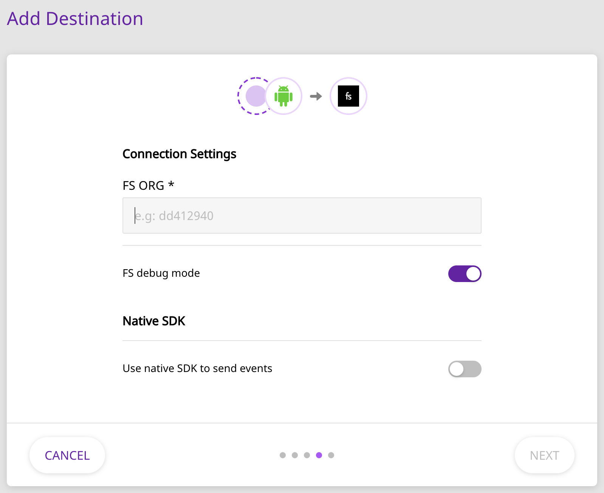

# FullStory

[FullStory](https://www.fullstory.com/) is a platform for analyzing user interactions, data recording and searching, and much more. It is the perfect platform to measure and improve your overall mobile app experience.

RudderStack supports sending your event data to FullStory from our native web SDKs, to help you understand your customers better.

## Getting Started

Before configuring your source and destination on the RudderStack, please check whether the platform you are sending the events from is supported by FullStory. Please refer the following table to do so:

| **Connection Mode** | **Web** | **Mobile** | **Server** |
| :--- | :--- | :--- | :--- |
| **Device mode** | **Supported** | - | - |
| **Cloud mode** | - | - | - |


To know more about the difference between Cloud mode and Device mode in RudderStack, read the [RudderStack connection modes](https://docs.rudderstack.com/get-started/rudderstack-connection-modes) guide.


Once you have confirmed that the platform supports sending events to FullStory, perform the steps below:

* From your [RudderStack dashboard](https://app.rudderlabs.com/), add the source and select **FullStory** from the list of destinations.


Please follow our guide on [How to Add a Source and Destination in RudderStack](https://docs.rudderstack.com/how-to-guides/adding-source-and-destination-rudderstack) to add a source and destination in RudderStack.


* Name your destination, and click on **Next**. You should be able to see the following screen:



Enter the relevant details and click on **Next**. To get the **FS ORG** field, please login to FullStory and navigate to **Settings** - **General**. Here, copy the value present on the following line: `window['_fs_org'] = 'fullstory_org_id';`
* In this example **FS ORG** would be `fullstory_org_id`



To enable FullStory debugging, you can enable the **FS debug mode** option.


## Identify

The `identify` call is used to uniquely identify a user in FullStory. For more information on the `identify` call, please refer to the [RudderStack API Specification](https://docs.rudderstack.com/rudderstack-api-spec) documentation.

A sample `identify` call looks like the following snippet:

```javascript
rudderanalytics.identify("userId", {
  name: "John",
  email: "john@xyz.com"
  });
```

The above call is translated to a FullStory `identify` call as follows:

* `userId` is sent as the `uid` .
* The remaining traits are passed on as is.


If the `userId` is not explicitly provided, the `anonymousId` of the user is sent as the `uid` instead.


### `displayName` and `email`

`displayName` and `email` are both **optional** traits that can passed on to FullStory, and are treated specially. Once these traits are specified in the `identify` call, they will show up automatically the next time the user list is browsed in FullStory.

A sample `identify` call using the above traits is as shown:

```javascript
rudderanalytics.identify("1234", {
  displayName: "John Falko",
  email: "john@xyz.com",
  country: "UK"
});
```


For more information on the `displayName` and `email` traits, please refer to the [FullStory documentation](https://help.fullstory.com/hc/en-us/articles/360020828113).


## Track

A `track` call lets you track custom events as they occur in your web application. For more information on the `track` call, please refer to the [RudderStack API Specification](https://docs.rudderstack.com/rudderstack-api-spec) documentation.

A sample `track` call looks like the following snippet:

```javascript
rudderanalytics.track("Order Completed", {
  orderId: "1234567",
  price: "567",
  currency: "USD"
});
```

A `track` call is directly passed on to FullStory via its [FS.event](https://help.fullstory.com/hc/en-us/articles/360020623274-FS-event-API-Sending-custom-event-data-into-FullStory) method. All the associated properties are also passed on this method.

## Page

A page call contains information such as the URL or the name of the web page visited by the user. For more information, please refer to the [RudderStack API Specification](https://docs.rudderstack.com/rudderstack-api-spec) documentation.

By default, all `page` calls are sent to FullStory as events. A sample `page` call looks like the following:

```javascript
rudderanalytics.page("homepage");
```

The above call sends an event to FullStory with a name `Viewed a Page`. It also sends the following properties with the event:

* `name` \*if provided \(`homepage` in the sample example above\)
* `path`
* `referrer`
* `search`
* `title`
* `url`

Any additional properties passed to the `page` call are also passed on to FullStory.

## FAQs

### How do I get the value for the field FS ORG \*?

To get the value for the **FS ORG \*** field in the RudderStack **Connection Settings**, please follow these steps:

1. Login to your FullStory dashboard.
2. Navigate to Settings - General.
3. Go to the following line and copy the value present there: `window['_fs_org'] = 'fullstory_org_here';`

## Contact Us

If you come across any issues while configuring FullStory with RudderStack, please feel free to [contact us](mailto:%20docs@rudderstack.com). You can also start a conversation on our [Slack](https://resources.rudderstack.com/join-rudderstack-slack) channel; we will be happy to talk to you!

