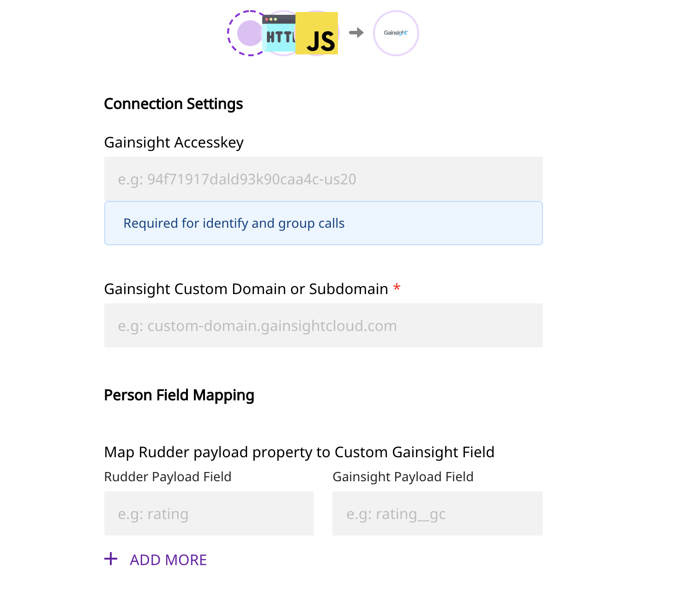
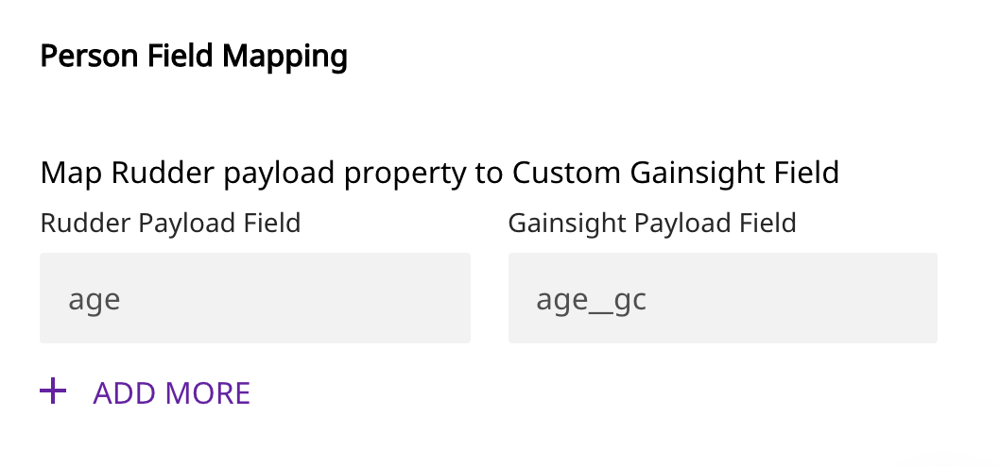
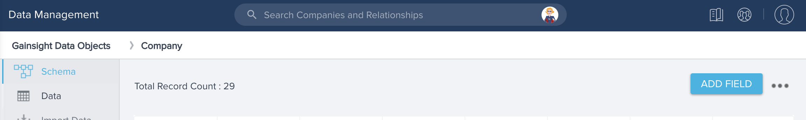
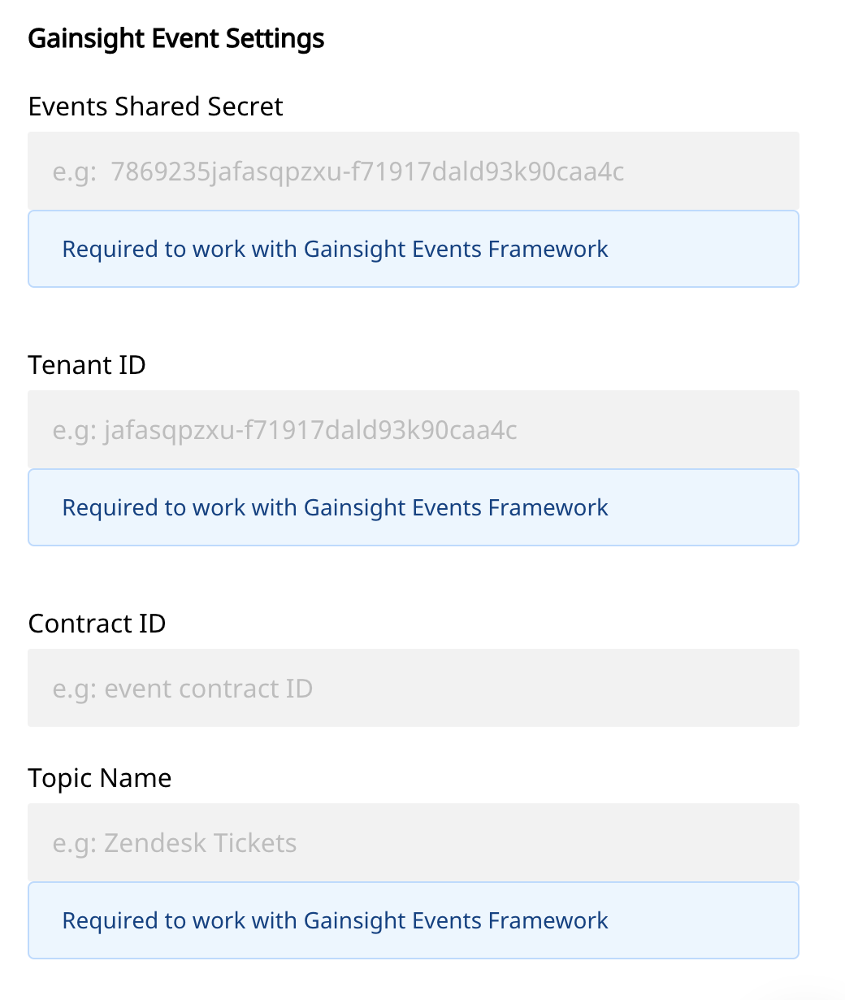
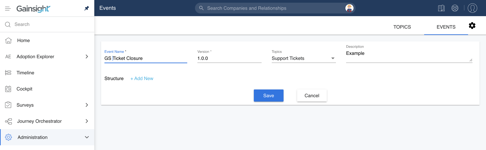

# Gainsight CS

[Gainsight CS](https://www.gainsight.com/customer-success/) is Gainsight's customer success product. It gives you a complete, 360-degree view of your customers and helps you understand their product behavior based on the data around their interactions and usage trends. With Gainsight CS, you can also analyze your company's activity with every customer and leverage the insights to improve interaction with them.

RudderStack allows you to send your event data from a variety of sources to Gainsight CS.


**This integration is developed for the Gainsight CS NXT Edition.**



**Find the open-source transformer code for this destination in our** [**GitHub repo**](https://github.com/rudderlabs/rudder-transformer/tree/dest-gainsight)**.**


## Getting Started

To send your events to Gainsight CS via RudderStack, you will need to add it as a destination in the RudderStack dashboard. 


See our [Connections](https://docs.rudderstack.com/connections) guide to learn more about sources and destinations in RudderStack.


Please check if the source platform is supported by Gainsight CS by referring to the table below:

| **Connection Mode** | **Web** | **Mobile** | **Server** |
| :--- | :--- | :--- | :--- |
| **Device mode** | - | -| - |
| **Cloud mode** | **Supported** | **Supported** | **Supported** |


To know more about the difference between Cloud mode and Device mode in RudderStack, read the [RudderStack connection modes](https://docs.rudderstack.com/get-started/rudderstack-connection-modes) guide.


Once you've confirmed that the source platform supports sending events to RudderStack, follow these steps:

* From your [RudderStack dashboard](https://app.rudderlabs.com/), add the source and select **Gainsight** from the list of supported destinations.


Please follow our guide on [How to Add a Source and Destination in RudderStack](https://docs.rudderstack.com/how-to-guides/adding-source-and-destination-rudderstack) to add a source and destination in RudderStack.


* Assign a name to this destination, and click on **Next**. You should then see the following screen:



You will need to enter the following settings under **Connection Settings**:

* **Access Key**: This key is required for the `identify` and `group` calls. To generate the access key in Gainsight, go to **Administration** - **Connectors 2.0** - **Connectors** tab and click on **Gainsight API**.


For more information on generating the Gainsight Access Key, refer to their [support page](https://support.gainsight.com/SFDC_Edition/Connectors/04API_Integration/Generate_API_Access_Key).


* **Domain or Subdomain Name**: Subdomain or custom domain is a required field to work with the Gainsight API. required to work with the Gainsight API.


More information on setting up a Gainsight custom domain can be found in their [support page](https://support.gainsight.com/Gainsight_NXT/06Surveys/02Admin_Guides/Setup_a_Gainsight_Domain).


* **Gainsight Event Settings**: This setting is related to the Gainsight Events Framework. Refer to the **Track** section of this documentation for details.

## Identify

RudderStack creates a `Person` object in Gainsight for the `identify` call. Gainsight uses the `Email` field as an identifier and it is mandatory to merge the object. Hence, for an `identify` call, the `email` field is mandatory.

For the default fields in Gainsight `Person` object, the camelCase notation is used in the RudderStack payload traits.

The mapping of the RudderStack traits to the Gainsight `Person` object fields is as shown:

| **Gainsight Person Field** | **RudderStack Trait Name** |
| :--- | :--- |
| `Email` | `email` |
| `Name` | `name` |
| `FirstName` | `firstName` |
| `MiddleName` | `middleName` |
| `LastName` | `lastName` |
| `LinkedinUrl` | `linkedinUrl` |
| `Location` | `location` |
| `ExternalRecordID__gc` | `externalRecordId` |
| `EmailOptOut` | `emailOptOut` |
| `DynamicResolutionKey` | `dynamicResolutionKey` |
| `Comments` | `comments` |
| `Timezone` | `timezone` |
| `MasterRecordID` | `masterRecordId` |
| `MasterAvatarTypeCode` | `masterAvatarTypeCode` |

An example of the `identify` call in RudderStack is as shown:

```
  rudderanalytics.identify(
    "sample-user-id",
    { 
      email: "user@email.com",
      firstName: "John",
      lastName: "Doe",
      comments: "example identify call",
    },
    () => console.log("identify callback")
  );
```


Custom fields are supported for `identify`. Refer to the section below for details.


### Custom Fields

You can create custom fields in the Gainsight schema for a `Person` object as shown in the image below:


Then, you can add the RudderStack trait name for the Gainsight custom field mapping in the RudderStack dashboard as shown:





When you add custom fields in the Gainsight schema, `__gc` is automatically suffixed at the end. Therefore, you need to provide the field name including the `__gc` suffix in the RudderStack dashboard as shown above.


## Group

The `group` call associates a person with a group. RudderStack's `group` call creates a `Company` object if it is not present or updated with the provided traits. The `Name` field in is used as the unique identifier.


For making a `group` call, `email` is a mandatory field in `context.traits` of the RudderStack event payload.


The mapping of the RudderStack traits to the Gainsight `Company` object fields is as shown:


| **Gainsight Compant Field** | **RudderStack Trait Name** |
| :--- | :--- |
| `Name` | `name` |
| `Employees` | `employees` |
| `Arr` | `arr` |
| `BillingAddress` | `billingAddress` |
| `Summary` | `summary` |
| `Csm` | `csm` |
| `CustomerlifetimeInMonths` | `customerLifetimeInMonths` |
| `Industry` | `industry` |
| `LifecycleInWeeks` | `lifecycleInWeeks` |
| `ManagedAs` | `managedAs` |
| `Mrr` | `mrr` |
| `OriginalContractDate` | `originalContractDate` |
| `ParentCompany` | `parentCompany` |
| `RenewalDate` | `renewalDate` |
| `Stage` | `stage` |
| `Status` | `status` |
| `Tags` | `tags` |
| `TickerSymbol` | `tickerSymbol` |
| `Users` | `users` |
| `SfdcAccountId` | `sfdcAccountId` |
| `IndustryNew` | `industryNew` |


An example `group` call is as shown below:

```
  rudderanalytics.group(
    "sample-group-id",
    { 
      name: "Example Company",
      employees: 1000,
      industry: "Software"
    },
    () => console.log("group callback")
  );
```


Custom Fields are supported for the `group` call. For details, refer to the section below.


### Custom Fields

To send custom properties to Gainsight CS via RudderStack, you first need to create custom fields in the Gainsight schema for the `Company` object, as shown in the following image:



Then, you can add the RudderStack trait name for the Gainsight custom field mapping in the RudderStack dashboard:



When you add custom fields in the Gainsight schema, `__gc` is automatically suffixed at the end. Therefore, you need to provide the field name including the `__gc` suffix in the RudderStack dashboard as shown above.


## Track

The `track` call is used to work with the Gainsight Events Framework. The Gainsight Events Framework lets you create events which can then be used in the **Programs** and **Rules Engine**.

Gainsight events are identified with `Event Name` and `Event Version`. The events are grouped under `Topics`. Note that there can be multiple events under a topic.

To start sending events, you will first need to register as a Publisher in Gainsight by going to **Administration** - **Events** and clicking on **Register as Publisher**. This generates a unique shared secret required for working with Gainsight Events Framework.


More information on the Gainsight Events Framework can be found in their [support page](https://support.gainsight.com/Gainsight_NXT/Journey_Orchestrator_and_Email_Templates/Programs/Events_Framework#Event_API_Contract).


Provide the required event settings in the RudderStack dashboard as shown:



The required settings are:

* **Shared Secret**: This is a required field. Go to **Administration** - **Events** and click on **Register as Publisher** to get this key.
* **TenantId**: The Tenant ID of the Publisher is a required field. You can copy this ID by going to **Administration** - **Application Settings**.
* **Contract ID**: This field is optional. If a user subscribes to a contract, only those subscribers associated with this contract will get the event.
* **Topic Name**: This is a required field. The events are grouped under topic.

`ContractId` can be provided in the RudderStack dashboard or in the `track` payload as `externalId`. If both are present, the `externalId` will get the higher precedence.

Following is an example for sending `contractId` via track call.
```
rudderanalytics.track(
  "Ticket Closure",
  {
    name: "John Doe",
    status: "resolved"
  },
  {
    externalId: [
      {
        type: "gainsightEventContractId",
        id: "sample-contract-id"
      }
    ]
  },
  () => console.log("track callback")
);
```

### Using RudderStack's `track` call with Gainsight Events


Both the event `name` and `version` are needed to use `track` with Gainsight Events.


First, create a new event under a particular topic in Gainsight, as shown:



Then, provide this event name and the version mapping in the RudderStack dashboard as shown:


You are now ready to send events to Gainsight using the `track` method.

An example of a `track` call is as shown:

```
rudderanalytics.track(
  "Ticket Closure",
  {
    name: "John Doe",
    status: "resolved"
  },
  () => console.log("track callback")
);
```


To send Gainsight Events to more than one topic, we recommend creating new Gainsight destinations in the RudderStack dashboard for each topic.


## Contact Us

If you come across any issues while configuring Gainsight with RudderStack, please feel free to [contact us](mailto:%20docs@rudderstack.com). You can also start a conversation on our [Slack](https://resources.rudderstack.com/join-rudderstack-slack) channel; we will be happy to talk to you!
