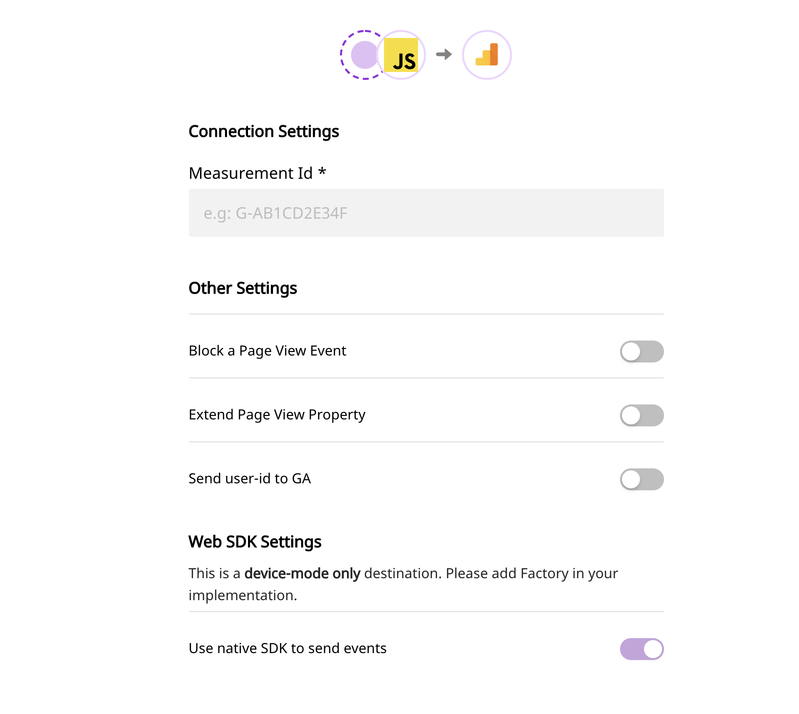

# Google Analytics 4

[Google Analytics 4](https://analytics.google.com/) (GA4, formerly known as “App + Web) is a new Google Analytics property, with different instrumentation and reports than what used to be Universal Analytics properties. With Google Analytics 4 property you can use it for a website, an app, or both together whereas Universal Analytics properties only support websites. RudderStack supports the `gtag` way of tagging in websites.

## Getting Started

To enable sending data to **GA4**, you will first need to add it as a destination to the source from which you are sending your event data. Once the destination is enabled, events from RudderStack will start flowing to GA4.

Before configuring your source and destination on the RudderStack, please verify if the source platform is supported by GA4, by referring to the table below:

| **Connection Mode** | Web | Mobile | Server |
| :--- | :--- | :--- | :--- |
| **Device Mode** | **Supported** | **-** | **-** |
| **Cloud Mode** | **-** | **-** | **-** |


To know more about the difference between Cloud mode and Device mode in RudderStack, read the [RudderStack connection modes](https://docs.rudderstack.com/get-started/rudderstack-connection-modes) guide.


Once you have confirmed that the platform supports sending events to GA4, please perform the steps below:

* Choose a source to which you would like to add GA4 as a destination.


Please follow our [Adding a Source and Destination](https://docs.rudderstack.com/how-to-guides/adding-source-and-destination-rudderstack) guide to add a source in RudderStack.


* Select the destination as **Google Analytics 4** to your source. Give your destination a name and then click on **Next**.
* On the **Connection Settings** page, fill all the fields with the relevant information and click **Next**.



In the **Connection Settings**, please enter your **Measurement Id** as shown above.

## Identify

User-ID is an advanced feature that lets Analytics present a cross-platform, cross-device view of your users' behavior.
Google Analytics 4 uses user id and device id (GA's cid value from Universal Analytics terminology) to identify users.

Google Analytics 4 allows you to set a user ID to the identified visitors if **Send User ID** **to GA** is enabled in the destination settings page in RudderStack app.
RudderStack will send the identified user id according to [this](https://developers.google.com/analytics/devguides/collection/ga4/cookies-user-id#set_user_id)

A sample `identify` call is as shown:

```bash
rudderanalytics.identify("I am User"{
  name: "My name is",
  email: "myemailaddressis@gmail.com"
});
```

In the above snippet, the `userid` will be set to `I am User` for Google Analytics and the name and email will be set as `user_properties` in GA. 

If **Send User ID** **to GA** is disabled then we do not set user Id instead we only send user traits to set as `user_properties` in GA.
The user properties are set on the `gtag` client according to [this](https://developers.google.com/analytics/devguides/collection/ga4/user-properties)


## Page

GA4 gtag sends a `page_view` event to Google Analytics by default every-time it is loaded.
You can also send `page_view` event to google analytics whenever you make an explicit **`page()`** call to Rudder SDK.

We send following properties by default:

* `path` mapped to `page_location`
* `title` mapped to `page_title`
* `referrer` mapped to `page_referrer`

You can also make `page()` call with any custom and standard properties as shown below:

```bash
rudderanalytics.page({
  path: "/test_browser.html",
  url: "http://localhost/test_browser.html?param1=true",
  title: "Page Load",
  search: "?param1=true",
  referrer: "referrer"
});
```

#### Extend Page View Property
GA4 has a limit on number of unique properties per event name. The default `page_view` event supports the above properties as mentioned [here](https://support.google.com/analytics/answer/9234069?hl=en&ref_topic=6317484).
If **Extend Page View Property** config is enabled then we send the following properties along with any other custom property passed to page call of Rudder SDK:

* `url`
* `search`

#### Block Page View Event
When this config is enabled we disable sending GA4 `page_view` events on load, instead you can explicitly send a `page_view` event by calling Rudder SDK **page()** api.

## Track

The `track` call allows you to capture any action that the user might perform, along with the properties that are associated with that action. Each action is considered to be an event.

A sample `track` call looks like the following:

```javascript
rudderanalytics.track("Track me");
```
Rudder SDK will send the track event name and any properties as custom properties to GA4.


For properties that are nested and not a standard GA4 property, RudderStack SDK will flatten them before sending to Google Analytics


## E-Commerce

RudderStack supports E-Commerce tracking for GA4. Use the e-commerce [spec](https://docs.rudderstack.com/rudderstack-api-spec/rudderstack-ecommerce-events-specification) of sending events while instrumenting your site with Rudder SDK.

Below are some examples of the track event names that are passed to GA4 specific e-commerce event name

| RudderStack event name | GA4 event name |
| -- | -- | -- |
| products | searched search |
| product list viewed | view_item_list |
| promotion viewed | view_promotion |
| product clicked | select_item |
| product added to wishlist | add_to_wishlist |
| product added | add_to_cart |
| cart shared | share |
| checkout started | begin_checkout |
| order completed | purchase |


For each product in the order, there must be an `id` and `name`. More info on GA4 e-commerce event and corresponding properties [here](https://developers.google.com/gtagjs/reference/ga4-events#view_item_list)



## FAQs

### **How do you get the GA4 Measurement Id?**

* Login to Google Analytics dashboard.
* Go to the **Admin** section from the left sidebar.
* Select the account and then property from the drop down for which you wish to get the id.
* Now click on data streams and select the stream for which you wish to get the id.
* Copy the measurement id by clicking on copy to clipboard icon.

## Contact Us

If you come across any issues while configuring Google Analytics 4 with RudderStack, please feel free to [contact us](mailto:%20contact@rudderstack.com) or start a conversation on our [Slack](https://resources.rudderstack.com/join-rudderstack-slack) channel. We will be happy to help you.
