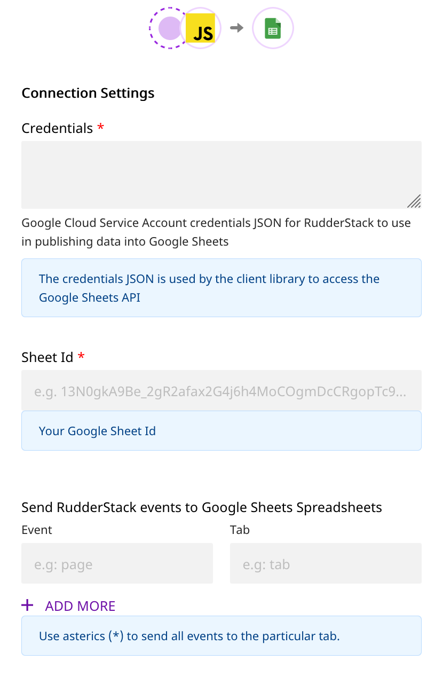
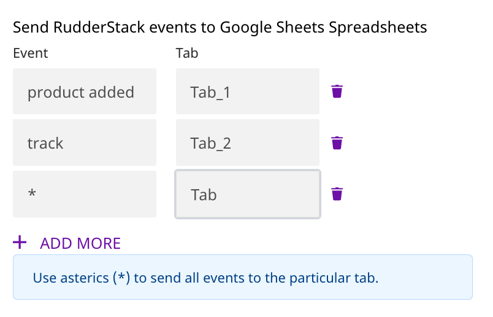

# Google Sheets

[Google Sheets](https://www.google.com/sheets/about/) is a popular spreadsheet program that is bundled as a part of the free, cloud-based office suite offered by Google. With Google Sheets you can seamlessly create spreadsheets that update and save automatically and are easy to access from your Google Drive.

RudderStack allows you to configure Google Sheets as a destination and send your event data to it directly.


**Find the open-source transformer code for this destination in our** [**GitHub repo**](https://github.com/rudderlabs/rudder-transformer/tree/master/v0/destinations/googlesheets)**.**


## Getting Started

To enable sending data to Google Sheets, you will first need to add it as a destination to the source from which you are sending your event data. Once the destination is enabled, events from our SDK will start flowing to Google Sheets.

| **Connection Mode** | **Web**       | **Mobile**    | **Server**    |
| :------------------ | :------------ | :------------ | :------------ |
| Device mode         | **-**         | **-**         | **-**         |
| Cloud mode          | **Supported** | **Supported** | **Supported** |



To know more about the difference between Cloud mode and Device mode in RudderStack, read the [RudderStack connection modes](https://docs.rudderstack.com/get-started/rudderstack-connection-modes) guide.


Once you have confirmed that the platform supports sending events to Google Sheets, perform the steps below:

- From your [RudderStack dashboard](https://app.rudderlabs.com/), add the source. From the list of destinations, select **Google Sheets.**


Please follow our [Adding a Source and Destination](https://docs.rudderstack.com/getting-started/adding-source-and-destination-rudderstack) guide to add a source and destination in RudderStack.


- Give a name to the destination and click on **Next**. You should then see the following screen:



- Enter the following details:

  - **Connection Settings**

    - **Credentials**: Follow these steps to obtain the credentials for connecting Google Sheets:

      - Create a service account in from your Google Cloud Console account.
      - A JSON file with the credentials will be generated against your service account.
      - Paste this downloaded JSON in the **Credentials** field.

    - **Sheet ID**: Add the Google Sheet ID to which you want to send your event data. You need add the email address of the service account as an editor for that specific Google Sheet.
    - Enter the **Event Name** as well as the corresponding **Google Sheet Tab**. You can create multiple tabs within a single sheet as shown below:




You can send `page`, `identify`, and `track` events with this integration. For the `track` events, you can specify the event name based on the `event` name in the payload.

For example:

- If the event name is **`page`**, it will send all the calls with the `type` page.
- If the event name is **`product added`** , it will send all the `track` events with the **`event`** as **`product added`**.



If you want to send all the events to a particular Tab in your Google Sheet irrespective of the type or name, you can use **`*`** as the event name.



The **Tab** is **case-sensitive** and has to be exactly as seen in Google Sheets. On the other hand, the **event name** is **case insensitive**, and thus `Page` or `page` will both be considered as valid.


- Finally, click on **Next** to complete the configuration. 

Google Sheets should now be added and enabled as a destination in RudderStack.

## Page

The `page` call contains information related to the page, such as the URL of the web page visited by the user.


For more information on the `page` method, please refer to our [RudderStack API Specification](https://docs.rudderstack.com/rudderstack-api-spec) guide.


A sample `page` payload is as shown in the snippet below:

```javascript
rudderanalytics.page({
  path: "path",
  url: "url",
  title: "title",
  search: "search",
  referrer: "referrer",
});
```

## Identify

The `identify` call captures the relevant details about the visiting user.


For more information on the `identify` method, please refer to our [RudderStack API Specification](https://docs.rudderstack.com/rudderstack-api-spec) guide.


A sample `identify` payload is as shown in the snippet below:

```javascript
rudderanalytics.identify("userId", {
  name: "FirstName LastName",
  email: "example@email.com",
  phone: "phone",
});
```

## Track

The `track` call captures the information related to the actions performed by the user along with their properties or traits.


For more information on the `track` method, please refer to our [RudderStack API Specification](https://docs.rudderstack.com/rudderstack-api-spec) guide.


A sample `track` payload is as shown in the snippet below:

```javascript
rudderanalytics.track("Track Event", {
  category: "category",
  label: "label",
  value: "value",
});
```

## Screen

The `screen` method allows you to record whenever a user sees the mobile screen along with any associated optional properties. This call is similar to the `page` call but is exclusive to your mobile device.

A sample `screen` call looks like the following code snippet:

```text
[[RSClient sharedInstance] screen:@"Sample Screen Name" properties:@{@"prop_key" : @"prop_value"}];
```

## FAQs <a id="faqs"></a>

### How does event mapping work with the Tabs in A Google Sheet?

- If there is no Tab set for an event, the event will not be sent.
- If an event is set with a Tab, the payload will be sent to Google Sheets to that particular Tab.


If you have set all of the event `type`, `event` and \* for mapping, the priority will be given to `event` ,  
then `type` , followed by \*.


For example, if the type of event is `track`, the event name is `product added`, then the mapping is done as:



Now all the events should go to the Tab mapped with **`product added`**.

## Contact Us

If you come across any issues while configuring or using Google Sheets with RudderStack, please feel free to [contact us](mailto:%20contact@rudderstack.com). You can also start a conversation on our [Slack](https://resources.rudderstack.com/join-rudderstack-slack) channel; we will be happy to talk to you!
