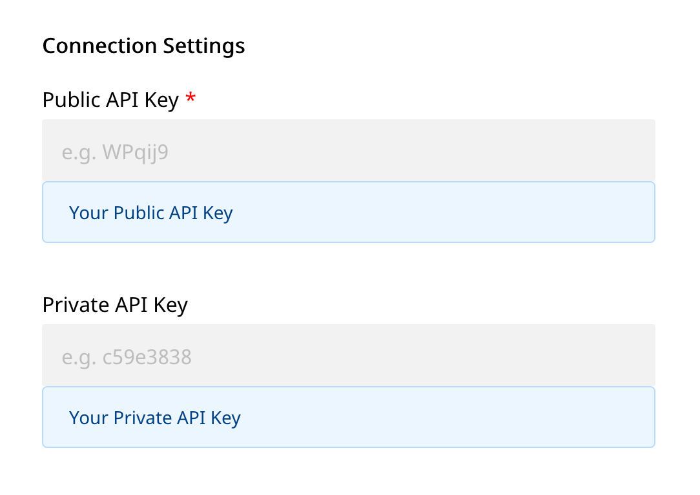

# Klaviyo

[Klaviyo](https://www.klaviyo.com/) is a powerful email platform focused on ecommerce that helps companies make more money. It supports segmentation based on category and event triggers like product bought, page viewed, email engagement, or amount spent.

It measures opens, clicks, revenue generated, breakdown of generated revenue based on custom attributes (like type of campaign or amount gained per recipient), and provides trend reports, cohort analysis, and subscriber growth

Ultimately, Klaviyo lets you send personalized newsletters, automates triggered emails, product recommendations, welcome campaigns, order announcements, push notifications and sync your data to facebook custom audiences.

You can now send your event data directly to Klaviyo through RudderStack.


**Find the open-source transformer code for this destination in our** [**GitHub repo**](https://github.com/rudderlabs/rudder-transformer/tree/master/v0/destinations/klaviyo)**.**


## Getting Started

Before configuring your source and destination on the RudderStack, please check whether the platform you are sending the events from is supported by ActiveCampaign. Please refer the following table to do so:

| **Connection Mode** | **Web**       | **Mobile**    | **Server**    |
| :------------------ | :------------ | :------------ | :------------ |
| **Device mode**     | -             | -             | -             |
| **Cloud mode**      | **Supported** | **Supported** | **Supported** |


To know more about the difference between Cloud mode and Device mode in RudderStack, read the [RudderStack connection modes](https://docs.rudderstack.com/get-started/rudderstack-connection-modes) guide.


Once you have confirmed that the platform supports sending events to Klaviyo, perform the steps below:

- From your [RudderStack dashboard](https://app.rudderstack.com/), add the source and ActiveCampaign as a destination.


Please follow our guide on [How to Add a Source and Destination in RudderStack](https://docs.rudderstack.com/how-to-guides/adding-source-and-destination-rudderstack) to add a source and destination in RudderStack.




## ActiveCampaign Configuration Settings on the RudderStack Dashboard

To successfully configure Klaviyo as a destination, you will need to configure the following settings:

- **Public API Key:** Your Public API Key is the unique Key generated against your account. It can be found in your account on the **Account** section under the **Settings** tab.
- **Private API Key:** Your Private API key can be generated for your account on the **Account** section under the **Settings** tab. This key allows you to add users to list or subscribe them using personalised emails/sms.

## Screen

The `screen` method allows you to record whenever a user sees the mobile screen, along with any associated optional properties. You always have to associate the event with an user if the user is not already identified a new user will be created with `email` or `phone` as identifier, if the user is already identified the activity of the user will be updated with the event. So either `email` or `phone` has to be provided to associate with the user.

A sample `screen` call looks like the following code snippet:

```javascript
rudderanalytics.screen(
  "Screen Viewed",
  {
    Clicked_Corner_Button": true,
    ViewTime: 2000,
    Checked: ["Home Page", "About"],
  },
  {
    traits: {
      id: "utsabc",
      age: "22",
      name: "Utsab",
      email: "utsab@rudderstack.com",
      phone: "9122340375",
      userId: "utsabc2",
      city: "kolkata",
      state: "West bengal",
      street: "Park Street",
      country: "India",
      postalcode: "700096",
      birthday: "2021-01-25",
      lastname: "Chowdhury",
      firstname: "Utsab",
      anonymousId: "9c6bd77ea9da3e68",
      description: "Sample description",
    },
  }
);
```

In the above snippet, RudderStack captures information related to the screen being viewed, along with any additional info on that screen view event.

## Track

The `track` call allows you to capture any action that the user might perform, and the properties associated with that action. Each action is considered to be an event It is similar to `screen` event an user has to be associated with an event rither by using `email` or `phone`.

A sample `track` call looks like the following:

```javascript
rudderanalytics.track(
  "Checked Out",
  {
    Clicked_Rush_delivery_Button: true,
    total_value: 2000,
    Odered: ["T-Shirt", "jacket"],
  },
  {
    traits: {}
      email: "utsab@rudderstack.com",
      phone: "9122340375"
    },
  }
);
```

In the above snippet, RudderStack captures the information related to the `Checked Out` event, along with any additional info about that event - in this case the name of the product.


If you want to set value to the `screen` and `track` type event you need to pass the `event` related property in event properties, and for the user info you need to pass then in `traits` in `context` like the above example.



Apart from either `email` or `phone`the other fields are not mandatory.


## Identify

The `identify` call lets you associate a user with their actions and capture all the relevant traits about them. This information includes unique `userid` as well as any optional information such as name, email address, etc.

A sample `identify` call looks like the following:

```javascript
rudderanalytics.identify("userid", {
  firstName: "Utsab",
  lastName: "Chowdhury",
  email: "utsab@rudderstack.com",
  phone: "+12 345 678 900",
  userId: "utsab47",
  title: "Owner",
  organization: "Rudder",
  city: "Tokyo",
  region: "Kanto",
  country: "JP",
  zip: "100-0001",
  Flagged: false,
  Residence: "Shibuya",
  properties: {
    listId: "XUepkK",
    subscribe: true,
    consent: "email",
    smsConsent: true,
  },
});
```

In the above snippet, RudderStack captures relevant information about the user such as the `email`, `phone` as well as the associated traits of that user.


The `email` or `phone` trait is a mandatory trait for mapping a user to Klaviyo. If a user already exists, the new values will be updated for that user . You can further add the user to the list by adding `listId` in the `properties` within traits also you can subscribe the user for that list using `subscribe`. If you are a GDPR compliant business, you will need to include `consent` in your API call. `consent` is a Klaviyo special property and only accepts the following values: "email", "web", "sms", "directmail", "mobile". If you are updating consent for a phone number or would like to send an opt-in SMS to the profile (for double opt-in lists), include an `smsConsent` key in the properties with a value of true or false.


## Group

The `group` call lets you associate a user with a list also you can subscribe the user in the list. If you haven't already added or subscribed the user using `identify` call you can do so by using `group` call.

A sample `group` call looks like the following:

```javascript
rudderanalytics.group(
      "XUepkK",
      {
        subscribe: "true",
      },
      {
        traits: {
          email: "utsab@rudderstack.com",
          phone: "+12 345 678 900",
          consent: "email",
          smsConsent: true,
        },
      }
    );
```

In the above snippet the user with above traits is added to list also the user is subscribe as using the `subscribe` flag.


Apart from either `email` or `phone`the other fields are not mandatory. If you are subscribing and if you are a GDPR compliant business, you will need to include `consent` in your API call. `consent` is a Klaviyo special property and only accepts the following values: "email", "web", "sms", "directmail", "mobile". If you are updating consent for a phone number or would like to send an opt-in SMS to the profile (for double opt-in lists), include an `smsConsent` key in the properties with a value of true or false.


## Contact Us

If you come across any issues while configuring ActiveCampaign with RudderStack, please feel free to [contact us](mailto:docs@rudderstack.com). You can also start a conversation on our [Slack](https://resources.rudderstack.com/join-rudderstack-slack) channel; we will be happy to talk to you!
