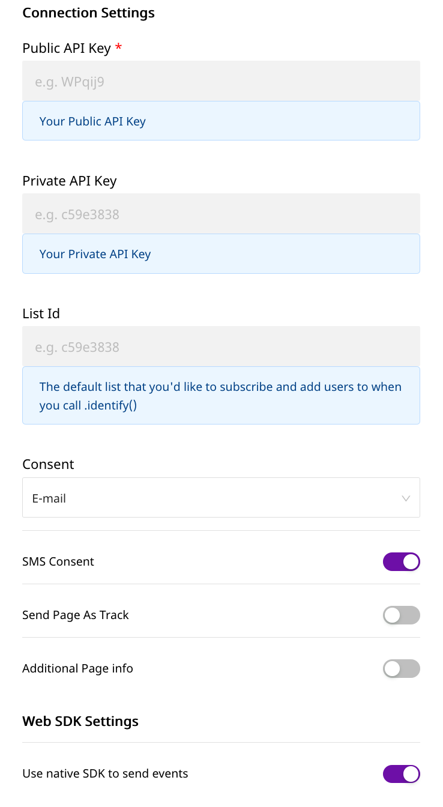

# Klaviyo

[Klaviyo](https://www.klaviyo.com/) is a powerful eCommerce platform that allows you to boost your business revenue. It supports unique features such as category-based segmentation and various event triggers based on page views, purchases, email engagement, and more. With Klaviyo, you can easily track and measure all your user activity and the resulting revenue and get a breakdown of this revenue based on custom attributes like campaign type or revenue per recipient. It also offers features such as trend reports, cohort analysis, and various options for boosting customer engagement, such as personalized newsletters, product recommendations, in-app push notifications, and more.

You can now send your event data directly to Klaviyo through RudderStack.


**Find the open-source transformer code for this destination in our** [**GitHub repo**](https://github.com/rudderlabs/rudder-transformer/tree/master/v0/destinations/klaviyo)**.**


## Getting Started

Before configuring your source and destination on the RudderStack, please check whether the platform you are sending the events from is supported by ActiveCampaign. Please refer the following table to do so:

| **Connection Mode** | **Web**       | **Mobile**    | **Server**    |
| :------------------ | :------------ | :------------ | :------------ |
| **Device mode**     | **Supported** | -             | -             |
| **Cloud mode**      | **Supported** | **Supported** | **Supported** |


To know more about the difference between Cloud mode and Device mode in RudderStack, read the [RudderStack connection modes](https://docs.rudderstack.com/get-started/rudderstack-connection-modes) guide.


Once you have confirmed that the platform supports sending events to Klaviyo, perform the steps below:

- From your [RudderStack dashboard](https://app.rudderstack.com/), add the source and Klaviyo as a destination.


Please follow our guide on [How to Add a Source and Destination in RudderStack](https://docs.rudderstack.com/how-to-guides/adding-source-and-destination-rudderstack) to add a source and destination in RudderStack.




## Klaviyo Configuration Settings on the RudderStack Dashboard

To successfully configure Klaviyo as a destination, you will need to configure the following settings:

- **Public API Key:** Your Public API Key is the unique key generated against your account. It can be found in your account on the **Account** section under the **Settings** tab.
- **Private API Key:** Your Private API key can be generated for your account on the **Account** section under the **Settings** tab. This key allows you to add users to list or subscribe them using personalised emails/sms.
- **List Id:** Your default List Id to which you want to add/subscribe identified users.
- **Consent:** If you are a GDPR-compliant business, you will need to include `consent` in your API call,`consent` is a Klaviyo-specific property and only accepts the following values: `email`, `web`, `sms`, `directmail`, and `mobile`.
- **SMS Consent:** If you are updating the consent for a phone number, or would like to send an opt-in SMS to the profile (for double opt-in lists), include an `smsConsent` key in the properties with a value of `true` or `false`.

## Page

Page call allows you track which web-page the user is viewing, take a look to understand what the Page method does. An example call would look like:

```javascript
rudderanalytics.page();
```

If you want to send additional info in the page evnent you can do it so by adding the `additionalInfo` key in the page event properties along with other `pageInfo` object which you want to associate with the page-view event, check out the example below.

```javascript
rudderanalytics.page(
  "Cart",
  "Cart Viewed",
  {
    additionalInfo: true,
    pageInfo: {
      path: "/cart",
      referrer: "test.com",
      search: "term",
      title: "test_item",
      url: "http://test.in",
    }
  },
  () => {
    console.log("in page call");
  }
);
```


NOTE: page calls are only supported device-mode integration.


## Screen

The `screen` method allows you to record whenever a user sees the mobile screen, along with any associated optional properties. This call is similar to the `page` call, but is exclusive to your mobile device.

It is required that you associate the event with an user. If the user is not already identified, a new user will be created with `email` or `phone` as the identifier. If the user is already identified, the activity of the user will be updated with the event. It is therefore essential to either provide `email` or `phone` in order to associate with the user.

A sample `screen` call looks like the following code snippet:

```javascript
rudderanalytics.screen(
  "Screen Viewed",
  {
    Clicked_Corner_Button": true,
    ViewTime: 2000,
    Checked: ["Home Page", "About"],
  },
  {
    traits: {
      id: "name",
      age: "22",
      name: "Name",
      email: "name@website.com",
      phone: "123456789",
      userId: "userid",
      city: "city",
      state: "state",
      street: "street",
      country: "country",
      postalcode: "123456",
      birthday: "2021-01-01",
      lastname: "lastname",
      firstname: "name",
      anonymousId: "9c6bd77ea9da3e68",
      description: "Sample description",
    },
  }
);
```

In the above snippet, RudderStack captures all the information related to the screen being viewed, along with any additional info associated with that screen view event.


NOTE: screen calls are only supported cloud-mode integration.


## Track

The `track` call allows you to capture any action that the user might perform, and the properties associated with that action. Each action is considered to be an event. It is similar to `screen` event, and the user has to be associated with an event either by using `email` or `phone`.

A sample `track` call looks like the following:

```javascript
rudderanalytics.track(
  "Checked Out",
  {
    Clicked_Rush_delivery_Button: true,
    total_value: 2000,
    Odered: ["T-Shirt", "jacket"],
  }
);
```

In the above snippet, RudderStack captures the information related to the `Checked Out` event, along with any additional info about that event - in this case the name of the product.


If you want to set a specific value to the `screen` and `track` type event, you need to pass the `event` related property in event properties.



If you are sending `track`/ `screen` type event using some sdk which does not persist user context info after `identify` you need to pass the user info in `context.traits`.


## Identify

The `identify` call lets you associate a user with their actions and capture all the relevant traits about them. This information includes unique `userid` as well as any optional information such as name, email address, etc.

A sample `identify` call looks like the following:

```javascript
rudderanalytics.identify("userid", {
  firstName: "Name",
  lastName: "Surname",
  email: "name@website.com",
  phone: "+12 345 678 900",
  userId: "userId",
  title: "Owner",
  organization: "Company",
  city: "Tokyo",
  region: "ABC",
  country: "JP",
  zip: "100-0001",
  Flagged: false,
  Residence: "Shibuya",
  properties: {
    listId: "XUepkK",
    subscribe: true,
    consent: "email",
    smsConsent: true,
  },
});
```

In the above snippet, RudderStack captures relevant information about the user such as the `email`, `phone` as well as the associated traits of that user.


The `email` or `phone` trait is a mandatory trait for mapping a user to Klaviyo. If a user already exists, the new values will be updated for that user . You can further add the user to the list by adding `listId` in the `properties` within the `traits`, this will override the `listId` you used in Control-Plane for this event. You can also subscribe the user to a list by setting `subscribe` option to `true`.



Similar to `listId` adding `consent` and `smsConsent` property will override the value stored in Control-Plane fot the specific event.



NOTE: Adding or Subscribing users to specific list is only available in cloud-mode integration.



## Group

The `group` call lets you associate a user with a list. You can also subscribe a user to the list. If you haven't already added or subscribed the user using the `identify` call, you can do so by using `group` call.

A sample `group` call looks like the following:

```javascript
rudderanalytics.group(
  "XUepkK",
  {
    subscribe: "true",
  },
  {
    traits: {
      email: "name@website.com",
      phone: "+12 345 678 900",
      consent: "email",
      smsConsent: true,
    },
  }
);
```

In the above snippet, the user with the associated traits is added to list, and also subscribed using the `subscribe` flag.


Apart from either `email` or `phone`, the other fields are not mandatory.



Adding `consent` and `smsConsent` property will override the value stored in Control-Plane fot the specific event.



NOTE: using group event to Add or Subscribe users to specific list is only available in cloud-mode integration.


## Contact Us

If you come across any issues while configuring Klaviyo with RudderStack, please feel free to [contact us](mailto:docs@rudderstack.com). You can also start a conversation on our [Slack](https://resources.rudderstack.com/join-rudderstack-slack) channel; we will be happy to talk to you!
