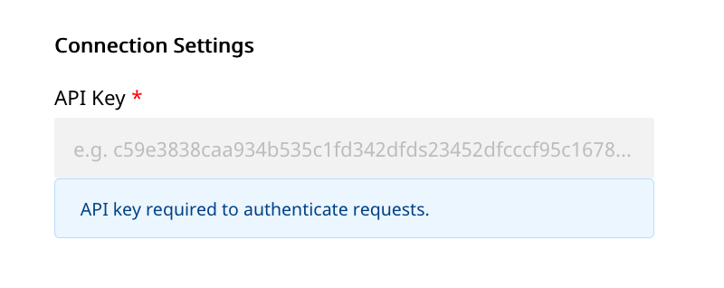

# Kustomer

[Kustomer](https://www.kustomer.com/) is a modern customer engagement platform designed for enterprises. It gives you a holistic view of your users and customer base, lets you provide best-in-class support, and engage with your customers through meaningful interactions.

You can now send your event data directly to Kustomer through RudderStack.


**Find the open-source transformer code for this destination in our** [**GitHub repo**](https://github.com/rudderlabs/rudder-transformer/tree/master/v0/destinations/kustomer)**.**


## Getting Started

Before configuring your source and destination on the RudderStack, please check whether the platform you are sending the events from is supported by Kustomer. Please refer the following table to do so:

| **Connection Mode** | **Web**       | **Mobile**    | **Server**    |
| :------------------ | :------------ | :------------ | :------------ |
| **Device mode**     | -             | -             | -             |
| **Cloud mode**      | **Supported** | **Supported** | **Supported** |


To know more about the difference between Cloud mode and Device mode in RudderStack, read the [RudderStack connection modes](https://docs.rudderstack.com/get-started/rudderstack-connection-modes) guide.


Once you have confirmed that the platform supports sending events to Kustomer, perform the steps below:

- From your [RudderStack dashboard](https://app.rudderstack.com/), add the source and Kustomer as a destination.


Please follow our guide on [How to Add a Source and Destination in RudderStack](https://docs.rudderstack.com/how-to-guides/adding-source-and-destination-rudderstack) to add a source and destination in RudderStack.




## Kustomer Configuration Settings in RudderStack

To successfully configure Kustomer as a destination, you will need to configure the following settings:

- **API Key:** Your API Key is an unique Key which can be generated for your account. It can be found in your account under **Settings** , by navigating to **Security** - **API Keys**.


Note: Relevant `roles` are required for an **API Key** to successfully access Kustomer endpoints. Please check the [Kustomer Docs](https://support.kustomer.com/api-keys-SJs5YTIWX) for further information on how to do this.  



Note: All server-side destination requests require either a `anonymousId` or a `userId` in the payload.


## Page

The `page` call allows you to record information whenever a user sees a web page, along with its associated properties.

When you send a `page` event , RudderStack sends that event to Kustomer as a **"Web Page Viewed `Page Name`** event.

An example of a `page` call is shown below:

```javascript
rudderanalytics.page("Cart", "Cart Viewed", {
  path: "/cart",
  referrer: "test.com",
  search: "term",
  title: "test_item",
  url: "http://test.in",
  kustomerSessionId: "kSession",
  kustomerTrackingId: "ktracking",
});
```

If the `kustomerSessionId` or `kustomerTrackingId` is included in `properties`, RudderStack will map it as `sessionId` and `trackingId` for that page event, as per the [Kustomer **Tracking Event** Reference](https://apidocs.kustomer.com/#fe1b29a6-7f3c-40a7-8f54-973ecd0335e8).

## Screen

The `screen` method allows you to record whenever a user sees the mobile screen, along with any associated optional properties. This call is similar to the `page` call, but is exclusive to your mobile device.

When you send a `page` event , RudderStack sends that event to Kustomer as a **"Screen Viewed `Screen Name`** event.

A sample `screen` call looks like the following code snippet:

```text
[[RSClient sharedInstance] screen:@"Sample Screen Name" properties:@{@"prop_key" : @"prop_value"}];
```

If the `kustomerSessionId` or `kustomerTrackingId` is included in `properties`, RudderStack will map it as `sessionId` and `trackingId` for the page event, as per the [Kustomer **Tracking Event** Reference](https://apidocs.kustomer.com/#fe1b29a6-7f3c-40a7-8f54-973ecd0335e8).

## Track

The `track` call allows you to capture any action that the user might perform, along with the properties associated with that action. Each action is considered to be an event. It is similar to `screen` event, and the user is by default associated with `userId` or `anonymousId`.

A sample `track` call looks like the following:

```javascript
rudderanalytics.track("Checked Out", {
  Clicked_Rush_delivery_Button: true,
  total_value: 2000,
  revenue: 2000,
});
```

In the above snippet, RudderStack captures the information related to the `Checked Out` event, along with any additional information about that event - in this case, the details of the `Checked out` event.

If the `kustomerSessionId` or `kustomerTrackingId` is included in `properties`, RudderStack will map it as `sessionId` and `trackingId` for the page event, as per the [Kustomer **Tracking Event** Reference](https://apidocs.kustomer.com/#fe1b29a6-7f3c-40a7-8f54-973ecd0335e8).


Note: For `track`, `page` and `screen` events, Kustomer supports only `number`, `string`, and `string` with `date-time` format for custom event properties. Please refer to the [official Kustomer Documentation](https://apidocs.kustomer.com/#fe1b29a6-7f3c-40a7-8f54-973ecd0335e8) for more information on this.


## Identify

The `identify` call lets you associate a user with their actions and capture all the relevant traits about them. This information includes unique `userid` as well as any optional information such as `name`, `email`, etc.

A number of Rudderstack's special traits map to Kustomer’s standard user profile fields, as shown in the table below.

| **Kustomer**             | **Rudderstack**                      | **Type Supported**   |
| :----------------------- | :----------------------------------- | :------------------- |
| `name`                   | `name` or `firstName` and `lastName` | `string`             |
| `externalId`             | `userId` or `anonymousId`            | `string`             |
| `username`               | `userName`                           | `string`             |
| `company`                | `company`                            | `string`             |
| `signedUpAt`             | `createdAt`                          | `string date-time`   |
| `lastActivityAt`         | `lastActivityAt`                     | `string date-time`   |
| `lastCustomerActivityAt` | `lastCustomerActivityAt`             | `string date-time`   |
| `lastSeenAt`             | `lastSeenAt`                         | `string date-time`   |
| `avatarUrl`              | `avatar`                             | `string`             |
| `gender`                 | `gender`                             | `string`             |
| `tags`                   | `tags`                               | `array`              |
| `emails`                 | `emails` or `email`                  | `array` or `string`  |
| `phones`                 | `phones` or `phone`                  | `array` or `string`  |
| `socials`                | `socials`                            | `array`              |
| `birthdayAt`             | `birthday`                           | `string date-time`   |
| `urls`                   | `website`                            | `string`             |
| `locations`              | `address`                            | `string` or `object` |
| `locale`                 | `context.locale`                     | `string`             |

For more info on supported traits, check out the [official Kustomer Documentation](https://apidocs.kustomer.com/#07bd1072-4d4b-4875-b526-8369d711e811)

A sample `identify` call looks like the following:

```javascript
rudderanalytics.identify("userId", {
  email: "user@website.com",
  phone: "phone",
  birthday: "birthday",
  name: "full name",
  address: {
    street: "street",
    city: "city",
    state: "state",
    postalCode: "zip",
  },
  userName: "userName",
  company: "company",
  signedUpAt: "date-time",
  lastActivityAt: "date-time",
  lastCustomerActivityAt: "date-time",
  lastSeenAt: "date-time",
  avatar: "avatar-url",
  gender: "gender",
  tags: ["tag1", "tag2"],
  locale: "en_US",
  website: "www.website.com",
  socials: [
    {
      verified: true,
      userid: "100",
      type: "twitter",
      username: "@twiiterHandle",
      url: "http://twitter.com/twitterhandle",
    },
    {
      verified: false,
      userid: "200",
      type: "facebook",
      username: "facebookhandle",
      url: "http://facebook.com/facebookhandle",
    },
  ],
});
```

An `identify` call with multiple `emails`, and `phones` along with an `address` with string `value` looks like the following:

```javascript
rudderanalytics.identify("userId", {
  emails: [
      {
        "type": "home",
        "email": "homeEmail"
      },
      {
        "type": "work",
        "email": "workEmail"
      }
    ],
  phones: [
      {
        "type": "home",
        "phone": "homePhone"
      },
      {
        "type": "work",
        "phone": "workPhone"
      }
    ],
  birthday: "birthday",
  name: "full name",
  address: "street city state zip"
  userName: "userName",
  company: "company"
  locale: "en_US",
  website: "www.website.com"
});
```


If a customer already exists, the new values will be updated for that user. Rudderstack automatically maps the `userId` \(or `anoymousId`\) to the customer's `externalId` in Kustomer.



If you choose to send Customer's `id` in `context.externalId` (example `context.externalId: {type:kustomerExternalId, id:uniqueId}`) we will skip looking-up the Customer using `email`/`userId`/`anonymousId`and directly update the Customer against that`id` with new attributes.


## Contact Us

If you come across any issues while configuring Kustomer with RudderStack, please feel free to [contact us](mailto:docs@rudderstack.com). You can also start a conversation on our [Slack](https://resources.rudderstack.com/join-rudderstack-slack) channel; we will be happy to talk to you!
