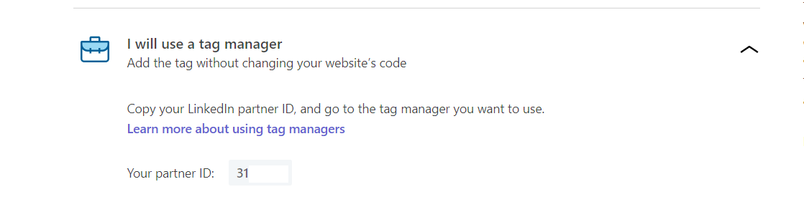

# LinkedIn Insight Tag 

The [Linkedin Insight Tag](https://business.linkedin.com/marketing-solutions/insight-tag) is a lightweight code JS code that you can add to your website to enable in-depth campaign reporting and unlock valualbe insights about your website visitors. You can use the linkedIn Insight Tag to track conversions, retarget website visitors and unlock additional insights about members interacting with your ads.

You can now send your event data directly to LinkedIn Insight Tag through RudderStack.

When you start using the LinkedIn Insight Tag as destination in RudderStack web app, `browser.js` starts loading the LinkedIn insight tag's tracking snippet on your page. If you already have LinkedIn Insight tag snippet installed on your website, you should remove it. Since LinkedIn Insight tag automatically starts loading the pixel on sites which you load the `browser.js` on. It loads asynchronously with the current website and shouldn't slow down the performance of your website.

* The LinkedIn Insight Tag enables the collection of data reagrding members' visit to your website, including the URL, IP Address, referrer, device and browser characteristics, also timestamp.


**Find the open-source code for this destination in our** [**GitHub repo**](https://github.com/rudderlabs/rudder-sdk-js/tree/production/integrations)**.**


## Getting started

To enable sending your event data to LinkedIn Insight Tag, you will first need to add it as a destination to the source from which you are sending your event data.

Before configuring your source and destination on the RudderStack, please verify if the source platform is supported by LinkedIn Insight Tag, by referring to the table below:

| **Connection Mode** | **Web** | **Mobile** | **Server** |
| :--- | :--- | :--- | :--- |
| **Device mode** | **Supported** | - | - |
| **Cloud mode** | - | - | - |

Once you have confirmed that the platform supports sending events to LinkedIn, perform the steps below:

* From your [RudderStack dashboard](https://app.rudderstack.com/), add the source and LinkedIn Insight Tag as a destination.


Please follow our guide on [How to Add a Source and Destination in RudderStack](https://docs.rudderstack.com/how-to-guides/adding-source-and-destination-rudderstack) to add a source and destination in RudderStack.


## LinkedIn Insight Tag Configuration Settings on the RudderStack Dashboard

To sucessfully configure LinkedIn Insight Tag as destination you will need **Partner ID**. To obtain that, perform the steps below:

* You will need LinkedIn account. Then you have to [sign in to Campaign Manager](https://www.linkedin.com/campaignmanager/login).
* You will need to create an ad account. Account name ,an optional Linkedin Page and currency information is asked , but no payment is required.

* Next you will be needing **Partner ID**. Click on the desired account name,then you will be able to see **Account Assets** dropdown menu. Select **insight tag**.

* If you are using this for first time you will see **install my insight tag** else you will see **manage insight tag**, click and choose **see tag**.

* Then select **I will use a tag manager**. You will be able to see your partner ID. Click on that to copy.

* Enter the partner ID obtained above. It should be a series of numbers like `12345`.
* **Use native SDK to send events** should be enabled. It allows you to send events using device mode.

## Contact Us

If you come across any issues while configuring LinkedIn Insight Tag with RudderStack, please feel free to [contact us](mailto:docs@rudderstack.com). You can also start a conversation on our [Slack](https://resources.rudderstack.com/join-rudderstack-slack) channel; we will be happy to talk to you!

