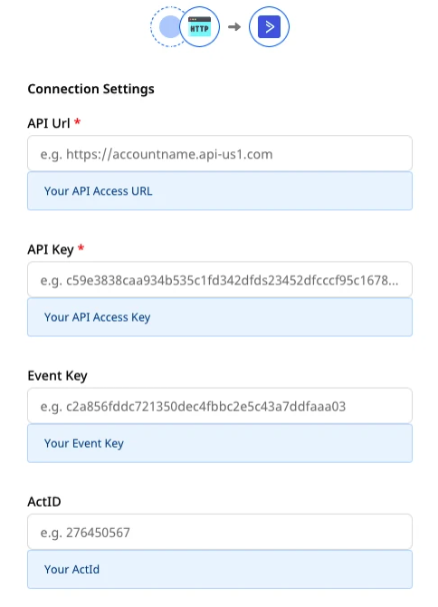

# ActiveCampaign

[ActiveCampaign](https://www.activecampaign.com/) is a popular marketing automation and CRM platform that makes it easy for you to drive customer engagement and retention. With ActiveCampaign's all-in-one email marketing and growth platform, you can monitor your customers' product behavior and use the resulting insights to design and drive highly personalized customer experiences.

RudderStack supports ActiveCampaign as a destination to which you can seamlessly send your event data.

<div class="successBlock">

Find the open-source transformer code for this destination in our <a href="https://github.com/rudderlabs/rudder-transformer/tree/master/v0/destinations/active_campaign">GitHub repository</a>.
</div>

## Getting started

Before configuring your source and destination in RudderStack, verify if the source platform is supported by ActiveCampaign by referring to the following table:

| **Connection Mode** | **Web**       | **Mobile**    | **Server**    |
| :------------------ | :------------ | :------------ | :------------ |
| **Device mode**     | -             | -             | -             |
| **Cloud mode**      | **Supported** | **Supported** | **Supported** |

<div class="infoBlock">

To know more about the difference between cloud mode and device mode in RudderStack, read the <a href="https://rudderstack.com/docs/rudderstack-cloud/rudderstack-connection-modes/">RudderStack Connection Modes</a> guide.
</div>

Once you have confirmed that the source platform supports sending events to ActiveCampaign, follow these steps:

1. From your [RudderStack dashboard](https://app.rudderstack.com/), add the source. Then, from the list of destinations, select **ActiveCampaign**.
2. Assign a name to your destination and click on **Next**.

### Connection settings

To successfully configure ActiveCampaign as a destination, you will need to configure the following settings:



- **API URL:** Your API URL is the unique URL generated against your account. It can be found in your account on the **Settings** page under the **Developer** tab.
- **API Key:** Your API key can be found in your account on the **Settings** page under the **Developer** tab. Each user in your ActiveCampaign account has their own unique API key.
- **Event Key:** This value is unique to your ActiveCampaign account. To obtain the event key, go to your ActiveCampaign account and navigate to **Settings** > **Tracking** > **Event Tracking**.
- **ActID:** This value is unique to your ActiveCampaign account.  Go to **Settings** > **Tracking** > **Event Tracking API**. You will find the **actid** listed here.

## Identify

The `identify` call lets you associate a user with their actions and captures all the relevant traits about them. This information includes unique `userid` as well as any optional information such as name, email address, etc.

A sample `identify` call is shown below:

```javascript
rudderanalytics.identify(
  "userId", {
    email: "john@example.com",
    firstName: "John",
    lastName: "Keener,
    phone: "1234567890",
  })
```

In the above snippet, RudderStack captures relevant information about the user like the `userId`, as well as the associated traits such as `email`, `phone`, and the name (`firstName` and `lastName`) of that user.

<div class="warningBlock">

The <code class="inline-code">email</code> trait is a mandatory trait for mapping a user to ActiveCampaign.
</div>

<div class="infoBlock">
  
  If a user already exists in ActiveCampaign, RudderStack will update the user with the latest values.
</div>

### Custom tags

You can associate a user with custom tags by passing in the `tags` trait, as shown:

```javascript
rudderanalytics.identify(
  "userId", {
    email: "john@example.com",
    firstName: "John",
    lastName: "Keener,
    phone: "1234567890",
    tags: ["Returning User", "Coupon Used"],
  })
```

<div class="infoBlock">

The <code class="inline-code">tags</code> property should contain an array of tags which you want to associate with the user. If any tag is already created in ActiveCampaign previously, RudderStack will automatically skip creating that tag.
</div>

### Custom fields

RudderStack also lets you update a contact’s custom fields in ActiveCampaign.

To send custom fields to ActiveCampaign, you will need to first create the [custom fields](https://www.activecampaign.com/learn/guides/what-are-custom-fields) in ActiveCampaign for each custom field that you want to send. Then, when you call `identify` with the keys matching those traits, the custom fields for that contact will be automatically updated.

You can use the `fieldInfo` trait to set values for the custom fields, as shown in the following snippet:

```javascript
rudderanalytics.identify(
  "userId", {
    email: "john@example.com",
    firstName: "John",
    lastName: "Keener,
    phone: "1234567890",
    tags: ["Returning User", "Coupon Used"],
    fieldInfo: {
      Interest: "Electronics",
      Country: "USA",
      Hobbies: ["Cricket", "Tennis"],
    },
  })
```

<div class="infoBlock">

The <code class="inline-code">fieldInfo</code> trait contains the value of the custom field that you want to store for that contact. For using this feature, you need to create the custom fields from your ActiveCampaign dashboard \(e.g. - Interest, Country\) before passing the values for the given user.
</div>

<div class="infoBlock">

To send multi-choice field values for the fields having a checkbox, or list values as an input, you need to send the values as an array. For example: <code class="inline-code">"Hobbies": ["Cricket","Tennis"]</code>. Note that for date field, the format should be YYYY-MM-DD. Also, the values for the datetime field should be in a ISO datetime format, i.e. <code class="inline-code">yyyy-MM-dd'T'HH:mm:ss. SSSXXX</code>.
</div>

### List

You can subscribe or unsubscribe a contact from any number of lists by passing in a trait called `lists`. As shown in the example below, this trait should be an array, with each element having an `id` and a `status`. The value of status must be either `subscribe` or `unsubscribe`.

```javascript
rudderanalytics.identify(
  "userId", {
    email: "john@example.com",
    firstName: "John",
    lastName: "Keener,
    phone: "1234567890",
    tags: ["Returning User", "Coupon Used"],
    fieldInfo: {
      Interest: "Electronics",
      Country: "USA",
      Hobbies: ["Cricket", "Tennis"],
    },
    lists: [{
        id: 2,
        status: "subscribe",
      },
      {
        id: 3,
        status: "unsubscribe",
      },
    ],
  })
```

<div class="infoBlock">

For associating a contact to any field, you need to create the list from ActiveCampaign and use the <code class="inline-code">id</code> parameter for mapping that contact.
</div>

## Page

The `page` call lets you record information whenever a user sees a web page, along with the associated optional properties of that page. This method must be called at least once per page load.

When you call `page`, RudderStack will send that event to ActiveCampaign as a `site tracking event`. This will add your domain to whitelist for tracking purposes.

A sample `page` call looks like the following:

```javascript
rudderanalytics.page("home", {
  path: "path",
  url: "url",
  title: "title",
  search: "search",
  referrer: "referrer",
})
```

In the above sample, RudderStack captures the information related to the page being viewed, the URL `property` is used to whiltelist the website in the destination.

<div class="infoBlock">

A <code class="inline-code">page</code> call will only work if <strong>Site Tracking</strong> is enabled in ActiveCampaign. You can enable this setting by going to the <strong>Tracking</strong> tab in your ActiveCampaign settings page.
</div>

## Screen

The `screen` method lets you record whenever a user sees the mobile screen, along with any associated optional properties. This call is similar to the `page` call, but is exclusive to your mobile device.

A sample `screen` call looks like the following code snippet:

```objectivec
[[RSClient sharedInstance] screen:@"Sample Screen Viewed" properties:@{@"prop_key" : @"prop_value"}];
```

In the above snippet, RudderStack captures information related to the screen being viewed, along with any additional information related to the event.

<div class="warningBlock">

The <code class="inline-code">screen</code> event name must contain only alphanumeric characters. ActiveCampaign rejects events with any special characters in the name.
</div>

## Track

The `track` call lets you capture any user actions and the associated properties. Each action is considered to be an event.

A sample `track` call looks like the following:

```javascript
rudderanalytics.track("Product Purchased", {
  name: "Rubik's Cube",
})
```

In the above snippet, RudderStack captures the information related to the `Product Purchased` event, along with any additional information about that event - in this case the product `name`.

RudderStack also maps `eventData` present within the `track` event properties to ActiveCampaign's `eventdata` field, as shown:

```javascript
rudderanalytics.track("Product Purchased", {
  name: "Rubik's Cube",
  eventData: "Learn while having fun"
})
```

<div class="warningBlock">

The <code class="inline-code">track</code> event name must contain only alphanumeric characters. ActiveCampaign rejects events with any special characters in the name.
</div>

## FAQ

### Can I use special characters in my `screen` and `track` event names?

No, your `screen` and `track` event names must contain only alphanumeric characters. ActiveCampaign prescribes that the `screen` and `track` event names must contain only alphabets and numbers, and does not allow the usage of any special characters.

## Contact us

For queries on any of the sections covered in this guide, you can [**contact us**](mailto:%20docs@rudderstack.com) or start a conversation in our [**Slack**](https://rudderstack.com/join-rudderstack-slack-community) community.
