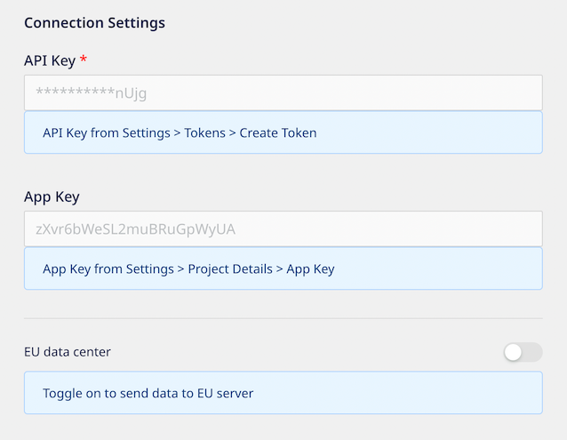
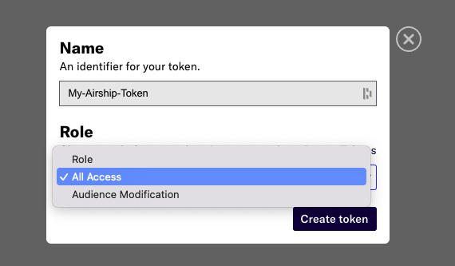
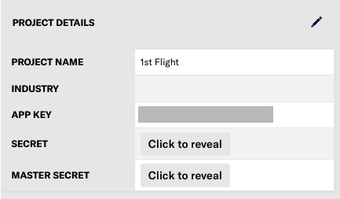

# Airship

[Airship](https://www.airship.com/) is an app experience platform that lets you create and deliver powerful in-app experiences with the help of engaging, personalized content and actionable customer insights.

RudderStack supports Airship as a destination to which you can seamlessly send your event data.

## Getting started

Before configuring Airship as a destination in RudderStack, verify if the source platform is supported by referring to the table below:

| **Connection Mode** | **Web**         | **Mobile**   | **Server**        |
| :-------------------| :-------------- | :----------- | :-----------------|
| **Device mode**     | -               | -            | -                 |
| **Cloud mode**      | **Supported**               | **Supported**           |  **Supported**    |

<div class="infoBlock">

To know more about the difference between cloud mode and device mode in RudderStack, refer to the <a href="https://rudderstack.com/docs/connections/rudderstack-connection-modes/">RudderStack Connection Modes</a> guide.
</div>

Once you have confirmed that the source platform supports sending events to Airship, follow these steps:

1. From your [RudderStack dashboard](https://app.rudderstack.com/), add the source. Then, from the list of destinations, select **Airship**.

<div class="infoBlock">

Follow our guide on <a href="https://rudderstack.com/docs/connections/adding-source-and-destination-rudderstack/">Adding a Source and Destination in RudderStack</a> for more information.
</div>

2. Assign a name to your destination and click on **Next**.

### Connection settings

To successfully configure Airship as a destination, you will need to configure the following settings:



- **API Key**: Enter your Airship token here. This is a mandatory field required by RudderStack to communicate with your Airship project.

<div class="infoBlock">

For detailed steps on obtaining the API key, refer to the <a href="#faq">FAQ</a> section below.
</div>

- **App Key**: Enter your Airship project's app key by going to **Settings** > **Project Details**.
- **App Secret**: Enter your Airship project's app secret by going to **Settings** > **Project Details**.

<div class="infoBlock">

For detailed steps on obtaining the Airship app key and secret, refer to the <a href="#faq">FAQ</a> section below.
</div>

- **EU data center**: Enable this setting if you've implemented your app in Airship's European data center.

<div class="infoBlock">

If you're unsure which data center you are on, reach out to <a href="mailto:%20docs@rudderstack.com" target="_blank">Airship support</a>
</div>

## Identify

The `identify` call lets you uniquely identify a user and record any associated traits about them like their name, email, etc.

<div class="infoBlock">

For information on the <code class="inline-code">identify</code> call, refer to the <a href="https://www.rudderstack.com/docs/rudderstack-api/api-specification/rudderstack-spec/identify/">RudderStack API Specification</a> guide.
</div>

A sample `identify` call is shown below:

```javascript

```

Airship assigns tags to the [named users](https://docs.airship.com/guides/messaging/user-guide/audience/segmentation/named-users/) based on the incoming RudderStack `identify` calls. 

<div class="warningBlock">

To successfully assign tags to Airship using the RudderStack <code class="inline-code">identify</code> events, you must create a tag group with the group key set to <code class="inline-code">rudderstack-integration</code> in Airship. For more information on creating a tag group in Airship, refer to the <a href="#faq">FAQ</a> section below.
</div>

### Attribute mapping

RudderStack maps the following reserved traits to the predefined Airship attributes:

| RudderStack trait | Airship attribute |
| :-----------------| :-----------------|
| `address.city` | `city` |
| `address.country` | `country` |
| `address.postalcode` | `zipcode` |
| `address.state` | `region` |
| `createdAt` | `account_creation` |
| `firstName` | `first_name` |
| `lastName` | `last_name` |
| `name` | `full_name` |
| `phone` | `mobile_phone` |

## Track

The `track` call lets you record the user's actions along with any associated properties. Each user action is called an event. 

<div class="infoBlock">

For information on the <code class="inline-code">track</code> call, refer to the <a href="https://www.rudderstack.com/docs/rudderstack-api/api-specification/rudderstack-spec/track/">RudderStack API Specification</a> guide.
</div>

A sample `track` call is shown below:

```javascript

```

RudderStack sends the `track` events to Airship via their [Custom Events API](https://docs.airship.com/api/ua/#operation-api-custom-events-post). You can use the event properties to personalize and trigger specific messages for your audience.

### Supported mappings

RudderStack maps the following event properties to the Airship properties before sending them over to Airship.

| RudderStack property          | Airship property      | Presence |
| :--------------------------- | :--------------------- | :------|
| `event` | `name` | Required |
| `userId` | `named_user_id` | Required |
| `properties` | `properties` | Optional |
| `value` | `value` | Optional |
| `interactionId` | `interaction_id` | Optional |
| `interactionType` | `interaction_type` | Optional |
| `sessionId` | `session_id` | Optional |
| `transaction` | `transaction` | Optional |
| `timestamp` | `occurred` | Optional |

<div class="warningBlock">

The <code class="inline-code">name</code> value must not contain any upper case characters. Otherwise, 
</div>

## Group

The `group` call lets you link an identified user with a group such as a company, organization, or an account, and record any traits associated with that group, e.g., company name, number of employees, etc.

<div class="infoBlock">

For information on the <code class="inline-code">group</code> call, refer to the <a href="https://www.rudderstack.com/docs/rudderstack-api/api-specification/rudderstack-spec/group/">RudderStack API Specification</a> guide.
</div>

A sample `group` call is shown below:

```javascript

```


## FAQs

### Where can I obtain the Airship API key?

The Airship API key is required so that RudderStack can communicate with your Airship project. This is a mandatory field to set up the integration.

To obtain your Airship project's API key, follow these steps:

1. In your Airship dashboard, go to **Settings**.
2. In the **Project configuration** window, go to **Tokens** and click on **Manage**.
3. Then, click on **Create token**.
4. Assign a name for your token. Under **Role**, select **All access** from the dropdown, as shown:



5. Once the token is created, copy and secure the credentials and click on **Got it**.

### Where can I obtain the Airship App Key and App Secret?

To obtain your Airship project's app key and secret, follow these steps:

1. In your Airship dashboard, go to **Settings**.
2. In the **Project configuration** window, look for the **Project Details** pane on the right side.

You will find your project's app key listed here. To obtain the app secret, click on on **Click to reveal**, as shown:



### How do I create a custom tag group in Airship?

To create a tag group in Airship, follow these steps:

1. Go to **Settings** > **Project configuration** > **Tag Groups** and click on **Manage**.
2. Click on **Create Tag Group** and enter the following settings:
    - **Name**: Enter the name for the tag group. 
    - **Description**: Set additional information about the tag group in this field. 
    - **Group Key**: Assign a unique ID for the tag group in this field. For example, to assign tags using the RudderStack `identify` events, you can set this to `rudderstack-integration`. For assigning tags using the `group` events, set this to `rudderstack-integration-group`.

For more information, refer to the [Airship documentation](https://docs.airship.com/guides/messaging/user-guide/audience/segmentation/tags/#creating-custom-tag-groups).

## Contact us

For queries on any of the sections covered in this guide, you can [contact us](mailto:%20docs@rudderstack.com) or start a conversation in our [Slack](https://rudderstack.com/join-rudderstack-slack-community) community.
