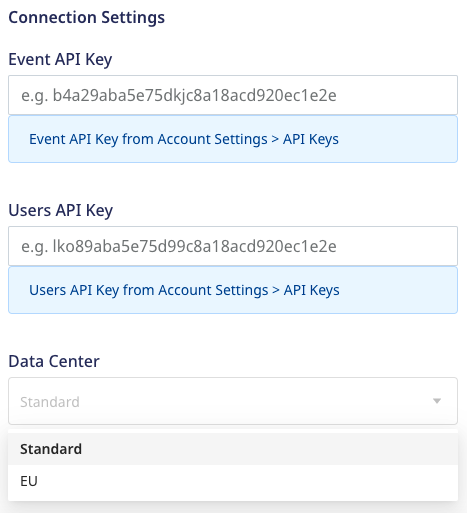
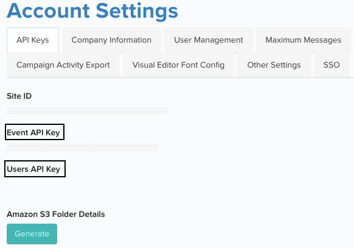

# Blueshift

[Blueshift's](https://blueshift.com/) SmartHub customer data platform helps consumer brands scale customer engagement intelligently on every channel. It enables marketers to unify their siloed data and use real-time customer insights and interactions to shape customer experiences.

RudderStack supports Blueshift as a destination to which you can seamlessly send your event data.

<div class="successBlock">

Find the open-source transformer code for this destination in our <a href="https://github.com/rudderlabs/rudder-transformer/tree/master/v0/destinations/blueshift">GitHub repo</a>.
</div>

## Getting started

Before configuring Blueshift as a destination in RudderStack, verify if the source platform is supported by Blueshift by referring to the table below:

| **Connection Mode** | **Web**       | **Mobile**    | **Server**    |
| :------------------ | :------------ | :------------ | :------------ |
| **Device mode**     | -             |   -           |  -            |
| **Cloud mode**      | **Supported** | **Supported** | **Supported** |

<div class="infoBlock">

To know more about the difference between cloud mode and device mode in RudderStack, refer to the <a href="https://rudderstack.com/docs/connections/rudderstack-connection-modes/">RudderStack Connection Modes</a> guide.
</div>

Once you have confirmed that the source platform supports sending events to Blueshift, follow these steps:

- From your [**RudderStack dashboard**](https://app.rudderstack.com/), add the source. Then, from the list of destinations, select **Blueshift**.

<div class="infoBlock">

Follow our guide on <a href="https://rudderstack.com/docs/connections/adding-source-and-destination-rudderstack/">Adding a Source and Destination in RudderStack</a> for more information.
</div>

## Connection settings

To successfully configure Blueshift as a destination, you will need to configure the following settings:



- **Event API Key**: Enter the Event API Key generated for your Blueshift account. You can find it in your Blueshift dashboard by going to **Account Settings** > **API Keys**.
- **Users API Key**: Enter the Users API Key generated for your Blueshift account. You can find it in your Blueshift dashboard by going to **Account Settings** > **API Keys**.

<div class="infoBlock">
  
For more information on obtaining the Event and Users API Key, refer to the <a href="#faq">FAQ</a> section below.
</div>

- **Blueshift EU data center**: Enable this option to send data to the EU servers. When enabled, the base URL for EU region converts to `https://api.eu.getblueshift.com`

## Identify

The `identify` call lets you create new or update existing customers. It also lets you record the traits about them like their name, email address, etc. It is recommended to limit the `identify` calls to 50 per second.

A sample `identify` call is shown below:

```javascript
rudderanalytics.identify("1hKOmRA4el9Zt1WSfVJIVo4GRlm", {
  email: "alex@example.com",
  phone: "+1-202-555-0146",
  firstName: "Alex",
  lastName: "Keener",
});
```

### Supported mappings

The following table details the mapping between RudderStack and Blueshift fields:

| RudderStack field | Blueshift field | Presence |
| :-----| :--------| :------|
| `email` | `email` | Required |
| `userId`  | `customer_id` | Required |
| `event` | `event` | Optional |  
| `phone` | `phone_number`  |  Optional |
| `firstName` | `firstname`  | Optional |
| `lastName` | `lastname` | Optional |
| `gender`|`gender`| Optional |

<div class="infoBlock">

Blueshift supports custom attributes from your site's customers. For more information on these attributes, refer to <a href ="https://developer.blueshift.com/docs/customer-related-data#attributes">Blueshift Custom Attributes</a>.
</div>


## Track

The `track` call lets you capture user events along with the associated properties.

A sample `track` call is shown below:

```javascript
rudderanalytics.track(
  "Product Viewed", {
    cookie: "1234abcd-efghijkj-1234kfjadslk-34iu123",
    checkout_id: "C324532",
    order_id: "T1230",
    value: 15.98,
    revenue: 16.98,
    shipping: 3.0,
    coupon: "FY21",
    currency: "USD",
    products: [{
      product_id: "product-mixedfruit-jam",
      sku: "sku-1",
      category: "Food",
      name: "Food/Drink",
      brand: "Sample",
      variant: "None",
      price: 10.0,
      quantity: 2,
      currency: "USD",
      position: 1,
      value: 6.0,
      typeOfProduct: "Food",
      url: "https://www.example.com/product/mixedfruit-jam",
      image_url: "https://www.example.com/product/mixedfruit-jam.jpg",
    }, ],
  }, {
    context: {
      device: {
        id: "7e32188a4dab669f",
        manufacturer: "Google",
      },
      ip: "14.5.67.21",
    },
  }
);
```

### Supported mappings

RudderStack maps the following events to the Blueshift events in the `track` call before sending them over Blueshift's HTTP API.

| RudderStack event         | Blueshift event      | 
| :--------------------------- | :---------------------  |
| `Product Viewed`             |  `view`                |         
| `Product Added`               | `add_to_cart`               |             
| `Order Completed`           | `purchase`           |         
| `Products Searched`            | `search`            |          
| `Subscribe Interest`                | `subscribe_interest `                |            
| `Unsubscribe Interest`            | `unsubscribe_interest `            |          
| `Checkout Step Viewed`               | `checkout `               |             
| ` Product Removed`              | `remove_from_cart`              |            
| `Identify`                 | `identify`          |                

<div class="infoBlock">

Blueshift supports custom events to track any custom user action on your site or app. For more information, refer to the <a href ="https://developer.blueshift.com/docs/your-sites-event-data#custom-event">Blueshift Custom Event</a> guide.
</div>

The following table details the mapping between RudderStack and Blueshift fields:

| RudderStack field | Blueshift field | Presence |
| :-----| :--------| :-------------|
| `userId`  | `customer_id` | Optional |
| `email` | `email` | Optional |
| `event` | `event` | Required |  
| `context.device.type` | `device_type` | Optional |  
| `context.device.token` | `device_token` | Optional |
| `context.device.id` | `device_id` | Optional |
| `context.idfa`/`context.device.advertisingId` | `device_idfa` | Optional |
| `context.idfv`/`context.device.id` | `device_idfv` | Optional |
| `context.device.manufacturer` | `device_manufacturer` | Optional|
| `context.os.name` | `os_name` | Optional|
| `context.network.carrier` | `network_carrier` | Optional|
| `context.ip`/`request_ip` | `ip` | Optional |
| `context.address.latitude`/`context.location.latitude` | `latitude` | Optional |
| `context.address.longitude`/`context.location.longitude` | `longitude` | Optional|
| `messageId` |  `event_uuid`| Optional|
| `properties.cookie` | `cookie` | Optional|

<div class="infoBlock">
  
The <code class="inline-code">event</code> name is a required field and should <strong>not</strong> contain period (.), numeric value, or be more than 64 characters. RudderStack automatically converts a space into an underscore (_).
</div>

<div class="infoBlock">

Blueshift supports receiving custom attributes about your site's customers. For more information on these attributes, refer to the <a href ="https://developer.blueshift.com/docs/customer-related-data#attributes">Blueshift Custom Attributes</a>.
</div>

## Group

You can use the `group` call to assign users to a list. To create an empty user list, you can use the [userList](https://developer.blueshift.com/reference/post_api-v1-custom-user-lists-create) API of Blueshift.

A sample `group` call is shown below:

```javascript
rudderanalytics.group("12345", {
  userId: "35428",
  name: "SF1 user list",
  description: "The list of users who are based in San Francisco.",
  email: "alex@example.com",
  isSeedList: true,
  source: "email",
});
```

### Supported mappings

The following table details the mapping between RudderStack and Blueshift fields:

| RudderStack field | Blueshift field | Presence |
| :-----| :--------| :-------------|
| `groupId` | `list_id` | Required |
| `userId` | `identifier_value` | Required |
| `name`  | `name` | Optional|
| `traits.description`/`context.traits.description` | `description` | Optional|
| `traits.isSeedList`/`context.traits.isSeedList` | `is_seed_list` | Optional|
| `traits.source`/`context.traits.source` | `source` | Optional|

Rudderstack automatically maps the <code class="inline-code">identifier_key</code> to <code class="inline-code">customer_id</code> when <code class="inline-code">userId</code> is provided in the <code class="inline-code">group</code> call.

<div class="infoBlock">
  
If a <code class="inline-code">list_id</code> already exists, the user is added to the list. Otherwise, a new empty user list is created and the user is added to that list.
</div>

## FAQ

### How do I obtain the Blueshift API keys?

To obtain the API keys, log into the Blueshift app, go to **Account Settings** and then to the **API keys** tab. You can obtain the following API keys, based on your role:

- Event API key (EVENT_API_KEY)
- Users API key (USER_API_KEY) (visible only to admin users)




## Contact us

For queries on any of the sections covered in this guide, you can [**contact us**](mailto:%20docs@rudderstack.com) or start a conversation in our [**Slack**](https://rudderstack.com/join-rudderstack-slack-community) community.
