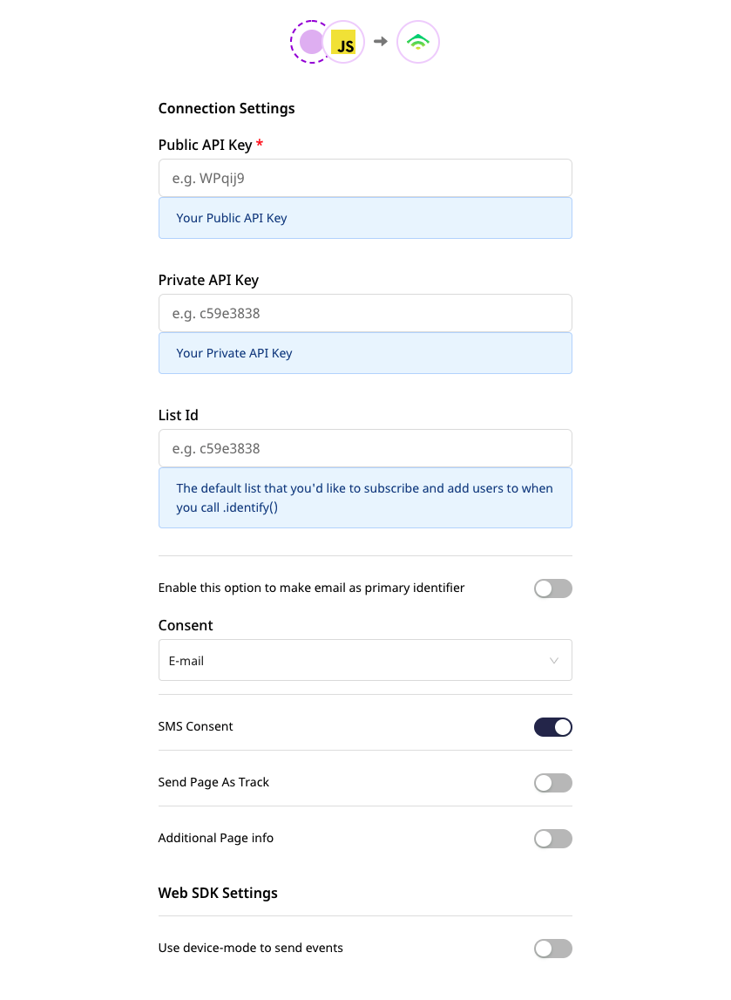

# Blueshift

[Blueshift](https://blueshift.com/) is a powerful eCommerce platform that lets you boost your business revenue. It supports unique features such as category-based segmentation and various event triggers based on page views, purchases, email engagement, etc. You can easily track and measure all your user activity and the resulting revenue and get a breakdown of this revenue based on different custom attributes.

Blueshift also offers features such as trend reports, cohort analysis, and various options for boosting customer engagement, such as personalized newsletters, product recommendations, in-app push notifications, and more.

RudderStack supports Blueshift as a destination to which you can seamlessly send your event data.

<div class="successBlock">

Find the open-source transformer code for this destination in our <a href="https://github.com/rudderlabs/rudder-transformer/tree/master/v0/destinations/blueshift">GitHub repo</a>.
</div>

## Getting started

Before configuring Blueshift as a destination in RudderStack, verify if the source platform is supported by Blueshift by referring to the table below:

| **Connection Mode** | **Web**       | **Mobile**    | **Server**    |
| :------------------ | :------------ | :------------ | :------------ |
| **Device mode**     |               |               |               |
| **Cloud mode**      | **Supported** | **Supported** | **Supported** |

<div class="infoBlock">

To know more about the difference between cloud mode and device mode in RudderStack, refer to the <a href="https://rudderstack.com/docs/connections/rudderstack-connection-modes/">RudderStack Connection Modes</a> guide.
</div>

Once you have confirmed that the source platform supports sending events to Blueshift, follow these steps:

- From your [**RudderStack dashboard**](https://app.rudderstack.com/), add the source. Then, from the list of destinations, select **Blueshift**.

<div class="infoBlock">

Follow our guide on <a href="https://rudderstack.com/docs/connections/adding-source-and-destination-rudderstack/">Adding a Source and Destination in RudderStack</a> for more information.
</div>

## Connection settings

To successfully configure Blueshift as a destination, you will need to configure the following settings:



- **Event API Key**: Your Event API Key generated against your Blueshift account. It can be found in your Blueshift dashboard in the **Account Settings** section under **API Keys**.

<div class="infoBlock">
  
For more information on obtaining the Event API Key, refer to the <a href="#faq">FAQ</a>.
</div>

- **Users API Key**: Your Users API Key generated for your account in the **Account Settings** section under **API Keys**.
- **Blueshift EU data center**: Enable this option to send data to the EU servers. The base URL for EU region becomes `https://api.eu.getblueshift.com` whereas it stays `https://api.getblueshift.com/` for the rest of the regions.

## Identify

The `identify` call lets you identify a visiting user and associate them to their actions. It also lets you record the traits about them like their name, email address, etc.

It is recommended to limit the calls to this endpoint to 50 per second.

A sample `identify` call is shown below:

```javascript
rudderanalytics.identify("sampleusrRudder8", {
  email: "alex@example.com",
  phone: "+1-202-555-0146",
  firstName: "Alex",
  lastName: "Keener",
});
```

### Supported mappings

The following table details the mapping of the fields specified in the RudderStack dashboard and Google AdWords Enhanced Conversions, along with the relevant guidelines:

| RudderStack field | Blueshift field | Presence |
| :-----| :--------| :------|
| `email` | `email` | Required |
| `userId`  | `customer_id` | Required |
| `event` | `event` | Optional |  
| `phone` | `phone_number` |  Optional |
| `firstName` | `firstname` | Optional |
| `lastName` | `lastname` | Optional |
| `traits.gender`/`context.traits.gender`|`gender`| Optional |


## Track

The `track` call lets you capture user events along with the properties associated with them.


A sample `track` call is shown below:

```javascript
rudderanalytics.track(
  "Product Viewed", {
    cookie: "1234abcd-efghijkj-1234kfjadslk-34iu123",
  }, {
    context: {
      ip: "14.5.67.21",
    },
  }
);
```


<div class="infoBlock">

<ul>
<li>To send <code class="inline-code">track</code> or <code class="inline-code">screen</code> type event using an SDK that does not persist user context information after <code class="inline-code">identify</code>, you need to pass the information in <code class="inline-code">context.traits</code>.</li>

<li>To set a specific value to the <code class="inline-code">screen</code> or <code class="inline-code">track</code> type event, you need to pass the event-related property in the <code class="inline-code">properties</code> field. Also, you can send <code class="inline-code">revenue</code> property in the <code class="inline-code">track</code> event and RudderStack will automatically map it to Klaviyo's special property <code class="inline-code">$value</code>.</li>
</ul>
</div>

### Supported mappings
RudderStack maps the following properties to the Mixpanel properties before sending them over Mixpanel's HTTP API.

<div class="infoBlock">

RudderStack maps these fields only in the <code class="inline-code">identify</code> requests.
</div>

| RudderStack property         | Mixpanel property      | 
| :--------------------------- | :--------------------- |
| `traits.createdAt`           | `$created`             |         
| `traits.email`               | `$email`               |             
| `traits.firstName`           | `$firstName`           |         
| `traits.lastName`            | `$lastName`            |          
| `traits.name`                | `$name`                |            
| `traits.username`            | `$username`            |          
| `traits.phone`               | `$phone`               |             
| `traits.avator`              | `$avator`              |            
| `context.ip`                 | `ip` or `$ip`          |               
| `context.campaign.name`      | `campaign_id`          |    
| `context.page.url`           | `$current_url`         |         
| `context.os.name`            | `$os`                  |          
| `context.page.referrer`      | `$referrer`            |    
| `context.network.carrier`    | `$carrier`             |  
| `address.city`               | `$city`                |             
| `address.country`            | `$country_code`        |          
| `address.region`             | `$region`              |           
| `context.location.latitude`  | `$latitude`            | 
| `context.location.longitude` | `$longitude`           | 
| `context.page.manufacturer`  | `$manufacturer`        | 
| `context.device.model`       | `$model`               |      
| `context.screen.width`       | `$screen_width`        |      
| `context.screen.height`      | `$screen_height`       |    
| `context.network.wifi`       | `$wifi`                |      
| `context.location.geoSource` | `$geoSource`           | 
| `context.traits.unsubscribed`| `$unsubscribed`        | 
| `traits.unsubscribed`        | `$unsubscribed`        | 
| `properties.unsubscribed`    | `$unsubscribed`        |  
| `context.location.timezone`  | `$timezone`            |  


## Group

<div class="infoBlock">

Adding or subscribing users to a specific list via the <code class="inline-code">group</code> event is only available in cloud mode integration. To know more about the RudderStack cloud mode, read the <a href="https://rudderstack.com/docs/connections/rudderstack-connection-modes/">RudderStack connection modes</a> guide.
</div>

The `group` call lets you link an identified user with a group, such as a company, organization, or an account. It also lets you record any custom traits associated with that group, such as the name of the company, the number of employees, etc.

A sample server-side `group` call looks like the following:

```javascript
rudderanalytics.group("12345", {
  userId: "35428",
  name: "SF1 user list",
  description: "The list of users who are based in San Francisco.",
  email: "sample@rudderstack.com",
  isSeedList: true,
  source: "email",
});
```

## Supported mappings

As mentioned in the table above, RudderStack converts the `Product Viewed` event name to `Viewed Product`. The event properties are also mapped to the Klaviyo properties, as shown:

| RudderStack field | Blueshift field | Presence |
| :-----| :--------| :------|
| `groupId` | `list_id` | Optional |
| `name`  | `name` | Required | 
| `traits.description`/`context.traits.description` | `description` |  Optional |
| `traits.isSeedList`/`context.traits.isSeedList` | `is_seed_list` | Optional |
| `traits.source`/`context.traits.source` | `source` | Optional |

#### Product Added

As mentioned previously, RudderStack converts the `Product Added` event name to `Added to Cart`. The event properties are also mapped to the Klaviyo properties, as shown:

| **RudderStack Property** | **Klaviyo Property** |
|:--------------------------------|:--------------------------|
| `value` | `$value`  |
| `name` | `AddedItemProductName` |
| `product_id` | `AddedItemProductID` |
| `sku` | `AddedItemSKU` |
| `image_url` | `AddedItemImageURL` |
| `url` | `AddedItemURL` |
| `price` | `AddedItemPrice` |
| `quantity` | `AddedItemQuantity` |
| `categories` | `AddedItemCategories` |
| `item_names` | `ItemNames` |
| `checkout_url`| `CheckoutURL` |
| `items` | `Items` |

Furthermore, `items` can contain the following parameters:

| **RudderStack Parameters** | **Klaviyo Parameters** |
|:--------------------------------|:--------------------------|
| `product_id` | `ProductID` |
| `sku` | `SKU` |
| `name` | `ProductName` |
| `quantity` | `Quantity` |
| `price` | `Price` |
| `total` | `RowTotal` |
| `url` | `URL` |
| `image_url` | `ImageURL` |
| `categories` | `ProductCategories` |

#### Checkout Started

As mentioned previously, RudderStack converts the `Checkout Started` event name to `Started Checkout`. The event properties are also mapped to the Klaviyo properties, as shown:

| **RudderStack Parameters** | **Klaviyo Parameters** |
|:--------------------------------|:--------------------------|
| `order_id` | `$event_id` |
| `value` | `$value` |
| `categories` | `Categories` |
| `item_names` | `ItemNames` |
| `items` | `Items` |
| `checkout_url` | `CheckoutURL` |

Furthermore, `items` can contain the following parameters:

| **RudderStack Parameters** | **Klaviyo Parameters** |
|:--------------------------------|:--------------------------|
| `product_id` | `ProductID` |
| `sku` | `SKU` |
| `name` | `ProductName` |
| `quantity` | `Quantity` |
| `price` | `Price` |
| `total` | `RowTotal` |
| `url` | `URL` |
| `image_url` | `ImageURL` |
| `categories` | `ProductCategories` |

A sample `track` call containing the above e-Commerce event parameters is shown below:

```javascript
rudderanalytics.track("checkout started ", {
  order_id: "1234",
  value: 12.34,
  categories: ["category1", "category2"],
  checkout_url: "http://www.testcall.com",
  item_names: ["item1", "item2"],
  items: [{
      product_id: "pId1",
      sku: "sku1",
      name: "item1",
      url: "https://www.item1URL.com",
      price: 1.0,
      quantity: 1,
      image_url: "https://www.item1Image.com,
      categories: ["category1", "category2"],
      row_total: 1.0
    },
    {
      product_id: "pId2",
      sku: "sku2",
      name: "item2",
      url: "https://www.item2URL.com",
      price: 2.0,
      quantity: 1,
      image_url: "https://www.item2Image.com,
      categories: ["category1", "category2"],
      row_total: 2.0
    },
  ],
});
```

<div class="warningBlock">

When sending events via the web device mode, specifying <code class="inline-code">order_id</code> is not mandatory, as Klaviyo automatically assigns the timestamp to the event. However, if explicitly specified, it <strong>must be unique</strong>. Klaviyo automatically discards the events with a duplicate <code class="inline-code">order_id</code>.
</div>

## FAQ

### How to obtain the API keys?

To obtain the API keys, log into the Blueshift app, go to **Account Settings** and then to the **API keys** tab. You can obtain the following API keys, based on your role:

- Event API key (EVENT_API_KEY)
- Users API key (USER_API_KEY) (visible only to admin users)

## Contact us

For queries on any of the sections covered in this guide, you can [**contact us**](mailto:%20docs@rudderstack.com) or start a conversation in our [**Slack**](https://rudderstack.com/join-rudderstack-slack-community) community.
