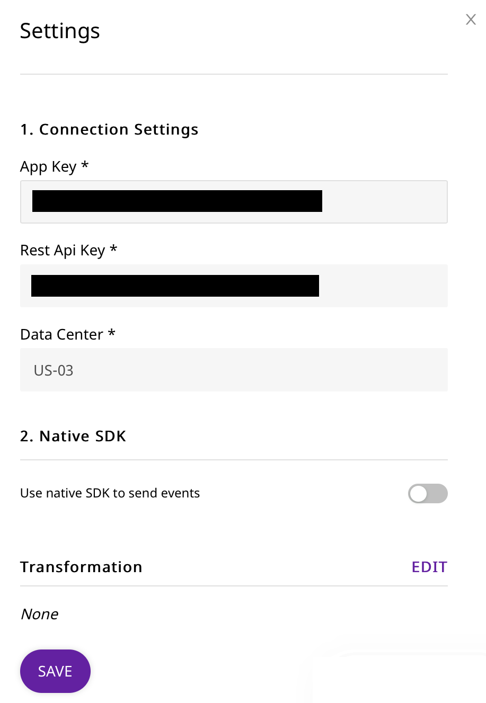

# Braze

Braze is an industry-leading customer engagement platform. It allows you to better understand your customers' in-app behavior and use the insights to improve your overall app experience, and increase engagement with them.

With RudderStack's SDK for mobile and web platforms, you can send your in-app event data to Braze directly for contextual analysis.

<div class="successBlock">

  **Find the open-source transformer code for this destination in our <a href="https://github.com/rudderlabs/rudder-transformer/tree/master/v0/destinations/braze">GitHub repo</a>.**
</div>

## Getting Started

Before getting started, please determine whether the platform you are sending your event data from is supported. Refer to the following table for the supported source types and connection modes:

| **Connection Mode** | **Web**       | **Mobile**    | **Server**    |
| :------------------ | :------------ | :------------ | :------------ |
| **Device mode**     | **Supported** | **Supported** | -             |
| **Cloud mode**      | **Supported** | **Supported** | **Supported** |

<div class="infoBlock">

To know more about the difference between Cloud mode and Device mode in RudderStack, read the <a href="https://rudderstack.com/docs/rudderstack-cloud/rudderstack-connection-modes/">RudderStack connection modes</a> guide.

</div>

In order to start sending data to Braze, you will first need to add it as a destination to the source from which you are sending the event data.

<div class="infoBlock">

Please follow our guide on <a href="https://www.rudderstack.com/docs/rudderstack-cloud/destinations/#adding-a-destination">Adding a Destination</a> to add a destination in RudderStack.

</div>

Please follow these steps once you have added a source in the RudderStack app:

<span class="imageTitle">RudderStack connection settings for adding Braze as a destination</span>

<div class="infoBlock">

When creating a new Braze Rest API Key for your app, you will only need to select the **users.track**, **users.identify**, and **users.alias.new** endpoints under the **User Data** permissions

</div>

- Once you have added the source, configure the Braze settings to complete the setup.
- Both the **App Key** and the **Rest Api Key** can be found in the **Developer Console** underneath the **Settings** section in your Braze dashboard \(left-side menu\)
- In the **Developer Console** under the **API Settings** tab, there should be 4 sections.
- To get the **App Key**, go to the **Identification** section and look up your **App Name**. The key will then be the associated **Identifier** string. You can find more information [here](https://www.braze.com/docs/api/api_key/#where-can-i-find-it-1).
- To get the **Rest Api Key**, go to the **Rest API Keys** section and look for the **API Key Name** that you created. The key will then be the associated **Identifier** string. You can find more information [here](https://www.braze.com/docs/api/api_key/#where-can-i-find-it).
- To get the correct **Data Center** details, you can follow this very clear [Braze Instances](https://www.braze.com/docs/user_guide/administrative/access_braze/braze_instances/) guide. An example of a Data Instance would be `US-01`. The easiest way to get your **Data Center** details is to simply log in to your Braze account and look at your URL. Your URL will map to what **Data Center** you will enter.

| URL                            | Data Center Input |
| :----------------------------- | :---------------- |
| https://dashboard-01.braze.com | US-01             |
| https://dashboard-03.braze.com | US-03             |
| https://dashboard-01.braze.eu  | EU-01             |
| etc.                           | etc.              |

## Adding Device Mode Integration

Depending on your platform of integration, follow the steps below to add Braze to your project:

<Tabs>
  <TabList>
    <Tab>iOS</Tab>
    <Tab>Android</Tab>
    <Tab>React Native</Tab>
  </TabList>
    <TabPanels>
      <TabPanel>
        Please follow these steps to add Braze to your iOS project:
<ul>
<li>Open the <code class="inline-code">Podfile</code> of your project and add the following line:
<span>

```ruby
pod 'Rudder-Braze'
```
</span>
  followed by the command as shown:
<span>

```bash
$ pod install
```
</span>
</li>
<li>Finally change the SDK initialization to the following snippet:
<span>

```objectivec
RudderConfigBuilder *builder = [[RudderConfigBuilder alloc] init];
[builder withDataPlaneUrl:<DATA_PLANE_URL>];
[builder withFactory:[RudderBrazeFactory instance]];
[RudderClient getInstance:<WRITE_KEY>; config:[builder build]];
```
</span>
</li>
</ul>
      </TabPanel>
      <TabPanel>
        To add Braze to your Android project, follow these steps:
<ul>
<li>Open your <code class="inline-code">app/build.gradle</code> (Module: app) file, and add the following:
<span>

```groovy
repositories {
  mavenCentral()
  maven { url "https://appboy.github.io/appboy-android-sdk/sdk" }
}
```
</span>
</li>
<li>Add the following under <code class="inline-code">dependencies</code> section:
<span>

```groovy
  implementation 'com.rudderstack.android.sdk:core:1.0.1'
  implementation 'com.rudderstack.android.integration:braze:1.0.2'
  implementation 'com.appboy:android-sdk-ui:6.0.+'
  // if you haven't included Gson already
  implementation 'com.google.code.gson:gson:2.8.6'
```
</span>
</li>
<li>Finally, change the SDK initialization to the following:
<span>

```kotlin
  val rudderClient: RudderClient = RudderClient.getInstance(
      this,
      <WRITE_KEY>,
      RudderConfig.Builder()
          .withDataPlaneUrl(<DATA_PLANE_URL>)
          .withLogLevel(RudderLogger.RudderLogLevel.DEBUG)
          .withFactory(BrazeIntegrationFactory.FACTORY)
          .build()
  )
```
</span>
</li>
</ul>
      </TabPanel>
      <TabPanel>
        To add Braze to your React Native project:
<ul>
<li>Add the RudderStack-Braze module to your app by running the following command:
<span>

```bash
npm install @rudderstack/rudder-integration-braze-react-native
```
</span>

<span>

```bash
yarn add @rudderstack/rudder-integration-braze-react-native
```
</span>
</li>

<li>Open your <code class="inline-code">android/build.gradle</code> file (Project level), and add the following:
<span>

```groovy
repositories {
  maven { url "https://appboy.github.io/appboy-android-sdk/sdk" }
}
```
</span>
</li>

<li>Import the module you added above and add it to your SDK initialization code as shown:
<span>

```typescript
import rudderClient from "@rudderstack/rudder-sdk-react-native"
import braze from "@rudderstack/rudder-integration-braze-react-native"
const config = {
  dataPlaneUrl: DATA_PLANE_URL,
  trackAppLifecycleEvents: true,
  withFactories: [braze],
}
rudderClient.setup(WRITE_KEY, config)
```
</span>
</li>
</ul>
      </TabPanel>
    </TabPanels>
</Tabs>

## Identify

The `identify` call is used to associate a user to their actions. Apart from capturing a unique user ID, RudderStack also captures optional traits associated with that user, such as name, email, IP address, etc.

A sample `identify`call captured from the RudderStack Android SDK looks like the following code snippet:

```javascript
rudderanalytics.identify("userid", {
  name: "John Doe",
  title: "CEO",
  email: "name.surname@domain.com",
  company: "Company123",
  phone: "123-456-7890",
  state: "Texas",
  rating: "Hot",
  city: "Austin",
  postalCode: "12345",
  country: "US",
  street: "Sample Address",
  state: "TX",
})
```

<div class="infoBlock">

Ideally, the `identify` method is called when the user registers to the app for the first time. It can also be called after the user logs into the app, or updates their information.

</div>

## Track

The `track` call captures all the activities that the user performs, along with any other properties that are associated with those activities. Each of these activities or actions is considered by RudderStack as an **event**. For more information on the `track` call, please refer to the [RudderStack API Specification](https://rudderstack.com/docs/rudderstack-api/api-specification/rudderstack-spec/) guide.

A sample `track` call looks like the following code snippet:

```javascript
rudderanalytics.track("Track me", {
  category: "category",
  label: "label",
  value: "value",
})
```

For example, consider the following code snippet for a `track` event `Order Completed` from your JavaScript SDK:

```javascript
rudderanalytics.track("Order Completed", {
  checkout_id: "fksdjfsdjfisjf9sdfjsd9f",
  order_id: "50314b8e9bcf000000000000",
  affiliation: "Google Store",
  total: 27.5,
  subtotal: 22.5,
  revenue: 25.0,
  shipping: 3,
  tax: 2,
  discount: 2.5,
  coupon: "hasbros",
  currency: "USD",
  products: [
    {
      product_id: "507f1f77bcf86cd799439011",
      sku: "45790-32",
      name: "Monopoly: 3rd Edition",
      price: 19,
      quantity: 1,
      category: "Games",
      url: "https://www.example.com/product/path",
      image_url: "https:///www.example.com/product/path.jpg",
    },
    {
      product_id: "505bd76785ebb509fc183733",
      sku: "46493-32",
      name: "Uno Card Game",
      price: 3,
      quantity: 2,
      category: "Games",
    },
  ],
})
```

### Order Completed

When you call the `track` method for an event with the name `Order Completed` using the eCommerce API, RudderStack sends the products listed in the event to Braze as purchases.

## Page

The `page` call allows you to record your website's page views, with the additional relevant information about the page being viewed. For more information on the `page` call, please refer to the [RudderStack API Specification](https://rudderstack.com/docs/rudderstack-api/api-specification/rudderstack-spec/) guide.

A sample`page` call is as shown below:

```javascript
rudderanalytics.page("PublicFacingCategory", "HomePage", {
  title: "Welcome RudderStack",
  url: "http://www.rudderstack.com",
  time: "2020-02-11T13:16:23.858Z",
})
```

The above call is made through the RudderStack JavaScript SDK, and sent to Braze as a track event with name set to the page name.

## Group

The `group` call is made to associate the user with a group. The example of a `group` call is as shown below:

```javascript
rudderanalytics.group("test_group_id", {
  name: "Group Name",
})
```

Once you send the `group` event, RudderStack will send a custom attribute to Braze with the name as `ab_rudder_group_<groupId>` where `groupId` is the ID you've passed in the `group` call, and will set the value to `true`.

For example, if the `groupId` is `test_group_id` then RudderStack will create a custom attribute to Braze with the name `ab_rudder_group_test_group_id` and set the value to `true`.

## Contact Us

If you come across any issues while configuring Braze with RudderStack, please feel free to [contact us](mailto:%20docs@rudderstack.com). You can also start a conversation in our [Slack](https://rudderstack.com/join-rudderstack-slack-community) community; we will be happy to talk to you!
