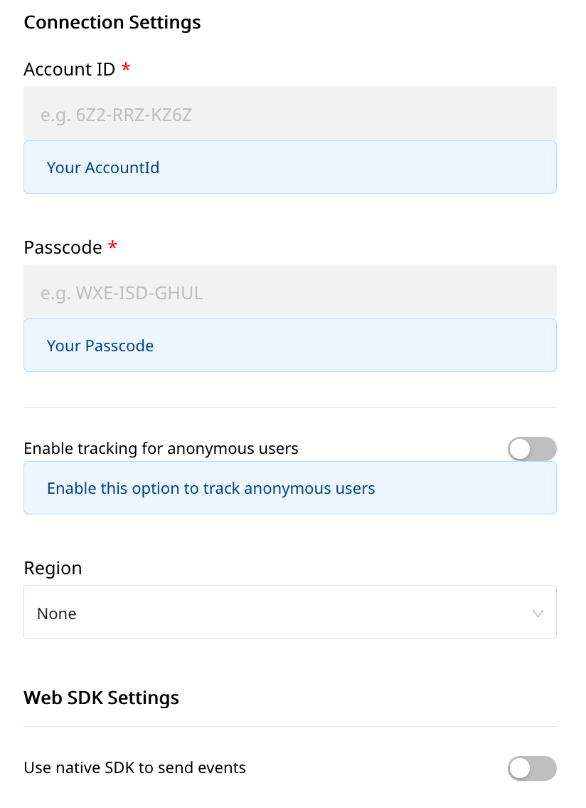

# CleverTap

[CleverTap](https://clevertap.com/) is a popular customer engagement and retention platform. Its in-app analytics and marketing capabilities allow you to get real-time insights into your customers and build valuable, long-term relationships with them. With CleverTap, you can easily your users' actions and understand how they are using your product. You can also segment users based on their behavior and run targeted campaigns to boost your user engagement and retention metrics.

You can now send your event data directly to CleverTap through RudderStack.

<div class="successBlock">

  **Find the open-source transformer code for this destination in our <a href="https://github.com/rudderlabs/rudder-transformer/tree/master/v0/destinations/clevertap">GitHub repo</a>.**
</div>

## Getting started

Before configuring your source and destination on the RudderStack, please check whether the platform you are sending the events from is supported by CleverTap. Please refer the following table to do so:

| **Connection Mode** | **Web**       | **Mobile**    | **Server**    |
| :------------------ | :------------ | :------------ | :------------ |
| **Device mode**     | **Supported** | **Supported** | -             |
| **Cloud mode**      | **Supported** | **Supported** | **Supported** |

<div class="infoBlock">

To know more about the difference between Cloud mode and Device mode in RudderStack, read the <a href="https://rudderstack.com/docs/rudderstack-cloud/rudderstack-connection-modes/">RudderStack connection modes</a> guide.

</div>

Once you have confirmed that the platform supports sending events to CleverTap, perform the steps below:

- From your [RudderStack dashboard](https://app.rudderstack.com/), add the source and CleverTap as a destination.

<div class="infoBlock">

Please follow our guide on <a href="https://www.rudderstack.com/docs/rudderstack-cloud/destinations/#adding-a-destination">Adding a Destination</a> to add a destination in RudderStack.

</div>



### Connection settings

To successfully configure CleverTap as a destination, you will need to configure the following settings:

* **Account ID:** Your account ID is an unique ID generated for your account. It can be found in your account in the **Settings** as your **Project ID**.
* **Passcode:** Your account passcode is an unique code generated for your account. It can be found in the **Settings** as **Passcode**.
* **Enable track for anonymous user:** Enable this option to track anonymous users in CleverTap.
* **Use Clevertap ObjectId for Mapping:** Enable this option to use both CleverTap `objectId` along with `identity` for mapping events from RudderStack to CleverTap.
* **Region:** Server Only: This is your dedicated CleverTap region.
* **Use Native SDK to send Events:** Enable this option if you want to send events using device mode.

<div class="infoBlock">

All server-side destination requests require either a <code class="inline-code">anonymousId</code> or a <code class="inline-code">userId</code> in the payload.
</div>

## Adding device mode integration

<!--

To add CleverTap to your Android project and enable functionalities like push notifications, follow these steps :

- Open your project level `build.gradle` file, and add the following:

```groovy
buildscript {
  repositories {
    mavenCentral()
  }
}

allprojects {
  repositories {
    mavenCentral()
  }
}
```

- Ensure that `android.useAndroidX` is set to `true` in your `gradle.properties` file.
- Also, add the following under the `dependencies` section:

```groovy
// ruddder core sdk
implementation 'com.rudderstack.android.sdk:core:1.+'
// rudder-clevertap integration
implementation 'com.rudderstack.android.integration:clevertap:1.+'
// clevertap native sdk
implementation 'com.clevertap.android:clevertap-android-sdk:4.+'
// if you don't have Gson included already
implementation 'com.google.code.gson:gson:2.8.6'
```

- Initialize the RudderStack SDK in the `Application` class's `onCreate()` method as shown:

```kotlin
import com.rudderstack.android.integrations.clevertap.CleverTapIntegrationFactory
import com.rudderstack.android.sdk.core.RudderClient
import com.rudderstack.android.sdk.core.RudderConfig

// initializing Rudder SDK
val rudderClient = RudderClient.getInstance(
    this,
    WRITE_KEY,
    RudderConfig.Builder()
        .withDataPlaneUrl(DATA_PLANE_URL)
        .withFactory(CleverTapIntegrationFactory.FACTORY)
        .build()
    )
```




Follow these steps to add CleverTap to your iOS project:

- Go your `Podfile` and add the `Rudder-CleverTap` extension as shown below:

```ruby
pod 'Rudder-CleverTap'
```

- After adding the dependency followed by `pod install` , you can add the imports to your `AppDelegate.m` file as shown:

```objectivec
#import "RudderCleverTapFactory.h"
```

- Finally, change the initialization of your `RudderClient` as shown:

```objectivec
RudderConfigBuilder *builder = [[RudderConfigBuilder alloc] init];
[builder withDataPlaneUrl:DATA_PLANE_URL];
[builder withFactory:[RudderCleverTapFactory instance]];
[RudderClient getInstance:WRITE_KEY config:[builder build]];
```




To add CleverTap to your React Native project:

Add the RudderStack-CleverTap module to your app using :

```bash
npm install @rudderstack/rudder-integration-clevertap-react-native
## OR ##
yarn add @rudderstack/rudder-integration-clevertap-react-native
```

Run `pod install` inside the `ios` directory of your project adding `@rudderstack/rudder-integration-clevertap-react-native` to your project.

Import the module you added above and add it to your SDK initialization code as shown below:

```typescript
import rudderClient from "@rudderstack/rudder-sdk-react-native"
import clevertap from "@rudderstack/rudder-integration-clevertap-react-native"

const config = {
  dataPlaneUrl: DATA_PLANE_URL,
  trackAppLifecycleEvents: true,
  withFactories: [clevertap],
}
rudderClient.setup(WRITE_KEY, config)
```


 -->

<Tabs>
  <TabList>
    <Tab>Android</Tab>
    <Tab>iOS</Tab>
    <Tab>React Native</Tab>
  </TabList>
    <TabPanels>
      <TabPanel>
        To add CleverTap to your Android project and enable functionalities like push notifications, follow these steps :
<ul>
<li>Open your project level <code class="inline-code">build.gradle</code> file, and add the following:
<span>

```groovy
buildscript {
  repositories {
    mavenCentral()
  }
}

allprojects {
  repositories {
    mavenCentral()
  }
}
```
</span>
</li>
<li>Ensure that <code class="inline-code">android.useAndroidX</code> is set to <code class="inline-code">true</code> in your <code class="inline-code">gradle.properties</code> file.</li>
<li>Also, add the following under the <code class="inline-code">dependencies</code> section:
<span>

```groovy
// ruddder core sdk
implementation 'com.rudderstack.android.sdk:core:1.+'
// rudder-clevertap integration
implementation 'com.rudderstack.android.integration:clevertap:1.+'
// clevertap native sdk
implementation 'com.clevertap.android:clevertap-android-sdk:4.+'
// if you don't have Gson included already
implementation 'com.google.code.gson:gson:2.8.6'
```
</span>
</li>
<li>Initialize the RudderStack SDK in the <code class="inline-code">Application</code> class's <code class="inline-code">onCreate()</code> method as shown:
<span>

```kotlin
import com.rudderstack.android.integrations.clevertap.CleverTapIntegrationFactory
import com.rudderstack.android.sdk.core.RudderClient
import com.rudderstack.android.sdk.core.RudderConfig

// initializing Rudder SDK
val rudderClient = RudderClient.getInstance(
    this,
    WRITE_KEY,
    RudderConfig.Builder()
        .withDataPlaneUrl(DATA_PLANE_URL)
        .withFactory(CleverTapIntegrationFactory.FACTORY)
        .build()
    )
```
</span>
</li>
</ul>
      </TabPanel>
      <TabPanel>
        Follow these steps to add CleverTap to your iOS project:
<ul>
<li>Go your <code class="inline-code">Podfile</code> and add the <code class="inline-code">Rudder-CleverTap</code> extension as shown below:
<span>

```ruby
pod 'Rudder-CleverTap'
```
</span>
</li>
<li>After adding the dependency followed by <code class="inline-code">pod install</code> , you can add the imports to your <code class="inline-code">AppDelegate.m</code> file as shown:
<span>

```objectivec
#import "RudderCleverTapFactory.h"
```
</span>
</li>
<li>Finally, change the initialization of your <code class="inline-code">RudderClient</code> as shown:
<span>

```objectivec
RudderConfigBuilder *builder = [[RudderConfigBuilder alloc] init];
[builder withDataPlaneUrl:DATA_PLANE_URL];
[builder withFactory:[RudderCleverTapFactory instance]];
[RudderClient getInstance:WRITE_KEY config:[builder build]];
```
</span>
</li>
</ul>
      </TabPanel>
      <TabPanel>
        To add CleverTap to your React Native project:
<ul>
<li>Add the RudderStack-CleverTap module to your app using :
<span>

```bash
npm install @rudderstack/rudder-integration-clevertap-react-native
## OR ##
yarn add @rudderstack/rudder-integration-clevertap-react-native
```
</span>
</li>
<li>Run <code class="inline-code">pod install</code> inside the <code class="inline-code">ios</code> directory of your project adding <code class="inline-code">@rudderstack/rudder-integration-clevertap-react-native</code> to your project.
</li>
<li>Import the module you added above and add it to your SDK initialization code as shown below:
<span>

```typescript
import rudderClient from "@rudderstack/rudder-sdk-react-native"
import clevertap from "@rudderstack/rudder-integration-clevertap-react-native"

const config = {
  dataPlaneUrl: DATA_PLANE_URL,
  trackAppLifecycleEvents: true,
  withFactories: [clevertap],
}
rudderClient.setup(WRITE_KEY, config)
```
</span>
</li>
</ul>
      </TabPanel>
    </TabPanels>
</Tabs>


## Configuring push notifications and in-app messages

The steps to configure push notifications for CleverTap for the platform of your choice are as mentioned below:

<!--


- Register push notifications for Android devices on your CleverTap dashboard either by uploading your FCM credentials or any other supported credentials by navigating to <strong>Settings</strong> - <strong>Channels</strong> - <strong>Mobile Push</strong> - <strong>Android</strong>.
- Add the following dependency in your project level `build.gradle` file inside the `buildscript`:

```groovy
dependencies {
  classpath 'com.google.gms:google-services:4.3.5'
}
```

- Next, add the following dependencies and plugin to your app level `build.gradle` file:

```groovy
dependencies {
  // for push notifications
  implementation 'com.clevertap.android:clevertap-android-sdk:4.0.0'
  implementation 'com.google.firebase:firebase-messaging:20.2.4'
}
apply plugin: 'com.google.gms.google-services'
```

- Place the `google-services.json` downloaded from the `Firebase console` into the root folder of your `app`.
- Add your `CLEVERTAP_ACCOUNT_ID` , `CLEVERTAP_TOKEN` & `FcmMessageListenerService` to the `application` tag of your app's `AndroidManifest.xml`, as below:

```markup
<meta-data
  android:name="CLEVERTAP_ACCOUNT_ID"
  android:value="XXX-XXX-XXXX"/>
<meta-data
  android:name="CLEVERTAP_TOKEN"
  android:value="XXX-XXX"/>
<service android:name="com.clevertap.android.sdk.pushnotification.fcm.FcmMessageListenerService">
  <intent-filter>
    <action android:name="com.google.firebase.MESSAGING_EVENT"/>
  </intent-filter>
</service>
```

- Finally, create a notification channel anywhere in your application using the following block of code. You can then use this `channel Id` while creating any campaign on your CleverTap Dashboard.

```kotlin
import android.app.Application;
import com.clevertap.android.sdk.CleverTapAPI;

CleverTapAPI.createNotificationChannel(
    getApplicationContext(),
    "yourChannelId",
    "Your Channel Name",
    "Your Channel Description",
    NotificationManager.IMPORTANCE_MAX,
    true
);
```

<div class="infoBlock">

For the Push Notification and In-App messages function correctly, CleverTap needs to know the <code class="inline-code">Application</code> status as early as possible. You can either set the <code class="inline-code">android:name</code> in your <code class="inline-code">AndroidManifest.xml</code> tag to <code class="inline-code">com.clevertap.android.sdk.Application</code>. Or, if you have a custom Application class, call <code class="inline-code">ActivityLifecycleCallback.register(this);</code> before <code class="inline-code">super.onCreate()</code> in your Application class.

To know more on this you can check the <a href="https://github.com/CleverTap/clevertap-android-sdk#setup-the-lifecycle-callback---important">CleverTap documentation on push notifications</a>.

</div>





Add Push Notification as a capability by navigating to Target - `Signing & Capabilities` of your app when opened in Xcode.
Enable `Background Modes/Remote notifications` by navigating to <strong>Targets</strong> -&gt; <strong>Your App</strong> -&gt; <strong>Capabilities</strong> -&gt; **Background Modes** and then check `Remote notifications`
Register the push notifications for the iOS devices on your CleverTap dashboard either by uploading Auth Key or APNS Push Certificate by navigating to <strong>Settings</strong> -&gt; <strong>Channels</strong> -&gt; <strong>Mobile Push</strong> -&gt; <strong>iOS</strong>.
Then, add the following code in your app just after initializing RudderStack's iOS SDK to register the push notifications.

```objectivec
#import <UserNotifications/UserNotifications.h>

// register for push notifications
UNUserNotificationCenter* center = [UNUserNotificationCenter currentNotificationCenter];
center.delegate = self;
[center requestAuthorizationWithOptions:(UNAuthorizationOptionAlert | UNAuthorizationOptionSound | UNAuthorizationOptionBadge)
completionHandler:^(BOOL granted, NSError * _Nullable error) {
  if (granted) {
    dispatch_async(dispatch_get_main_queue(), ^(void) {
        [[UIApplication sharedApplication] registerForRemoteNotifications];
        });
  }
}];
```

- Finally, add the below handlers to handle the tokens and push notifications accordingly:

```objectivec
#import "RudderCleverTapIntegration.h"

- (void)application:(UIApplication *)application didRegisterForRemoteNotificationsWithDeviceToken:(NSData *)deviceToken {
  [[RudderCleverTapIntegration alloc] registeredForRemoteNotificationsWithDeviceToken:deviceToken];
}

- (void)application:(UIApplication *)application didReceiveRemoteNotification:(NSDictionary *)userInfo fetchCompletionHandler:(void (^)(UIBackgroundFetchResult))completionHandler {
  [[RudderCleverTapIntegration alloc] receivedRemoteNotification:userInfo];
  completionHandler(UIBackgroundFetchResultNoData);
}

- (void)userNotificationCenter:(UNUserNotificationCenter *)center willPresentNotification:(UNNotification *)notification withCompletionHandler:(void (^)(UNNotificationPresentationOptions))completionHandler {
  completionHandler(UNAuthorizationOptionSound | UNAuthorizationOptionAlert | UNAuthorizationOptionBadge);
}

- (void)userNotificationCenter:(UNUserNotificationCenter *)center didReceiveNotificationResponse:(UNNotificationResponse *)response withCompletionHandler:(void (^)(void))completionHandler {
  [[RudderCleverTapIntegration alloc] receivedRemoteNotification:response.notification.request.content.userInfo];
}
```





- Open `android` folder of your React Native app and do follow all the steps mentioned in `Android` tab of [Configuring Push Notifications](clevertap.md#configuring-push-notifications)
- Open `ios` folder of your React Native app and do follow all the steps mentioned in `iOS` tab of [Configuring Push Notifications](clevertap.md#configuring-push-notifications)
  
   -->

<Tabs>
  <TabList>
    <Tab>Android</Tab>
    <Tab>iOS</Tab>
    <Tab>React Native</Tab>
  </TabList>
    <TabPanels>
      <TabPanel>
        <ul>
        <li>Register push notifications for Android devices on your CleverTap dashboard either by uploading your FCM credentials or any other supported credentials by navigating to <strong>Settings</strong> - <strong>Channels</strong> - <strong>Mobile Push</strong> - <strong>Android</strong>.</li>
<li>Add the following dependency in your project level <code class="inline-code">build.gradle</code> file inside the <code class="inline-code">buildscript</code>:
<span>

```groovy
dependencies {
  classpath 'com.google.gms:google-services:4.3.5'
}
```
</span>
</li>
<li>Next, add the following dependencies and plugin to your app level <code class="inline-code">build.gradle</code> file:
<span>

```groovy
dependencies {
  // for push notifications
  implementation 'com.clevertap.android:clevertap-android-sdk:4.0.0'
  implementation 'com.google.firebase:firebase-messaging:20.2.4'
}
apply plugin: 'com.google.gms.google-services'
```
</span>
</li>
<li>Place the <code class="inline-code">google-services.json</code> downloaded from the <code class="inline-code">Firebase console</code> into the root folder of your <code class="inline-code">app</code>.</li>
<li>Add your <code class="inline-code">CLEVERTAP_ACCOUNT_ID</code> , <code class="inline-code">CLEVERTAP_TOKEN</code> & <code class="inline-code">FcmMessageListenerService</code> to the <code class="inline-code">application</code> tag of your app's <code class="inline-code">AndroidManifest.xml</code>, as below:
<span>

```markup
<meta-data
  android:name="CLEVERTAP_ACCOUNT_ID"
  android:value="XXX-XXX-XXXX"/>
<meta-data
  android:name="CLEVERTAP_TOKEN"
  android:value="XXX-XXX"/>
<service android:name="com.clevertap.android.sdk.pushnotification.fcm.FcmMessageListenerService">
  <intent-filter>
    <action android:name="com.google.firebase.MESSAGING_EVENT"/>
  </intent-filter>
</service>
```
</span>
</li>
<li>Finally, create a notification channel anywhere in your application using the following block of code. You can then use this <code class="inline-code">channel Id</code> while creating any campaign on your CleverTap Dashboard.
<span>

```kotlin
import android.app.Application;
import com.clevertap.android.sdk.CleverTapAPI;

CleverTapAPI.createNotificationChannel(
    getApplicationContext(),
    "yourChannelId",
    "Your Channel Name",
    "Your Channel Description",
    NotificationManager.IMPORTANCE_MAX,
    true
);
```
</span>
</li>
</ul>
<div class="infoBlock">

For the Push Notification and In-App messages function correctly, CleverTap needs to know the <code class="inline-code">Application</code> status as early as possible. You can either set the <code class="inline-code">android:name</code> in your <code class="inline-code">AndroidManifest.xml</code> tag to <code class="inline-code">com.clevertap.android.sdk.Application</code>. Or, if you have a custom Application class, call <code class="inline-code">ActivityLifecycleCallback.register(this);</code> before <code class="inline-code">super.onCreate()</code> in your Application class.

To know more on this you can check the <a href="https://github.com/CleverTap/clevertap-android-sdk#setup-the-lifecycle-callback---important">CleverTap documentation on push notifications</a>.

</div>
      </TabPanel>
      <TabPanel>
      <ul>
<li>Add Push Notification as a capability by navigating to Target - <code class="inline-code">Signing & Capabilities</code> of your app when opened in Xcode.</li>
<li>Enable <code class="inline-code">Background Modes/Remote notifications</code> by navigating to <strong>Targets</strong> -&gt; <strong>Your App</strong> -&gt; <strong>Capabilities</strong> -&gt; <strong>Background Modes</strong> and then check <code class="inline-code">Remote notifications</code></li>
<li>Register the push notifications for the iOS devices on your CleverTap dashboard either by uploading Auth Key or APNS Push Certificate by navigating to <strong>Settings</strong> -&gt; <strong>Channels</strong> -&gt; <strong>Mobile Push</strong> -&gt; <strong>iOS</strong>.</li>
<li>Then, add the following code in your app just after initializing RudderStack's iOS SDK to register the push notifications.
<span>

```objectivec
#import <UserNotifications/UserNotifications.h>

// register for push notifications
UNUserNotificationCenter* center = [UNUserNotificationCenter currentNotificationCenter];
center.delegate = self;
[center requestAuthorizationWithOptions:(UNAuthorizationOptionAlert | UNAuthorizationOptionSound | UNAuthorizationOptionBadge)
completionHandler:^(BOOL granted, NSError * _Nullable error) {
  if (granted) {
    dispatch_async(dispatch_get_main_queue(), ^(void) {
        [[UIApplication sharedApplication] registerForRemoteNotifications];
        });
  }
}];
```
</span>
</li>
<li>Finally, add the below handlers to handle the tokens and push notifications accordingly:
<span>

```objectivec
#import "RudderCleverTapIntegration.h"

- (void)application:(UIApplication *)application didRegisterForRemoteNotificationsWithDeviceToken:(NSData *)deviceToken {
  [[RudderCleverTapIntegration alloc] registeredForRemoteNotificationsWithDeviceToken:deviceToken];
}

- (void)application:(UIApplication *)application didReceiveRemoteNotification:(NSDictionary *)userInfo fetchCompletionHandler:(void (^)(UIBackgroundFetchResult))completionHandler {
  [[RudderCleverTapIntegration alloc] receivedRemoteNotification:userInfo];
  completionHandler(UIBackgroundFetchResultNoData);
}

- (void)userNotificationCenter:(UNUserNotificationCenter *)center willPresentNotification:(UNNotification *)notification withCompletionHandler:(void (^)(UNNotificationPresentationOptions))completionHandler {
  completionHandler(UNAuthorizationOptionSound | UNAuthorizationOptionAlert | UNAuthorizationOptionBadge);
}

- (void)userNotificationCenter:(UNUserNotificationCenter *)center didReceiveNotificationResponse:(UNNotificationResponse *)response withCompletionHandler:(void (^)(void))completionHandler {
  [[RudderCleverTapIntegration alloc] receivedRemoteNotification:response.notification.request.content.userInfo];
}
```
</span>
</li>
</ul>
      </TabPanel>
      <TabPanel>
        <ul>
       <li>Open <code class="inline-code">android</code> folder of your React Native app and do follow all the steps mentioned in <code class="inline-code">Android</code> tab of <a href="#configuring-push-notifications">Configuring Push Notifications</a></li>
<li>Open <code class="inline-code">ios</code> folder of your React Native app and do follow all the steps mentioned in <code class="inline-code">iOS</code> tab of <a href="#configuring-push-notifications">Configuring Push Notifications</a></li>
  </ul>
      </TabPanel>
    </TabPanels>
</Tabs>

## Using CleverTap objectId and identity for mapping \(cloud mode only\)

CleverTap uniquely identifies each user with two main identifiers, namely `objectId` and `identity`. When the **Use Clevertap ObjectId for Mapping** option is enabled in the dashboard, both `objectId` and `identity` are used for mapping.

When the **Use Clevertap ObjectId for Mapping** setting is disabled in the dashboard, RudderStack expects the the following mapping for identifying users and tracking events \(`track`/`page`/`screen`\):

| **RudderStack**           | **CleverTap** |
| :------------------------ | :------------ |
| `userId` or `anonymousId` | `identity`    |

When the **Use Clevertap ObjectId for Mapping** setting is enabled in the dashboard, the following mapping is expected:

* For `identify` events:

| **RudderStack**           | **RudderStack**      | **CleverTap**                  | **CleverTap**   |
| :------------------------ | :------------------- | :----------------------------- | :-------------- |
| **`anonymousId` present?**| **`userId` present?**| **`objectId`**                 | **`identity`**  |
| Yes                       | Yes                  | `anonymousId`                  | `userId`        |
| Yes                       | No                   | `anonymousId`                  | -               |
| No                        | Yes                  | CleverTap-generated UUID       | `userId`        | 

* For `track` events:

| **RudderStack**           | **RudderStack**      | **CleverTap**     | **CleverTap** |
| :------------------------ | :------------------- | :---------------- | :------------ |
| **`anonymousId` present?**| **`userId` present?**| **Tracking with** | **Value**     |
| Yes                       | Yes                  | `objectId`        | `anonymousId` |
| Yes                       | No                   | `objectId`        | `anonymousId` |
| No                        | Yes                  | `identity`        | `userId`      |

### Why use Clevertap objectId for mapping?

When you track an unidentified user in CleverTap, a user profile is created with minimal details, along with the details of the user's activity. When the same user is then identified with a `userId` without the **Use CleverTap ObjectId for Mapping** option enabled, RudderStack creates another profile for the user with the identifier `userId` \(in case of RudderStack\) which maps to `identity` \(in case of CleverTap\).

One way to solve this problem is to track users only in cases where a `userId` is present. To do so, you can disable the **Enable tracking for anonymous users** option in the RudderStack dashboard. Alternatively, you can enable the **Use Clevertap ObjectId for Mapping** option in the dashboard which allows you to track the anonymous users and when they are later identified, merge their `anonymousId` with their `userId`.

## Device token upload using cloud mode

<div class="infoBlock">
This section is applicable for the Android and iOS sources when sending events via the Cloud Mode.
</div>

When the device token is present in `context.device.token` in `identify` calls, RudderStack will use the [CleverTap Device Token Upload API](https://developer.clevertap.com/docs/upload-device-tokens-api) to upload the device token for the identified user. For Android, RudderStack sets the token type as `fcm`. For iOS, it is set as `apns`.

<div class="warningBlock">

To use this feature you should have enabled the **Use Clevertap ObjectId for Mapping** option in the dashboard, as RudderStack needs the `objectId` to upload the device token.
</div>

## Page

The `page` call allows you to record information whenever a user sees a web page, along with its associated properties.

When you send a `page` event , RudderStack sends that event to CleverTap as a **"Web Page Viewed `Page Name`** event.

An example of a `page` call is shown below:

```javascript
rudderanalytics.page("Cart", "Cart Viewed", {
  path: "/cart",
  referrer: "test.com",
  search: "term",
  title: "test_item",
  url: "http://test.in",
})
```

## Screen

The `screen` method allows you to record whenever a user sees the mobile screen, along with any associated optional properties. This call is similar to the `page` call, but is exclusive to your mobile device.

A sample `screen` call looks like the following code snippet:

```objectivec
[[RSClient sharedInstance] screen:@"Sample Screen Name"
        properties:@{@"prop_key" : @"prop_value"}];
```

In the above snippet, RudderStack captures all the information related to the screen being viewed, along with any additional info associated with that screen view event. In CleverTap, the above `screen` call will be shown as - **"Screen Viewed: `Sample Screen Name` "** along with the properties.

## Track

The `track` call allows you to capture any action that the user might perform, along with the properties associated with that action. Each action is considered to be an event. It is similar to `screen` event, and the user is by default associated with `userId` or `anonymousId`.

A sample `track` call looks like the following:

```javascript
rudderanalytics.track("Checked Out", {
  Clicked_Rush_delivery_Button: true,
  total_value: 2000,
  revenue: 2000,
})
```

In the above snippet, RudderStack captures the information related to the `Checked Out` event, along with any additional info about that event - in this case the details of the `Checked out` event.

<div class="infoBlock">

To set a specific value to the <code class="inline-code">screen</code> or <code class="inline-code">track</code> type event, you need to pass the <code class="inline-code">event</code> related property in the <code class="inline-code">properties</code> field.

</div>

<div class="infoBlock">

Note: For <code class="inline-code">track</code>, <code class="inline-code">page</code> and <code class="inline-code">screen</code> events CleverTap does not support arrays or nested objects for custom event properties.

</div>

### Order Completed

When you track an event with the name `Order Completed` using the using Rudderstack's [e-commerce](https://rudderstack.com/docs/rudderstack-api/api-specification/rudderstack-ecommerce-events-specification/ordering/#order-completed) tracking API , Rudderstack maps that event to CleverTap’s [Charged](https://developer.clevertap.com/docs/concepts-events#recording-customer-purchases) event.

A number of Rudderstack's specific fields map to CleverTap’s standard `Charged` event fields

| **Rudderstack** | **CleverTap** |
| :-------------- | :------------ |
| `checkout_id`   | `Charged ID`  |
| `revenue`       | `Amount`      |
| `products`      | `Items`       |

A sample `Order Completed` event looks like the following:

```javascript
rudderanalytics.track("Order Completed", {
  checkout_id: "12345",
  order_id: "1234",
  affiliation: "Apple Store",
  "Payment mode": "Credit Card",
  total: 20,
  revenue: 15.0,
  shipping: 22,
  tax: 1,
  discount: 1.5,
  coupon: "Games",
  currency: "USD",
  products: [
    {
      product_id: "123",
      sku: "G-32",
      name: "Monopoly",
      price: 14,
      quantity: 1,
      category: "Games",
      url: "https://www.website.com/product/path",
      image_url: "https://www.website.com/product/path.jpg",
    },
    {
      product_id: "345",
      sku: "F-32",
      name: "UNO",
      price: 3.45,
      quantity: 2,
      category: "Games",
    },
    {
      product_id: "125",
      sku: "S-32",
      name: "Ludo",
      price: 14,
      quantity: 7,
      category: "Games",
      brand: "Ludo King",
    },
  ],
})
```

<div class="infoBlock">

The <code class="inline-code">Order Completed</code> E-Commerce event is free flowing event, if you are setting extra fields for example: <code class="inline-code">discount</code>, <code class="inline-code">coupon</code> <code class="inline-code">currency</code> etc these will be automatically set to <code class="inline-code">Charged</code> event properties.

</div>

## Identify

The `identify` call lets you associate a user with their actions and capture all the relevant traits about them. This information includes unique `userid` as well as any optional information such as `name`, `email`, etc.

A number of Rudderstack's special traits map to CleverTap’s standard user profile fields, as shown in the table below. You will be required to pass the key on the left into Rudderstack and RudderStack will transform it to the key on the right before sending to CleverTap.

| **Rudderstack** | **Clevertap**   |
| :-------------- | :-------------- |
| `name`          | `Name`          |
| `birthday`      | `DOB`           |
| `avatar`        | `Photo`         |
| `gender`        | `Gender`        |
| `phone`         | `Phone`         |
| `email`         | `Email`         |
| `employed`      | `Employed`      |
| `education`     | `Education`     |
| `married`       | `Married`       |
| `customerType`  | `Customer Type` |

All other traits will be sent to CleverTap as custom attributes.

A sample `identify` call looks like the following:

```javascript
rudderanalytics.identify("userid", {
  name: "Name Surname",
  email: "name@website.com",
  phone: "phone",
  birthday: "birthday",
  gender: "M",
  avatar: "link to image",
  title: "Owner",
  organization: "Company",
  city: "Tokyo",
  region: "ABC",
  country: "JP",
  zip: "100-0001",
  Flagged: false,
  Residence: "Shibuya",
  MSG-email: false
});
```

In the above snippet, RudderStack captures relevant information about the user such as the `email`, `phone` as well as the associated traits of that user.

<div class="infoBlock">

If a user already exists, the new values will be updated for that user. Rudderstack automatically maps the <code class="inline-code">userId</code> (or <code class="inline-code">anoymousId</code>) to CleverTap user's <code class="inline-code">identity</code>.

</div>

<div class="infoBlock">

Note: For <code class="inline-code">identify</code> events CleverTap does not support nested objects for user's <code class="inline-code">traits</code>.

</div>

<div class="infoBlock">

Profile properties <code class="inline-code">MSG-email</code>, <code class="inline-code">MSG-push</code>, <code class="inline-code">MSG-sms</code> and <code class="inline-code">MSG-whatsapp</code> are used to set the Do-Not-Disturb status for the user. Unless these are explicitly set to <code class="inline-code">false</code>, they are always <code class="inline-code">true</code>.

Example: To disable push notifications for a user, set <code class="inline-code">MSG-push</code> to <code class="inline-code">false</code>

</div>

## Contact us

For queries on any of the sections covered in this guide, you can [**contact us**](mailto:%20docs@rudderstack.com) or start a conversation in our [**Slack**](https://rudderstack.com/join-rudderstack-slack-community) community.
