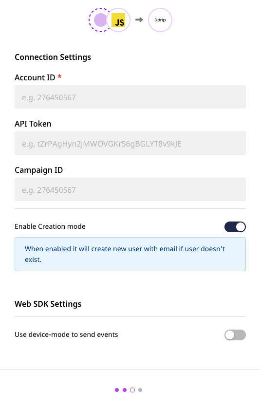

# Setting Up Drip in RudderStack

To enable sending data to Drip, you will first need to add it as a destination in RudderStack. Once the destination is configured and enabled, events from RudderStack will start flowing to Drip.

Before configuring Drip as a destination, verify if Drip supports the source platform by referring to the table below:

| **Connection Mode** | **Web** | **Mobile** | **Server** |
| :--- | :--- | :--- | :--- |
| **Device mode** | - | - | - |
| **Cloud** **mode** | **Supported** | **Supported** | **Supported** |


To know more about the difference between Cloud mode and Device mode in RudderStack, read the [**RudderStack connection modes**](https://docs.rudderstack.com/get-started/rudderstack-connection-modes) guide.


Once you have confirmed that the source supports sending events to Drip, follow these steps:

* From your [**RudderStack dashboard**](https://app.rudderstack.com/), add the source. From the list of destinations, select **Drip**.


Follow our guide on [**How to Add a Source and Destination in RudderStack**](https://docs.rudderstack.com/how-to-guides/adding-source-and-destination-rudderstack) for more information.


* Give a name to the destination and click on **Next**. You should then see the following screen:

* Next, enter your Drip **Account ID**. To get your **Account ID**, [**sign in**](https://login.getdrip.com/login/email) to your Drip dashboard and go to **Settings** - **Account**. Scroll down to see your Account ID.

* Enter your Drip **API Token**. To get your Drip API token, go to **Settings** - **User Settings** in your Drip dashboard.


The **API token** is required when using the Cloud mode to send your data.


* Enter your **Campaign ID**. To get your campaign ID, go to **Campaigns** - **Email Series** and choose the relevant campaign. The last part of the URL is the campaign ID, e.g. `https://www.getdrip.com/account_id/campaigns/campaign_id`.


If the **Campaign ID** is provided, RudderStack will try to subscribe the users by default.



You can also send your Campaign ID via the `identify` call, which takes a higher precedence.


* **User Creation Mode** This option lets you create the user with their `email` using the `track` call, if the user doesn't already exist.
* Finally, click on **Next**. That's it! Drip will now be enabled as a destination in Rudderstack.

## Contact Us

If you come across any issues while configuring Drip with RudderStack, feel free to [**contact us**](mailto:%20docs@rudderstack.com) or start a conversation on our [**Slack**](https://resources.rudderstack.com/join-rudderstack-slack) channel.

