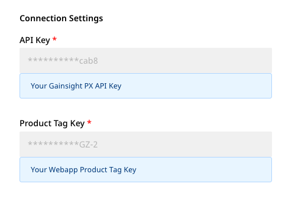
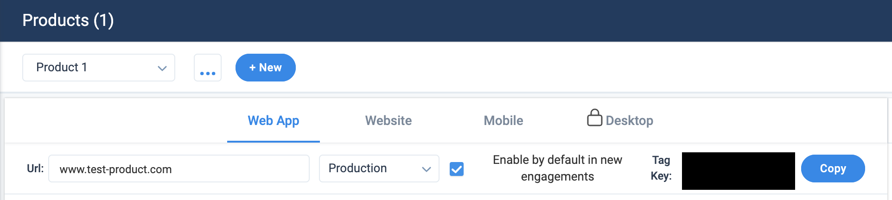
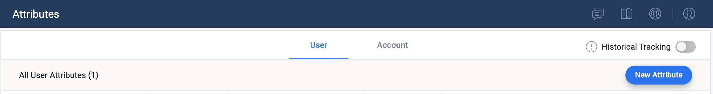
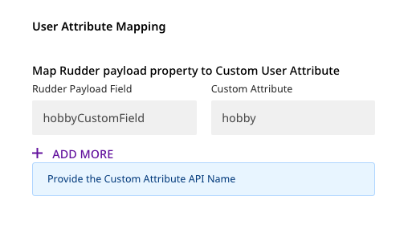
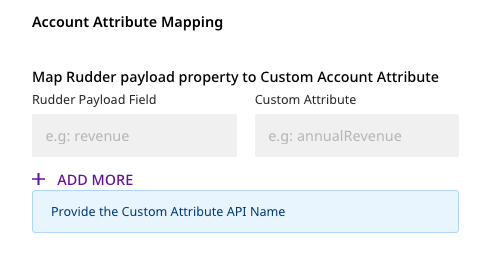
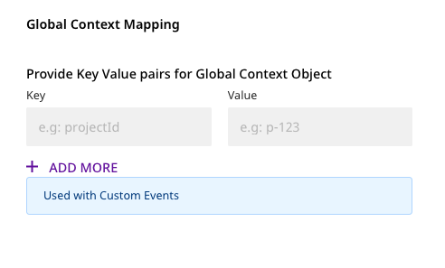

# Gainsight PX

[**Gainsight PX**](https://www.gainsight.com/product-experience/) is a popular product experience platform that offers cutting-edge product analytics and product engagement features. It allows the product teams to optimize their customer adoption and onboarding flows and design relevant product experiences through email, dialogue, and effective user guides.

RudderStack supports Gainsight PX as a destination to which you can send your event data seamlessly.

<div class="successBlock">

  **Find the open-source transformer code for this destination in our <a href="https://github.com/rudderlabs/rudder-transformer/tree/dest-gainsight-px">GitHub repo</a>.**
</div>

## Getting Started

To send your events to Gainsight PX via RudderStack, you will first need to add it as a destination in the RudderStack dashboard.

<div class="infoBlock">

See our <a href="https://rudderstack.com/docs/connections/">Connections</a> guide to learn more about sources and destinations in RudderStack.

</div>

Before you get started, check if the source platform is supported by Gainsight PX by referring to the table below:

| **Connection Mode** | **Web**       | **Mobile**    | **Server**    |
| :------------------ | :------------ | :------------ | :------------ |
| **Device mode**     | -             | -             | -             |
| **Cloud mode**      | **Supported** | **Supported** | **Supported** |

<div class="infoBlock">

To know more about the difference between Cloud mode and Device mode in RudderStack, read the <a href="https://rudderstack.com/docs/rudderstack-cloud/rudderstack-connection-modes/">RudderStack connection modes</a> guide.

</div>

Once you've confirmed that the source platform supports sending events to RudderStack, follow these steps:

- From your [**RudderStack dashboard**](https://app.rudderlabs.com/), add the source and select **Gainsight PX** from the list of supported destinations.

<div class="infoBlock">

To add a source, follow our guide on <a href="https://www.rudderstack.com/docs/rudderstack-cloud/destinations/#adding-a-destination">How to Add a Source and Destination in RudderStack</a> for more details.
</div>

- Assign a name to this destination and click on **Next**. You should then see the following **Connection Settings** screen:


<span class="imageTitle">Connection Settings for Gainsight PX</span>

You will need to enter the following settings under **Connection Settings**:

- **API Key**: Enter the API key required for using the Gainsight PX REST API. To generate the API Key, go to your Gainsight dashboard and navigate to **Administration** - **Integrations** - **Rest API**.

<div class="infoBlock">

More information on the Gainsight PX Rest API can be found <a href="https://support.gainsight.com/PX/API_for_Developers/02Usage_of_Different_APIs/Work_with_the_Gainsight_PX_REST_API">here</a>.

</div>

- **Product Tag Key**: Provide the **Tag key** for your product. To create a new product or copy a product tag key, go to **Administration** - **Products** as shown below:


<span class="imageTitle">Gainsight PX</span>

### Custom Attributes

You can send Custom Attributes for both the `User` and `Account` objects using RudderStack.

To create custom attributes in Gainsight PX, go to your Gainsight dashboard and navigate to **Administration** - **Attributes**. Then, click on the **New Attribute** button as shown in the image below:


<span class="imageTitle">Create Custom Attribute</span>

You can then provide these mappings in the RudderStack dashboard as shown:

<span class="imageTitle">Connection Settings 2</span>

## Identify

RudderStack creates a **`User`** object in Gainsight PX for the `identify` call. Gainsight uses the `identifyId` field as the unique identifier for this object. RudderStack will then map the `userId` from the message to this `identifyId`.

<div class="infoBlock">

If <code class="inline-code">userId</code> is not present, <code class="inline-code">anonymousId</code> will be used instead.

</div>

RudderStack supports all the default attributes for the **`User`** object. For the custom attributes, you can map the RudderStack payload attribute to the Gainsight PX attribute in the RudderStack dashboard under the **User Attribute Mapping** section, as shown:


<span class="imageTitle">User Custom Attribute Mapping</span>

<div class="warningBlock">

RudderStack will drop the custom attributes that are not defined in the mapping and send the rest of the attributes to Gainsight PX.

</div>

A sample `identify` call is as shown below:

```javascript
rudderanalytics.identify("sample-user-id", {
  email: "user@domain.com",
  name: "Some User",
  gender: "M",
  countryName: "INDIA",
  countryCode: "IN",
  city: "CHENNAI",
  score: 100,
  hobbyCustomField: "Painting",
  title: "Doctor",
})
```

In the above example, `hobbyCustomField` is a custom field. You will need to provide the mapping for `hobbyCustomField` to the corresponding Custom Attribute name \(`hobby`, as shown in the screenshot above\) in Gainsight PX. If this mapping is not provided, RudderStack will drop the `hobbyCustomField` attribute and send the other attributes to Gainsight PX.

### Location Attribute Mapping

The mapping of the location properties from the Gainsight PX **`User`** object to the RudderStack payload is as shown:

| **Gainsight PX Property**        | **RudderStack Trait Name** |
| :------------------------------- | :------------------------- |
| `location.countryName`           | `countryName`              |
| `location.countryCode`           | `countryCode`              |
| `location.stateName`             | `stateName`                |
| `location.stateCode`             | `stateCode`                |
| `location.city`                  | `city`                     |
| `location.street`                | `street`                   |
| `location.postalCode`            | `postalCode`               |
| `location.continent`             | `continent`                |
| `location.regionName`            | `regionName`               |
| `location.timeZone`              | `timeZone`                 |
| `location.coordinates.latitude`  | `latitude`                 |
| `location.coordinates.longitude` | `longitude`                |

## Group

For the `group` calls, RudderStack associates a **`User`** with an **`Account`** in Gainsight PX. RudderStack will map the `groupId` to the `accountId` in the Gainsight PX payload.

All the default fields for **`Account`** object are supported. For custom attributes, you can map the custom RudderStack attributes to Gainsight custom attributes in the RudderStack dashboard under **Account Attribute Mapping**, as shown below:

<span class="imageTitle">Account Custom Attribute Mapping</span>

A sample `group` call is as shown:

```javascript
rudderanalytics.group("sample-group-id", {
  name: "Example Group",
  industry: "Online Streaming",
  numberOfEmployees: 10000,
  website: "www.exmaple-group.com",
  cultureCustomField: "cool",
})
```

In the above example, `cultureCustomField` is a custom field. You will need to provide the mapping for `cultureCustomField` to the corressponding Custom Attribute name in Gainsight PX. If this mapping is not provided, RudderStack will drop the `cultureCustomField` attribute and send the other default attributes to Gainsight.

### Location Attribute Mapping

The mapping of the location properties from your Gainsight PX **`Account`** object to the RudderStack payload is as shown:

| **Gainsight PX Property**        | **RudderStack Trait Name** |
| :------------------------------- | :------------------------- |
| `location.countryName`           | `countryName`              |
| `location.countryCode`           | `countryCode`              |
| `location.stateName`             | `stateName`                |
| `location.stateCode`             | `stateCode`                |
| `location.city`                  | `city`                     |
| `location.street`                | `street`                   |
| `location.postalCode`            | `postalCode`               |
| `location.continent`             | `continent`                |
| `location.regionName`            | `regionName`               |
| `location.timeZone`              | `timeZone`                 |
| `location.coordinates.latitude`  | `latitude`                 |
| `location.coordinates.longitude` | `longitude`                |

## Track

RudderStack uses the Gainsight PX's Custom Event API for sending the `track` calls.

A sample `track` call is as shown:

```javascript
rudderanalytics.track("Track User", {
  description: "Example track call",
  status: "demo",
})
```

The `event` field in the RudderStack payload is mapped to the `eventName` field in the Gainsight PX payload.

You can also set the **Global Context** metadata for the custom events. The key-value pairs for Global Context must be set in the RudderStack dashboard under **Global Context Mapping** as shown in the image below:


<span class="imageTitle">Global Context Mapping</span>

<div class="infoBlock">

**For more information on the Global Context feature and how to use it, refer to the <a href="https://support.gainsight.com/PX/Engagements/02Engagement_Configuration/Use_Global_Context">Gainsight PX documentation</a>.**

</div>

The Global Context metadata can also be provided in the `track` payload, as shown in the following example:

```javascript
rudderanalytics.track("Track User", {
  description: "Example track call",
  status: "demo",
  globalContext: {
    projectId: "p-123",
  },
})
```

<div class="infoBlock">

In case the Global Context metadata is provided in the RudderStack dashboard (under **Global Context Mapping**) as well as the payload, the payload will take a higher precedence.

</div>

<div class="infoBlock">

For <code class="inline-code">identify</code>, <code class="inline-code">group</code> and <code class="inline-code">track</code> calls, <code class="inline-code">userId</code> is required. If <code class="inline-code">userId</code> is not present, <code class="inline-code">anonymousId</code> will be used instead.

</div>

## Contact Us

If you come across any issues while configuring Gainsight PX with RudderStack, feel free to [**contact us**](mailto:%20docs@rudderstack.com) or start a conversation in our [**Slack**](https://rudderstack.com/join-rudderstack-slack-community) community.
