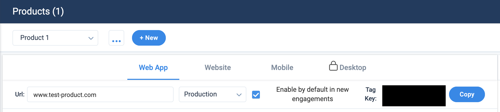
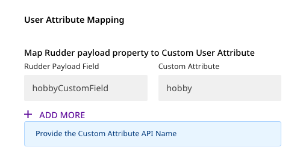
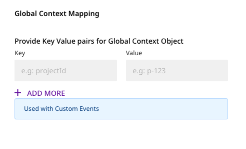

# Gainsight PX

Gainsight PX is a complete Product Experience Platform that enables product teams to accelerate onboarding and adoption, create memorable product experiences that efficiently scale onboarding and drive feature adoption through in-app guides, dialogues, and email.


**Find the open-source transformer code for this destination in our** [**GitHub repo**](https://github.com/rudderlabs/rudder-transformer/tree/dest-gainsight-px)**.**


## Getting Started

To send your events to Gainsight PX via RudderStack, you will first need to add it as a destination in the RudderStack dashboard.


See our [Connections](https://docs.rudderstack.com/connections) guide to learn more about sources and destinations in RudderStack.


Please check if the source platform is supported by Gainsight PX by referring to the table below:

| **Connection Mode** | **Web**       | **Mobile**    | **Server**    |
| :------------------ | :------------ | :------------ | :------------ |
| **Device mode**     | -             | -             | -             |
| **Cloud mode**      | **Supported** | **Supported** | **Supported** |


To know more about the difference between Cloud mode and Device mode in RudderStack, read the [RudderStack connection modes](https://docs.rudderstack.com/get-started/rudderstack-connection-modes) guide.


Once you've confirmed that the source platform supports sending events to RudderStack, follow these steps:

- From your [RudderStack dashboard](https://app.rudderlabs.com/), add the source and select **Gainsight** from the list of supported destinations.


Follow our guide on [How to Add a Source and Destination in RudderStack](https://docs.rudderstack.com/how-to-guides/adding-source-and-destination-rudderstack) to add a source in RudderStack.


- Assign a name to this destination, and click on **Next**. You should then see the following screen:


You will need to enter the following settings under **Connection Settings**:

- **API Key**: This key is required for using the REST API. To generate your API Key go to **Administration** > **Integrations** > **Rest API**
- **Product Tag Key**: Provide the `Tag key` for your product. To create a new product or copy a product tag key go to **Administration** > **Products**.




More information on the Gainsight PX Rest API can be found [here](https://support.gainsight.com/PX/API_for_Developers/02Usage_of_Different_APIs/Work_with_the_Gainsight_PX_REST_API).


### Custom Attributes

You can send Custom Attributes for both `User` and `Account` objects using RudderStack.

To create Custom Attributes in Gainsight PX go to **Administration** > **Attributes** and create a New Attribute as shown in the image below.


Next Provide the mapping in the RudderStack dashboard.

## Identify

RudderStack creates a `User` object in Gainsight PX for the `identify` call. Gainsight uses the `identifyId` field as the unique identifier for a User object. RudderStack will map the `userId` from message to `identifyId`. If `userId` is not present, `anonymousId` will be used instead.

All the default fields for `User` object are supported. Additionally, for custom attributes provide the rudder payload key to gainsight key mapping in the RudderStack dashboard as shown in the image below.

**Note** If mapping is not provided, all attributes other than the default ones are dropped.



Example of identify call:

```javascript
rudderanalytics.identify("sample-user-id", {
  email: "user@email.com",
  name: "Example User",
  gender: "M",
  countryName: "USA",
  countryCode: "US",
  city: "New York",
  score: 100,
  title: "Engineer",
});
```

## Group

For group calls, RudderStack associates a `User` with an `Account` in Gainsight PX. RudderStack will map the groupId for message to the `Account` id.

All the default fields for Account object are supported. Additionally, for custom attributes provide the rudder payload key to gainsight key mapping in the RudderStack dashboard.


Example of group call:

```javascript
rudderanalytics.group("sample-group-id", {
  name: "Example Group",
  industry: "Online Streaming",
  numberOfEmployees: 10000,
  website: "www.exmaple-group.com",
  cultureCustomField: "cool",
});
```

**Note**: `cultureCustomField` is a custom field. Provide the mapping for `cultureCustomField` to the corressponding Custom Attribute Api name in Gainsight PX. If mapping is not provided, all attributes other than the default ones are dropped.

## Track

RudderStack uses the Custom Event API in Gainsight PX for track calls.

Example of track call:

```javascript
rudderanalytics.track("Track User", {
  description: "Example track call",
  status: "demo",
});
```

The `event` field in rudder payload is mapped to `eventName` field in the destination payload.

You can also set Global Context metadata for Custom Events. The key value pairs for Global Context must be set in the RudderStack dashboard as shown in the image below.



The Global Context metadata can also be provided in the track payload. Incase it is provided both in Rudder dashboard and payload, the payload will have higher precedence.

Example of track call with global context:

```javascript
rudderanalytics.track("Track User", {
  description: "Example track call",
  status: "demo",
  globalContext: {
    projectId: "p-123",
  },
});
```

## Contact Us

If you come across any issues while configuring Gainsight PX with RudderStack, please feel free to [contact us](mailto:%20docs@rudderstack.com). You can also start a conversation on our [Slack](https://resources.rudderstack.com/join-rudderstack-slack) channel; we will be happy to talk to you!
