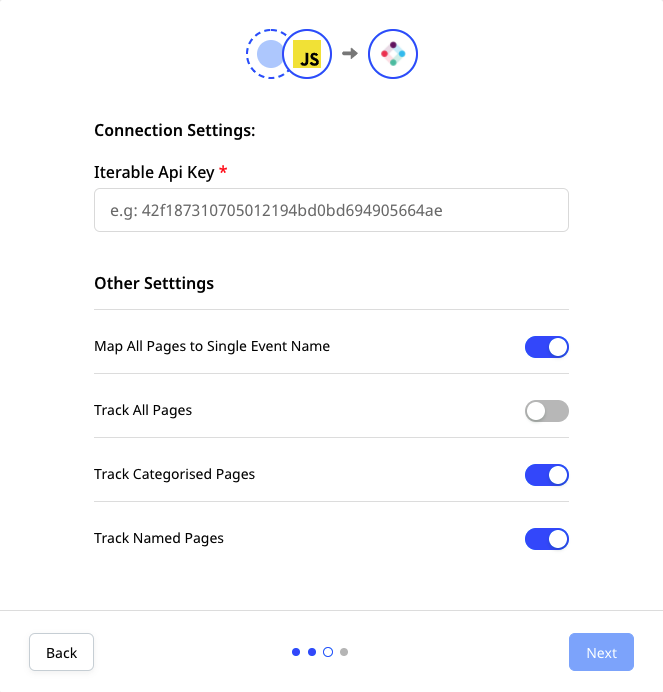

# Iterable

[Iterable](https://iterable.com/) is a popular growth marketing platform that lets you maximize customer interaction and improve your customers' overall LTV \(Life Time Value\).

RudderStack supports Iterable as a destination where you send your event data seamlessly.

<div class="infoBlock">
  
RudderStack batches the events together before sending them to the Iterable destination. It helps in saving the number of API calls and delivering the events faster.
</div>

## Getting started

First, verify if the source platform is supported by Iterable by referring to the following table:

| **Connection Mode** | **Web**       | **Mobile**    | **Server**    |
| :------------------ | :------------ | :------------ | :------------ |
| **Device mode**     | **-**         | -             | -             |
| **Cloud mode**      | **Supported** | **Supported** | **Supported** |

<div class="infoBlock">

To know more about the difference between cloud mode and device mode in RudderStack, refer to the <a href="https://rudderstack.com/docs/connections/rudderstack-connection-modes/">RudderStack Connection Modes</a> guide.
</div>

Once you have confirmed that the platform supports sending events to Iterable, follow these steps:

- From your [RudderStack dashboard](https://app.rudderstack.com/), add the source. Then, from the list of destinations, select **Iterable**.

<div class="infoBlock">

Refer to the <a href="https://rudderstack.com/docs/connections/adding-source-and-destination-rudderstack/">Adding a Source and Destination in RudderStack</a> guide for more information.
</div>

- Assign a name to the destination and click on **Next**.

### Connection settings

To successfully configure Iterable as a destination, you will need to configure the following settings:



- **Iterable API Key**: Enter your Iterable API key. You can obtain it by going to the **API Configuration Settings** section in your Iterable account.
- **Map All Pages to Single Event Name**: If this setting is enabled, all the pages will be tracked to Iterable with the same event name.
  - For `page` events, RudderStack will set the event name as `Loaded a Page`.
  - For `screen` events, RudderStack will set the event name as `Loaded a Screen`.
- **Track All Pages**: If this setting is enabled, all the page events will be sent to Iterable.
- **Track Categorized Pages**: If this setting is enabled, only pages with a category present will be tracked.
- **Track Named Pages**: If this setting is enabled, RudderStack will track only the pages having a name.

## Identify

When you make an `identify` call, RudderStack calls Iterable's [Update User](https://api.iterable.com/api/docs#users_updateUser) API to send the data.

<div class="warningBlock">

Iterable identifies a user by <code class="inline-code">email</code> or <code class="inline-code">userId</code>. If none of these traits is present in the call, RudderStack will not send the event to Iterable.
</div>

<div class="infoBlock">

Iterable gives precedence to <code class="inline-code">email</code> over <code class="inline-code">userId</code> in case both the traits are present in the <code class="inline-code">identify</code> call.
</div>

A sample `identify` call is as shown:

```javascript
rudderanalytics.identify(
  "userId",
  {
    city: "New Orleans",
    name: "Alex Keener",
    email: "alex@example.com",
    country: "USA"
  }
);
```

### Push notification registration

RudderStack uses Iterable's [device registration API](https://api.iterable.com/api/docs#users_registerDeviceToken) to send the token information from a device. It also sets the `platform` parameter to `APNS` and `GCM` for iOS and Android devices respectively. 

Similarly, RudderStack uses Iterable's [browser token registration API](https://api.iterable.com/api/docs#users_registerBrowserToken) for the web platform.

If the `deviceToken` associated with the push notification is present in `context` of the event payload, then RudderStack will map the user with the device to register for push. This will add the data if it doesn't exist yet. It will also update data fields on the device.

<div class="infoBlock">

To know more about Iterable's push notification registration feature for mobile devices, refer to their <a href="https://support.iterable.com/hc/en-us/articles/115000331943#_2-create-a-mobile-app-in-iterable">Android</a> and <a href="https://support.iterable.com/hc/en-us/articles/115000315806#_4-create-a-mobile-app-in-iterable">iOS</a> documentation.
</div>

## Page

When you call the `page` method, the RudderStack sends a `track` event to Iterable with the `userId`, `email`, and `eventName` parameters. If the user does not already exist in Iterable, RudderStack will add them to the system as long as `email` is present in the event. If `email` is not present, Iterable will reject the event.

<div class="infoBlock">

Iterable requires <code class="inline-code">email</code> for the first time you call <code class="inline-code">page</code> for a given user. The subsequent events can contain <code class="inline-code">userId</code>.
</div>

If the name of your page is `Application Home`, then RudderStack sends the event to Iterable as `Application Home Page`.

<div class="warningBlock">

The event name will differ according to the settings you specify in the RudderStack dashboard. Refer to the <a href="#connection-settings">Connection settings</a> section above for more information.
</div>

A sample `page` call is shown below:

```javascript
rudderanalytics.page({
  path: "home",
  url: "https://www.example.com/home",
  title: "Home Page",
  search: "home",
  referrer: "https://www.example.com/previous",
})
```

## Screen

The `screen` event is the mobile equivalent of the `page`. When you make a `screen` call, RudderStack sends a `track` event to Iterable with the `userId`,`email`, and `eventName` parameters . If a user corresponding to the email ID is absent, Iterable will create a new user.

If the name of your screen is `Main Activity`, RudderStack sends the event to Iterable as `Main Activity Screen`.

<div class="warningBlock">

The event name will differ according to the settings you specify in the RudderStack dashboard. Refer to the <a href="#connection-settings">Connection settings</a> section above for more information.
</div>

A sample `screen` call is as shown:

```objectivec
[[RSClient sharedInstance] screen:@"Main"];
```

## Alias

The `alias` call lets you merge different identities of a known user. The format of an `alias` call is shown below:

```javascript
rudderanalytics.alias("userId","previousId");
```

To send an `alias` event to Iterable, you must set `previousId` to the current email and `userId` as new email, as shown:

```javascript
rudderanalytics.alias("new@email.com", "current@email.com");
```

## Track

When you make a `track` call, RudderStack uses Iterable's [Track API](https://api.iterable.com/api/docs#events_track) to send the events. The event properties are sent as data fields in the request, while the name of the event is sent as a custom event.

<div class="warningBlock">

Iterable requires <code class="inline-code">email</code> for the first time you send a <code class="inline-code">track</code> event for a given user. If a user does not exist, Iterable creates new users for those <code class="inline-code">track</code> calls which have <code class="inline-code">email</code>.
</div>

A sample`track` call is shown below:

```javascript
rudderanalytics.track(
  "Email Opened", {
    "subject": "Resume validation",
    "sendtime": "2022-01-01",
    "sendlocation": "alex@example.com"
  }, {
    traits: {
      email: "alex@example.com"
    }
  }
);
```

## E-commerce

You can find the relevant details of the e-commerce events in the [E-commerce Events Specification](https://rudderstack.com/docs/rudderstack-api/api-specification/rudderstack-ecommerce-events-specification/) guide.

### Order Completed

RudderStack supports the e-commerce event `Order Completed` and sends the other events as generic `track` events. Refer to the corresponding Iterable endpoint details in the [Track a purchase API](https://api.iterable.com/api/docs#commerce_trackPurchase).

<div class="infoBlock">

RudderStack requires the user properties, item properties, and <code class="inline-code">total</code> to successfully send the <strong>Order Completed</strong> event.
</div>

The following snippet highlights a sample `Order Completed` event:

```javascript
rudderanalytics.track("Order Completed", {
  total: 1000,
  products: [
    {
      product_id: "507f1f77bcf86cd799439011",
      sku: "45790-32",
      name: "Monopoly: 3rd Edition",
      price: "19",
      position: "1",
      category: "Games,Gifts,Entertainment,Toys",
      url: "https://www.example.com/product/path",
      image_url: "https://www.example.com/product/path.jpg",
    },
    {
      product_id: "507f1f77bcf86cd799439011",
      sku: "45790-32",
      name: "Monopoly: 3rd Edition",
      price: "19",
      quantity: "2",
      position: "1",
      category: "Games,Gifts,Entertainment,Toys",
      url: "https://www.example.com/product/path",
      image_url: "https://www.example.com/product/path.jpg",
    },
  ],
})
```

### Product Added / Product Removed

RudderStack supports the e-commerce event `Product Added` or `Product Removed` and sends the information to Iterable via the [updateCart endpoint](https://api.iterable.com/api/docs#commerce_updateCart), corresponding to updating a user's shopping cart items.

<div class="warningBlock">

RudderStack requires the user and item properties to successfully send the <strong>Order Completed</strong> event to Iterable. Also, you must  send the whole updated cart details and not just the updated individual items added/removed from the cart.
</div>

A sample snippet highlighting the `Product Added` event is shown below:

```javascript
rudderanalytics.track("Product Added", {
  total: 1000,
  products: [
    {
      product_id: "507f1f77bcf86cd799439011",
      sku: "45790-32",
      name: "Monopoly: 3rd Edition",
      price: "19",
      position: "1",
      category: "Games,Gifts,Entertainment,Toys",
      url: "https://www.example.com/product/path",
      image_url: "https://www.example.com/product/path.jpg",
    },
    {
      product_id: "507f1f77bcf86cd799439011",
      sku: "45790-32",
      name: "Monopoly: 3rd Edition",
      price: "19",
      quantity: "2",
      position: "1",
      category: "Games,Gifts,Entertainment,Toys",
      url: "https://www.example.com/product/path",
      image_url: "https://www.example.com/product/path.jpg",
    },
  ],
})
```

## FAQs

### Where can I find the Iterable API key?

You can get the Iterable API key by navigating to **Integrations** > **API Keys**. For more information, refer to this [Iterable documentation](https://support.iterable.com/hc/en-us/articles/360043464871-API-Keys).

### What does the **Track Named Pages** setting imply?

If the **Track Named Pages** setting is enabled in the RudderStack dashboard, RudderStack will only track the pages that have a name assigned to them.

### What does the **Track Categorized Pages** imply?

If the **Track Categorized Pages** setting is enabled in the RudderStack dashboard, RudderStack will only track the pages that have a category assigned to them.

## Contact us

For queries on any of the sections covered in this guide, you can [**contact us**](mailto:%20docs@rudderstack.com) or start a conversation in our [**Slack**](https://rudderstack.com/join-rudderstack-slack-community) community.
