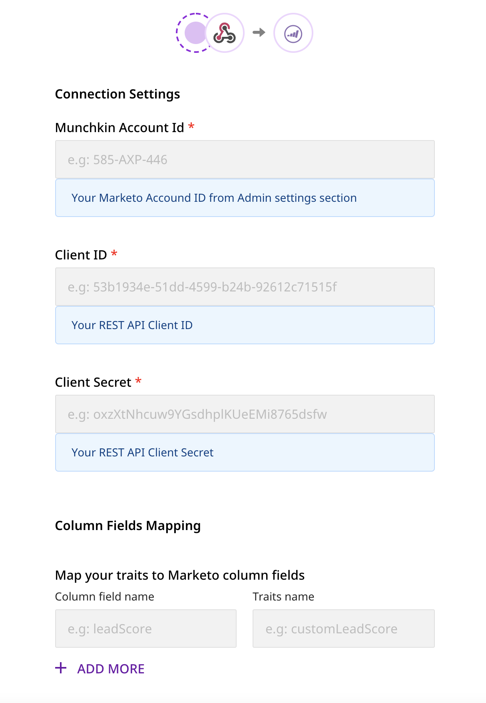

# Marketo Lead Import

[**Marketo**](https://marketo.com) is a leading marketing automation platform that lets you identify the right audiences through effective behavioral tracking. It also lets you enhance their overall product experience through personalized marketing campaigns. Marketo offers cutting-edge email marketing, lead management, and revenue attribution solutions across all major businesses verticals.

RudderStack supports **Marketo Lead Import** as a destination to which you can send your leads seamlessly.

<div class="successBlock">

**Find the open-source transformer code for this destination in our <a href="https://github.com/rudderlabs/rudder-transformer/tree/master/v0/destinations/marketo_bulk_upload">GitHub repo</a>**.
</div>

## Getting Started

To enable sending your leads data to **Marketo Lead Import**, you will need to add it as a destination in RudderStack.

<div class="successBlock">

The most common source can be a <a href="https://rudderstack.com/docs/warehouse-actions/">Warehouse Actions</a> source, as RudderStack only accepts <code class="inline-code">identify</code> events for this destination.
</div>

Before configuring your source and destination on the RudderStack, verify if Marketo supports the source platform by referring to the following table:

| **Connection Mode** | **Web** | **Mobile** | **Server** |
| :--- | :--- | :--- | :--- |
| **Device mode** | **-** | **-** | **-** |
| **Cloud mode** | **Supported** | **Supported** | **Supported** |

<div class="infoBlock">

To know more about the difference between Cloud mode and Device mode in RudderStack, read the <a href="https://rudderstack.com/docs/connections/rudderstack-connection-modes/">RudderStack connection modes</a> guide.
</div>

Once you have confirmed that the platform supports sending events to Marketo Lead Import, follow these steps:

* Choose a source to which you would like to add Marketo Lead Import as a destination.

<div class="infoBlock">

Follow our guide on <a href="https://rudderstack.com/docs/connections/adding-source-and-destination-rudderstack//">Adding a Source and Destination in RudderStack</a> for more information.
</div>

* From the list of destinations, select **Marketo Lead Import**. Assign a name to your destination and then click on **Next**.
* You should then see the following **Connection Settings** page, where you can fill the relevant information and click on **Next** to proceed.

<span class="imageTitle">Marketo Connection Settings in RudderStack</span>

### Connection Settings

The settings to configure Marketo Lead Import as a destination are listed below:

* **Munchkin Account ID**: Enter your Munchkin ID. To get your Munchkin Account ID, log into your Marketo instance and navigate to the **Admin** section. Then, in the left menu, under **Integration**, click on the **Munchkin** option. Your Munchkin Account ID will be listed in the **Tracking Code** section on the main screen.

<div class="infoBlock">

For more information on finding your Munchkin Account ID, refer to the <a href="https://nation.marketo.com/t5/knowledgebase/how-to-find-your-munchkin-id-for-a-marketo-instance/ta-p/248432">Marketo knowledge base</a>.
</div>

* **Client ID**: To get your **Client ID**, go to the the **Admin** section as mentioned above. Then, in the left menu, under **Integration**, click on **LaunchPoint**. Finally, select the API service and click on **View Details** to get your client ID.

<div class="infoBlock">

For more information on finding your Client ID, refer to the <a href="https://developers.marketo.com/rest-api/authentication/">Marketo knowledge base</a>.
</div>

* **Client Secret**: You can find your Marketo client secret next to the **Client ID** obtained in the previous step. 
* **Column Fields Mapping**: This option lets you map your **Leads** table columns' API key values with keys in your incoming events' traits. The values of those traits will be sent correspondingly to the columns.

You can find your columns API key names by following this [**documentation**](https://developers.marketo.com/rest-api/bulk-import/bulk-custom-object-import/).

For instance, if you want to send data from the event traits set as `firstName`, `email` to the Marketo columns with API key names `name` and `Email`, then the mapping should be done as shown in the following table:

| **Column Field Name** | **Traits** |
| :--- | :--- |
| `name` | `firstName` |
| `Email` | `email` |

## Identify

<div class="infoBlock">

RudderStack supports only <code class="inline-code">identify</code> event type for this destination.
</div>

The `identify` call lets you identify a visiting user and associate them to their actions. It also lets you record the traits about them like their name, email address, etc.

<div class="infoBlock">

For more information on the <code class="inline-code">identify</code> call, refer to the <a href="https://rudderstack.com/docs/rudderstack-api/api-specification/rudderstack-spec/identify/">RudderStack Events Specification</a> guide.
</div>

A sample `identify` call is as shown:

```javascript
rudderanalytics.identify("name123", {
  name: "Name Surname",
  firstName: "Name",
  lastName: "Surname",
  email: "name@surname.com",
  createdAt: "Thu Mar 24 2020 17:46:45 GMT+0000 (UTC)",
});
```

The corresponding mapping to the Marketo traits in case of the above event is shown in the following table:

| **Marketo Field Name** | **Traits** |
| :--- | :--- |
| `name` | `firstName` |
| `Email` | `email` |
| `birthday` | `birthday` |
| `phone` | `phone_number` |
| `timestamp` | `createdAt` |

RudderStack sends the following values to Marketo \(corresponding to the sample `identify` call above\):

`name`,`Email`,`birthday`,`phone`,`timestamp`

`Name`,[`name@surname.com`](mailto:name@surname.com),,,`Thu Mar 24 2020 17:46:45 GMT+0000 (UTC)`

## Contact Us

If you come across any issues while configuring or using Marketo Lead Import with RudderStack, you can [**contact us**](mailto:%20docs@rudderstack.com) or start a conversation on our [**Slack**](https://rudderstack.com/join-rudderstack-slack-community) channel.
