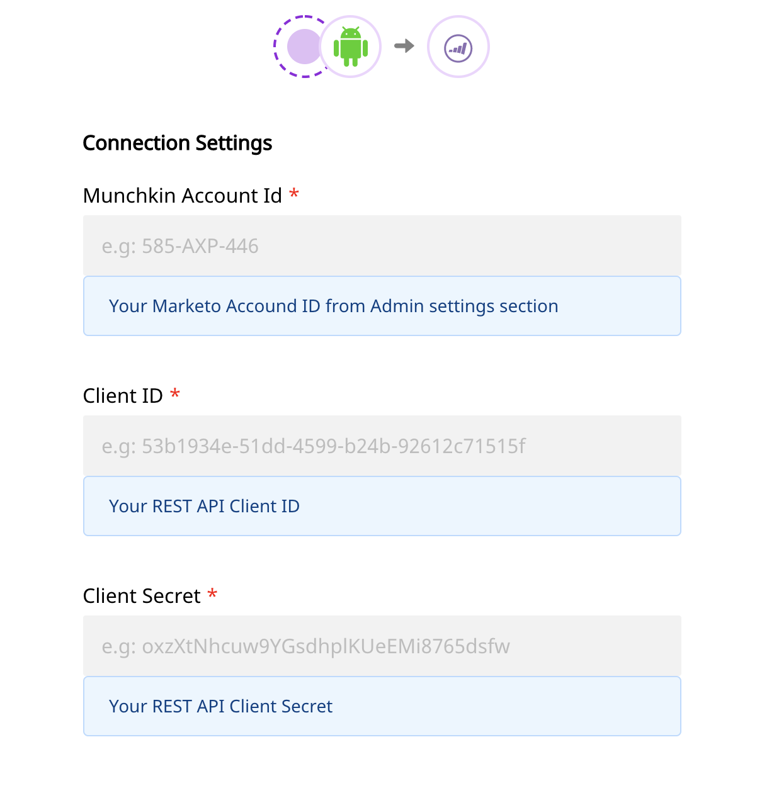
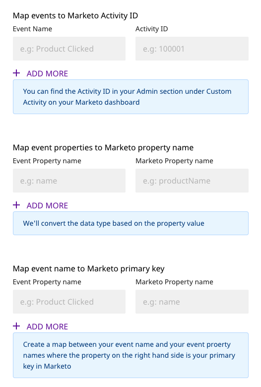

# Marketo

[Marketo](https://marketo.com) is a leading marketing automation platform that allows you to identify the right audiences through effective behavioral tracking, and deliver automated, personalized marketing campaigns to enhance their overall product experience. It also offers cutting-edge email marketing, lead management, and revenue attribution solutions. With Marketo, you can deliver enhanced customer experiences and build customized products for businesses across all spectrum - including tech, healthcare, media, manufacturing, and education.

RudderStack allows you to seamlessly configure Marketo as a destination to which you can send your event data seamlessly.

<div class="successBlock">

  **Find the open-source transformer code for this destination in our <a href="https://github.com/rudderlabs/rudder-transformer/tree/master/v0/destinations/marketo">GitHub repo</a>.**
</div>

## Getting Started

To enable sending data to **Marketo**, you will first need to add it as a destination to the source from which you are sending your event data. Once the destination is enabled, events from RudderStack will start flowing to Marketo.

Before configuring your source and destination on the RudderStack, please verify if the source platform is supported by Marketo, by referring to the table below:

| **Connection Mode** | **Web**       | **Mobile**    | **Server**    |
| :------------------ | :------------ | :------------ | :------------ |
| **Device mode**     | **-**         | **-**         | **-**         |
| **Cloud mode**      | **Supported** | **Supported** | **Supported** |

<div class="infoBlock">

To know more about the difference between Cloud mode and Device mode in RudderStack, read the <a href="https://rudderstack.com/docs/rudderstack-connection-modes/">RudderStack connection modes</a> guide.

</div>

Once you have confirmed that the platform supports sending events to Marketo, please perform the steps below:

- Choose a source to which you would like to add Marketo as a destination.

<div class="infoBlock">

Please follow our <a href="https://rudderstack.com/docs/rudderstack-cloud/connections/">Adding a Source and Destination</a> guide to know how to add a source in RudderStack.

</div>

- Select the destination as **Marketo** to your source. Give your destination a name and then click on **Next**.
- On the **Connection Settings** page, fill all the fields with the relevant information and click **Next**


<span class="imageTitle">Marketo Connection Settings in RudderStack</span>

### Configurable Settings

The following are the settings to be configured:

- **Munchkin Account ID**: You can find the Munchkin Account ID on the Munchkin page by clicking on Admin in the navigation bar. Then, in the menu on the left, under Integration, click on Munchkin. The Munchkin Account Id will be listed in the Tracking Code section on the main screen.
- **Client ID**: To get the Client ID, go to the your Admin settings page following the instructions above. Then, in the menu on the left, under Integration, click on LaunchPoint. Then select the API service and click on "View Details".
- **Client Secret**: You can find the secret next to the ID from the previous step

<div class="infoBlock">

You need to create two fields in Marketo with API names exactly as <code class="inline-code">userId</code> and <code class="inline-code">anonymousId</code>. We lookup the Lead objects using these properties. Without these two fields all the events will fail.

</div>

For configuring the **Custom Activity Settings**, see the instructions below in the Track section.

## Track

We register a custom activity to Marketo for the `track` calls. Before configuring with RudderStack, create the Custom Activities in Marketo.

- Go to your Admin Settings page, then under Database Management, select Marketo Custom Activities.
- Click New Custom Activity and give your activity a Display Name, and a Filter and Trigger.
- When the Primary Field form shows up, enter in a Display Name and confirm the API Name. Then you can press Submit to create the Custom Activity. You will also need to approve the activity in order to get the Custom Activity ID.

Now you can configure the settings in the RudderStack Dashboard.



- For the **Map events to Marketo Activity ID** input, you will map the event name that you call in your app to the Activity ID that you just created in the steps above.
- For the **Map event properties to Marketo property name** input, you will match the property names of the source's track call, with the associated Marketo property name from the fields listed in your Custom Activity created above.
- Finally, for the **Map event name to Marketo primary key** input, you will match the source's track event name to the Marketo Primary Key for the associated Custom Activity you created above.

A sample `track` call is as shown in the snippet below:

```javascript
rudderanalytics.track("Order Completed", {
  checkout_id: "C324532",
  order_id: "T1230",
  value: 15.98,
  revenue: 16.98,
  shipping: 3.0,
  coupon: "FY21",
  currency: "INR",
})
```

## Identify

We create or update a Lead object in Marketo through an `identify` request. By default we map the following `traits` to relevant fields in Marketo. For rest of the fields you want to sync with Marketo, you need to create a mapping of your `traits` field name and the `customFieldName` from your Marketo dashboard.

| Marketo Field Name   | RudderStack Trait Name   |
| :------------------- | :----------------------- |
| `City`               | `address.city`           |
| `Company`            | `company.name`           |
| `Country`            | `address.country`        |
| `Email`              | `email`                  |
| `FirstName`          | `firstName`              |
| `Industry`           | `company.industry`       |
| `LastName`           | `lastName`               |
| `OriginalSourceInfo` | `leadSource`             |
| `NumberOfEmployees`  | `company.employee_count` |
| `Phone`              | `phone`                  |
| `PostalCode`         | `address.zip`            |
| `Rating`             | `rating`                 |
| `State`              | `address.state`          |
| `Address`            | `address.street`         |
| `Title`              | `title`                  |
| `DateofBirth`        | `birthday`               |
| `Website`            | `website`                |

A sample `identify` call is as shown:

```javascript
rudderanalytics.identify("name123", {
  name: "Name Surname",
  first_name: "Name",
  last_name: "Surname",
  email: "name@surname.com",
  createdAt: "Thu Mar 24 2020 17:46:45 GMT+0000 (UTC)",
})
```

## FAQs

### Why are my requests failing with the message "Lookup failed"?

Please make sure that you've created two fields in Marketo with the names `userId` and `anonymousId` so that RudderStack can lookup the `Lead` database for `leadId` with the `userId` passed along with the event.

### Why are my track events failing?

Please check whether you've turned off the `Track Anonymous Id` settings on the dashboard. If the setting is turned off and you are not sending an `userId` along with your event, the events will fail.

## Contact Us

If you come across any issues while configuring or using Marketo with RudderStack, please feel free to [contact us](mailto:%20docs@rudderstack.com). You can also start a conversation in our [Slack](https://rudderstack.com/join-rudderstack-slack-community) community; we will be happy to talk to you!
