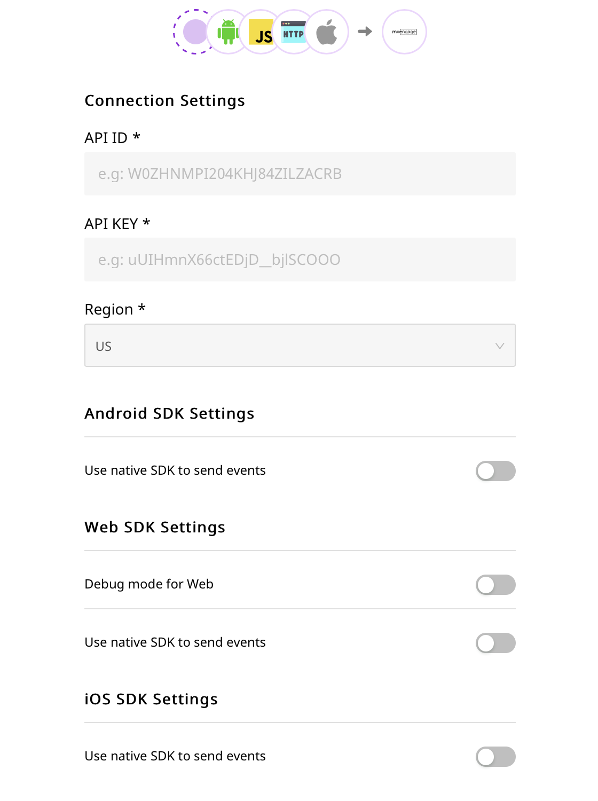

# MoEngage

MoEngage is an intelligent customer engagement platform that allows you to effectively engage with your customers throughout their product journey. It allows you to track and map your customer life-cycle across various touchpoints, and optimize their customer experience at each stage.

With MoEngage, you can effectively deliver personalized communication to your customers and thereby increase overall customer engagement and audience retention.

RudderStack now supports MoEngage as a destination to seamlessly send your event data in real-time.


**Find the open-source transformer code for this destination in our **[**GitHub repo**](https://github.com/rudderlabs/rudder-transformer/tree/master/v0/destinations/moengage)**.**


## Getting Started

Before configuring your source and destination on the RudderStack, please verify if the source platform is supported by MoEngage, by referring to the table below:

| **Connection Mode** | **Web**       | **Mobile**    | **Server**    |
| ------------------- | ------------- | ------------- | ------------- |
| **Device Mode**     | **Supported** | **Supported** | **-**         |
| **Cloud Mode**      | **Supported** | **Supported** | **Supported** |


To know more about the difference between Cloud mode and Device mode in RudderStack, read the [RudderStack connection modes](https://docs.rudderstack.com/get-started/rudderstack-connection-modes) guide.


Once you have confirmed that the platform supports sending events to MoEngage, perform the steps below:

* From your [RudderStack dashboard](https://app.rudderlabs.com), add the source. From the list of destinations, select **MoEngage**.


 Please follow our guide on [How to Add a Source and Destination in RudderStack](https://docs.rudderstack.com/how-to-guides/adding-source-and-destination-rudderstack) to add a source and destination in RudderStack.


* Give a name to the destination and click on **Next**. You should then see the following screen:



In the Connection Settings on the RudderStack dashboard, please enter the MoEngage **API ID**, **API Key**, and **Region**, as shown above. 

By turning on the native SDK switch under Android SDK Settings on the RudderStack dashboard you can enable Rudder Stack Device Mode for **Android** Sources. Similarly for **Web** Under Web SDK Settings and **IOS** under iOS SDK Settings.


Choose `EU` in the `Region` field to send your event data to the MoEngage Europe server. To send your event data to the MoEngage India server, choose `IND`.


## Adding Device Mode Integration



Follow these steps to add MoEngage to your iOS project:

* Go your `Podfile` and add the `Rudder-Moengage` extension

```
pod 'Rudder-Moengage'
```

* After adding the dependency followed by `pod install` , you can add the imports to your `AppDelegate.m` file as shown:

```
#import "RudderMoengageFactory.h"
```

* Finally, change the initialization of your `RudderClient` as shown:

```
RudderConfigBuilder *builder = [[RudderConfigBuilder alloc] init];
[builder withDataPlaneUrl:DATA_PLANE_URL];
[builder withFactory:[RudderMoengageFactory instance]];
[RudderClient getInstance:WRITE_KEY config:[builder build]];
```



## Adding Dependencies

To add MoEngage to your Android Project and enable its full functionality like push notifications, please follow these steps :

* Open your `app/build.gradle` (Module: app) file, and add the following:

```javascript
repositories {
    mavenCentral()
}
```

* and add the following under the dependencies section

```javascript
implementation 'com.rudderstack.android.sdk:core:1.+'
implementation 'com.rudderstack.android.integration:moengage:1.0.0'
api 'com.moengage:moe-android-sdk:10.5.00'

//jet pack library required by moengage
implementation 'androidx.core:core-ktx:1.3.2'
implementation 'androidx.appcompat:appcompat:1.2.0'
implementation 'androidx.lifecycle:lifecycle-process:2.2.0'

//firebase messaging dependency
implementation 'com.google.firebase:firebase-messaging:21.0.0'

// if you don't have Gson included already
implementation 'com.google.code.gson:gson:2.8.6'
```

* Also, add the below plugin after `buildscript`

```javascript
// For Push Notification
apply plugin: 'com.google.gms.google-services'
```

* Open your `build.gradle` (Module: Project) file and add the following in `buildscript` dependencies

```javascript
// For Push Notification
buildscript {
    dependencies {
        classpath 'com.google.gms:google-services:4.3.4'
    }
}
```

* Initialize the Rudder SDK in the `Application` class's  `onCreate()` method as following:

```javascript
// initializing Rudder SDK
val rudderClient = RudderClient.getInstance(
    this,
    WRITE_KEY,
    RudderConfig.Builder()
        .withDataPlaneUrl(DATA_PLANE_URL)
        .withFactory(MoengageIntegrationFactory.FACTORY)
        .build()
)
```

* Also, Initialize the MoEngage SDK in the Application class's onCreate() method as following: 

```javascript
// this is the instance of the application class 
// and "XXXXXXXXXXX" is the APP ID from the dashboard.
val moEngage = MoEngage.Builder(this, "XXXXXXXXXXX")
        .build()
MoEngage.initialise(moEngage)
```



## Identify

To identify a user to MoEngage, you need to call the `identify` API.


For information on the `identify` call, please refer to our [RudderStack API Specification](https://docs.rudderstack.com/rudderstack-api-spec) guide.


MoEngage needs a unique identifier to identify a user. So, if you provide `userId` in your `identify` call, RudderStack passes it as that `customer_id` . Otherwise, it sends an `anonymousId` if a `userId` is not present. 

You can also create  a new user property or update existing user properties of the users using the `identify` API.

A sample identify call is as shown:

```javascript
rudderanalytics.identify("name123", {
  name: "Name Surname",
  first_name: "Name",
  last_name: "Surname",
  email: "name@surname.com",
  createdAt: "Thu Mar 24 2020 17:46:45 GMT+0000 (UTC)",
});
```


Identify api will be used to **Login** the user into MoEngage in **Device **Mode


### MoEngage Reserved Properties

The following property names are reserved by MoEngage:

* `name`
* `first_name`
* `last_name`
* `email`
* `age`
* `gender`
* `mobile`
* `transactions`
* `revenue`
* `moe_unsubscribe`


You may create custom properties but you should not create properties with the following names `"`**`id`**`"`, `"`**`_id`**`"`, or `""` .


### Identifying a Device to MoEngage

You can also identify a device to MoEngage , using the `identify` API. With this API, you can create new properties  or update the existing properties of the device.

A sample call for identifying device is as shown: 

```javascript
rudderanalytics.identify("name123", {
  context: {
    device: {
      id: "7ase32188a4dab669f",
      manufacturer: "Apple",
      model: "IOS SDK built for x86",
      name: "generic_x86",
      token: "devtoken",
      type: "ios",
    },
  },
});
```

## Track

To track your users' actions, you can use the RudderStack `track` API. You can call `track` with `eventname` and the associated properties. 


For information on the `track` call, please refer to our [RudderStack API Specification](https://docs.rudderstack.com/rudderstack-api-spec) guide.


A sample `track` call is as shown:

```javascript
rudderanalytics.track("Order Completed", {
  checkout_id: "C324532",
  order_id: "T1230",
  value: 15.98,
  revenue: 16.98,
  shipping: 3.0,
  coupon: "FY21",
  currency: "INR",
  products: [
    {
      product_id: "product-mixedfruit-jam",
      sku: "sku-1",
      category: "Food",
      name: "Food/Drink",
      brand: "Sample",
      variant: "None",
      price: 10.0,
      quantity: 2,
      currency: "INR",
      position: 1,
      value: 6.0,
      typeOfProduct: "Food",
      url: "https://www.example.com/product/bacon-jam",
      image_url: "https://www.example.com/product/bacon-jam.jpg",
    },
  ],
});
```

## Alias

The Alias api is used to merge two different profiles of a same user into a single profile. 

Alias call can be done only through mobile sdks.

For more information, please refer to our [RudderStack API Specification](https://docs.rudderstack.com/rudderstack-api-spec) guide.



Run the following command to implement the `alias` method in your iOS project:

```javascript
[[RSClient sharedInstance]  alias:@"newId"];
```



Run the following command to implement the `alias` method in your Android project:

```javascript
rudderClient.alias("newId")
```



## Reset

The reset method resets the previously identified user and the related information. For more information, please refer to our [RudderStack API Specification](https://docs.rudderstack.com/rudderstack-api-spec) guide.



Run the following command to implement the `reset`method in your iOS project:

```javascript
[[RSClient sharedInstance] reset];
```



Run the following command to implement the `reset`method in your Android project:

```javascript
rudderClient.reset();
```




**RESET** api is applicable only for **Device** Mode Connections


## Configuring Push Notifications



* To send push notifications in iOS an APNS certificate needs to be created and has to be converted to `.pem` file.
* This `.pem` file needs to be uploaded in the MoEngage dashboard.
* In the target app turn on App Groups and enable one of the App group ids, in case if you don't have an App Group ID then create one. The name of your app group should be `group.{bundle id}.MoEngage`.
* Turn on Background mode and set/enable Remote Notification.
* Turn on push notification capabilities in your app.
* Before initializing add `[MoEngage setAppGroupID:<your app group id>];`
* In case if you would like to keep the notifications even after the App Launch then : `[MoEngage sharedInstance].disableBadgeReset = true;`


For more detailed steps please follow [MoEngage guidelines here](https://docs.moengage.com/docs/push-notification-implementation).


### In-App messaging

In-app messaging is a type of mobile messaging where the notification is displayed within the app. Some examples include popups, yes/no prompts, interstitials, and more. To implement this please follow this guide: [**InApp NATIV**](https://docs.moengage.com/docs/in-app-nativ)**.**



Copy the Server Key from the FCM console and add it to the MoEngage Dashboard(Not sure where to find the Server Key refer to [Getting FCM Server Key](https://docs.moengage.com/docs/getting-fcmgcm-server-key). To upload it, go to the [Settings Page](https://app.moengage.com/v3/#/settings/push/mobile) and add the Server Key and package name.\
**Please make sure you add the keys both in the Test and Live environment.**

Before configuring MoEngage SDK for receiving push notifications please make you have configured Firebase in your application, if not done already refer to the [documentation](https://firebase.google.com/docs/android/setup) and complete setup.\
Also, make sure you have added the Firebase Messaging dependency in your application `build.gradle` file.

### Adding meta for push notification

To show push notifications you need to add the notification small icon and large icon along with the AppId to the `MoEngage.Builder`

```javascript
val moEngage = MoEngage.Builder(this, "XXXXXXXX")
        .setNotificationSmallIcon(R.drawable.icon)
        .setNotificationLargeIcon(R.drawable.ic_launcher)
        .build()
MoEngage.initialise(moEngage)
```

For showing Push notifications there are 2 important things 

1. Registration for Push, i.e. generating push token.
2. Receiving the Push payload from Firebase Cloud Messaging(FCM) service and showing the notification on the device.\
   The above can either be handled by the application or MoEngage SDK. There is some configuration required based on whether the above-mentioned things are handled by the application or SDK.

### Push Registration and Receiving handled by App

By default, MoEngage SDK attempts to register for push token, since your application is handling push you need to opt-out of SDK's token registration.

#### How to opt-out of MoEngage Registration?

To opt-out of MoEngage's token registration mechanism call in the `optOutTokenRegistration()` on the `MoEngage.Builder` as shown below

```javascript
val moEngage = MoEngage.Builder(this, "XXXXXXXX")
        .setNotificationSmallIcon(R.drawable.icon)
        .setNotificationLargeIcon(R.drawable.ic_launcher)
        .configureFcm(FcmConfig(false))
        .build()
MoEngage.initialise(moEngage)
```

#### Pass the Push Token To MoEngage SDK

The Application would need to pass the Push Token received from FCM to the MoEngage SDK for the MoEngage platform to send out push notifications to the device. Use the below API to pass the push token to the MoEngage SDK.

```javascript
MoEFireBaseHelper.getInstance().passPushToken(applicationContext,token)
```

_Note:_ Please make sure token is passed to MoEngage SDK whenever push token is refreshed and on application update. Passing token on application update is important for migration to the MoEngage Platform.

#### Passing the Push payload to the MoEngage SDK

To pass the push payload to the MoEngage SDK call the MoEngage API from the `onMessageReceived()` from the Firebase receiver.\
Before passing the payload to the MoEngage SDK you should check if the payload is from the MoEngage platform using the helper API provided by the SDK.

```javascript
if (MoEPushHelper.getInstance().isFromMoEngagePlatform(remoteMessage.data)) {
  MoEFireBaseHelper.getInstance()
    .passPushPayload(applicationContext, remoteMessage.data)
} else {
  // your app's business logic to show notification
}
```

### Push Registration and Receiving handled by SDK

Add the below code in your manifest file within the application tag

```javascript
<service android:name="com.moengage.firebase.MoEFireBaseMessagingService">
    <intent-filter>
        <action android:name="com.google.firebase.MESSAGING_EVENT" />
    </intent-filter>
</service>
```

When MoEngage SDK handles push registration it optionally provides a callback to the Application whenever a new token is registered or token is refreshed.\
An application can get this callback by implementing `FirebaseEventListener` and registering for a callback in the Application class'  `onCreate()`using `MoEFireBaseHelper.getInstance().setEventListener()`

### In-App messaging:

In-app messaging is a type of mobile messaging where the notification is displayed within the app. Examples include popups, yes/no prompts, interstitials, and more. To implement this please follow: [ **InApp NATIV**](https://docs.moengage.com/docs/configuring-in-app-nativ)****



* Go to [Web Push Settings](http://app.moengage.com/v3/#/settings/4/0).
* Under Web fill in the details as required.
* For HTTPS Web Push to work, you need to host two files in the `root` directory of your web server.
* After clicking **SAVE**, please proceed to download `serviceworker.js` file. Under [Web Push Settings](http://app.moengage.com/v3/#/settings/4/0).
* In case you already have your own serviceworker.js add :

```javascript
importScripts("https://cdn.moengage.com/webpush/releases/serviceworker_cdn.min.latest.js");
```

* HTTP :\
  Select a sub-domain. 

 For more details please follow the [guidelines from MoEngage](https://docs.moengage.com/docs/setting-up-chrome-push).



## Debugging in Web SDK

From the RudderStack [dashboard](htps://app.rudderstack.com), turn on the debug mode to get debug logs. The events will be seen under the **Test **section of the particular app in MoEngage.

## Timezone offset for cloud mode

### Track

MoEngage allows sending the t[ime at which the event occurred](https://docs.moengage.com/docs/data-import-apis#event-api) and calculates the user local time by taking two parameters. `current_time `and `user_timezone_offset` where the `current_time` is **UTC** Time at which the event happened, and `user_timezone_offset` is the difference in seconds between the **user local time and UTC. **


The RudderStack transformer maps the _**current_time** to **timestamp or originalTimestamp** _\
__value from the event payload sent to Rudder server. This value should be passed in **UTC.**



The _**user_timezone_offset**_ is mapped to _**timezone**_ field present under the _**context**_ object of the event payload. This value should be passed as** tz** string.\
Rudder mobile SDKs populate the timezone field by itself. But for other sources like server like SDKs, HTTP api,  the timezone needs to be set explicitly in every request.


Example payload:

```javascript
{
  "type": "track",
  "event": "Email Replied",
  "sentAt": "2020-12-02T11:30:33.262Z",
  "context": {
    "library": {
      "name": "analytics-node",
      "version": "0.0.3"
    },
    "timezone": "Asia/Kolkata"
  },
  "rudderId": "87a40cf3-f6d8-4675-bc01-7854ab4486ec",
  "_metadata": {
    "nodeVersion": "10.22.0"
  },
  "messageId": "node-7519b5f2fcacca521c7a9e8ddb9fc09c-c273004b-6968-422d-a511-440b6db24403",
  "properties": {
    "details": "list of details"
  },
  "anonymousId": "anony11111111111",
  "originalTimestamp": "2020-12-02T11:30:33.259Z"
}
```

### Identify

MoEngage accepts user creation time for its [user endpoint](https://docs.moengage.com/docs/data-import-apis#user-api). This is reflected as `first_Seen` in their dashboard.


The RudderStack transformer maps the _**created_time **_from the _**createdAt**_  spec'd traits in our payload. The value should be in the **ISO 8601** format.\
If the value is not in proper format or not present, MoEngage will put in the value by itself.


An example payload is as shown:

```javascript
{
  "type": "identify",
  "sentAt": "2020-12-02T13:04:05.953Z",
  "traits": {
    "city": "Bangalore",
    "name": "lolo",
    "email": "lolo@website.com",
    "country": "India",
    "createdAt": "2020-12-02T12:29:53.872Z"
  },
  "userId": "111its111",
  "context": {
    "traits": {
      "city": "Bangalore",
      "name": "lolo",
      "email": "lolo@website.com",
      "country": "India",
      "createdAt": "2020-12-02T12:29:53.872Z"
    },
    "library": {
      "name": "analytics-node",
      "version": "0.0.3"
    }
  },
  "rudderId": "754fe90e-89fb-4d71-9d11-3ec2b91b5777",
  "_metadata": {
    "nodeVersion": "10.22.0"
  },
  "messageId": "node-1a585828272cf1116407aaf6be3921f2-65c1670e-f4e1-4283-a7a5-0a60825c4f83",
  "originalTimestamp": "2020-12-02T13:04:05.951Z"
}
```

## FAQs

#### **Where can I find my MoEngage API ID and API KEY?**

You can find your MoEngage API ID and API KEY in your [moengage.com](https://www.moengage.com) account under **Settings** > **APIs** > [**DATA API Settings**](https://app.moengage.com/v3/#/settings/1/0).

#### Where can I see the events that are going to MoEngage? 

If your app is in debug mode then you can see under Test otherwise you can see under Live. \
Go to For developers --> Recent Events.

## Contact Us

If you come across any issues while configuring or using MoEngage with RudderStack, please feel free to [contact us](mailto:%20docs@rudderstack.com). You can also start a conversation on our [Slack](https://resources.rudderstack.com/join-rudderstack-slack) channel; we will be happy to talk to you!
