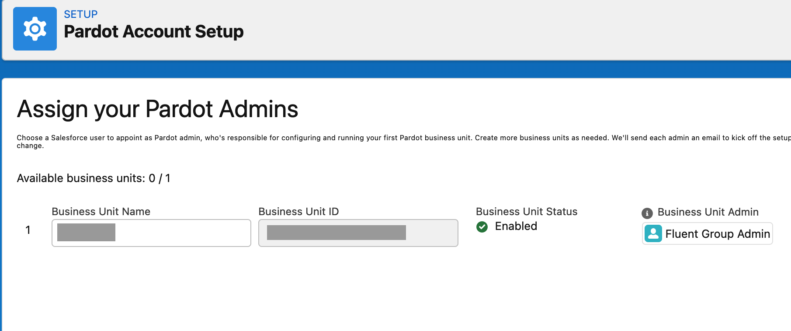
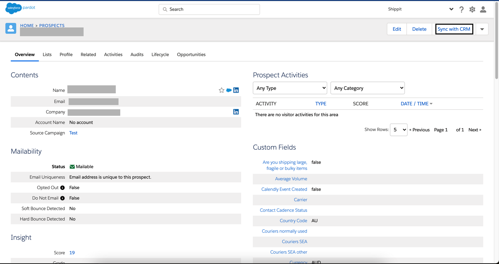

# Pardot

[Pardot](https://www.pardot.com/) is a Salesforce product and a marketing automation solution that enables organizations to track and measure the effectiveness of their communications, gain insight into user behavior, and personalize content across campaigns based on any specific criteria.

RudderStack supports Pardot as a destination to which you can seamlessly send your event data.

<div class="successBlock">

  <strong>Find the open-source transformer code for this destination in our <a href="https://github.com/rudderlabs/rudder-transformer/tree/master/v0/destinations/pardot">GitHub repo</a></strong>.
</div>

## Getting started

Before configuring Pardot as a destination in RudderStack, verify if the source platform is supported by Pardot by referring to the table below:

| **Connection Mode** | **Web**       | **Mobile**    | **Server**    |
| :------------------ | :------------ | :------------ | :------------ |
| **Device mode**     | -             | -             | -             |
| **Cloud mode**      | **Supported** | **Supported** | **Supported** |

<div class="infoBlock">

To know more about the difference between cloud mode and device mode in RudderStack, refer to the <a href="https://rudderstack.com/docs/connections/rudderstack-connection-modes/">RudderStack Connection Modes</a> guide.
</div>

Once you have confirmed that the source platform supports sending events to Pardot, follow these steps:

- From your [**RudderStack dashboard**](https://app.rudderstack.com/), add the source. Then, from the list of destinations, select **Pardot**.

<div class="infoBlock">

Follow our guide on <a href="https://rudderstack.com/docs/connections/adding-source-and-destination-rudderstack/">Adding a Source and Destination in RudderStack</a> for more information.
</div>

## Connection settings

To successfully configure Pardot as a destination, you will need to configure the following settings:


- **Business Unit Id**: Your **Business Unit ID** is the 18 character long string starting with `0Uv`. You can find it in your **Salesforce** account by following the steps listed below:
  1. Go to **Setup** at the top right corner and click on **Pardot**. 
  2. Click on **Pardot Account Setup** to obtain the Business Unit ID.



- **Campaign Id**: You can find the Campaign ID (or piCId) under **Marketing** > **Campaigns** in your Pardot account. After selecting the desired website campaign, click on **View Tracking Code**.

<div class="infoBlock">
  
Alternatively, you can go to the <a href="https://pi.pardot.com/campaign">Pardot campaigns</a> and select the desired campaign from the list. The last 5 digits of the campaign URL is your campaign ID. For example, <code class="inline-code">12345</code> is the campaign ID for the campaign URL <code class="inline-code">https://pi.pardot.com/campaign/read/id/12345</code> .

</div>

## Identify

The `identify` call lets you capture the details of a visiting user along with any associated traits such as their name, email address, etc.

A sample `identify` call is shown below:

```javascript
rudderanalytics.identify("userId", {
  "active_seats": 6,
  "salutation": "Mr",
  "firstName": "Alex",
  "lastName": "Keener",
  "email": "alex@example.com",
  "website": "https://www.example.com",
  "score": 16,
  "company": "Example Organization",
  "job_title": "Sales Executive",
  "department": "Sales",
  "country": "USA",
  "address": {
    "street": "6649 N Blue Gum Street",
    "city": "New Orleans",
    "state": "LA",
    "zip": "00000"
  },
  "phone": "8005550100",
  "annual_revenue": "100000",
  "employees": "100",
  "industry": "Technology sector",
  "notes": "example notes",
  "address_two": "example address",
  "fax": "fax321",
  "years_in_business": 13,
  "comments": "good",
  "is_do_not_email": false,
  "opted_out": false,
  "is_reviewed": false,
  "is_starred": true,
  "territory": "territory",
  "campaign_id": 12345
}, {
  externalId: [{
    type: "crmfid", // can be pardotid for sending pardot ID
    id: "crmFidUser",
  }]
});
```
The following behavior can be observed whenever an `Identify` call is made through RudderStack:
* RudderStack throws an error if either `email` or `externalId` (`crmfid`/`pardotid`) is absent.
* RudderStack calls the update API if `email` is absent but either `pardotid` or `crmfid` is present. However, if `pardotid` and `crmfid` are not already linked to a prospect, it throws an error.
* RudderStack throws an error if `email` is absent and `prospectid` or `crmfid` is entered incorrectly.
* If only `email` is present, or Pardot already contains more than one prospect with the same email ID, a new prospect is created as Pardot does not allow write operation on email IDs.
* RudderStack considers only the first `externalId` in case of multiple `externalId`.


## FAQ

### How do I find the crmfid (used for upsert operation)?
You can find the crmfid (CRM Lead ID) under any **Prospect** by clicking on **Sync with CRM** as shown below:


The CRM Lead ID can be located here:


### How do I update a prospect's data?

To update the prospect data, you need to send a payload that contains `externalId` in the payload as shown below:
```javascript
// Sample payload with `id` data for update
{
  "externalId": [{
    "type": "pardotid"
    "id": "12345",
  }]
}
```
- `type` field can contain either of the below:
  - Pardot ID with field name as `pardotid`
  - CRM FID with field name as `crmfid`
- `id` field contains the actual value

### Can I send event data to Pardot's Sandbox environment?

Unfortunately, you can currently send event data only to the Pardot's **Production** environment and not **Sandbox**.

## Contact us

For queries on any of the sections covered in this guide, you can [**contact us**](mailto:%20docs@rudderstack.com) or start a conversation in our [**Slack**](https://rudderstack.com/join-rudderstack-slack-community) community.
