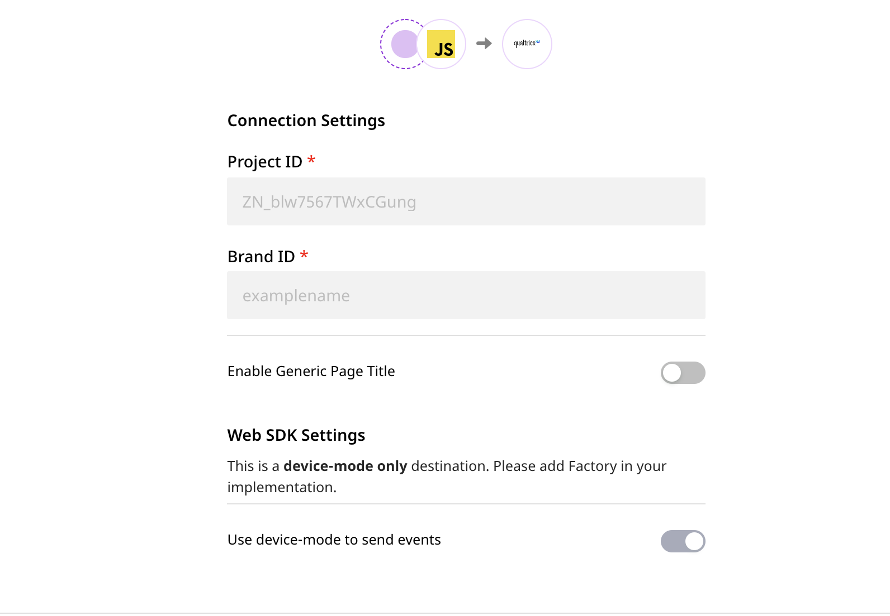

# Qualtrics Website Feedback

[**Qualtrics**](https://www.qualtrics.com/au/core-xm/survey-software/) is a popular survey software that lets you create intelligent, real-time user surveys. It lets you get cutting-edge insights into your customers and use them to boost your brand value.

RudderStack supports Qualtrics as a [**website feedback destination**](https://api.qualtrics.com/sdks/docs/SDKs/Web%20Intercept%20SDK/web-feedback-javascript-api-reference-1.md) to which you can send your event data directly.

## Getting Started

Before configuring Qualtrics as a destination in RudderStack, verify if Qualtrics supports the source platform you are sending the events from. Refer to the following table:

| **Connection Mode** | **Web**       | **Mobile** | **Server** |
| :------------------ | :------------ | :--------  | :--------- |
| **Device mode**     | **Supported** | -          | -          |
| **Cloud mode**      | -             | -          | -          |


To know more about the difference between Cloud mode and Device mode in RudderStack, read the [**RudderStack connection modes**](https://docs.rudderstack.com/get-started/rudderstack-connection-modes) guide.


Once you have confirmed that the source platform supports sending events to Qualtrics, follow these steps:

* From your [**RudderStack dashboard**](https://app.rudderstack.com/), add the source and select **Qualtrics** from the list of destinations.


Follow our guide on [**How to Add a Source and Destination in RudderStack**](https://docs.rudderstack.com/how-to-guides/adding-source-and-destination-rudderstack) for more information.




### Configuration Settings

To successfully configure Qualtrics as a destination, you will need to configure the following settings:

* **Project ID:** Enter your Qualtrics Project ID here.

* **Brand ID:** Enter your Qualtrics Brand ID here.


Refer to the **FAQ** section below for steps on how to get your Qualtrics Project ID and Brand ID.


* **Enable Generic Page Title:** If this field is enabled, RudderStack sends every `page` call with the name `Viewed a Page`.


This field useful only when you are using `page` call. 



If this option is disabled, RudderStack will search for the category and name of the `page` call and send the event as `Viewed <category_field> <name_field> Page`. If any of the two fields is absent, RudderStack sends the `page` call as `Viewed <category_field>/<name_field> Page`.


## Page

The `page` call lets you track how many times a user performs certain actions. RudderStack passes any tracked events as embedded data to the Qualtrics [**intercept**](https://www.qualtrics.com/support/website-app-feedback/getting-started-with-website-app-feedback/step-4-setting-up-your-intercept/) target. After the `page` call, the Qualtrics survey is loaded.


You can set the intercepts when a user creates the project or after they have created the project.


A sample `page` call is as shown:

```javascript
rudderanalytics.page("category", "name", {
  path: "path",
  url: "url",
  title: "title",
  search: "search",
  referrer: "referrer",
  testDimension: "true"
});
```

For the above example, The event will be sent as `Viewed category name Page`, if the **Generic Page Title** option is disabled in the RudderStack dashboard. If this option is enabled, the event will be sent as `Viewed a Page`.

If the category field is not mentioned in the `page` call but specified inside the properties, RudderStack still includes the field while sending the event. For example, refer to the following snippet:

```javascript
rudderanalytics.page( "name", {
    category: "category",
    path: "path",
    url: "url",
    title: "title",
    search: "search",
    referrer: "referrer",
    testDimension: "true"
});
```

For the above example, the event will be sent as `Viewed category name Page`, if the **Generic Page Title** option is disabled in the RudderStack dashboard. If it is enabled, the event will be sent as `Viewed a Page`.


If `category` is not specified in the event at all, RudderStack sends the event with only the page name, as shown below:

```javascript
rudderanalytics.page( "name", {
    path: "path",
    url: "url",
    title: "title",
    search: "search",
    referrer: "referrer",
    testDimension: "true"
});
```

For the above example, The event will be sent as `Viewed name Page`, if the **Generic Page Title** option is disabled in the RudderStack dashboard. If enabled, the event will be sent as `Viewed a Page`.


If both the name and category fields are absent in the `page` call and the **Generic Page Title** option is disabled, RudderStack will not send the event to Qualtrics.


## Track

The `track` call lets you track how many times a user performs certain actions. RudderStack passes any tracked events as embedded data to the Qualtrics [**intercept**](https://www.qualtrics.com/support/website-app-feedback/getting-started-with-website-app-feedback/step-4-setting-up-your-intercept/) target. After the `track` call, the Qualtrics survey is loaded.


At the destination end, i.e. Qualtrics, both `page` and `track` calls have the same functionality.



You can set the intercepts when a user creates the project or after they have created the project.


In this case, the value of event field of the `track` call will be used as the event name while sending it to Qualtrics.

A sample `track` call is as shown:

```javascript
rudderanalytics.track("Test Event");
```

In the above example, the event will be sent to Qualtrics as `Test Event`. 

## FAQ

### How do I get my Project ID and Brand ID?

To get your Qualtrics Project ID and Brand ID, follow these steps:

* Log into your [**Qualtrics account**](https://login.qualtrics.com/login?lang=au).
* Click on the project you will be using.
* Click on **Settings** tab, followed by **Manage Project** option (the right-most dropdown menu in the dashboard).


* Click on **Project ID's**. Here you will find both your Project ID and Brand ID, as shown:


## Contact Us

For questions on any of the sections covered in this guide, feel free to [**contact us**](mailto:docs@rudderstack.com) or start a conversation on our [**Slack**](https://resources.rudderstack.com/join-rudderstack-slack) channel.
