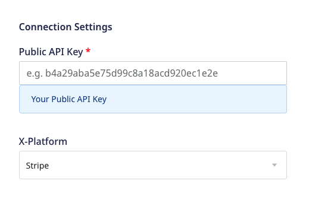
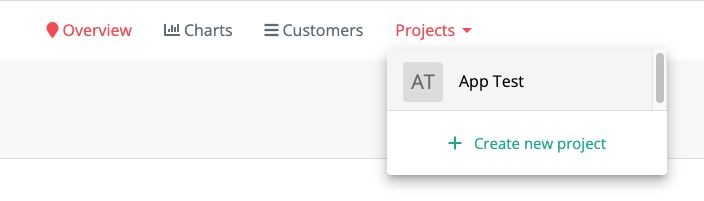
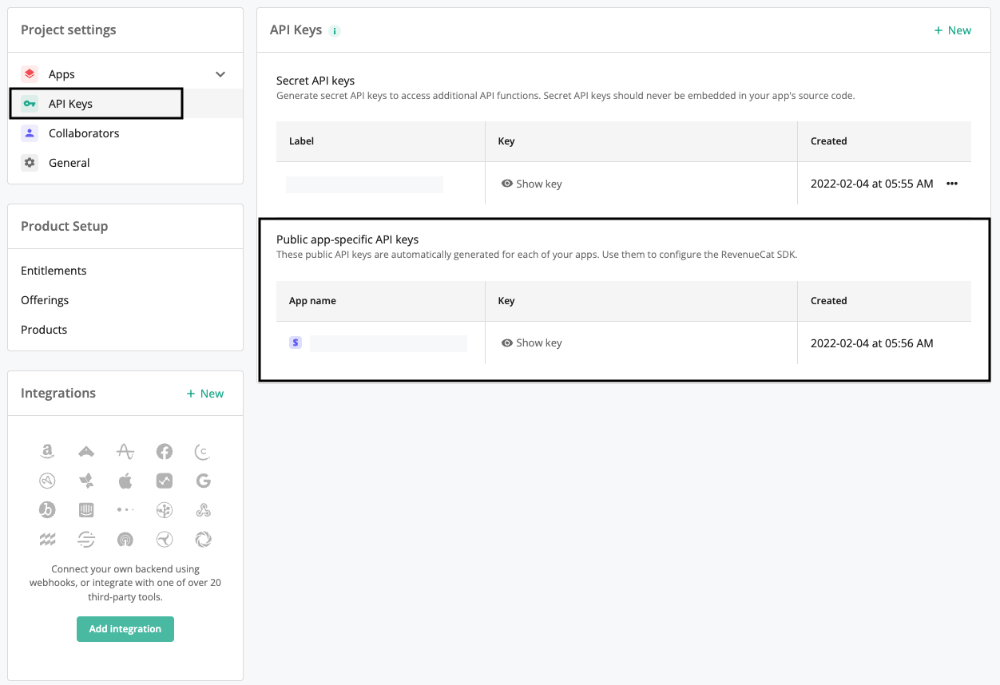

# Revenue Cat

[Revenue Cat](https://www.revenuecat.com/) is an in-app subscription platform that lets you analyze and grow your cross-platform app subscriptions.

RudderStack supports Revenue Cat as a destination to which you can seamlessly send your event data.

## Getting started

Before configuring Revenue Cat as a destination in RudderStack, verify if the source platform is supported by Revenue Cat by referring to the table below:

| **Connection Mode** | **Web** | **Mobile** | **Server** |
| :--- | :--- | :--- | :--- |
| **Device mode** | - | - | - |
| **Cloud mode** | **Supported**  | **Supported** | **Supported** |

<div class="infoBlock">
    
To know more about the difference between cloud mode and device mode in RudderStack, refer to the <a href="https://rudderstack.com/docs/rudderstack-cloud/rudderstack-connection-modes/">RudderStack Connection Modes</a> guide.
</div>

Once you have confirmed that the source platform supports sending events to Revenue Cat, follow these steps:

1. From your [RudderStack dashboard](https://app.rudderstack.com/), add a source. Then, from the list of destinations, select **Revenue Cat**.
2. Assign a name to the destination and click on **Next**.

### Connection settings

To successfully configure Revenue Cat as a destination, you will need to configure the following settings:



- **Public API Key**: Enter your Revenue Cat public API key.

<div class="infoBlock">

For more information on getting your Revenue Cat public API key, refer to the <a href="#faq">FAQ</a> section below.
</div>

- **X-Platform**: Select your app platform from the dropdown.

## Identify 

The [`identify`](https://www.rudderstack.com/docs/rudderstack-api/api-specification/rudderstack-spec/identify/) method lets you identify a user and associate them to their actions. It also lets you record any traits about them like their name, email, etc.

RudderStack uses the `identify` call to create or update new subscribers in Revenue Cat. It maps `userId` to Revenue Cat's `app_user_id` before sending the data via the [`subscribers`](https://docs.revenuecat.com/reference/subscribers) API.

A sample `identify` call is shown below:

```javascript
rudderanalytics.identify("1hKOmRA4GRlm",{
    "email": "alex@example.com"
})
```

## Track

The [`track`](https://www.rudderstack.com/docs/rudderstack-api/api-specification/rudderstack-spec/track/) method lets you capture user events along with the properties associated with them.


### Property mapping

RudderStack maps the following event properties to the corresponding Revenue Cat attributes:

| RudderStack property | Revenue Cat attribute | Comments |
| :-----| :------| :-------|


## FAQ

### Where can I find the Revenue Cat public API key?

To find the Revenue Cat public API key, follow these steps:

1. Log into your [Revenue Cat dashboard](https://app.revenuecat.com/).
2. From the top navigation bar, go to **Projects** and select your app, as shown:



3. Under **Project settings**, select **API Keys**. You will find your public API keys under **Public app-specific API keys**, as shown:



## Contact us

For queries on any of the sections covered in this guide, you can, [contact us](mailto:%20docs@rudderstack.com) or start a conversation in our [Slack](https://rudderstack.com/join-rudderstack-slack-community) community.