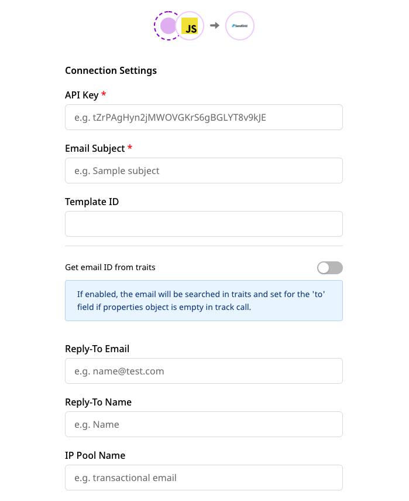
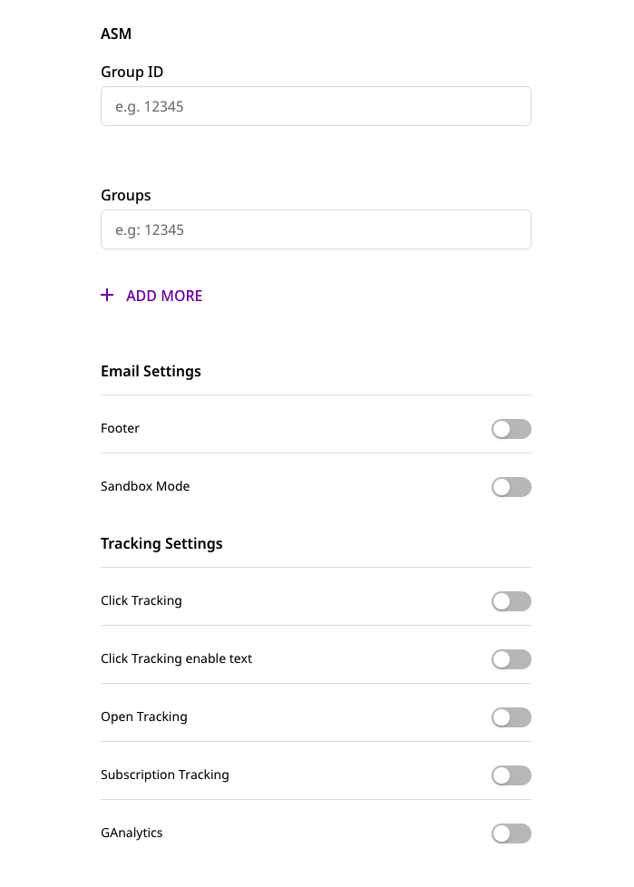

# SendGrid

[**SendGrid**](https://sendgrid.com/) is a cloud-based email marketing platform built for marketers and developers. It helps businesses deliver billions of transactional and marketing emails every month.

RudderStack supports SendGrid as a destination to which you can seamlessly send your customer data.

## Getting started

Before configuring SendGrid as a destination in RudderStack, verify if the source platform is supported by SendGrid by referring to the table below:

| Connection Mode     | Web           | Mobile                 | Server        |
| :------------------ | :------------ | :--------------------- | :-------------|
| **Device mode**     | -             | -                      | -             |
| **Cloud mode**      | **Supported** | **Supported**          | **Supported** |

<div class="infoBlock">
 
 To know more about the difference between cloud mode and device mode in RudderStack, refer to the <a href="https://rudderstack.com/docs/connections/rudderstack-connection-modes/">RudderStack connection modes</a> guide.
</div>

Once you have confirmed that your source platform supports sending events to SendGrid, follow these steps:

* From your [**RudderStack dashboard**](https://app.rudderstack.com/), add the source. From the list of destinations, select **SendGrid**.

<div class="infoBlock">
 
 Follow our guide on <a href="https://rudderstack.com/docs/connections/adding-source-and-destination-rudderstack/">Adding a Source and Destination in RudderStack</a> for more information.
</div>

* Assign a name to the destination and click on **Next**. You should then see the following screen:






### Connection settings

The connection settings required to configure SendGrid as a destination in RudderStack are listed below:

* Enter your SendGrid **API Key**.

<div class="infoBlock">
 
 To get the SendGrid API Key, click <a href="https://app.sendgrid.com/settings/api_keys">here</a>.
</div>

* Enter the **Subject**.

<div class="infoBlock">
 
 You can also send the Email subject via the <code class="inline-code">subject</code> field in the <code class="inline-code">track</code> properties. For more information, refer to the <a href="https://rudderstack.com/docs/destinations/marketing/sendgrid/#track">Track</a> section below.
</div>

* Next, enter the **Template ID**. 

<div class="infoBlock">
 
To get your template ID or create a new one, go to your <a href="https://app.sendgrid.com/">SendGrid dashboard</a>. Then, click on <strong>Email API</strong> and go to <strong>Dynamic Templates</strong>.
</div>

<div class="infoBlock">
 
You can also set the Template ID via the <code class="inline-code">templateId</code> field in the <code class="inline-code">track</code> properties. Note that the template ID passed in the <code class="inline-code">track</code> properties will override the <strong>Template ID</strong> field specified in the RudderStack dashboard.
</div>

* Next, you can enable or disable the **Get email ID by traits** option. If enabled, RudderStack searches for the user's `email` inside the user's `traits`. If it is found, then the event can be sent to SendGrid without any `track` call properties.

<div class="warningBlock">
 
This option is only useful when the properties in the <code class="inline-code">track</code> are empty. SendGrid also requires either the <code class="inline-code">templateId</code> or <code class="inline-code">content</code> to be present for a successful event delivery. 
</div>

* Enter the email address in the **Reply-To Email** option, where the email ID replies or bounces will be returned.

* In **Reply-To Name** , enter the user's name associated with the above email address.

<div class="infoBlock">
 
You can also send the email ID and name inside <code class="inline-code">replyTo</code> in the <code class="inline-code">track</code> properties. Note that these fields will override the <strong>Reply-To Email</strong> and <strong>Reply-To Name</strong> fields set in the RudderStack dashboard.
</div>

<div class="infoBlock">
 
For more information on how to send these details via the <code class="inline-code">replyTo</code> object, refer to the refer to the <a href="https://rudderstack.com/docs/destinations/marketing/sendgrid/#replyto">replyTo</a> section below.
</div>

* Next, enter the **IP Pool Name**.

<div class="infoBlock">
 
The length of the IP Pool Name must be between 2 and 64 characters. For detailed steps on creating the IP pool name, refer to the <a href="https://docs.sendgrid.com/ui/account-and-settings/ip-pools#create-an-ip-pool">SendGrid documentation</a>.
</div>

#### From

* Enter the user's **Email** address through which the email will be sent.

<div class="infoBlock">

For more information on creating a verified sender identity, refer to this <a href="https://docs.sendgrid.com/ui/sending-email/sender-verification">SendGrid documentation</a>.
</div>

* Enter the **Name** associated with above email ID.

<div class="infoBlock">

You can also include <code class="inline-code">email</code> and <code class="inline-code">name</code> inside the <code class="inline-code">from</code> object in the <code class="inline-code">track</code> call (shown below). Note that this will override the <strong>Email</strong> and <strong>Name</strong> fields specified in the RudderStack dashboard.
</div>

```javascript
from:{
    "email": "test@email.com",
    "name": "test"
}
```

#### Event names

* Next, create the list of **events** for which the `track` calls will be made.

<div class="warningBlock">

Any <code class="inline-code">track</code> call made with an event name that is not specified in this list will be <strong>discarded</strong>.
</div>

#### Content

* To specify the **content** of your email, enter the **type** and **value**.

    * The **type** field is the value type to be included in the **value** field.
    * The **value** field contains the actual value that is to be included in the email.

<div class="infoBlock">

The <code class="inline-code">content</code> array can also be sent via <code class="inline-code">track</code> properties (shown below), which will override the dashboard settings.
</div>

```javascript
content: [
    {
        "type": "text/plain",
        "value": "sample text"
    }
]
```

#### Attachments

Use the **Attachments** settings to specify any attachments you want to include in your email. The individual settings are as follows:

* **content**: This should be a Base64-encoded string.

* **type**: The attachment **type** contains the type of content you are attaching e.g. `"text/plain"`, `"text/html"`, etc.

* **filename**: Use this setting to specify the attachment's file name.

* **disposition**: This option specifies how you would like the attachment to be displayed.

* **content ID**: Use this option when **disposition** is set to `inline` and the attachment is an image.

<div class="infoBlock">

SendGrid requires that each attachment element must contain <strong>content</strong> and <strong>filename</strong>. The attachments can also be sent via the <code class="inline-code">track</code> call (shown below), which will override the dashboard settings.
</div>

```javascript
attachments:[
    {
        "content": "base64encodedString",
        "filename": "index.html",
        "type": "text/html",
        "disposition": "attachment"
    }
]
```

#### ASM

The **ASM** settings allow you to handle the user's unsubscribing activity. The configurable options are:

* **Group ID**: This option specifies the unsubscribe group to associate with this email.
 
* **Groups**: This option contains the array of unsubscribing groups that would be displayed in the unsusbcribing preferences page.

<div class="infoBlock">

SendGrid requires that the <strong>Group ID</strong> should always be present if the <code class="inline-code">asm</code> object is to be sent.
</div>

#### Email settings

* To include a default footer in every mail, enable the **Footer** option. When enabled, the **text** option contains the plain content of footer. The **HTML** contains the HTML content of footer.

<div class="infoBlock">

The footer can also be sent via <code class="inline-code">track</code> properties (shown below), which will override the dashboard settings.
</div>

```javascript
mailSettings:{
    "footer": true,
    "footerText": "plain text",
    "footerHtml": "html content"
}
```

* To send a test mail and ensure everything is correct, you can enable the **Sandbox Mode** setting.

<div class="infoBlock">

The sandbox mode can also be enabled or disabled via the <code class="inline-code">track</code> properties (shown below), which will override the dashboard setting.
</div>

```javascript
mailSettings:{
    "sandboxMode": true
}
```

#### Tracking settings

The following table describes the various tracking settings to be configured in the RudderStack dashboard:

| **Setting** | **Description** |
|:--------|:------------|
|**Click Tracking** | Allows you to track if a recipient clicked a link in your email.|
|**Click Tracking enable text** | Indicates if this setting should be included in the text/plain portion of your email. |
|**Open Tracking** |Allows you to track if the email was opened by including a single pixel image in the body of the content. |
|**Substitution Tag** | When **Open Tracking** is enabled, this setting allows you to specify a substitution tag that you can insert in the email body at a specific location.|
|**Subscription Tracking** |Allows you to insert a subscription management link at the bottom of your email's text and HTML bodies. |
|**Text**|When **Subscription Tracking** is enabled, this setting refers to the string to be appended to the email with the subscription tracking link. |
|**HTML**|When **Subscription Tracking** is enabled, this is appended to the email with the subscription tracking link.|
|**Substitution Tag** | Refers to the tag that will be replaced with the unsubscribe URL.|
|**GAnalytics** |Allows you to enable Google Analytics tracking. |
|**utm source** |Refers to the name of the referrer source, e.g. Google. |
|**utm medium** | Refers to the name of the marketing medium, e.g. Email.|
|**utm term**| This setting is used to identify any paid keywords.|
|**utm content**  | Allows you to differentiate your campaign from advertisements.|
|**utm campaign** | Corresponds to the name of the campaign.|

<div class="infoBlock">

The <strong>utm source</strong>, <strong>utm medium</strong>, <strong>utm term</strong>, <strong>utm content</strong>, <strong>utm campaign</strong> options are associated with the <strong>GAnalytics</strong> setting on the dashboard.
</div>

Finally, click on **Next** to complete the setup. SendGrid will now be enabled as a destination in RudderStack.

## Track

The `track` call lets you send an event to SendGrid along with its properties. **Note that the properties specified in the `track` call will override the settings specified in the RudderStack dashboard.**

<div class="warningBlock">

Note that SendGrid requires either the <code class="inline-code">templateId</code> or <code class="inline-code">content</code> to be present in the body. Otherwise, the event will be <strong>discarded</strong>.
</div>

A sample `track` call is shown below:

```javascript
rudderanalytics.track('testing',
      {
          "personalizations": [
          {
            "to": [
              {
                "email": "recipient@email.com",
                "name": "Name"
              }
            ],
            "cc": [
                {
                    "email": "ccUser@gmail.com",
                    "name": "CCUser"
                },
                {
                    "email": "ccUser2@gmail.com",
                    "name": "CCUser2"
                }
            ],
            "subject": "subject"
          }
        ],
        "from": {
            "email": "test@email.com",
            "name": "Name here"
        },
        "attachments":[
            {
                "content": "base64encodedString",
                "filename": "index.html",
                "type": "text/html",
                "disposition": "attachment"
            }
        ],
        "content":[
            {
                "type": "text/html",
                "value": "<p>Hello</p>"
            }
        ],
        "templateId": "value",
        "headers":{
            "key": "value"
        },
        "customArgs":{
            "key": "value"
        },
        "categories": ["sample","values","here"],
        "sendAt": 1617260400,
        "batchId": "some valid batch ID",
        "subject": "Subject Value",
        "mailSettings":{
          "bypassBounceManagement": true,
          "bypassSpamManagement": true,
          "bypassUnsubscribeManagement": true,
          "footer": true,
          "footerText": "text",
          "footerHtml": "html",
          "sandboxMode": true
        },
        "replyTo":{
          "email": "testingreplyto@email.com",
          "name": "Name"
        },
        "replyToList":[
            {
                "email": "test@gmail.com",
                "name": "Test"
            }
        ],
        "field1": "value"
  });
```
The following sections highlight some important things to keep in mind while using the `track` call to send customer data to SendGrid.

### `categories`

SendGrid allows the `categories` array to have a maximum of 10 values.

### `customArgs`

If `customArgs` is not provided in the `track` call, the non-default fields are taken as custom fields. In the sample `track` call above, `field1` will be mapped inside `customArgs`.

### Email settings

To send the event to SendGrid successfully, the following points must be kept in mind:

* In the `mailSettings`, you cannot combine `bypassListManagement` with `bypassBounceManagement`, `bypassSpamManagement`, and `bypassUnsubscribeManagement`. 

* If `bypassListManagement` is present, then neither `bypassSpamManagement`, `bypassBounceManagement`, or `bypassUnsubscribeManagement` can be present.

### `personalizations` 

SendGrid requires that the `personalizations` array should be present in every event and each object must contain the field `to`. 

* If the **Get email ID from traits** option is enabled in the RudderStack dashboard and the properties are not sent in track call, RudderStack will look for `email` in the event traits. If found, RudderStack will create a `personalizations` object and assign `email` to the `to` field. 

* In case both **Template ID** and **content** are not assigned in the dashboard settings, the event will **not** be sent as either of `templateId` or `content` is required.

### `replyTo`

Note that SendGrid does not allow only `name` to be sent in the `replyTo`  object. `email` must be present too, otherwise the `replyTo` object will be ignored.

A sample `replyTo` object is as shown:

```javascript
replyTo:{
    "email": "test@email.com",
    "name": "test"
}
```

### `asm`

It is mandatory to have the `groupId` field inside the `asm` object.

### Event name

As mentioned in the [**Connection settings**](#connection-settings) section above, the event names for which a `track` call is made must be specified in the RudderStack dashboard. In the sample `track` call above, `testing` is the event name that should be configured in the RudderStack dashboard. Otherwise, the call will be dropped.

### `content`

Each object inside `content` array must contain the `type` and `value` fields. If these fields are absent, then the object will be dropped. However, note that the call will **not** be discarded.

### `attachments`

Each object inside attachments array must at least contain the `content` and `filename` fields. If these fields are absent, then the object will be dropped. However the event will **not** be discarded.

## Contact us

If you come across any issues while configuring or using SendGrid with RudderStack, you can [**contact us**](mailto:%20docs@rudderstack.com) or start a conversation on our [**Slack**](https://rudderstack.com/join-rudderstack-slack-community) channel.
