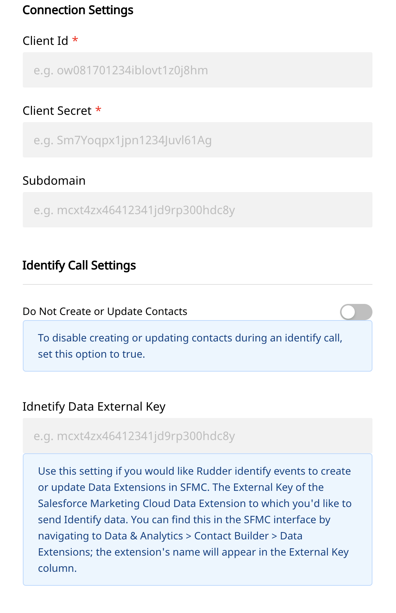
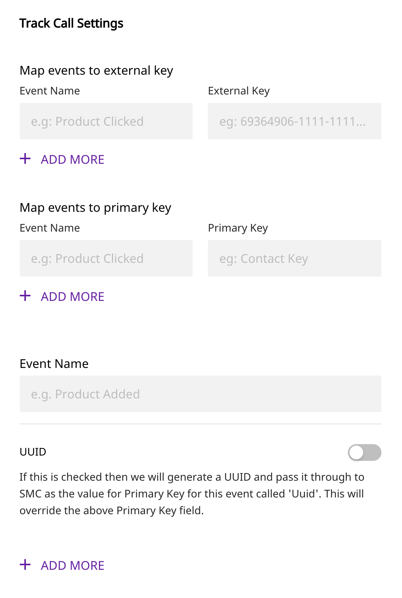

# Salesforce Marketing Cloud

[Salesforce Marketing Cloud](https://www.salesforce.com/in/products/marketing-cloud/overview/) is a digital marketing automation and analytics tool. It allows you to understand your customers better, and design personalized digital marketing campaigns to engage them throughout their product journey.

RudderStack allows you to integrate your source to Salesforce Marketing Cloud and send data to Salesforce Marketing Data Extensions.

<div class="successBlock">

  **Find the open-source transformer code for this destination in our <a href="https://github.com/rudderlabs/rudder-transformer/tree/master/v0/destinations/sfmc">GitHub repo</a>.**
</div>

## Getting Started

Before configuring your source and destination on the RudderStack, please verify if the source platform is supported by Salesforce Marketing Cloud by referring to the table below:

| **Connection Mode** | **Web**       | **Mobile**    | **Server**    |
| :------------------ | :------------ | :------------ | :------------ |
| **Device mode**     | -             | -             | -             |
| **Cloud** **mode**  | **Supported** | **Supported** | **Supported** |

<div class="infoBlock">

To know more about the difference between Cloud mode and Device mode in RudderStack, read the <a href="https://rudderstack.com/docs/connections/rudderstack-connection-modes/">RudderStack connection modes</a> guide.

</div>

Once you have confirmed that the platform supports sending events to Salesforce Marketing, perform the steps below:

- From your [RudderStack dashboard](https://app.rudderlabs.com/), add the source. From the list of destinations, select Salesforce.

<div class="infoBlock">

Follow our guide on <a href="https://rudderstack.com/docs/connections/adding-source-and-destination-rudderstack/">How to Add a Source and Destination in RudderStack</a> to add a source and destination in RudderStack.

</div>

- Give a name to the destination and click on **Next**. You should then see the following screen:


<span class="imageTitle">Salesforce Connection Settings</span>

## Settings

- **Client Id, Client Secret:** To get the `clientId` and `clientSecret`, follow these steps.
  - After logging in to your Salesforce marketing account, go to the **Setup** page.
  - Under **Platform Tools**, you will find **Apps** where you can select **Installed Packages**.
  - Click **New** to create a new package. We recommend giving it a name such as **RudderStack**.
  - Click **Add Component** and select **API Integration**.
  - Select the **Server-to-Server Integration Type**.
  - The following permissions are needed to configure the destination correctly. Otherwise, you'll get the insufficient Privileges error from SFMC:
    - `Email`: Read, Write
    - `Web`: Read, Write
    - `Automations`: Read, Write, Execute
    - `Journeys`: Read
    - `List And Subscribers`: Read, Write
    - `Data Extensions`: Read, Write
    - `Tracking Events`: Read
    - `Webhooks`: Read, Write
  - Click **Save**.
- **Subdomain:** From the URL received, such as the following: [`https://mxxxxxxxxxxxxxxxxxxxx.rest.marketingcloudapis.com/`](https://mxxxxxxxxxxxxxxxxxxxx.rest.marketingcloudapis.com/) , **`mxxxxxxxxxxxxxxxxxxxx`** is the subdomain.
- **Do not create or update contacts:** To disable creating or updating contacts during an `identify` call, set this option to `true`.
- **Identify Data External Key:** Use this setting if you would like RudderStack to send `identify` events for creating or updating data extensions in Salesforce Marketing. The External Key of the data extension is needed for mapping the data.

<div class="infoBlock">

You can find the external key in the SFMC interface by going to **Data & Analytics**, and navigating to **Contact Builder** - **Data Extensions**. The extension's name can be found in the **External Key** column.

</div>


<span class="imageTitle">Salesforce Connection Settings for Track</span>


- **Map events to External Key:** This setting is for mapping `track` events to a certain Data Extension in Salesforce Marketing Cloud. For the "Event Name" field, enter the name of the event that you want to send to Salesforce Marketing Cloud. Then, for the "External Key" field, enter the Data Extension's External Key that you would like to route the event data to. Click "Add More" and repeat for all `track` events you would like to send to SFMC.

<div class="warningBlock">

If you do not map an event to an External Key and it gets sent to SFMC, you may receive a message saying <code class="inline-code">"Event not mapped for this track call"</code>

</div>

<div class="infoBlock">

You can find the external key in the SFMC interface by going to **Data & Analytics**, and navigating to **Contact Builder** - **Data Extensions**. The extension's name can be found in the **External Key** column.

</div>

- **Map events to Primary Key:** For all events going to a Data Extension, there needs to be a `Primary Key`. By default, if you do not use this setting, RudderStack will create a `Primary Key` called `Contact Key` and assign it to the `userId` of the event. If no `userId` is present, then it will be assigned to the `email`. Use this setting if you would like to map your own `Primary Key`. In the "Event Name" field, indicate the name of the event you would like to choose your own `Primary Key` for. Then choose what key from the event payload you would like to act as the `Primary Key`. The key should be present in your `event.properties` and ensure that it is set as a `Primary Key` in your SFMC Data Extension. You can add multiple primary keys by separating them with commas. 
- **Event Name to UUID:** This setting is for assigning a UUID as a `Primary Key` for a specified event. If an event name is given in the "Event Name" field and the toggle is turned on, RudderStack will generate a UUID and pass it through to SFMC as the value for a `Primary Key` called `Uuid` for the given event. Using this setting will override any action taken for the **Map events to Primary Key** section above, for the specified event.

## Creating Data Extensions in SFMC

We recommend creating a **Data Extension** in SFMC to store the `identify` and `track` calls coming from RudderStack. For each trait \(in case of `identify` calls\) or properties \(in case of `track` calls\) that you want to send to Salesforce Marketing Cloud, you should create an attribute on the Data Extension in the interface.

In SFMC, keys that are not present in the selected data extension are ignored, so those attributes must be created before you send them to SFMC. If you send a trait/property `"phone": "99999"` with your data, but there's no matching phone column in SFMC's table, that trait or property will be ignored. All of the traits/properties in an `identify` or `track` call are not needed to be created as attributes in data extensions only the required ones should be created.

<div class="warningBlock">

All attributes in the Data Extension should be created in title case, regardless of the casing used in your RudderStack <code class="inline-code">identify</code> or <code class="inline-code">track</code> calls. When RudderStack sends these calls to SFMC, they are first transformed into title case.

</div>

<div class="infoBlock">

A Primary Key for the Identify Data Extension called **Contact Key** is required to be created. RudderStack will use this to link the users to SFMC's built-in **Contact Key** key. This field will be populated with <code class="inline-code">userId</code> or <code class="inline-code">email</code> by default during the <code class="inline-code">identify</code> calls.

</div>

For setting up Primary Keys in Track calls, you can set up different primary keys for various events. If no primary key is set, the default primary key will be **Contact Key**. You can specify multiple, comma-separated primary keys if you have multiple primary keys in your data extension.

When creating data extensions, the **Is Sendable** box should be checked if you want to send emails or push notifications based on this data. If this data is used to send emails, email attributes will be set, which will be called **`EmailAddress`**. Copy the External Key for the particular Data Extension, which you will set in the destination setting of RudderStack.

Here is an example of a Data Extension for an `identify` call that will store email, first name, and last name, and phone traits.

## Identify

The following code snippet demonstrates a sample `identify` call in RudderStack:

```javascript
rudderanalytics.identify("userid", {
  name: "John Doe",
  title: "CEO",
  email: "name.surname@domain.com",
  company: "Company123",
  phone: "123-456-7890",
  state: "Texas",
  rating: "Hot",
  city: "Austin",
  postalCode: "12345",
  country: "US",
  street: "Sample Address",
  state: "TX",
  createdAt: new Date().toJSON().slice(0, 10).replace(/-/g, "/"),
})
```

<div class="infoBlock">

Identify events will create or update the contacts in Salesforce marketing cloud if **Do Not Create or Update Contacts** is turned off. Otherwise, no creation or updating of contacts will occur.

</div>

<div class="warningBlock">

<code class="inline-code">UserId</code> or <code class="inline-code">email</code> trait is required in every <code class="inline-code">identify</code> call, otherwise the event will not be triggered.

</div>

<div class="warningBlock">

Salesforce marketing cloud does not allow colon characters (":") in the **Contact Key** field, so they must be removed from any <code class="inline-code">userId</code> fields. SFMC doesn't handle nested objects.

</div>

<div class="warningBlock">

SFMC only accepts ISO-8601 type dates and rejects any other types if the attribute is of DateTime. For example, refer to the <code class="inline-code">createdAt</code> trait in the above snippet.

</div>

## Track

The following code snippet demonstrates a sample `track` call in RudderStack:

```javascript
rudderanalytics.track("Event Name", {
  Plan: "plan value",
})
```

Enter your external key and the primary key against each event. If no primary key is set, the default value of the **Contact Key** is taken. Multiple primary keys can be set by separating them with commas.

<div class="infoBlock">

You can also turn on UUID for particular events. If it is on, you can set UUID as a primary key in your data extensions. The <code class="inline-code">messageId</code> is then set as the UUID.

</div>

## Data Formatting and Mapping

The RudderStack SDKs and libraries will automatically collect context properties which can be passed as properties in SFMC as attributes for the data extension. To use `context` properties, the attributes in the Data Extensions with specific naming conventions should be set.

The table below lists the RudderStack context properties available for SFMC and the Data Extension attribute names that they map to.

<div class="infoBlock">

Note that camel cases and snake cases will be formatted to title cases.

</div>

| **RudderStack Context Properties** | **SFMC Attribute name** |
| :--------------------------------- | :---------------------- |
| `app.name`                         | `App Name`              |
| `app.version`                      | `App Version`           |
| `app.build`                        | `App Build`             |
| `campaign.name`                    | `UTM Campaign`          |
| `campaign.source`                  | `UTM Source`            |
| `campaign.medium`                  | `UTM Medium`            |
| `campaign.term`                    | `UTM Term`              |
| `campaign.content`                 | `UTM Content`           |
| `locale`                           | `Locale`                |
| `userAgent`                        | `User Agent`            |
| `ip`                               | `IP Address`            |
| `device.adTrackingEnabled`         | `Ad Tracking Enabled`   |
| `device.manufacturer`              | `Device Manufacturer`   |
| `device.model`                     | `Device-model`          |
| `device.name`                      | `Device Name`           |
| `device.type`                      | `Device Type`           |
| `network.bluetooth`                | `Bluetooth Enabled`     |
| `network.carrier`                  | `Network Carrier`       |
| `network.cellular`                 | `Cellular Enabled`      |
| `network.wifi`                     | `Wifi Enabled`          |
| `screen.density`                   | `Screen Density`        |
| `screen.height`                    | `Screen Height`         |
| `screen.width`                     | `Screen Width`          |

## Contact Us

If you come across any issues while configuring Salesforce Marketing Cloud with RudderStack, please feel free to [contact us](mailto:docs@rudderstack.com). You can also start a conversation on our [Slack channel](https://rudderstack.com/join-rudderstack-slack-community); we will be happy to talk to you!
