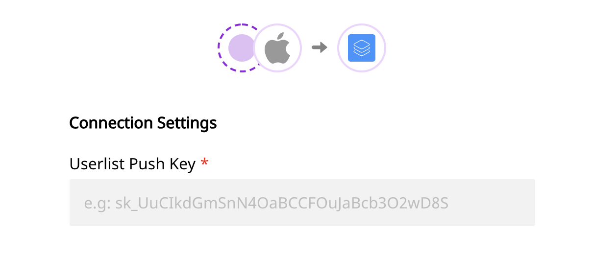

# Userlist

[Userlist](https://userlist.com) is a popular behavior-based messaging platform that lets you engage with your SaaS users effectively through targeted, behavior-based campaigns. It’s great for onboarding your users as well as nurturing them throughout their journey.

RudderStack supports sending your events to Userlist from the cloud mode S2S \(Server to Server\) by calling the relevant RudderStack APIs.

<div class="successBlock">
This destination is supported by the Userlist team. Feel free to contact Userlist via <a href="mailto:support@userlist.com">support@userlist.com</a>.
</div>

<div class="successBlock">
<strong>Find the open-source transformer code for this destination in our <a href="https://github.com/rudderlabs/rudder-transformer/tree/master/v0/destinations/userlist">GitHub repo</a>.</strong>
</div>

## Getting Started

Before configuring your source and destination on the RudderStack app, please check whether the platform you are working on is supported. You can refer the following table to do so:

| **Connection Mode** | **Web**       | **Mobile**    | **Server**    |
| :------------------ | :------------ | :------------ | :------------ |
| **Device mode**     | -             | -             | -             |
| **Cloud mode**      | **Supported** | **Supported** | **Supported** |

<div class="infoBlock">
To know more about the difference between Cloud mode and Device mode in RudderStack, read the <a href="https://rudderstack.com/docs/rudderstack-cloud/rudderstack-connection-modes/">RudderStack connection modes</a> guide.

</div>

Once you have confirmed that the platform supports sending events to Userlist, perform the steps below:

- From your [RudderStack dashboard](https://app.rudderlabs.com/), add the source and Userlist as a destination.

<div class="infoBlock">
Please follow our guide on <a href="https://www.rudderstack.com/docs/rudderstack-cloud/destinations/#adding-a-destination">Adding a Destination</a> to add a destination in RudderStack.

</div>

- Name your destination, and click on **Next**. You should be able to see the following screen:


<span class="imageTitle">Connection settings for Userlist destination</span>

- Enter the **Userlist Pus Key** which you can find from your [Userlist Push API settings](https://app.userlist.com/settings/push).
- Once the destination is enabled, events from the RudderStack SDK will start to flow to Userlist.

<div class="warningBlock">

Userlist does not support tracking of anonymous users. So, make sure you call `identify` before calling `track`.
</div>

## Identify

The `identify` call sends the event data to Userlist along with the properties that you pass as the RudderStack traits. For more information on the `identify` call, please refer our [RudderStack API specification](https://rudderstack.com/docs/rudderstack-api/api-specification/rudderstack-spec/) documentation.

If the `userId` is already known, Userlist will update the user record. Otherwise, it’ll create a new one.

<div class="warningBlock">

Userlist will only process messages with a `userId`. Messages with only an `anonymousId` will be ignored.

</div>

The following code snippet is an example of an `identify` call in RudderStack:

```javascript
rudderanalytics.identify("test-user-id", {
  name: "Tintin",
  city: "Brussels",
  country: "Belgium",
  email: "tintin@herge.com",
})
```

## Group

The `group` call is made to associate the user with a company in Userlist. For more information on the `group` call, please refer our [RudderStack API specification](https://rudderstack.com/docs/rudderstack-api/api-specification/rudderstack-spec/) documentation.

An example of a `group` call is as shown:

```javascript
rudderanalytics.group("test-group-id", {
  name: "Example, Inc.",
  industry: "Testing",
  employees: 42,
})
```

<div class="infoBlock">

Userlist supports adding properties to the relationship between user and group. As this isn't officially supported by RudderStack's message format, you can specify the relationship properties by providing additional data for Userlist specifically.

</div>

The following example will associate the currently identified user with the given group \(company\) and set their `role` for that particular group \(company\) to `owner`.

```javascript
rudderanalytics.group("test-group-id", {
  name: "Example, Inc.",
  industry: "Testing",
  employees: 42,
  integrations: {
    Userlist: {
      extensions: {
        relationship: {
          properties: {
            role: "owner",
          },
        },
      },
    },
  },
})
```

## Track

The `track` call will pass the event properties to Userlist. You may call `rudderanalytics.track()` with or without event properties. For more information on how `track` call works, please refer to our [RudderStack API specification](https://rudderstack.com/docs/rudderstack-api/api-specification/rudderstack-spec/) documentation.

The following code snippet shows how a sample `track` call is made in RudderStack:

```javascript
rudderanalytics.track("Project created", {
  project_name: "Demo Project",
})
```

<div class="infoBlock">

Note that every `track` call will be sent to Userlist as a new event. You may send additional properties to describe the event in more detail.

Both the event name and additional properties will be stored with the event and normalized to snake case \(`project_created` and `project_name`\) automatically within Userlist.

</div>

To track an event in the context of a group \(company\), you need to specify the `groupId` in the `context`, as shown:

```javascript
rudderanalytics.track("Project created", {
  project_name: "Demo Project",
  context: {
    groupId: "test-group-id",
  },
})
```

## Contact Us

If you come across any issues while configuring Userlist with RudderStack, please feel free to [contact us](mailto:docs@rudderstack.com). You can also start a conversation in our [Slack](https://rudderstack.com/join-rudderstack-slack-community) community; we will be happy to talk to you!
