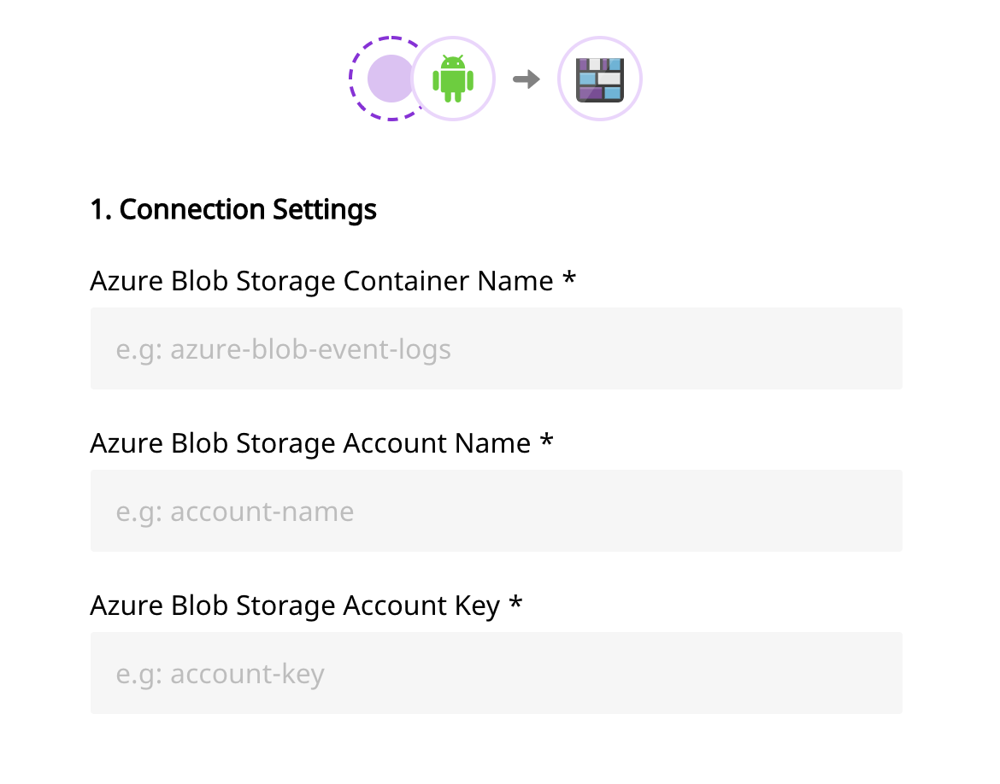

# Azure Blob Storage

[Azure Blob Storage](https://azure.microsoft.com/en-in/services/storage/blobs/) is a cloud-based object storage solution offered by Microsoft. It allows you to store massive amounts of unstructured data without conforming to a specific data model.

RudderStack allows you to send your event data from a source to Microsoft Azure Blob Storage, and dump it in their container.

## Setting up Azure Blob Storage

Follow these steps to set up Azure Blog Storage before adding it as a destination in RudderStack:

* Login to your [Azure portal](https://portal.azure.com/).
* Create a Storage Account of type **General-purpose v2 account**.
* Choose your storage account and under `Blob service` , click on `containers`.
* Create a new container. This is where all your event files will be dumped.
* You also need to provide an access key to authorize RudderStack to write to your container. Under `settings` click on `Access keys`. You can find your access keys here.


Please note the name of the account, container as well as the access key as it will be required to set up Azure Blob Storage as a destination in RudderStack.


## **Configuring Azure Blob Storage in RudderStack**

To enable dumping data to Microsoft Azure Blob Storage, you will first need to add it as a destination to the source from which you are sending event data. Once the destination is enabled, events from RudderStack will start flowing to Microsoft Azure Blob Storage. You will see the files in your blob container.

Follow these steps to configure Azure Blob Storage as a destination in RudderStack:

* Choose a source to which you would like to add Azure Blob Storage as a destination. You can also simply create a destination and connect it to a source later.


Please follow our guide on [How to Add a Source and Destination in RudderStack](https://docs.rudderstack.com/how-to-guides/adding-source-and-destination-rudderstack) to add a source and destination in RudderStack.


* Select the destination as **Azure Blob Storage** to your source. Give your destination a name and click **Next**.
* Next, fill all the fields with the appropriate information \(please refer to the Setting up Azure Blob Storage section above\) and click **Next**.

* If you need any transformation choose one from the list. Else, click on **Next**.

That's it! You have successfully added Microsoft Azure Blob Storage as a destination in RudderStack. Once you send an event from your source, you can find it dumped to your container.

## Contact Us

If you come across any issues while configuring or using Azure Blob Storage with RudderStack, please feel free to [contact us](mailto:%20docs@rudderstack.com). You can also start a conversation on our [Slack](https://resources.rudderstack.com/join-rudderstack-slack) channel; we will be happy to talk to you!

