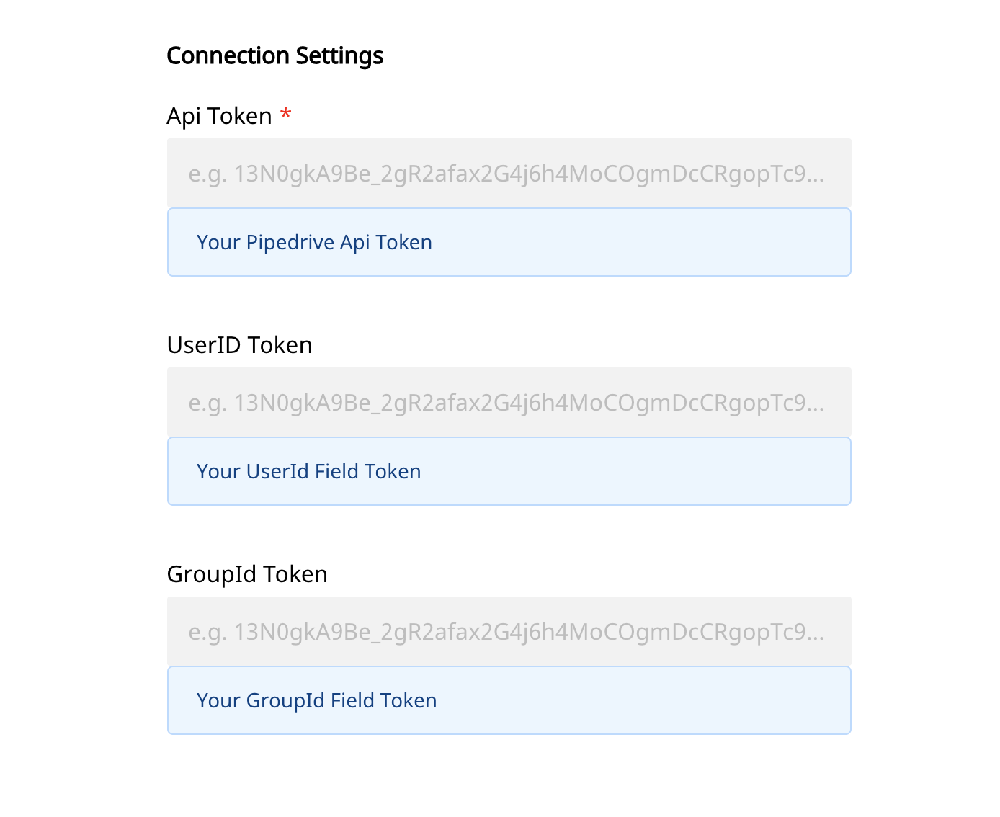
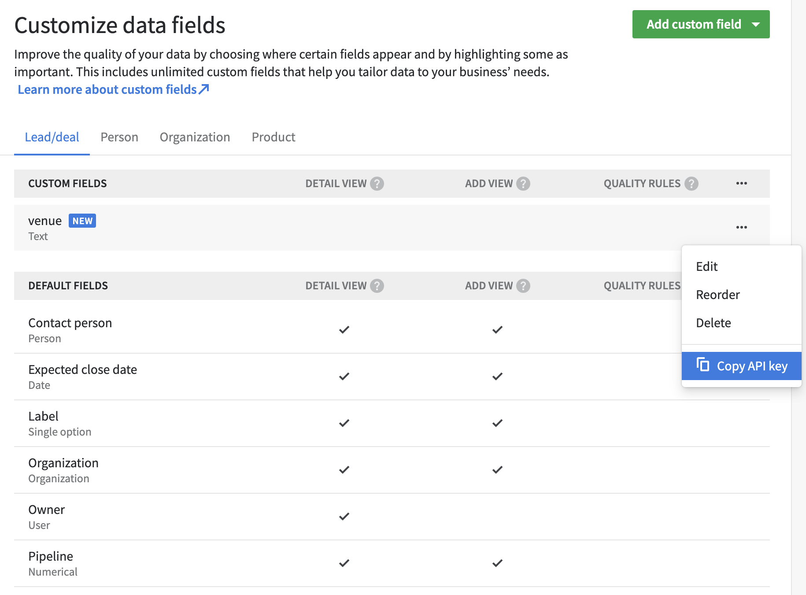
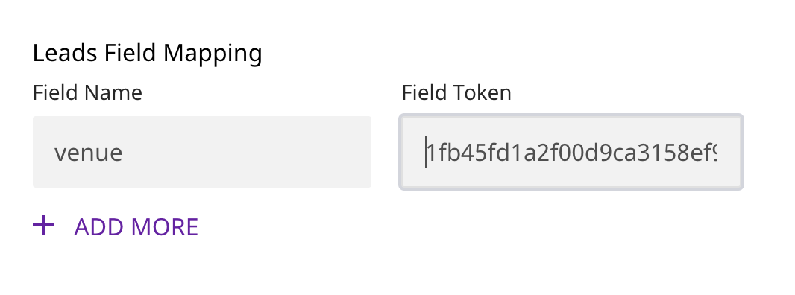

# Pipedrive

[Pipedrive](https://www.pipedrive.com/) is a CRM platform made for salespeople, by salespeople. It provides its users with solutions that are  designed to help SMBs efficiently manage the sales process and grow their business.

You can now send your event data directly to Pipedrive through RudderStack.

To visit Pipedrive API documentation, click [here](https://developers.pipedrive.com/docs/api/v1/#/).


**Find the open-source transformer code for this destination in our** [**GitHub repo**](https://github.com/rudderlabs/rudder-transformer/tree/dest-pipedrive)**.**


## Getting Started

Before configuring your source and destination on the RudderStack, please check whether the platform you are sending the events from is supported. Please refer the following table to do so:

| **Connection Mode** | **Web** | **Mobile** | **Server** |
| :--- | :--- | :--- | :--- |
| Device mode | -| -| - |
| **Cloud mode** | **Supported** | **Supported** | **Supported** |


To know more about the difference between Cloud mode and Device mode in RudderStack, read the [RudderStack connection modes](https://docs.rudderstack.com/get-started/rudderstack-connection-modes) guide.


Once you have confirmed that the platform supports sending events to CleverTap, perform the steps below:

* From your [RudderStack dashboard](https://app.rudderstack.com/), add the source and Pipedrive as a destination.


Please follow our guide on [How to Add a Source and Destination in RudderStack](https://docs.rudderstack.com/how-to-guides/adding-source-and-destination-rudderstack) to add a source and destination in RudderStack.




## Connection Settings

To successfully configure Pipedrive as a destination, you will need to configure the following settings:

* **Api Token:** Your api token is a unique token generated for your account. It can be found in your account in the **Company Settings**-->**Personal Preferances** --> **API**.


`GroupId Token` and `UserId Token` fields are related to Custom Field tokens in Pipedrive.


**Note:** Pipedrive does not support mapping userId or groupId. Instead they create id's internally. So, in order for rudderstack calls to work with Pipedrive, user needs to create custom fields for userId, groupId in Pipedrive to which the provided userId and groupId values would be mapped to..

Rudderstack will use these Custom Fields to map userId value, groupId value, etc.

 **Note:** `GroupId Token` and `UserId Token` are required only if calls like identify, group, etc. will be made. In that case, rudderstack needs a way to map provided userId's and groupId's in the destination.

## Using Custom Fields

**Custom fields** can be created in Pipedrive. User can pass values for created custom fields in rudderstack payload. The mapping, however needs to be configured in the Rudderstack Dashboard.

In order to create custom fields and provide the mappings in Rudderstack, please follow the steps below.

* To create Custom fields go to **CompanySettings** --> **Data Fields** --> **Add Custom Field**.
* Create new Field under the desired section (Leads/Person/Organization/Product).



* Next provide the Custom field name and the token under the respective section in the Rudderstack dashboard as seen in the image below.



**Note:**  Field names are case sensitive.

* For `userId` and `groupId` tokens, create a Custom Field under Persons and Organizations respectively.
* In the dashboard, just provide the Tokens. The actual field name can be anything and is not required by Rudderstack.
* For all other cases, provide both the exact Field name and token in the dashboard.


Pipedrive allows passing in owner_id in most cases. However, that owner_id is related to the Pipedrive account owner and not a user. So, owner_fields are not taken by Rudderstack for any of the events.


## Supported Events

The following events are supported by Rudderstack for Pipedrive destionation.

* Identify
* Alias
* Group
* Track

The following Ecommerce events are also supported:

* Product Viewed
* Order Completed


**More details on the Ecommerce events can be found in the Rudderstack* [**Ecommerce Events Specification**](https://docs.rudderstack.com/rudderstack-api-spec/rudderstack-ecommerce-events-specification/ordering)**.**


### Identify

This method allows you to link the users and their actions to a specific userid. You can also add additional information as traits to a user. Once you set the identify information to the user, those will be passed to the successive track or page calls. To reset the user identification, you can use the reset method.

The identify() method definition is as follows:

``` 
rudderanalytics.identify([userid], [traits], [options], [callback]);
```


For an identify call, a `Person` object is create in Pipedrive.


Sample identify call:

```
rudderanalytics.identify(
"sample-user-id",
{
  "name": "John Doe",
  "email": "john@doe.com"
});
```

Fields that can be passed in identify method are as follows:

* name
* email
* phone
* visible_to
* add_time

Custom Fields can also be passed in the method. However, provide the field name and token in Rudderstack dashboard under `Persons` section. Otherwise, random-key value pairs are dropped.

**Note:** For identify, userId token is required. Please refer to the Connection settings section for more details.

Example of identify method with Custom Fields:
```
rudderanalytics.identify(
"sample-user-id",
{
  "name": "John Doe",
  "email": "john@doe.com",
  "role": "Software Developer"
});
```
The `role` field and corresponding Pipedrive api key is provided in Rudderstack dashboard.

### Group

The group call associates a user to a specific organization.

The format of a group call is as shown:

```
rudderanalytics.group("groupId", traits, options, callback);
```

 For a group call, a Person object in Pipedrive is added to an organization. 

**Note:** `GroupId` token is required for group call. Please provide the token in Rudderstack dashboard under `Connection Settings`.


This Custom Group Id field is required by Rudderstack to map the groupId with Pipedrive's internal org_id.


Fields that can be passed in group method are as follows:

* name
* add_time
* visible_to

Custom Fields can also be passed. Provide the Custom Field name and token under the `Organization Field Mapping` section in Rudderstack dashboard.

### Alias

Alias method is used to merge to users.

Sample alias call
```
rudderanalytics.alias("to", "from", options, callback);
```

**Note:** Both the user id's in alias should be valid, i.e both the users should be already existing Pipedrive `Persons`.

### Track

This method allows you to track any actions that your users might perform. Each of these actions is commonly referred to as an event. Track events are mapped to [Leads](https://developers.pipedrive.com/docs/api/v1/#!/Leads/addLead) object in Pipedrive.

The track() method definition is as follows:

```
rudderanalytics.track(event,[properties],[options],[callback]);
```

A sample example of how to use the track() method is as shown:

```
rudderanalytics.track(
  "Potential Lead",
  {
    "value": 1000,
    "currency": "USD",
    "expected_close_date": "2021-04-27"
  },
);
```

Fields that can be passed in track method are as follows:

* currency
* expected_close_date
* label_ids
* revenue/value/total/amount

Custom Fields can also be passed. Provide the Custom Field name and token under the `Leads Field Mapping` section in Rudderstack dashboard.


**Note:** Pipedrive requires a valid person_id or organization_id (these are Pipedrive side id's) for a Lead creation. So, in order to map the track event to a Lead object correctly, a valid userId is required with the track event, i.e A user should exist for the userId.


### Ecommerce Events

For Pipedrive, Rudderstack is supporting two Ecommerce events:

* Product Viewed
* Order Completed


The Product object in Pipedrive is created for these two Events.


**Note:** The `Product` object in Pipedrive is related to `inventory`. Pipedrive does not have any associated user field with the Product object.

### Product Viewed

A sample example of the `Product Viewed` event is shown below:

```
rudderanalytics.track('Product Viewed', {
  "product_id": "sample-product-id",
  "name": "Bike",
  "price": 400000,
  "currency": "INR"
});
```

This will add a Product object in Piprdrive.

Fields supported in this method are as follows:

* product_id
* sku
* price
* currency
* quantity

**Note**: Provide both price and currency for it to be mapped to `prices` field in Pipedrive Product.


Custom Fields are supported. Provide the mapping in Rudderstack dahsboard.


More details about `Product` in Pipedrive can be found [here](https://developers.pipedrive.com/docs/api/v1/#!/Products/addProduct).

### Order Completed

A sample example of the `Order Completed` event is shown below:

```
rudderanalytics.track("Order Completed", {
        checkout_id: "12346",
        order_id: "1235",
        total: 20,
        revenue: 15.0,
        shipping: 22,
        tax: 1,
        currency: "USD",
        products: [
          {
            product_id: "124",
            sku: "G-33",
            name: "Note 10 pro",
            price: 400
          },
          {
            product_id: "346",
            sku: "F-33",
            name: "11 ultra",
            price: 800
          },
        ],
      });

```

For the above call, each product in the `products` list is added as a Pipedrive Product.


**Note:** The `products` array is required. If, not provided or empty, the event will be dropped. This is because, the Order Related info cannot otherwise be mapped with Pipedrive.
Provide both the currency and price for it to be mapped to `prices` in Product.


More details about `Product` in Pipedrive can be found [here](https://developers.pipedrive.com/docs/api/v1/#!/Products/addProduct).

## Contact Us

If you come across any issues while configuring Pipedrive with RudderStack, please feel free to [contact us](mailto:docs@rudderstack.com). You can also start a conversation on our [Slack](https://resources.rudderstack.com/join-rudderstack-slack) channel; we will be happy to talk to you!
