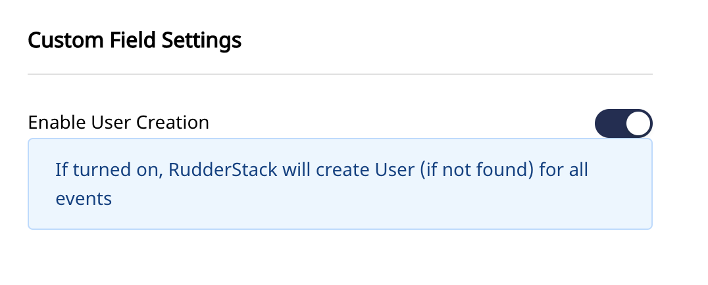

# Pipedrive

[Pipedrive](https://www.pipedrive.com/) is a CRM platform made for salespeople, by salespeople. It provides its users with solutions that are  designed to help SMBs efficiently manage the sales process and grow their business.

You can now send your event data directly to Pipedrive through RudderStack.

To visit Pipedrive API documentation, click [here](https://developers.pipedrive.com/docs/api/v1/#/).


**Find the open-source transformer code for this destination in our** [**GitHub repo**](https://github.com/rudderlabs/rudder-transformer/tree/dest-pipedrive)**.**


## Getting Started

Before configuring your source and destination on the RudderStack, please check whether the platform you are sending the events from is supported. Please refer the following table to do so:

| **Connection Mode** | **Web** | **Mobile** | **Server** |
| :--- | :--- | :--- | :--- |
| Device mode | -| -| - |
| **Cloud mode** | **Supported** | **Supported** | **Supported** |


To know more about the difference between Cloud mode and Device mode in RudderStack, read the [RudderStack connection modes](https://docs.rudderstack.com/get-started/rudderstack-connection-modes) guide.


Once you have confirmed that the platform supports sending events to Pipedrive, perform the steps below:

* From your [RudderStack dashboard](https://app.rudderstack.com/), add the source and Pipedrive as a destination.


Please follow our guide on [How to Add a Source and Destination in RudderStack](https://docs.rudderstack.com/how-to-guides/adding-source-and-destination-rudderstack) to add a source and destination in RudderStack.



## Pipedrive Configuration Settings in RudderStack

To successfully configure Pipedrive as a destination, you will need to configure the following settings:

* **Api Token:** Your api token is a unique token generated for your account. It can be found in your account in the **Company Settings**-->**Personal Preferances** --> **API**.


`GroupId Token` and `UserId Token` fields are related to Custom Field tokens in Pipedrive.


**Note:** Pipedrive does not support mapping userId or groupId. Instead they create id's internally. So, in order for RudderStack calls to work with Pipedrive, create custom fields for userId, groupId in Pipedrive to which the provided userId and groupId values would be mapped to.
.

**Note:** For cases where user already has the list of pipedrive id's, events can be sent using those id's as external Id. Details have been mentioned below. Go to the section `Using External Id`.

 **Note:** `GroupId Token` and `UserId Token` are required only if calls like identify, group, etc. will be made. In that case, rudderstack needs a way to map provided userId's and groupId's in the destination.

**Note:** For creating `Leads` or `Organization` in Pipedrive, `person_id` is required. Anonymous tracking is not available. Hence, UserId or External Id is required for all events.

## Enable User Creation

If User Creation flag is turned on, Rudderstack will create new user with the provided userId value (if user with userId value does not already exist). This will work for identify, track and group calls.


**Note:** For identify calls, to create a new user, keep this flag on. Otherwise, new users will not be created.
If turned off, Rudderstack will search and update existing user, if present.




## Using External Id

Already existing Pipedrive Id's can also be used with Rudderstack. In that case, provide the Pipedrive Id in `context.enternalId` in the required format.

Example of payload with external id:
```
{
    "userId": "sample-user-id",
    "anonymousId": "sample-anon-id",
    "context": {
        "externalId": [
            {
                "type": "person_id",
                "id": 261
            }
        ],
        "traits": {
            "name": " New User",
            "email": "user@email.com"
        },
        "ip": "0.0.0.0",
        "library": {
            "name": "http"
        }
    },
    "timestamp": "2020-02-02T00:23:09.544Z"
}
```

**Note:** External Id can be provided for `Person` and `Group` only. External Id can also be provided for alias  calls.


* For `Person` externalId type is `person_id`
* For `Group` externalId type is `org_id`
* For RudderStack `alias` call, external Id's can be provided. The mapping is shown below.

| **RudderStack Key** | **External Id Key**
| :--- | :--- |
| previousId| prev_person_id|
| userId | curr_person_id |

## Using Custom Fields

**Custom fields** can be created in Pipedrive. User can pass values for created custom fields in rudderstack payload. The mapping, however needs to be configured in the Rudderstack Dashboard.

In order to create custom fields and provide the mappings in Rudderstack, please follow the steps below.

* To create Custom fields go to **CompanySettings** --> **Data Fields** --> **Add Custom Field**.
* Create new Field under the desired section (Leads/Person/Organization/Product).


* Next provide the Custom field name and the token under the respective section in the Rudderstack dashboard as seen in the image below.


**Note:**  Field names are case sensitive.

* For `userId` and `groupId` tokens, create a Custom Field under Persons and Organizations respectively.
* In the dashboard, just provide the Tokens. The actual field name can be anything and is not required by Rudderstack.
* For all other cases, provide both the exact Field name and token in the dashboard.


Pipedrive allows passing in owner_id in most cases. However, that owner_id is related to the Pipedrive account owner and not a user. So, owner_fields are not taken by Rudderstack for any of the events.


**Note:** `External Id's` are given the `highest Precedence`, i.e if both external Id and custom Id's are provided, external id will be used for that event.

## Supported Events

The following events are supported by Rudderstack for Pipedrive destionation.

* [Identify](https://docs.rudderstack.com/rudderstack-api-spec/http-api-specification#6-identify)
* [Alias](https://docs.rudderstack.com/rudderstack-api-spec/http-api-specification#11-alias)
* [Group](https://docs.rudderstack.com/rudderstack-api-spec/http-api-specification#10-group)
* [Track](https://docs.rudderstack.com/rudderstack-api-spec/http-api-specification#7-track)

### Identify

This method allows you to link the users and their actions to a specific userid. You can also add additional information as traits to a user. Once you set the identify information to the user, those will be passed to the successive track or page calls. To reset the user identification, you can use the reset method.

The identify() method definition is as follows:

``` 
rudderanalytics.identify([userid], [traits], [options], [callback]);
```


For an identify call, a `Person` object is create in Pipedrive.


Sample identify call:

```
rudderanalytics.identify(
"sample-user-id",
{
  "name": "John Doe",
  "email": "john@doe.com"
});
```

Fields that can be passed in identify method are as follows:

* name
* email
* phone
* visible_to
* add_time

Custom Fields can also be passed in the method. However, provide the field name and token in Rudderstack dashboard under `Persons` section. Otherwise, random-key value pairs are dropped.

**Note:** For identify, userId token is required. Please refer to the Connection settings section for more details.

Example of identify method with Custom Fields:
```
rudderanalytics.identify(
"sample-user-id",
{
  "name": "John Doe",
  "email": "john@doe.com",
  "role": "Software Developer"
});
```
The `role` field and corresponding Pipedrive api key is provided in Rudderstack dashboard.

### Group

The group call associates a user to a specific organization.

The format of a group call is as shown:

```
rudderanalytics.group("groupId", traits, options, callback);
```

 For a group call, a Person object in Pipedrive is added to an organization. 

**Note:** `GroupId` token is required for group call. Please provide the token in Rudderstack dashboard under `Connection Settings`.


This Custom Group Id field is required by Rudderstack to map the groupId with Pipedrive's internal org_id.


Fields that can be passed in group method are as follows:

* name
* add_time
* visible_to

Custom Fields can also be passed. Provide the Custom Field name and token under the `Organization Field Mapping` section in Rudderstack dashboard.

### Alias

Alias method is used to merge two users or mapping an already identified user to a new identifier.

Sample alias call
```
rudderanalytics.alias("to", "from", options, callback);
```
Note: `to` denotes the new identifier and is required.

External Id's can also be supplied in Alias.
Sample example is shown below:
```
{
    "anonymousId": "sample-anon-id",
    "previousId": "",
    "userId": "",
    "context": {
        "externalId": [
            {
                "type": "prev_person_id",
                "id": 271
            },
            {
                "type": "curr_person_id",
                "id": 272
            }
        ],
        "traits": {
            "name": "Updated Username"
        },
        "ip": "14.5.67.21",
        "library": {
            "name": "http"
        }
    },
    "timestamp": "2020-01-21T00:21:34.208Z"
}
```

Note: In cases where both the previous and current users exist, the [Pipedrive merge](https://developers.pipedrive.com/docs/api/v1/#!/Persons/mergePersons) endpoint is called.

### Track

This method allows you to track potential leads/deals. More details on `Leads` can be found in [Pipedrive docs](https://developers.pipedrive.com/docs/api/v1/#!/Leads/addLead).

A sample example of how to use the track() method is as shown:

```
rudderanalytics.track(
  "Potential Lead",
  {
    "value": 1000,
    "currency": "USD",
    "expected_close_date": "2021-04-27"
  },
);
```

Fields that can be passed in track method are as follows:

* currency
* expected_close_date (In ISO 8601 format: YYYY-MM-DD)
* label_ids
* revenue/value/total/amount

Custom Fields can also be passed. Provide the Custom Field name and token under the `Leads Field Mapping` section in Rudderstack dashboard.


**Note:** Pipedrive requires a valid person_id or organization_id (these are Pipedrive side id's) for a Lead creation. So, in order to map the track event to a Lead object correctly, a valid userId is required with the track event, i.e A user should exist for the userId.


## Contact Us

If you come across any issues while configuring Pipedrive with RudderStack, please feel free to [contact us](mailto:docs@rudderstack.com). You can also start a conversation on our [Slack](https://resources.rudderstack.com/join-rudderstack-slack) channel; we will be happy to talk to you!
