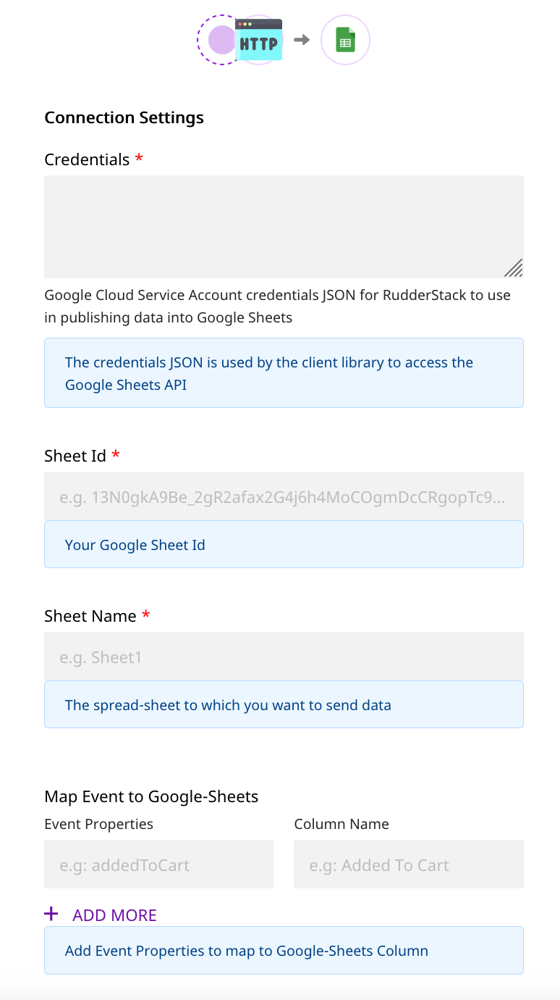
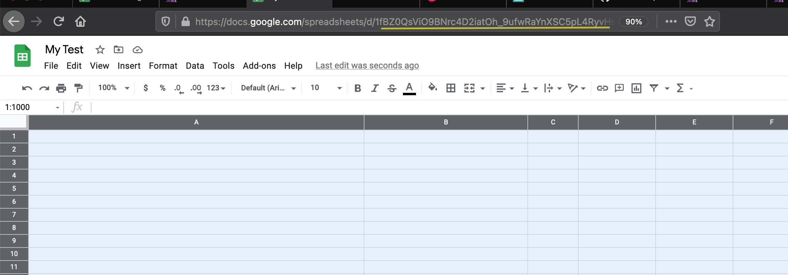

# Google Sheets

[Google Sheets](https://www.google.com/sheets/about/) is a popular spreadsheet program that is bundled as a part of the free, cloud-based office suite offered by Google. With Google Sheets you can seamlessly create spreadsheets that update and save automatically and are easy to access from your Google Drive.

RudderStack allows you to configure Google Sheets as a destination and send your event data to it directly.

<div class="successBlock">

  <strong>Find the open-source transformer code for this destination in our <a href="https://github.com/rudderlabs/rudder-transformer/tree/master/v0/destinations/googlesheets">GitHub repo</a>.</strong>
</div>

## Getting Started

To enable sending data to Google Sheets, you will first need to add it as a destination to the source from which you are sending your event data. Once the destination is enabled, events from RudderStack will start flowing to Google Sheets.

| **Connection Mode** | **Web**       | **Mobile**    | **Server**    |
| :------------------ | :------------ | :------------ | :------------ |
| Device mode         | **-**         | **-**         | **-**         |
| Cloud mode          | **Supported** | **Supported** | **Supported** |

<div class="infoBlock">

To know more about the difference between Cloud mode and Device mode in RudderStack, read the <a href="https://rudderstack.com/docs/rudderstack-cloud/rudderstack-connection-modes/">RudderStack connection modes</a> guide.

</div>

Once you have confirmed that the platform supports sending events to Google Sheets, perform the steps below:

- From your [RudderStack dashboard](https://app.rudderstack.com/), add the source. From the list of destinations, select **Google Sheets.**

<div class="infoBlock">

Please follow our [Adding a Destination](https://www.rudderstack.com/docs/rudderstack-cloud/destinations/#adding-a-destination) guide to add a source and destination in RudderStack.

</div>

- Assign a name to the destination and click on **Next**. You should then see the following screen:


<span class="imageTitle">Google Sheets Connection Settings</span>

### **Obtaining the Credentials**

Before you add Google Sheets as a destination in RudderStack, follow these steps to get the **Google Cloud Service Account credentials** required for the configuration:

- Create a service account in from your Google Cloud Console account, as shown below:


- A JSON file with the required credentials will be generated against this service account, as shown:


<div class="warningBlock">

Once you have completed the connection, make sure you have enabled [Google-Sheets-API](https://console.cloud.google.com/apis/library/sheets.googleapis.com?q=sheets&id=739c20c5-5641-41e8-a938-e55ddc082ad1&project=rudder-integration&supportedpurview=project) in the project of your service account.

</div>

Then, enter the following details under **Connection Settings** in the RudderStack dashboard.

- **Credentials**: Paste the downloaded JSON in the **Credentials** field in the RudderStack dashboard.
- **Sheet ID**: Add the Google Sheet ID to which you want to send your event data. You will also need to assign **Editor** privileges to the email address of the service account for that specific Google Sheet.
- **Sheet Name**: Add the Sheet Name to which you want to send your data. You can find the sheet name at the bottom left corner the spreadsheet as shown below:


<div class="warningBlock">

The **Sheet Name** is **case-sensitive** and has to be exactly as seen in Google Sheets.

</div>

- Next, enter the **Event Properties** corresponding to **Column Name** under the **Map Event to Google Sheets section**.

**NOTE**: For mapping `attributes` from `traits` or `properties`,
you can directly enter the `attribute` name \(for e.g. `productName`,
`firstName`, or `address.city`\) and map it to desired **Column**. For other
contextual attributes, you will need to enter the absolute path to the
`attribute` using dot notation. \(for e.g. `context.app.build`\)

<div class="warningBlock">

If you have **Nested Attributes** inside `properties` or `traits`, please use the **dot notation** for mapping to respective **Column** \(For e.g.: `address.zip`, `address.city`..\)

</div>

<div class="infoBlock">

For mapping `attributes` from event `properties` or `traits`/`context.traits`, RudderStack also supports absolute mapping. For example: adding `context.traits.firstName` will map the same value as adding `firstName`.

**NOTE**: We advise you to map with absolute path as it resolves
the ambiguity when you have same `attribute` name in `traits`, `context.traits`
or `properties`.

</div>

- Finally, click on **Next** to complete the configuration.

Google Sheets should now be added and enabled as a destination in RudderStack.

## Page

The `page` call contains information related to the page, such as the URL of the web page visited by the user.

<div class="infoBlock">

For more information on the <code class="inline-code">page</code> method, please refer to our <a href="https://rudderstack.com/docs/rudderstack-api">RudderStack API Specification</a> guide.

</div>

A sample `page` payload is as shown in the snippet below:

```javascript
rudderanalytics.page({
  path: "path",
  url: "url",
  title: "title",
  search: "search",
  referrer: "referrer",
})
```

## Identify

The `identify` call captures the relevant details about the visiting user.

<div class="infoBlock">

For more information on the <code class="inline-code">identify</code> method, please refer to our <a href="https://rudderstack.com/docs/rudderstack-api">RudderStack API Specification</a> guide.

</div>

A sample `identify` payload is as shown in the snippet below:

```javascript
rudderanalytics.identify("userId", {
  name: "FirstName LastName",
  email: "example@email.com",
  phone: "phone",
})
```

## Track

The `track` call captures the information related to the actions performed by the user along with their properties or traits.

<div class="infoBlock">

For more information on the <code class="inline-code">track</code> method, please refer to our <a href="https://rudderstack.com/docs/rudderstack-api">RudderStack API Specification</a> guide.

</div>

A sample `track` payload is as shown in the snippet below:

```javascript
rudderanalytics.track("Track Event", {
  category: "category",
  label: "label",
  value: "value",
})
```

## Screen

The `screen` method allows you to record whenever a user sees the mobile screen along with any associated optional properties. This call is similar to the `page` call but is exclusive to your mobile device.

A sample `screen` call looks like the following code snippet:

```objectivec
[[RSClient sharedInstance] screen:@"Sample Screen Name" properties:@{@"prop_key" : @"prop_value"}];
```

## FAQs

### I have added my Service Account Credentials. Why are my events still not sent to Google-Sheets?

To ensure that your events are sent to Google Sheets, verify if you have taken the following steps:

- Enabled Google-Sheets-API in the project of your service account.
- Added correct Sheet-Id and Sheet name in RudderStack dashboard.
- Assigned **Editor** access to your service account for accessing the Google Sheet.
- Added the event `attribute` mapping for the Sheet.

### Where do I find my Google-Sheet-ID?

- You can find the Google-Sheet-Id within the Google Sheet URL, as highlighted below:


<span class="imageTitle">Google Sheet ID (underlined in yellow)</span>

## Contact Us

If you come across any issues while configuring or using Google Sheets with RudderStack, please feel free to [contact us](mailto:%20contact@rudderstack.com). You can also start a conversation in our [Slack](https://rudderstack.com/join-rudderstack-slack-community) community; we will be happy to talk to you!
