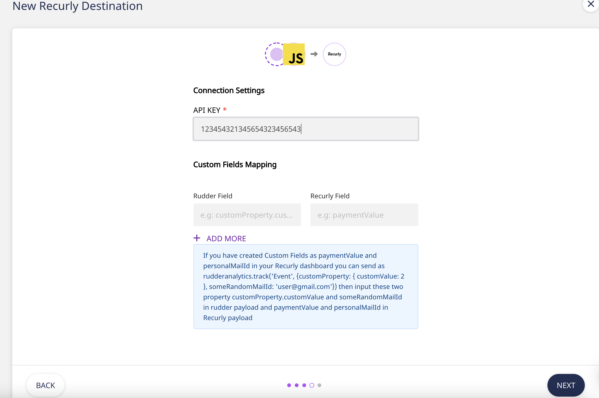

# Recurly

[Recurly](https://recurly.com/) is the subscription management platform delivering unrivaled results to smart brands worldwide. Recurly makes subscriptions a competitive advantage for leading brands worldwide. Growing subscription businesses such as Sling TV, BarkBox, Asana, FabFitFun, Cinemark and Fubo.tv depend on Recurly to harness the power of the subscription model and drive recurring revenue growth. Recurly provides several facility like subscription billing, recurring billing, saas billing, cloud billing, recurring payments, business intelligence, and business analytics

RudderStack allows you to seamlessly configure Recurly as a destination to which you can send your event data seamlessly.


**Find the open-source transformer code for this destination in our** [**GitHub repo**](https://github.com/rudderlabs/rudder-transformer/tree/master/v0/destinations/recurly)**.**


## Getting Started

To enable sending data to **Recurly**, you will first need to add it as a destination to the source from which you are sending your event data. Once the destination is enabled, events from RudderStack will start flowing to Recurly.

Before configuring your source and destination on the RudderStack, please verify if the source platform is supported by Recurly, by referring to the table below:

| **Connection Mode** | Web           | Mobile        | Server        |
| :------------------ | :------------ | :------------ | :------------ |
| **Device Mode**     | **-**         | **-**         | **-**         |
| **Cloud Mode**      | **Supported** | **Supported** | **Supported** |


To know more about the difference between Cloud mode and Device mode in RudderStack, read the [RudderStack connection modes](https://docs.rudderstack.com/get-started/rudderstack-connection-modes) guide.


Once you have confirmed that the platform supports sending events to Recurly, please perform the steps below:

- Choose a source to which you would like to add Recurly as a destination.


Please follow our [Adding a Source and Destination](https://docs.rudderstack.com/how-to-guides/adding-source-and-destination-rudderstack) guide to add a source in RudderStack.


- Select the destination as **Recurly** to your source. Give your destination a name and then click on **Next**.
- On the **Connection Settings** page, fill all the fields with the relevant information and click **Next**.



In the **Connection Settings**, please enter your **API Key** as shown above.

## Web Settings

- **Custom Fields Mapping** - This will map any RudderStack event to Recurly Event. To do successful mapping make sure you have created a custom fields in your recurly dashboard. If you wish to map rudder properties to Recurly Custom fields then list them here. These properties are case-sensitive, and can be nested. For example, you have created paymentValue and personalMailId in your Recurly dashboard now if you want to send rudderanalytics.track('Event', {customProperty: { customValue: 2 }, someRandomMailId: 'user@gmail.com'}) then input these two property customProperty.customValue and someRandomMailId in rudder payload and paymentValue and personalMailId in Recurly payload

```javascript
rudderanalytics.track("Event", {
  customProperty: { customValue: 2 },
  someRandomMailId: "user@gmail.com",
});
```

## Identify

To create an account in Recurly, you need to call the `identify` API.


For information on the `identify` call, please refer to our [RudderStack API Specification](https://docs.rudderstack.com/rudderstack-api-spec) guide.


A sample `identify` call is as shown below:

```javascript
rudderanalytics.identify("name123", {
  name: "name1",
  email: "google@gmail.com",
  plan: "Enterprise",
  phone: "9007197654",
  company: {
    id: "abc123",
    name: "Companyname",
  },
  address: {
    city: "kolkata",
    country: "India",
    postalCode: 789223,
    state: "WB",
    street: "",
  },
});
```

When you make an identify call with new userId, we create a new account.
When you make an identify call with existing userId, we update the existing account with new traits passed.

Following property mapping happens when you make an identify calls ::

| Standard RudderStack Field  | Standard Recurly Field |
| :-------------------------- | :--------------------- |
| `userId`                    | `code`                 |
| `email`                     | `email`                |
| `firstName`                 | `first_name`           |
| `lastName`                  | `last_name`            |
| `context.locale`            | `preferred_locale`     |
| `traits.company.name`       | `company`              |
| `context.campaign.name`     | `acquisition.campaign` |
| `phone`                     | `address.phone`        |
| `traits.address.street`     | `address.street1`      |
| `traits.address.city`       | `address.city`         |
| `traits.address.state`      | `address.region`       |
| `traits.address.postalCode` | `address.postal_code`  |
| `traits.address.country`    | `address.country`      |

## Track

The `track` call to recurly is supported only for two of our ecommerce event.

- checkout started
- order completed

A sample `track` call looks like the following:

```javascript
rudderanalytics.track("Order Completed", {
  currency: "INR",
  products: [
    {
      product_id: "product-mixedfruit-jam",
      sku: "sku-1",
      category: "Food",
      name: "Food/Drink",
      price: 10.0,
      currency: "INR",
    },
    {
      product_id: "cash123",
      sku: "G-32",
      currency: "USD",
      name: "Testing-5-Clash Of Clan",
      price: 1999,
      category: "Games",
    },
  ],
});
```

- To make a successful track call, an account must be present in recurly. Our `track` calls gets mapped to `line_items` for that account in recurly.
- Any `products` that you send in payload is associated with `items` in recurly.
- If a products is not present in recurly dashboard, we create a new `items` for that product and associated it with `line_items`.

Following property mapping happens when you make a track calls ::

| Standard RudderStack Field | Standard Recurly Field   |
| :------------------------- | :----------------------- |
| `products.$.name`          | `name`                   |
| `products.$.product_id`    | `code`                   |
| `products.$.currency`      | `currencies.currency`    |
| `products.$.price`         | `currencies.unit_amount` |
| `products.$.sku`           | `external_sku`           |
| `category`                 | `description`            |
| `properties.currency`      | `currency`               |


**Note**: Recurly only allows string with numbers, lowercase letters, dashes, pluses, and underscores when mapping `product_id` to `code`.


## FAQs

### **How do you get the Recurly API Key?**

- Login to Recurly dashboard.
- Go to the **Integrations** tab and then click on **API Credentials** on the left sidebar.
- You will find your key written as **Private API Key**.

## Contact Us

If you come across any issues while configuring Recurly with RudderStack, please feel free to [contact us](mailto:%20docs@rudderstack.com) or start a conversation on our [Slack](https://resources.rudderstack.com/join-rudderstack-slack) channel. We will be happy to help you.
