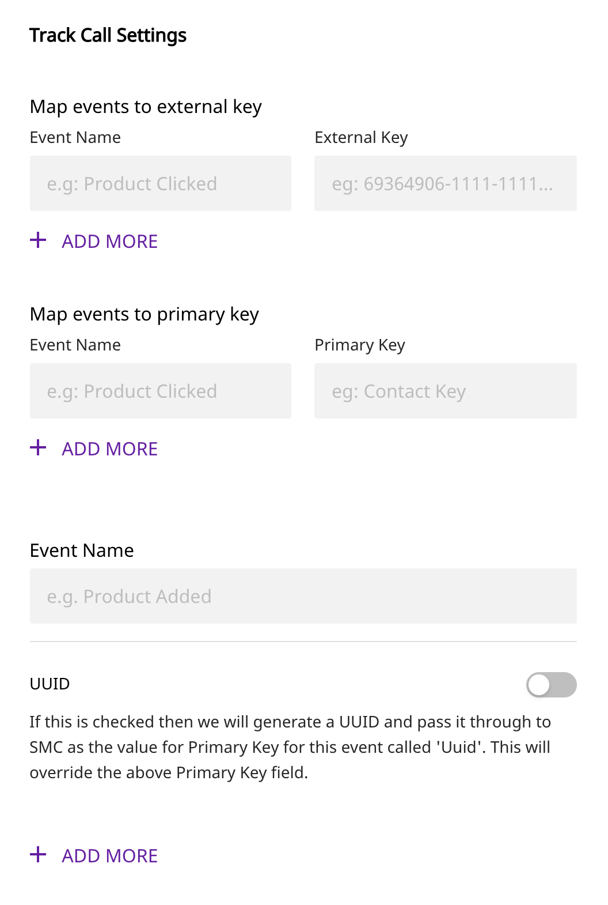

# Salesforce Marketing Cloud

[Salesforce Marketing Cloud](https://www.salesforce.com/in/products/marketing-cloud/overview/) is a digital marketing automation and analytics software and services provider. It was founded in 2000 under the name ExactTarget. It

RudderStack allows you to integrate your source to Salesforce Marketing Cloud and send data to Salesforce Marketing Data Extensions.


**Find the open-source transformer code for this destination in our** [**GitHub repo**](https://github.com/rudderlabs/rudder-transformer/tree/master/v0/destinations/sfmc)**.**


## Getting Started

Before configuring your source and destination on the RudderStack, please verify if the source platform is supported by Salesforce Marketing Cloud by referring to the table below:

| **Connection Mode** | **Web** | **Mobile** | **Server** |
| :--- | :--- | :--- | :--- |
| **Device mode** | - | - | - |
| **Cloud** **mode** | **Supported** | **Supported** | **Supported** |


To know more about the difference between Cloud mode and Device mode in RudderStack, read the [RudderStack connection modes](https://docs.rudderstack.com/get-started/rudderstack-connection-modes) guide.


Once you have confirmed that the platform supports sending events to Salesforce Marketing, perform the steps below:

* From your [RudderStack dashboard](https://app.rudderlabs.com/), add the source. From the list of destinations, select Salesforce.


Follow our guide on [How to Add a Source and Destination in RudderStack](https://docs.rudderstack.com/how-to-guides/adding-source-and-destination-rudderstack) to add a source and destination in RudderStack.


* Give a name to the destination and click on **Next**. You should then see the following screen:




* Settings:

**Client Id, Client Secret:** To get the `clientId` and `clientSecret`, you need to follow these steps.
-  After logging in to your Salesforce marketing account, go to the setup page.
-  Under Platform Tools, you will find Apps where you can select Installed Packages.
-  Click New to create a new package. We recommend giving it a name like "RudderStack".
-  Click Add Component and select API Integration.
-  Select the Server-to-Server Integration Type.
-  The following permissions are needed; otherwise, you'll see insufficient Privileges error from SFMC will be shown.
   - `Email`: Read, Write
   - `Web`: Read, Write
   - `Automations`: Read, Write, Execute
   - `Journeys`: Read
   - `List And Subscribers`: Read, Write
   - `Data Extensions`: Read, Write
   - `Tracking Events`: Read
   - `Webhooks`: Read, Write
-  Click Save.

**Subdomain:** From the URI received, eg: https://mxxxxxxxxxxxxxxxxxxxx.rest.marketingcloudapis.com/ , mxxxxxxxxxxxxxxxxxxxx is the subdomain.

**Do not create or update contacts:** To disable creating or updating contacts during an identify call, set this option to `true`.

**Identify Data External Key:** Use this setting if you would like RudderStack to send `identify` events for creating or updating Data Extensions in Salesforce Marketing. The External Key of the Data Extension is needed for mapping the data. This can be found in the SFMC interface by going to Data & Analytics, then Contact Builder, then Data Extensions. The extension's name can be found in the External Key column.

**Map events to External Key:** Use this setting if you would like RudderStack `track` events for creating or updating Data Extensions in Salesforce Marketing. The External Key of the Data Extension is needed for mapping the data. You can find this in the Salesforce Marketing interface by going to Data & Analytics, then Contact Builder, then Data Extensions. The extension's name can be found in the External Key column.

**Map events to Primary Key:** The target Data Extension's Primary Key. If a value is not provided, it defaults to Contact Key. You can add multiple primary keys by separating them with commas.

**Event Name to UUID:** If this is checked, we will generate a UUID and pass it through to SMC as the value for Primary Key for this event called 'Uuid'. It will override the above Primary Key field.

## Creating Data Extensions in SFMC

It would be best to create a Data Extension in SFMC to store the Identify and Track calls coming from Rudder. For each trait (for `identify` calls) or properties (for track calls) you want to send to Salesforce Marketing Cloud, you should create an attribute on the Data Extension in the interface.

In SFMC, keys that are not present in the selected data extension are ignored, so those attributes must be created before you send them to SFMC.  If you send a trait/property `"phone": "99999"` with your data, but there's no matching phone column in SFMC's table, that trait/property will be ignored. All of the traits/properties in an Identify/Track call are not needed to be created as attributes in data extensions only the required ones should be created.

All attributes in the Data Extension should be created in Title Case, regardless of the casing used in your Rudder Identify/Track calls. When Rudder sends Identify/Track calls to SFMC they are first transformed  into Title Case. A Primary Key for the Identify Data Extension called **Contact Key** is required to be created. Rudder will use this to link the users to Salesforce marketing cloud's built-in **Contact Key** key. This field will be populated with `userId` or `email` by default in Identify calls.

For setting up Primary Keys in Track calls, you can set up different primary keys for various events. If no primary key is set, the default primary key will be Contact Key. You can specify multiple comma-separated primary keys if you have multiple primary keys in your data extension. When creating data extensions, the "Is Sendable" box should be checked if you want to send emails or push notifications based on this data. If this data is used to send emails, Email attributes will be set, which will be called "EmailAddress". Copy the External Key for the particular Data Extension, which you will set in the destination setting of RudderStack.

Below is an example of a Data Extension for an Identify call that will store  Email, First Name, and Last Name, and Phone traits.
[An example of a Data Extension for an Identify call ](../.gitbook/assets/sfmc-1.png)

## Identify

The following code snippet demonstrates a sample `identify` call in RudderStack:

```javascript
rudderanalytics.identify("userid", {
  name: "John Doe",
  title: "CEO",
  email: "name.surname@domain.com",
  company: "Company123",
  phone: "123-456-7890",
  state: "Texas",
  rating: "Hot",
  city: "Austin",
  postalCode: "12345",
  country: "US",
  street: "Sample Address",
  state: "TX",
  createdAt: new Date().toJSON().slice(0, 10).replace(/-/g, "/"),
});
```

Identify events will create or update the contacts in Salesforce marketing cloud if "Do Not Create or Update Contacts". is turned off; otherwise, no create or update of contacts will occur.


Add your Data Extension external key on our dashboard. UserId or email trait is required in every Identify call; otherwise the event will not be triggered. Salesforce marketing cloud does not allow colon characters (":") in the Contact Key field, so they must be removed from any `userId` fields. SFMC doesn't handle nested objects. SFMC only accepts ISO-8601 type dates and rejects any other types if the attribute is of DateTime. E.g.: `createdAt` trait in the above snippet.

## Track

The following code snippet demonstrates a sample `track` call in RudderStack:

```javascript
rudderanalytics.identify("Event Name", {
  Plan: "plan value",
});
```
Enter your external key, the primary key against each event. If no primary key is set, the default value of the Contact Key is taken. Multiple primary keys can be set by separating them with commas. You can turn on UUID for particular events if it is on set UUID as a primary key in your data extensions. The `messageId` is set as the UUID.

## Data Formatting and Mapping


The Rudder SDKs and libraries will automatically collect context properties which can be passed as properties in SFMC as attributes for the data extension.
To use `context` properties, attributes in the Data Extensions with specific naming conventions should be set. The table below lists the Rudder context properties available for SFMC and the Data Extension attribute names they map to. Camel cases and snake cases will be formatted to title cases.

| **Rudder context Properties** | **SFMC Attribute name** |
| :--- | :--- |
| `app.name` | `App Name` |
| `app.version` | `App Version` |
| `app.build` | `App Build` |
| `campaign.name` | `UTM Campaign` |
| `campaign.source` | `UTM Source` |
| `campaign.medium` | `UTM Medium` |
| `campaign.term` | `UTM Term` |
| `campaign.content` | `UTM Content` |
| `locale` | `Locale` |
| `userAgent` | `User Agent` |
| `ip` | `IP Address` |
| `device.adTrackingEnabled` | `Ad Tracking Enabled` |
| `device.manufacturer` | `Device Manufacturer` |
| `device.mode`l| `Device-model` |
| `device.name` | `Device Name` |
| `device.type` | `Device Type` |
| `network.bluetooth` | `Bluetooth Enabled` |
| `network.carrier` | `Network Carrier` |
| `network.cellula`r| `Cellular Enabled` |
| `network.wifi` | `Wifi Enabled` |
| `screen.density` | `Screen Density` |
| `screen.height` | `Screen Height` |
| `screen.width` | `Screen Width` |

## Contact Us

If you come across any issues while configuring Salesforce with RudderStack, please feel free to [contact us](mailto:docs@rudderstack.com). You can also start a conversation on our [Slack](https://resources.rudderstack.com/join-rudderstack-slack) channel; we will be happy to talk to you!

