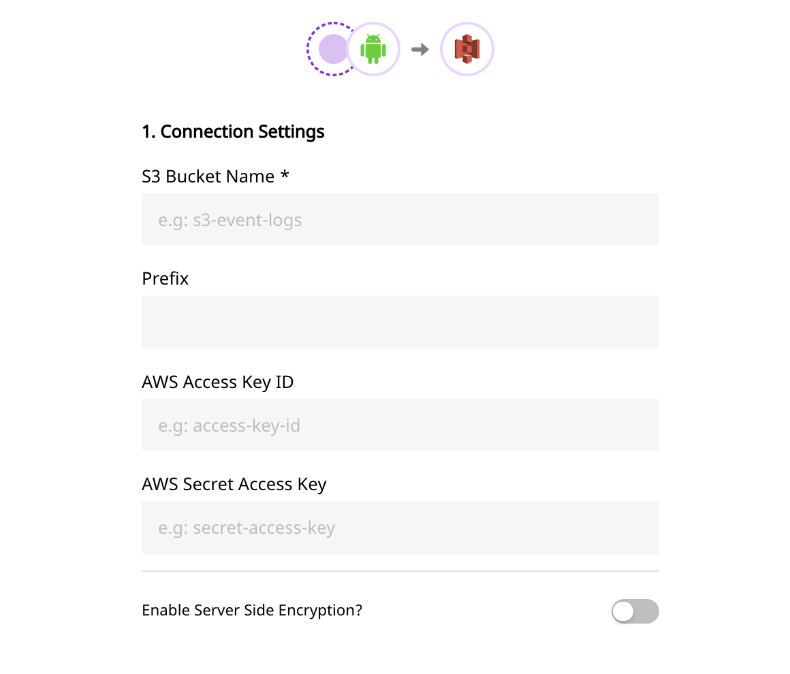
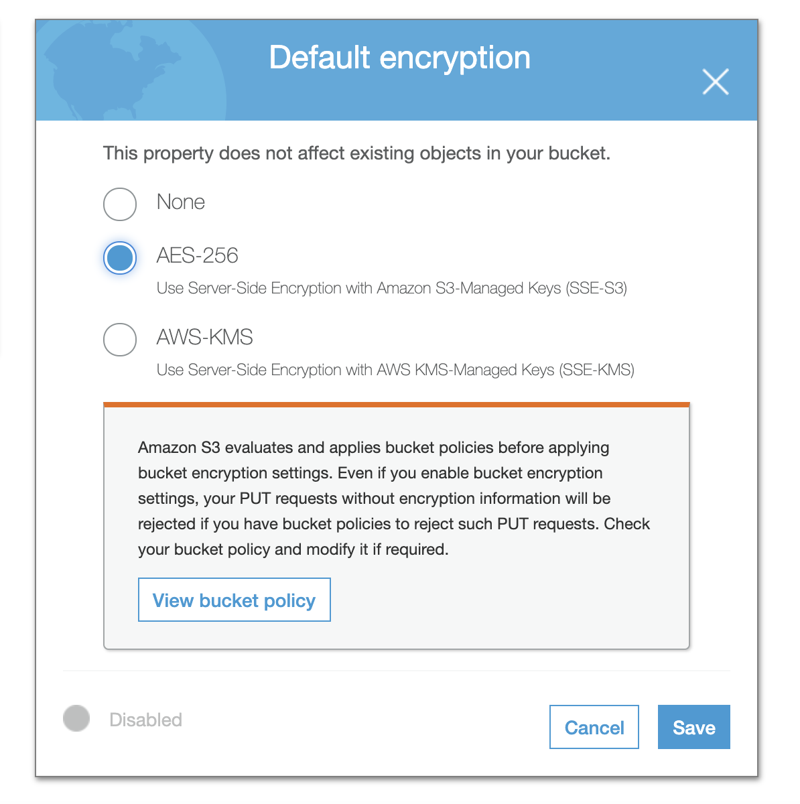

# Amazon S3

[Amazon S3](https://aws.amazon.com/s3/) \(Simple Storage Service\) is a cloud-based object storage service that allows customers and businesses to store their data securely, and at scale. With an easy to use interface and management features, S3 allows for effortless organizing of data to meet the business-specific requirements.

RudderStack allows you to configure Amazon S3 as a destination to which you can dump your event data seamlessly.

<div class="successBlock">

  **Find the open-source transformer code for this destination in our <a href="https://github.com/rudderlabs/rudder-transformer/tree/master/v0/destinations/s3">GitHub repo</a>.**
</div>

## Setting up Amazon S3

Follow these steps to set up Amazon S3 before adding it as a destination in RudderStack:

- Login to your [Amazon AWS S3 console](https://aws.amazon.com/console/).
- Create a new bucket. Alternatively, you can also choose already existing bucket.

## Permissions

The Following are two ways to give permissions to RudderStack for writing in your bucket. You can choose one of them based on your internal security policies. The First option is the easiest.

#### 1. Creating Credentials for an IAM user and providing it to RudderStack

- Login to your [Amazon AWS IAM Console](https://console.aws.amazon.com/iam/home?region=us-east-1)
- Create an IAM user with programmatic access and choose a policy that has write access to your bucket. Here is a reference for the policy.

```javascript
{
  "Version": "2012-10-17",
  "Statement": [
    {
      "Effect": "Allow",
      "Action": "s3:PutObject",
      "Resource": "arn:aws:s3:::YOUR_BUCKET_NAME/*"
    }
  ]
}
```

- Make a note of both access key ID and secret access key as these will be required while configuring S3 as a destination

<div class="infoBlock">

If the AWS credentials are **already configured** on your instance where the RudderStack server is set up, you will **not** need the security credentials.

</div>

#### 2. Allow RudderStack user to write into your bucket

- In order to allow RudderStack user to write into your bucket, you have to add the following JSON in your bucket policy.

```javascript
{
  "Version": "2012-10-17",
  "Statement": [
    {
      "Effect": "Allow",
      "Principal": {
        "AWS": "arn:aws:iam::422074288268:user/s3-copy"
      },
      "Action": ["s3:PutObject", "s3:PutObjectAcl"],
      "Resource": ["arn:aws:s3:::YOUR_BUCKET_NAME/*"]
    }
  ]
}
```

- Replace `YOUR_BUCKET_NAME` in the above JSON with your bucket name. By adding the above policy, RudderStack user \(_arn:aws:iam::422074288268:user/s3-copy_\) has the permission to write into your bucket.

<div class="infoBlock">

The above approach will only work if you are using managed RudderStack

</div>

If you are hosting RudderStack on your instances and don't want to follow option 1, then you have to create your IAM user with programmatic access and attach the below policy.

```javascript
{
  "Version": "2012-10-17",
  "Statement": [
    {
      "Effect": "Allow",
      "Action": "*",
      "Resource": "arn:aws:s3:::*"
    }
  ]
}
```

- Add the following bucket policy to your bucket. Replace ACCOUNT_ID, USER_ARN, YOUR_BUCKET_NAME with your AWS account id, the above created user arn, your bucket name.

```javascript
{
  "Version": "2012-10-17",
  "Statement": [
    {
      "Effect": "Allow",
      "Principal": {
        "AWS": "arn:aws:iam::ACCOUNT_ID:user/USER_ARN"
      },
      "Action": ["s3:PutObject", "s3:PutObjectAcl"],
      "Resource": ["arn:aws:s3:::YOUR_BUCKET_NAME/*"]
    }
  ]
}
```

- Add the above created IAM user programmatic access credentials to the environment of your RudderStack

```markup
RUDDER_AWS_S3_COPY_USER_ACCESS_KEY_ID=<above created user access key>
RUDDER_AWS_S3_COPY_USER_ACCESS_KEY=<above created user secret access key>
```

## **Configuring** Amazon S3 **in RudderStack**

In order to enable dumping data to Amazon S3, you will first need to add it as a destination to the source from which you are sending event data. Once the destination is enabled, events from RudderStack will start flowing to Amazon S3. You will start seeing the files created in your S3 bucket.

To do so, please follow these steps:

- Choose a source to which you would like to add Amazon S3 as a destination. You can also simply create a destination and connect it to a source later.

<div class="infoBlock">

Please follow our guide on <a href="https://www.rudderstack.com/docs/rudderstack-cloud/destinations/#adding-a-destination">Adding a Destination</a> to add a destination in RudderStack.

</div>

- Select the destination as **Amazon S3** to your source. Give your destination a name and then click on **Next**.
- Next, in the **Connection Settings**, fill all the fields with the relevant information \(please refer to the Setting up Amazon S3 section above\) and click on **Next**.


<span class="imageTitle">S3 Destination Settings</span>

<div class="infoBlock">

If the AWS credentials are already configured on your data plane's environment via [environment credentials](https://docs.aws.amazon.com/sdk-for-go/v1/developer-guide/configuring-sdk.html#specifying-credentials) or by following the [below steps](https://rudderstack.com/docs/destinations/storage-platforms/amazon-s3/#permissions), you can skip adding the credentials in this step. Only the S3 Bucket Name is required.

</div>

- If you need any transformation, choose one from the list. Else, click on **Next**.

That's it! You have successfully added Amazon S3 as a destination in RudderStack. Once you send an event from your source, you can find it dumped to your S3 bucket.

## Encryption

Amazon S3 provides encryption at rest. Object gets encrypted while saving it to S3 and gets decrypted before downloading from S3. S3 provides a way to set the default encryption behavior for a bucket. You can set the default encryption on a bucket from its properties. The objects are encrypted using server-side encryption with either Amazon S3-managed keys \(SSE-S3\) or AWS Key Management Service \(AWS KMS\) customer master keys \(CMKs\).

### Server-Side Encryption: Using AWS KMS \(SSE-KMS\)

RudderStack can write to S3 buckets when default encryption is set to AWS-KMS. Objects are encrypted using customer managed keys \(CMK\) when uploaded to the bucket. CMK can be created in your AWS Key Management Service \(KMS\). Follow the steps below to enable encryption using AWS KMS Managed Keys:

- Create a new customer managed key in Key Management Services \(KMS\) and add your IAM user in the key usage permission section. This will allow the IAM user to use the key for cryptographic operations
- Choose the above created CMK when you set AWS-KMS in the default Encryption property for the bucket

<div class="infoBlock">

Amazon S3 supports only [symmetric CMKs](https://docs.aws.amazon.com/kms/latest/developerguide/symm-asymm-concepts.html#symmetric-cmks)

</div>

### Server-Side Encryption: Using Amazon S3 Managed Keys \(SSE-S3\)

When Server Side Encryption is enabled from S3 destination settings, RudderStack adds a header `x-amz-server-side-encryption` with value `AES256` to the put's object request, So that [S3 will encrypt the object with AES256 encryption algorithm.](https://docs.aws.amazon.com/AmazonS3/latest/dev/SSEUsingRESTAPI.html)

You can also set the Default Encryption property to `AES-256` for the bucket, by which S3 will encrypt the object when its uploaded irrespective of the header `x-amz-server-side-encryption`



## Contact Us

If you come across any issues while configuring Amazon S3 with RudderStack, please feel free to [contact us](mailto:%20docs@rudderstack.com). You can also start a conversation in our [Slack](https://rudderstack.com/join-rudderstack-slack-community) community; we will be happy to talk to you!
