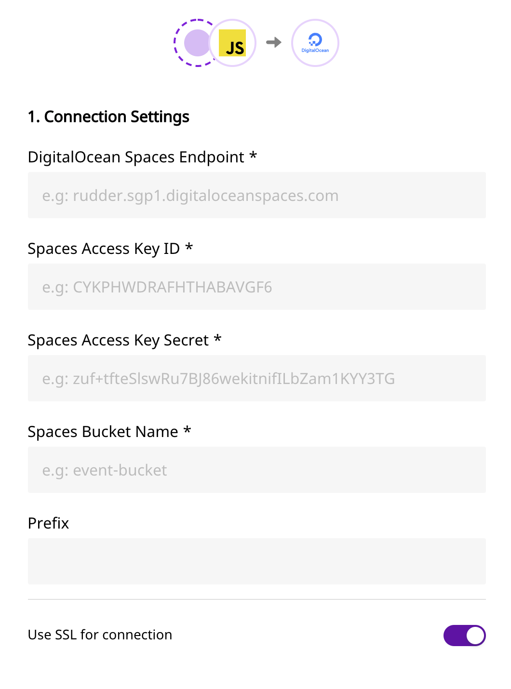

# DigitalOcean Spaces

DigitalOcean Spaces is an S3-compatible object storage service that lets you store and serve large amounts of data. Each Space is a bucket for you to store and serve files. The free, built-in Spaces CDN minimizes page load times, improves performance, and reduces bandwidth and infrastructure costs.

RudderStack allows you to configure Spaces as a destination to which you can dump your event data seamlessly.

  **Find the open-source transformer code for this destination in our <a href="https://github.com/rudderlabs/rudder-transformer/tree/master/v0/destinations/digital_ocean_spaces">GitHub repo</a>.**

## Setting up Spaces

Please follow these steps to set up Spaces before adding it as a destination in RudderStack:

- Login to your DigitalOcean Spaces service
- Create a new bucket. Alternatively, you can also use an already existing bucket.
- You will need to provide `access key ID` and `secret access key` to authorize RudderStack to write to your bucket.
- Make a note of both the `access key ID` and `secret access key` as these will be required while configuring Spaces as a destination.

## **Configuring** Spaces **in RudderStack**

In order to enable dumping data to Spaces bucket, you will first need to add it as a destination to the source from which you are sending event data. Once the destination is enabled, events from RudderStack will start to flow to Spaces bucket. You will start seeing the files created in your Spaces bucket.

To do so, please follow these steps:

- Choose a source to which you would like to add DigitalOcean Spaces as a destination. You can also simply create a destination and connect it to a source later.

Please follow our guide on <a href="https://www.rudderstack.com/docs/rudderstack-cloud/destinations/#adding-a-destination">Adding a Destination</a> to add a destination in RudderStack.

- Select the destination as **Spaces** to your source. Give your destination a name and then click on **Next**.
- Next, in the **Connection Settings**, fill all the fields with the relevant information \(please refer to the [Setting up Spaces](https://app.gitbook.com/@rudderlabs/s/rudderlabs-1/~/drafts/-MENL7MCfgJKc4EqjP-S/destinations/digitalocean-spaces) section above\) and click on **Next**.

Spaces connection settings

- If you need any transformation, choose one from the list. Else, click on **Next**.

That's it! You have successfully added Spaces as a destination in RudderStack. Once you send an event from your source, you can find it dumped to your Spaces bucket.

## Contact Us

If you come across any issues while configuring DigitalOcean Spaces with RudderStack, please feel free to [contact us](mailto:%20docs@rudderstack.com). You can also start a conversation in our [Slack](https://rudderstack.com/join-rudderstack-slack-community) community; we will be happy to talk to you!
