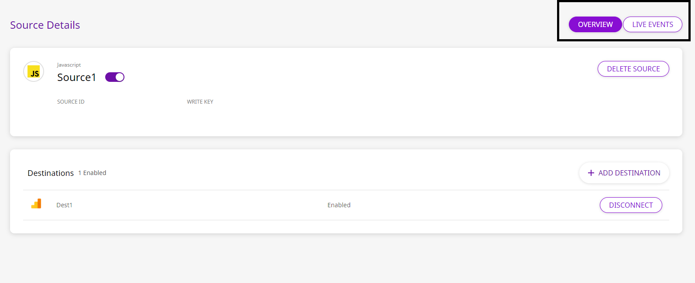
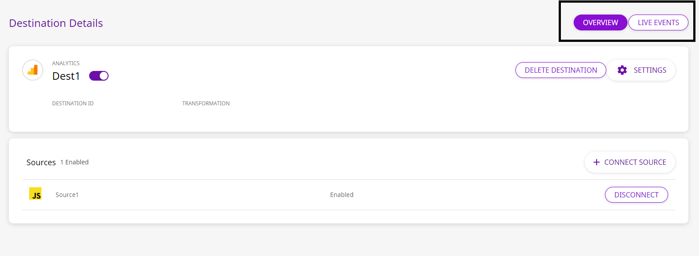

# Amazon EventBridge

[Amazon EventBridge](https://aws.amazon.com/eventbridge/) is a serverless event bus that allows you to connect applications using data from your own apps, integrated SaaS applications, or AWS services. You can collect streams of real time data from a variety of event sources such as Zendesk, Pagerduty, and more, and route them to your preferred endpoints such as AWS Lambda. EventBridge also allows you to set up routing rules that determine where and how to send your data to your application, and how it reacts to the data sources in real-time.

RudderStack allows you to configure Amazon EventBridge as a destination to which you can send your event data seamlessly.

<div class="successBlock">

  **Find the open-source transformer code for this destination in our <a href="https://github.com/rudderlabs/rudder-transformer/tree/master/v0/destinations/eventbridge">GitHub repo</a>.**
</div>

## **Getting Started**

In order to enable dumping data to Amazon EventBridge, you will first need to add it as a destination to the source from which you are sending event data. Once the destination is enabled, events from RudderStack will start to flow to Amazon EventBridge. Before configuring your source and destination on the RudderStack app, please check whether the platform you are working on is supported by Amazon EventBridge. Refer to the table below:

| **Connection Mode** | **Web**       | **Mobile**    | **Server**    |
| :------------------ | :------------ | :------------ | :------------ |
| **Device mode**     | -             | -             | -             |
| **Cloud mode**      | **Supported** | **Supported** | **Supported** |

<div class="infoBlock">

To know more about the difference between Cloud mode and Device mode in RudderStack, read the <a href="https://rudderstack.com/docs/connections/rudderstack-connection-modes/">RudderStack connection modes</a> guide.

</div>

Once you have confirmed that the platform supports sending events to EventBridge, perform the steps below:

- Choose a source to which you would like to add Amazon EventBridge as a destination.

<div class="infoBlock">

Please follow our <a href="https://rudderstack.com/docs/connections/adding-source-and-destination-rudderstack/">Adding a Source and Destination</a> guide to know how to add a source in RudderStack.

</div>

- Select the destination as **Amazon EventBridge** to your source. Give your destination a name and then click on **Next**.
- Next, in the **Settings** section, \***\*fill all the fields with the relevant information and click **Next.\*\* A brief description of each of these fields is mentioned below:

<span class="imageTitle">EventBridge Destination Settings on the RudderStack Dashboard</span>

- **AWS Credentials**
  - **AWS Region**: Enter the AWS region in which you have created the EventBridge bus.This is a **required** field.
  - The **AWS Access Key ID** and **AWS Secret Access Key** are required to authorize RudderStack in order to write to the configured event bus.

<div class="infoBlock">

To authorize RudderStack, you will need to create an IAM policy that provides the required permission to write to your event bus. Please refer to the <a href="https://docs.aws.amazon.com/eventbridge/latest/userguide/iam-identity-based-access-control-eventbridge.html">Using Identity-Based Policies (IAM Policies) for EventBridge</a> guide to know the applicable policies.
</div>

<div class="successBlock">

  Please note that if the AWS credentials are **already configured** on your machine where the RudderStack server is set up, you will **not** need the security credentials.
</div>

The following snippet shows an example of a permissions policy that allows a user to put event data into Kinesis:

```javascript
{
  "Version": "2012-10-17",
  "Statement": [
    {
      "Sid": "CloudWatchEventsInvocationAccess",
      "Effect": "Allow",
      "Action": ["kinesis:PutRecord"],
      "Resource": "*"
    }
  ]
}
```

- **EventBridge Settings**
  - **Event Bus Name:** Specify the name of the event bus you want to send the events to. If no event bus name is specified, the event will be sent to the default bus.
  - **Detail Type:** Specify the value for `detail-type` , which you would like to send to EventBridge.This is a **required** field.
- **Amazon Resources**
  - **Amazon Resource Name:** This field contains an ARN \(Amazon Resource Name\) that identifies a resource that is involved in your EventBridge setup. To add multiple ARNs \(for targets which might be involved in your setup\), you can click on **+ ADD MORE**.

## Sending Events to Amazon EventBridge

We map a RudderStack event to an EventBridge event in the following manner:

| RudderStack          | EventBridge        |
| :------------------- | :----------------- |
| Event payload        | **`Detail`**       |
| Amazon Resource Name | **`Resources`**    |
| Detail Type          | **`DetailType`**   |
| Event Bus Name       | **`EventBusName`** |
| `"rudderstack"`      | **`Source`**       |

- **Event Payload** - This is the generated event payload
- **Amazon Resource Name, Detail Type, Event Bus Name** - These are the values you configured while setting up the destination with RudderStack.

## FAQs

### Why are the events not visible on my EventBridge target?

Verify that you are sending the events in the **Live Events** tab of your source.

<span class="imageTitle">Live Events in Source Details Page</span>

You can also check for any delivery failures in the **Live Events** tab of your destination.

<span class="imageTitle">Live Events in the Destination Details Page</span>

## Contact Us

If you come across any issues while configuring AWS EventBridge as a destination with RudderStack, please feel free to [contact us](mailto:%20docs@rudderstack.com). You can also start a conversation in our [Slack](https://rudderstack.com/join-rudderstack-slack-community) community; we will be happy to talk to you!
