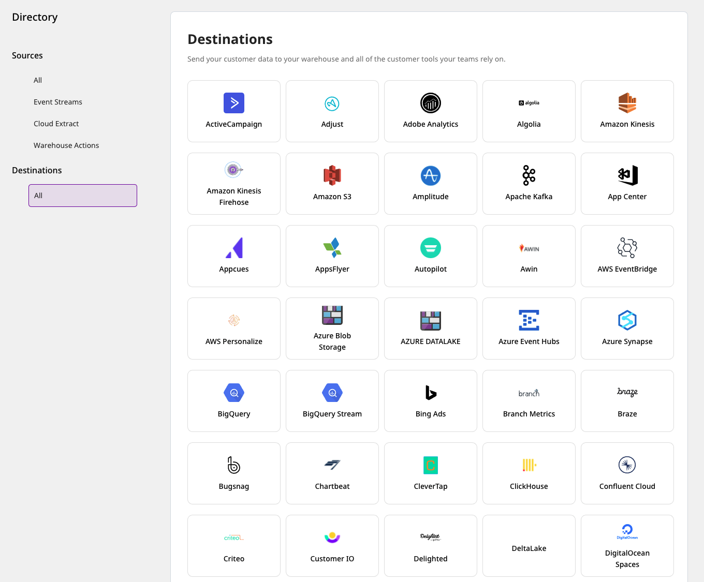
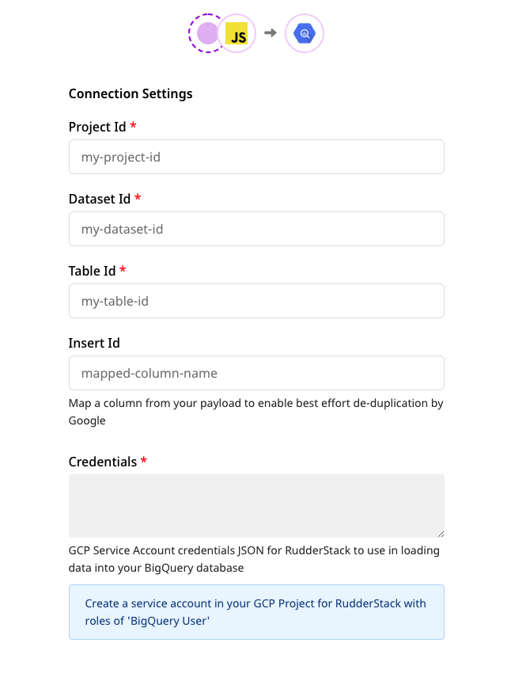
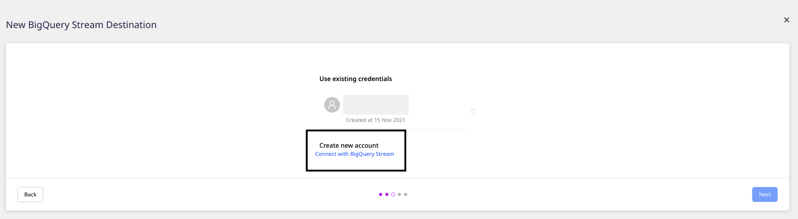
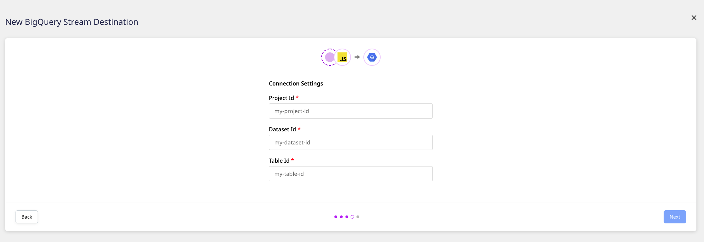
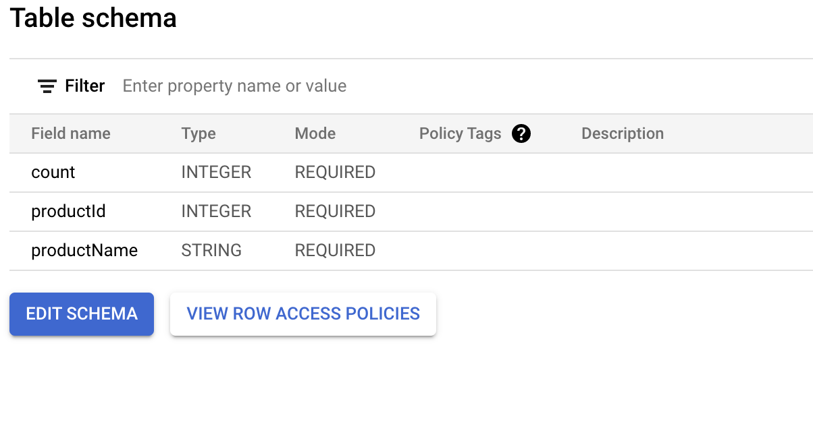
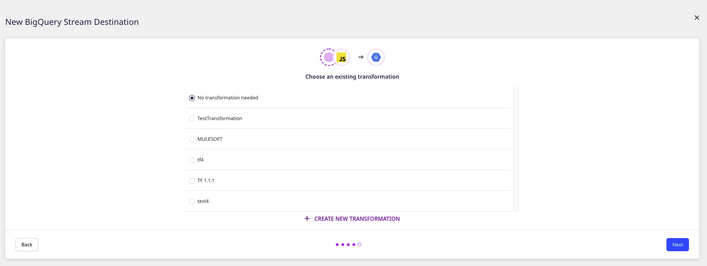
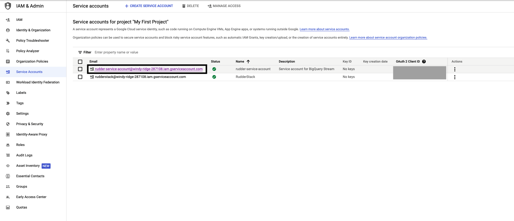

# BigQuery Stream

[**Google BigQuery**](https://cloud.google.com/bigquery) lets you stream your event data by leveraging its [**streaming API**](https://cloud.google.com/bigquery/docs/samples/bigquery-table-insert-rows). Because of its real-time nature, this approach is very useful as it avoids the delay encountered in running a load job using the batching mechanism. You can also have the streamed data available for analysis within no time.

RudderStack supports BigQuery Stream as a destination to which you can steam your event data seamlessly.

## Getting started

To send your events to BigQuery Stream via RudderStack, you will first need to add it as a destination in the RudderStack dashboard.

Before you get started, check if the source platform is supported by BigQuery Stream by referring to the table below:

| Connection Mode | Web       | Mobile    | Server   |
| :------------------ | :------------ | :------------ | :------------ |
| **Device mode**     | -             | -             | -             |
| **Cloud mode**      | **Supported** | **Supported** | **Supported** |

<div class="infoBlock">

To know more about the difference between cloud mode and device mode in RudderStack, read the <a href="https://rudderstack.com/docs/connections/rudderstack-connection-modes/">RudderStack connection modes</a> guide.
</div>

Once you've confirmed that the source platform supports sending events to BigQuery Stream, follow these steps:

- From your [**RudderStack dashboard**](https://app.rudderstack.com/), add the source. Then, select **BigQuery Stream** from the list of destinations.



<div class="infoBlock">

Follow our guide on <a href="https://rudderstack.com/docs/connections/adding-source-and-destination-rudderstack/">Adding a Source and Destination in RudderStack</a> for more information.
</div>

- Assign a name to this destination and click on **Next**. You should then see the following screen:



### Connection settings

To configure BigQuery Stream as a destination in RudderStack, you will need to add the following fields in the dashboard:

- **Project ID**: Enter your BigQuery project ID here.

- **Dataset ID**: This is the ID of the project dataset associated for which you specified the  **Project ID** above.

- **Table ID**: Provide the ID of the table into which you want to stream the event data.



- **Insert ID**: This is an **optional** field. Enter the insert ID which will be used by Google to de-duplicate the data sent to BigQuery.

<div class="infoBlock">

For more information on the <strong>Insert ID</strong>, refer to the <a href="https://rudderstack.com/docs/destinations/streaming-platforms/bigquery-stream/#insert-id">Insert ID</a> section below.
</div>

- **Credentials**: Enter the contents of the JSON you have downloaded after creating your service account.

<div class="infoBlock">

For more information on creating a service account, refer to <a href="https://rudderstack.com/docs/destinations/streaming-platforms/bigquery-stream/#creating-a-service-account">Creating a service account</a> section below. Note that the service account should have the required access to write to BigQuery.
</div>

- Select a transformation to apply to the events before sending them to the destination. If you do not wish to apply any transformation, select  **No transformation needed** and proceed, as shown:



- Finally, click on **Next** to complete the setup. BigQuery Stream will be set up as a destination in RudderStack.

## Insert ID

Google leverages the `insertId` to de-duplicate the data sent to BigQuery. `insertId` is essentially an event property that uniquely identifies an event.

<div class="infoBlock">

For more information on the de-duplication process in BigQuery, refer to <a href="https://cloud.google.com/bigquery/streaming-data-into-bigquery#dataconsistency">this guide</a>.
</div>

<div class="warningBlock">

RudderStack currently supports only <strong>numeric</strong> or <strong>string</strong> values as `insertId`.
</div>

### Use-case

Consider the following table schema:



If you send an event called `Insert Product` to BigQuery, the `productId` can be used to uniquely identify the product. Hence it can be passed as `insertId`. BigQuery will perform the de-duplication of the data based on this `productId`. 

## Sending events to BigQuery Stream

<div class="warningBlock">

BigQuery Stream supports only <code class="inline-code">track</code> type of events. Also, make sure the <code class="inline-code">track</code> event payload format matches the schema of the table specified in the RudderStack dashboard.
</div>

<div class="infoBlock">

RudderStack currently does not support the <code class="inline-code">templateSupportSuffix</code> feature which creates a table schema during a streaming insert action.
</div>

Suppose you want to stream the events from your web source to BigQuery and the table schema in your BigQuery dataset looks like the following image:


To successfully stream the events, the event tracked from your JavaScript SDK should look like the following:

```html
<!DOCTYPE html>
<html lang="en">

<head>
  <meta charset="UTF-8" />
  <meta http-equiv="X-UA-Compatible" content="IE=edge" />
  <meta name="viewport" content="width=device-width, initial-scale=1.0" />
  <title>Document</title>
  <script>
    rudderanalytics = window.rudderanalytics = [];
    for (
      var methods = [
          "load",
          "page",
          "track",
          "identify",
          "alias",
          "group",
          "ready",
          "reset",
          "getAnonymousId",
          "setAnonymousId",
        ],
        i = 0; i < methods.length; i++
    ) {
      var method = methods[i];
      rudderanalytics[method] = (function(a) {
        return function() {
          rudderanalytics.push(
            [a].concat(Array.prototype.slice.call(arguments))
          );
        };
      })(method);
    }
    rudderanalytics.load("<WRITE_KEY>", "<DATA_PLANE_URL>");

    rudderanalytics.track("relevant event name", {
      productId: 10,
      productName: `Product-10`,
      count: 12
    });
  </script>

  <script src="https://cdn.rudderlabs.com/v1/rudder-analytics.min.js"></script>
</head>
<body>...</body>
</html>
```

Note that the `track` properties in the above payload match with the fields specified in your table schema. Once streamed, you can view this event in your BigQuery console by running the SQL command as shown:



## Troubleshooting

This [**BigQuery documentation**](https://cloud.google.com/bigquery/docs/error-messages) lists the different errors you can possibly encounter while sending data to BigQuery Stream, along with the steps to troubleshoot and resolve them.

## Creating a service account

To a create a service account from your [**Google Cloud Console**](https://console.cloud.google.com), follow these steps:

- In the left sidebar, go to **APIs & Services** and select **Credentials**.

- Then, click on **CREATE CREDENTIALS** and select **Service account**, as shown:


- Enter the service account details and click on **CREATE AND CONTINUE**.

- Then, set the required permissions. Refer to [**this guide**](https://cloud.google.com/bigquery/streaming-data-into-bigquery#required_permissions) for more information on the required IAM permissions.

- After creating the service account, the service account JSON is needed for RudderStack to send the data to BigQuery. To obtain the JSON, go to your service account and click on it.



- Then, go to **KEYS** and click on **ADD KEY** followed by **Create new key**.

- Finally, select the **Key type** as **JSON** and click on **CREATE**.


Your JSON key will be automatically downloaded. Copy and paste the contents of this JSON key in the **Credentials** field while configuring BigQuery Stream as a destination in RudderStack.

## Dynamically configuring `insertId` via the event payload

<div class="warningBlock">

This is an optional feature you can leverage if you are <a href="https://rudderstack.com/docs/user-guides/how-to-guides/dynamic-destination-configuration/#how-to-configure-a-destination-via-the-event-payload">dynamically configuring BigQuery Stream via the event payload</a>.
</div>

If you want to dynamically configure `insertId` via the event payload, make sure that `insertId`is column name present in your schema (or in the `properties` object in the event payload) that is used to uniquely identify an event.

Consider the following schema:


Suppose you have a dynanmic configuration like `{{ message.uniqueId || "productId" }}` for the above schema. There are three cases to consider here:

### Case 1: Unique ID is sent as a value which is not a key in the event properties

Consider the following payload:

```javascript
{
  "properties": {
    "productId": 212,
    "productName": "my product",
    "count": 24
  },
  ...,
  "uniqueId": <some_value> ,
  ...
}
```

In the above case, de-duplication **will not be applicable** as the event properties do not contain `<some_value>` present in the payload.

### Case 2: Unique ID is sent as a value which is a key in  the event properties

Consider the following payload:

```javascript
{
  "properties": {
    "productId": 212,
    "productName": "my product",
    "count": 24
  },
  ...,
  "uniqueId": "productId",
  ...
}
```

In this case, de-duplication **is applicable** as RudderStack sends the `productId` value (`212`) as the `insertId` to Google.

### Case 3: Unique ID is not sent in the event payload

Consider the following payload:

```javascript
{
  "properties": {
    "productId": 212,
    "productName": "my product",
    "count": 24
  },
  ...
}
```

In this case, de-duplication **is applicable** as RudderStack sends the `productId` value (`212`) as the `insertId` to Google.

If you use the dynamic destination configuration for `insertId` by passing a random value (e.g. `1234`) in the above payload, de-duplication will **not be applicable** as the `properties` object does not contain the value `1234`.
 
## Contact us

For queries on any of the sections covered in this guide, you can [**contact us**](mailto:%20docs@rudderstack.com) or start a conversation in our [**Slack**](https://rudderstack.com/join-rudderstack-slack-community) community.
