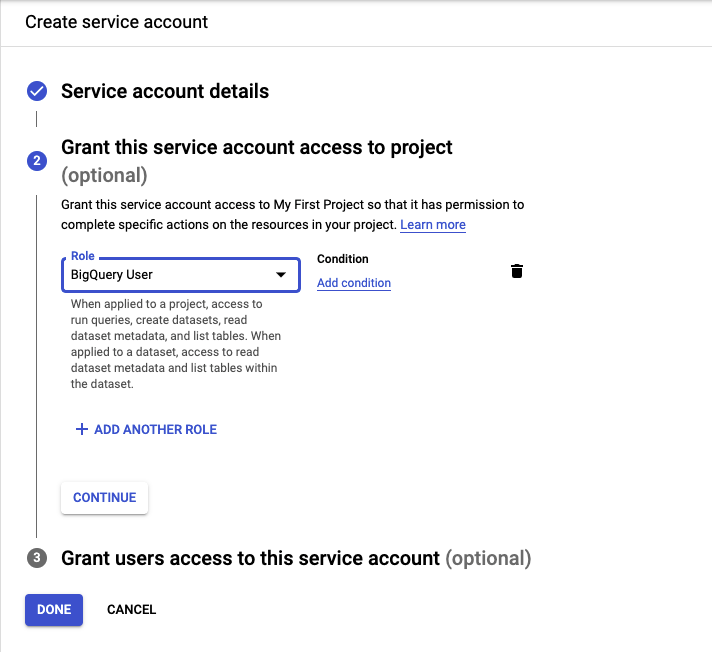
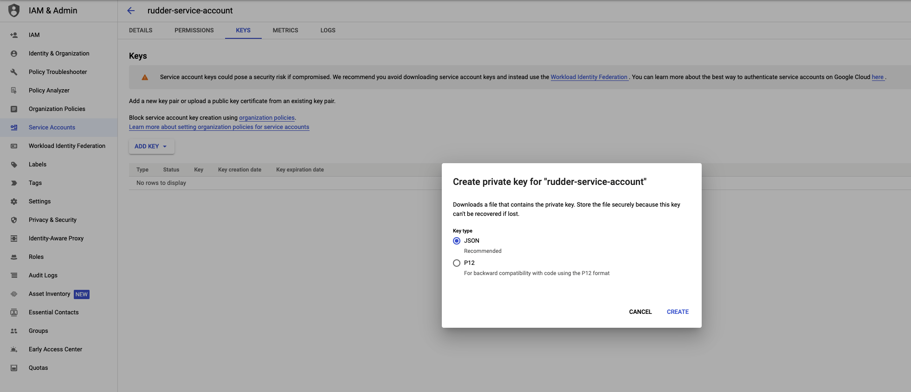

# BigQuery Stream

[Google BigQuery](https://cloud.google.com/bigquery) lets you stream your event data by leveraging its [streaming API](https://cloud.google.com/bigquery/docs/samples/bigquery-table-insert-rows). With this approach, you can insert data into BigQuery in near real-time and have it ready for analysis in no time.

RudderStack supports BigQuery Stream as a destination to which you can steam your event data seamlessly.

## Getting started

First, check if your source platform is supported by BigQuery Stream by referring to the following table:

| Connection Mode | Web       | Mobile    | Server   |
| :------------------ | :------------ | :------------ | :------------ |
| **Device mode**     | -             | -             | -             |
| **Cloud mode**      | **Supported** | **Supported** | **Supported** |

<div class="infoBlock">

To know more about the difference between cloud mode and device mode in RudderStack, refer to the <a href="https://rudderstack.com/docs/connections/rudderstack-connection-modes/">RudderStack Connection Modes</a> guide.
</div>

Once you've confirmed that the source platform supports sending events to BigQuery Stream, follow these steps:

- From your [RudderStack dashboard](https://app.rudderstack.com/), add the source. Then, select **BigQuery Stream** from the list of destinations.

<div class="infoBlock">

Refer to the <a href="https://rudderstack.com/docs/connections/adding-source-and-destination-rudderstack/">Adding a Source and Destination in RudderStack</a> guide for more information.
</div>

- Assign a name to this destination and click on **Next**. You should then see the following screen:


### Connection settings

To configure BigQuery Stream as a destination in RudderStack, you will need to add the following fields in the dashboard:

- **Project ID**: Enter your BigQuery project ID here.

- **Dataset ID**: This is the ID of the project dataset for which you specified the **Project ID** above.

- **Table ID**: Provide the ID of the table into which you want to stream the event data.


- **Insert ID**: This is an **optional** field. Enter the insert ID used by Google to de-duplicate the data sent to BigQuery.

<div class="infoBlock">

For more information on the <strong>Insert ID</strong>, refer to the <a href="#insert-id">Insert ID</a> section below.
</div>

- **Credentials**: Enter the contents of the credentials JSON you downloaded after [creating your service account](#creating-a-service-account).

<div class="infoBlock">

Create a service account in your GCP Project for RudderStack with the <strong>BigQuery User</strong> role, which has the required access to write to BigQuery.
</div>

- Optionally, you can select a transformation to apply to the events before sending them to the destination. If you do not wish to apply any transformation, select  **No transformation needed** and click on **Next** to complete the setup.

## Insert ID

Google leverages the `insertId` to de-duplicate the data sent to BigQuery. `insertId` is essentially an event property that uniquely identifies an event.

<div class="warningBlock">

RudderStack currently supports only <strong>numeric</strong> or <strong>string</strong> values as `insertId`.
</div>

<div class="infoBlock">

For more information on the de-duplication process in BigQuery, refer to this <a href="https://cloud.google.com/bigquery/streaming-data-into-bigquery#dataconsistency">BigQuery documentation</a>.
</div>

### Use-case

Consider the following table schema:


When sending an`Insert Product` event to BigQuery, the `productId` can be used to uniquely identify the product. Hence it can be passed as the `insertId`. BigQuery performs the de-duplication of the data based on this `productId`. 

## Sending events to BigQuery Stream

You can send only `track` events to BigQuery Stream via RudderStack. Also, RudderStack currently does not support batching these events.

<div class="warningBlock">

 Make sure the <code class="inline-code">track</code> event payload format matches the table schema specified in the RudderStack dashboard.
</div>

<div class="infoBlock">

RudderStack currently does not support the <code class="inline-code">templateSupportSuffix</code> feature which creates a table schema during a streaming insert action.
</div>

Suppose you want to stream the events from your web source to BigQuery and the table schema in your BigQuery dataset is as shown:


To successfully stream the events, the event tracked from your JavaScript SDK should look like the following:

```javascript
rudderanalytics.track("event", {
  productId: 10,
  productName: `Product-10`,
  count: 12
});
```

Note that the `track` properties in the above payload match with the fields specified in your table schema. Once streamed, you can view this event in your BigQuery console by running the following SQL command :


## Creating a service account

To a create a service account from your [Google Cloud Console](https://console.cloud.google.com), follow these steps:

1. In the left sidebar, go to **APIs & Services** > **Credentials**.

2. Then, click on **CREATE CREDENTIALS** > **Service account**, as shown:


3. Enter the service account details and click on **CREATE AND CONTINUE**.

4. In the **Select a role** field, search and select the **BigQuery User** role and click on **CONTINUE**.



5. Click on **DONE** to finish the setup.

6. Next, you need the service account credentials JSON required for RudderStack to send the data to BigQuery. To obtain this JSON, go to your service account.


7. Then, go to **KEYS** > **ADD KEY** > **Create new key**.

8. Select the **Key type** as **JSON** and click on **CREATE**.



Your JSON key will be automatically downloaded. Copy and paste the contents of this JSON key in the **Credentials** field while [configuring BigQuery Stream as a destination](#connection-settings) in RudderStack.

## Dynamically configuring `insertId` via the event payload

<div class="infoBlock">

Use this feature if you are <a href="https://rudderstack.com/docs/user-guides/how-to-guides/dynamic-destination-configuration/#how-to-configure-a-destination-via-the-event-payload">dynamically configuring BigQuery Stream via the event payload</a>.
</div>

If you want to dynamically configure `insertId` via the event payload, make sure that `insertId`is column name present in your schema (or in the `properties` object in the event payload) used to uniquely identify an event.

Consider the following schema:


Suppose you have a dynamic configuration like `{{ message.uniqueId || "productId" }}` for the above schema. There are three cases to consider here:

### Case 1: Unique ID is sent as a value which is not a key in the event properties

Consider the following payload:

```javascript
{
  "properties": {
    "productId": 212,
    "productName": "my product",
    "count": 24
  },
  ...,
  "uniqueId": <some_value> ,
  ...
}
```

In the above case, de-duplication **will not be applicable** as the event properties do not contain `<some_value>` present in the payload.

### Case 2: Unique ID is sent as a value which is a key in  the event properties

Consider the following payload:

```javascript
{
  "properties": {
    "productId": 212,
    "productName": "my product",
    "count": 24
  },
  ...,
  "uniqueId": "productId",
  ...
}
```

In this case, de-duplication **is applicable** as RudderStack sends the `productId` value (`212`) as the `insertId` to Google.

### Case 3: Unique ID is not sent in the event payload

Consider the following payload:

```javascript
{
  "properties": {
    "productId": 212,
    "productName": "my product",
    "count": 24
  },
  ...
}
```

In this case, de-duplication **is applicable** as RudderStack sends the `productId` value (`212`) as the `insertId` to Google.

If you use the dynamic destination configuration for `insertId` by passing a random value (e.g. `1234`) in the above payload, de-duplication will **not be applicable** as the `properties` object does not contain the value `1234`.
 
## Troubleshooting

This [BigQuery documentation](https://cloud.google.com/bigquery/docs/error-messages) lists the different errors you can possibly encounter while sending data to BigQuery Stream, along with the steps to troubleshoot and resolve them.

## Contact us

For queries on any of the sections covered in this guide, you can [contact us](mailto:%20docs@rudderstack.com) or start a conversation in our [Slack](https://rudderstack.com/join-rudderstack-slack-community) community.
