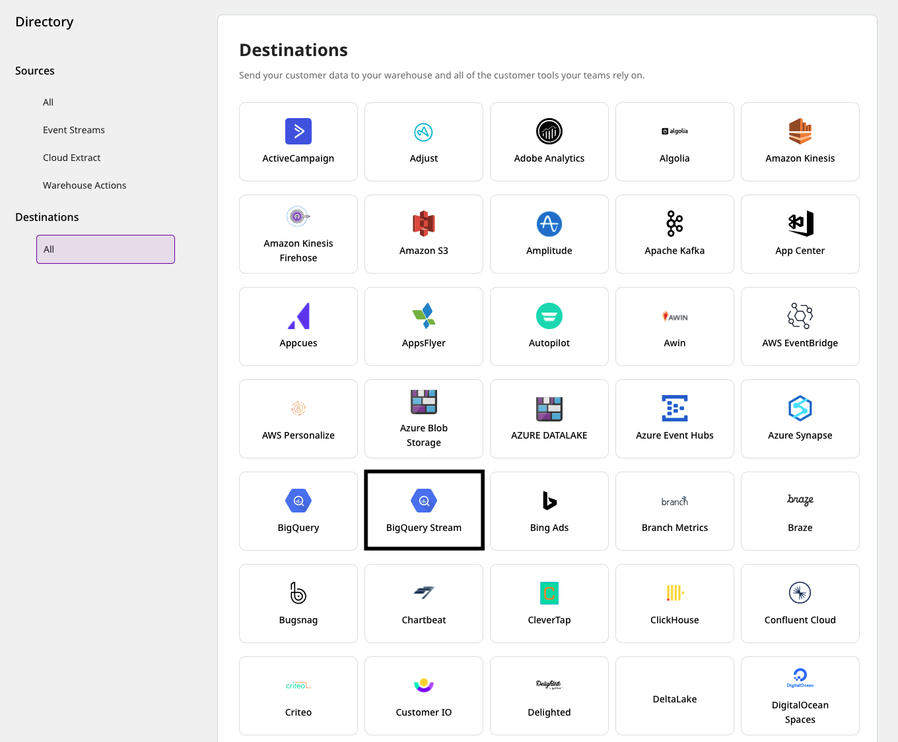

# BigQuery Stream

[**Google BigQuery**](https://cloud.google.com/bigquery) lets you stream your event data by leveraging its [**streaming API**](https://cloud.google.com/bigquery/docs/samples/bigquery-table-insert-rows). Because of its real-time nature, this approach is very useful as it avoids the delay encountered in running a load job using the batching mechanism. You can also have the streamed data available for analysis within no time.

RudderStack supports BigQuery Stream as a destination to which you can steam your event data seamlessly.

## Getting started

To send your events to BigQuery Stream via RudderStack, you will first need to add it as a destination in the RudderStack dashboard.

Before you get started, check if the source platform is supported by BigQuery Stream by referring to the table below:

| Connection Mode | Web       | Mobile    | Server   |
| :------------------ | :------------ | :------------ | :------------ |
| **Device mode**     | -             | -             | -             |
| **Cloud mode**      | **Supported** | **Supported** | **Supported** |

<div class="infoBlock">

To know more about the difference between cloud mode and device mode in RudderStack, read the <a href="https://rudderstack.com/docs/connections/rudderstack-connection-modes/">RudderStack connection modes</a> guide.
</div>

Once you've confirmed that the source platform supports sending events to BigQuery Stream, follow these steps:

- From your [**RudderStack dashboard**](https://app.rudderstack.com/), add the source. Then, select **BigQuery Stream** from the list of destinations.



<div class="infoBlock">

Follow our guide on <a href="https://rudderstack.com/docs/connections/adding-source-and-destination-rudderstack/">Adding a Source and Destination in RudderStack</a> for more details.
</div>

- Assign a name to this destination and click on **Next**.


- Next, you need to give RudderStack the required permissions to access BigQuery Stream. To do so, click on **Connect with BigQuery Stream**, as shown:


<div class="successBlock">

If you have already configured BigQuery Stream as a destination in RudderStack, your credentials should be visible under the **Use existing credentials** option.
</div>

<div class="infoBlock">

The following permissions are granted when you allow RudderStack to access your Google account:

<ul>
    <li>
      <code class="inline-code">https://www.googleapis.com/auth/userinfo.email</code>
    </li>
    <li>
      <code class="inline-code">https://www.googleapis.com/auth/userinfo.profile</code>
    </li>
    <li>
      <code class="inline-code">https://www.googleapis.com/auth/bigquery</code>
    </li>
  </ul>
</div>

- You should then see the following **Connection Settings** screen:


### Connection settings

To configure BigQuery Stream as a destination in RudderStack, you will need to add the following fields in the dashboard:

- **Project ID**: Enter your BigQuery project ID here.

- **Dataset ID**: This is the ID of the project dataset associated for which you specified the  **Project ID** above.

- **Table ID**: Provide the ID of the table into which you want to stream the event data.


- Select a trasnformation to apply to the events before sending them to the destination. If you do not wish to apply any transformation, select  **No transformation needed** and proceed, as shown:


<div class="warningBlock">

If you disable the destination in the RudderStack dashboard and then try to re-enable it later, you may need to reauthorize RudderStack, i.e. give RudderStack the required permissions to access BigQuery Stream. This can happen if:

<ul>
<li>BigQuery access to the account has been revoked.</li>
<li>The access token for the account has expired.</li>
</ul>

Here, <strong>account</strong> refers to the account used to grant RudderStack access to BigQuery.
</div>

## Sending events to BigQuery Stream

<div class="infoBlock">

<strong>BigQuery Stream supports only <code class="inline-code">track</code> type of events.</strong>
</div>

<div class="infoBlock">

RudderStack currently does not support the <code class="inline-code">templateSupportSuffix</code> feature which creates a table schema during a streaming insert action.
</div>

<div class="warningBlock">

To stream events into BigQuery successfully, make sure the <code class="inline-code">track</code> event payload format matches the schema of the table specified in the RudderStack dashboard.
</div>

Suppose you want to stream the events from your web source to BigQuery and the table schema in your BigQuery dataset looks like the following image:


To successfully stream the events, the event tracked from your JavaScript SDK should look like the following:

```html
<!DOCTYPE html>
<html lang="en">

<head>
  <meta charset="UTF-8" />
  <meta http-equiv="X-UA-Compatible" content="IE=edge" />
  <meta name="viewport" content="width=device-width, initial-scale=1.0" />
  <title>Document</title>
  <script>
    rudderanalytics = window.rudderanalytics = [];
    for (
      var methods = [
          "load",
          "page",
          "track",
          "identify",
          "alias",
          "group",
          "ready",
          "reset",
          "getAnonymousId",
          "setAnonymousId",
        ],
        i = 0; i < methods.length; i++
    ) {
      var method = methods[i];
      rudderanalytics[method] = (function(a) {
        return function() {
          rudderanalytics.push(
            [a].concat(Array.prototype.slice.call(arguments))
          );
        };
      })(method);
    }
    rudderanalytics.load("<WRITE_KEY>", "<DATA_PLANE_URL>");

    rudderanalytics.track("relevant event name", {
      productId: 10,
      productName: `Product-10(From JSSDK - to DataPlane)`,
      count: 12
    });
  </script>

  <script src="https://cdn.rudderlabs.com/v1/rudder-analytics.min.js"></script>
</head>
<body>...</body>
</html>
```

Note that the `track` properties in the above payload match with the fields specified in your table schema. Once streamed, you can view this event in your BigQuery console by running the SQL command as shown:


## Troubleshooting

This [**BigQuery documentation**](https://cloud.google.com/bigquery/docs/error-messages) lists the different errors you can possibly encounter while sending data to BigQuery Stream, along with the steps to troubleshoot and resolve them.

## Contact us

For queries on any of the sections covered in this guide, you can [**contact us**](mailto:%20docs@rudderstack.com) or start a conversation on our [**Slack**](https://rudderstack.com/join-rudderstack-slack-community) channel.