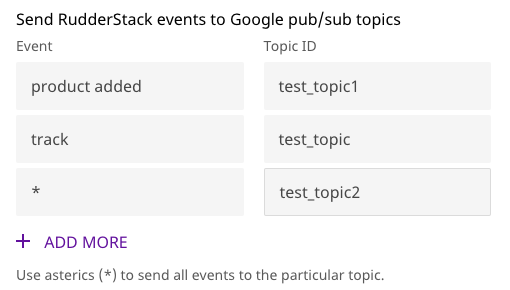

# Google Pub/Sub

[Google Pub/Sub](https://cloud.google.com/pubsub/docs/overview) is an asynchronous messaging service that allows you to decouple the services that produce events from the services that process events. With Pub/Sub, you get durable message storage as well as a real-time message delivery system. The Google Pub/Sub servers run reliably with a consistent performance in all the Google Cloud regions over the world.

RudderStack allows you to configure Google Pub/Sub as a destination and send your event data to it directly.

<div class="successBlock">

  **Find the open-source transformer code for this destination in our <a href="https://github.com/rudderlabs/rudder-transformer/tree/master/v0/destinations/googlepubsub">GitHub repo</a>.**
</div>

## Getting Started

To enable sending data to Google Pub/Sub, you will first need to add it as a destination to the source from which you are sending your event data. Once the destination is enabled, events from our SDK will start flowing to Google Pub/Sub.

| **Connection Mode** | **Web**       | **Mobile**    | **Server**    |
| :------------------ | :------------ | :------------ | :------------ |
| Device mode         | **-**         | **-**         | **-**         |
| Cloud mode          | **Supported** | **Supported** | **Supported** |

<div class="infoBlock">

To know more about the difference between Cloud mode and Device mode in RudderStack, read the <a href="https://rudderstack.com/docs/rudderstack-cloud/rudderstack-connection-modes/">RudderStack connection modes</a> guide.

</div>

Once you have confirmed that the platform supports sending events to Google Pub/Sub, perform the steps below:

- From your [RudderStack dashboard](https://app.rudderlabs.com/), add the source. From the list of destinations, select **Google Pub/Sub.**

<div class="infoBlock">

Please follow our [Adding a Destination](https://www.rudderstack.com/docs/rudderstack-cloud/destinations/#adding-a-destination) guide to add a destination in RudderStack.

</div>

- Give a name to the destination and click on **Next**. You should then see the following screen:

<span class="imageTitle">Google Pub/Sub Connection Settings</span>

- Enter the following details:
  - **Connection Settings**
    - **Project ID** and the **Credentials**: Follow these steps to obtain the project ID as well as the required credentials:
      - Create a service account from Google Cloud Console.
      - You can get the **Project ID** when you log in to your Google Cloud Console.
      - Use the **Select a role** dropdown to add the **Pub/Sub Publisher** role.
      - Create a key as JSON and download it.
      - Paste this downloaded JSON in the **Credentials** field
    - Enter the **Event Name** as well as the corresponding **Topic ID**. You can get the topic id from your topics page, as shown:

<span class="imageTitle">Google Pub/Sub Topic ID and Name</span>

<div class="infoBlock">

You can send an event `type` like `page,` `identify,` `track`.
For the `track` events you can specify the event name based on the `event` name in the payload.

For example:

<ul>
<li>

If the event name is **`page`** it will send all the calls with the `type` page.
</li>
<li>

If the event name is **`product added`** , it will send all the track events with the **`event`** as **`product added`**.
</li>
</ul>
  </div>

<div class="successBlock">

  If you want to send all the events to a particular stream irrespective of the
  type or name, you can use **`*`** as the event name.
</div>

<div class="warningBlock">

The **topic ID** is **case-sensitive** and has to be exactly as seen in Google Pub/Sub. On the other hand, the **event name** is **case insensitive**, and thus `Page` or `page` will both be considered as valid.

</div>

- Finally, click on **Next** to complete the configuration. Pub/Sub should now be added and enabled as a destination in RudderStack.

## Attributes

You can send attributes to Google Pub/Sub along with the message. In order to send the attributes, enter the required attribute mapping in the RudderStack dashboard as seen below:


The following are some examples:

- If the `event` is **`Product Viewed`** and the `key` is **`coupon`**, RudderStack will add the `coupon` key-value pair from the message to the attributes' metadata object.
- If multiple mappings are provided for **`Product Viewed`**, all such key-value pairs from the message body will be added to attributes' metadata object.
- If the event name is **`page`** it will send all the calls with the `type` page.

<div class="warningBlock">

For the `key` fields provided in the attributes map, the `key` is searched in the message body in **`root`**, **`properties`**, **`traits`** and **`context.traits`** - in that specific order.

</div>

**Note: You can also specify the key path in the payload using the dot notation.**

For example:

```javascript
rudderanalytics.track("Track me", {
  category: "category",
  label: "label",
  value: "value",
  metadata: {
    metadataId: "sample-id"
  }
});
```

For the above `track` call, you can specify an attribute mapping for `metadataID` as shown below:

| **Event** | **Field**             |
| :-------- | :-------------------- |
| Track me  | `metadata.metadataId` |

This will create the below attribute metadata object:

```javascript
{
   metadataId: "sample-id"
}
```

## Page

The `page` call contains information related to the page, such as the URL of the web page visited by the user.

<div class="infoBlock">

For more information on the <code class="inline-code">page</code> method, please refer to our <a href="https://rudderstack.com/docs/rudderstack-api">RudderStack API Specification</a> guide.

</div>

A sample `page` payload is as shown in the snippet below:

```javascript
rudderanalytics.page({
  path: "path",
  url: "url",
  title: "title",
  search: "search",
  referrer: "referrer",
})
```

## Identify

The `identify` call captures the relevant details about the visiting user.

<div class="infoBlock">

For more information on the <code class="inline-code">identify</code> method, please refer to our <a href="https://rudderstack.com/docs/rudderstack-api">RudderStack API Specification</a> guide.

</div>

A sample `identify` payload is as shown in the snippet below:

```javascript
rudderanalytics.identify("abc123", {
  name: "FirstName LastName",
  email: "example@gmail.com",
})
```

## Track

The `track` call captures the information related to the actions performed by the user, along with their properties, or traits.

<div class="infoBlock">

For more information on the <code class="inline-code">track</code> method, please refer to our <a href="https://rudderstack.com/docs/rudderstack-api">RudderStack API Specification</a> guide.

</div>

A sample `track` payload is as shown in the snippet below:

```javascript
rudderanalytics.track("Track me", {
  category: "category",
  label: "label",
  value: "value",
})
```

## FAQs

### How does event mapping work with the topic ID?

- If there is no topic ID set for an event, it will not be sent.
- If an event is set with a topic id, the payload will be sent to Pub/Sub to that particular topic id.

<div class="infoBlock">

If you have set all event type, event and * for mapping the priority will be given to <code class="inline-code">event</code> ,
then <code class="inline-code">type</code> , followed by *.

</div>

For example, let the type of event be `track`, the event name be `product added`. The mapping is done as:



Now all the events should go to the topic mapped with **`product added`**.

### How do I provide multiple Attribute mapping for a particular event?

In order to send multiple attribute keys for a particular event, enter the required mappings in the RudderStack dashboard as seen below:


## Contact Us

If you come across any issues while configuring or using Google Pub/Sub with RudderStack, please feel free to [contact us](mailto:%20contact@rudderstack.com). You can also start a conversation in our [Slack](https://rudderstack.com/join-rudderstack-slack-community) community; we will be happy to talk to you!
