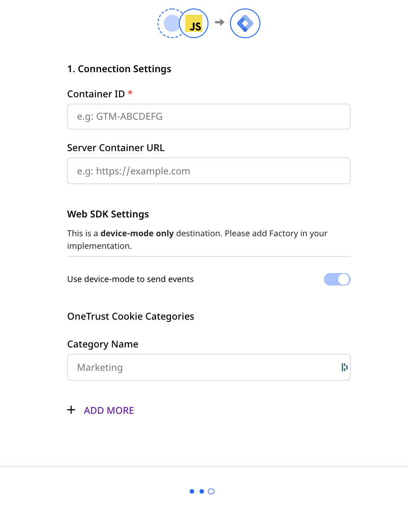
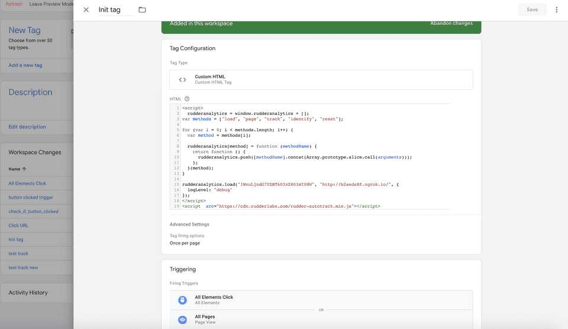
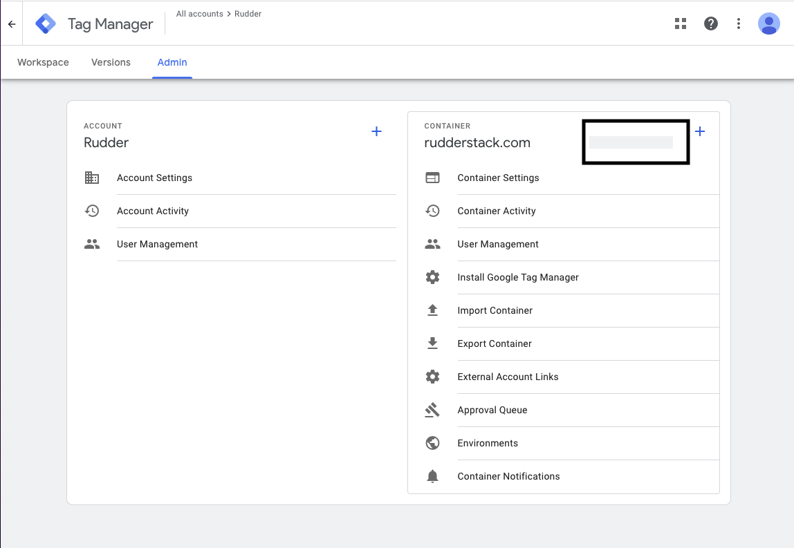
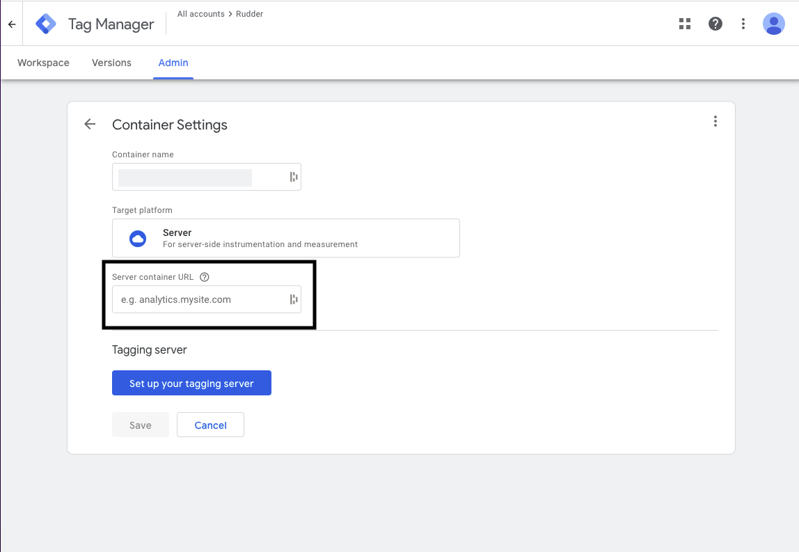

# Google Tag Manager

[**Google Tag Manager**](https://support.google.com/tagmanager) is a popular tag management system that lets you update tags for your web or mobile applications. Once added to your project, you can configure, deploy, and measure your tags from a web-based UI without needing any additional code.

RudderStack supports Google Tag Manager as a destination and enables you to send events to the **GTM dataLayer** using the [**JavaScript SDK**](https://www.rudderstack.com/docs/stream-sources/rudderstack-sdk-integration-guides/rudderstack-javascript-sdk/).

## Getting started

Before configuring Google Tag Manager (GTM) as a destination in RudderStack, verify if the source platform is supported by Google Tag Manager by referring to the table below:

| **Connection Mode** | **Web**       | **Mobile** | **Server** |
| :------------------ | :------------ | :--------- | :--------- |
| **Device mode**     | **Supported** | -          | -          |
| **Cloud mode**      | -             | -          | -          |

<div class="infoBlock">
 
 To know more about the difference between cloud mode and device mode in RudderStack, refer to the <a href="https://rudderstack.com/docs/rudderstack-cloud/rudderstack-connection-modes/">RudderStack Connection Modes</a> guide.
</div>

Once you have confirmed that your source platform supports sending events to Google Tag Manager, follow these steps:

* From your [**RudderStack dashboard**](https://app.rudderstack.com/), add the source. From the list of destinations, select **Google Tag Manager**.
* Assign a name to the destination and click on **Next**. You should then see the following screen:



### Connection settings

The connection settings required to configure Google Tag Manager as a destination in RudderStack are listed below:

- **Container ID**: Add your Google Tag Manager container ID. You can obtain this by going to the **Admin** section of your [**Google Tag Manager dashboard**](https://tagmanager.google.com/#/admin/).

<div class="infoBlock">
 
 For more information on obtaining the container ID, refer to the <a href="#faqs">FAQs</a> section below.
</div>

- **Server Container URL**: Specify Tag Manager server container URL. Use this setting when you want to load the Tag Manager scripts via your server container. For more information, refer to [**this guide**](https://developers.google.com/tag-platform/tag-manager/server-side/send-data#load_google_scripts).

<div class="infoBlock">
 
 For more information on obtaining the server container URL, refer to the <a href="#faqs">FAQs</a> section below.
</div>

- Finally, click on **Next** to complete the setup. Google Tag Manager will now load on any page where the RudderStack snippet is initialized, and `rudderanalytics.page` is called.

### Loading RudderStack as a custom HTML tag

You can also load RudderStack as a custom tag in Google Tag Manager. However, we recommend that you load Google Tag Manager through RudderStack by following the steps described in the above section.

The following image demonstrates how you can add RudderStack as a custom HTML tag which can then be called through Google Tag Manager:



## Page

The `page` call allows you to record whenever a user visits a page of your website, along with the properties associated with that page. 

<div class="warningBlock">

The  <code class="inline-code">page</code> call must be made for Google Tag Manager to load.
</div>

<div class="infoBlock">

In <code class="inline-code">rudderanalytics.js</code> , a <code class="inline-code">page</code> call is included by default, just after `rudderanalytics.load` is executed. This is because this call must be executed <strong>at least once</strong> per page load.
</div>

A sample `page` call is shown below:

```javascript
rudderanalytics.page("home", {
  path: "path",
  url: "url",
  title: "title",
  search: "search",
  referrer: "referrer"
});
```

The above call will populate Google Tag Manager with the following properties along with their values:

- `userId`
- `anonymousId`
- `event` - the viewed `home` page
- `path`
- `url`
- `title`
- `search`
- `referrer`

<div class="infoBlock">

Making a <code class="inline-code">page</code> call will send out an object to the <strong>GTM dataLayer</strong> containing your page-related properties and an event name with its associated value.
</div>

## Track

The `track` call lets you record any user actions along with the properties associated with those actions.

<div class="infoBlock">

You can use the RudderStack <code class="inline-code">track</code> events to populate the Google Tag Manager <code class="inline-code">dataLayer</code> once you have set up and enabled Google Tag Manager in RudderStack.
</div>

Calling the RudderStack SDK `track` method with the event and its properties similarly passes the data to GTM as seen in the [**Page**](https://www.rudderstack.com/docs/destinations/tag-managers/google-tag-manager/#page) section above.

```javascript
rudderanalytics.track("Track me", {
  category: "category",
  label: "label",
  value: "value",
});
```

The above call will populate Google Tag Manager with the following properties along with their values:

- `userId`
- `anonymousId`
- `event`
- `category`
- `label`
- `value`

## FAQs

### Where can I get the GTM Container ID?

You can find your Tag Manager container ID in the admin section of your [**GTM dashboard**](https://tagmanager.google.com/#/admin/). It is of the format **GTM-XXXXXXX**.



### Where do I get the server container URL?

To get your server container URL, follow these steps:

- Click on your server container and go to the **Admin** tab.

- Click on **Container Settings**. You can find the container URL listed here.



### I am getting a 404 error when using Google Tag Manager. What should I do?

If you are getting a 404 error on the JavaScript console of your web page related to the Google Tag Manager, verify if you have published your Google Tag Manager Container. Follow [**this guide**](https://support.google.com/tagmanager/answer/6107163?hl=en) for more information.

## Contact us

For queries on any of the sections covered in this guide, you can [**contact us**](mailto:%20docs@rudderstack.com) or start a conversation in our [**Slack**](https://rudderstack.com/join-rudderstack-slack-community) community.
