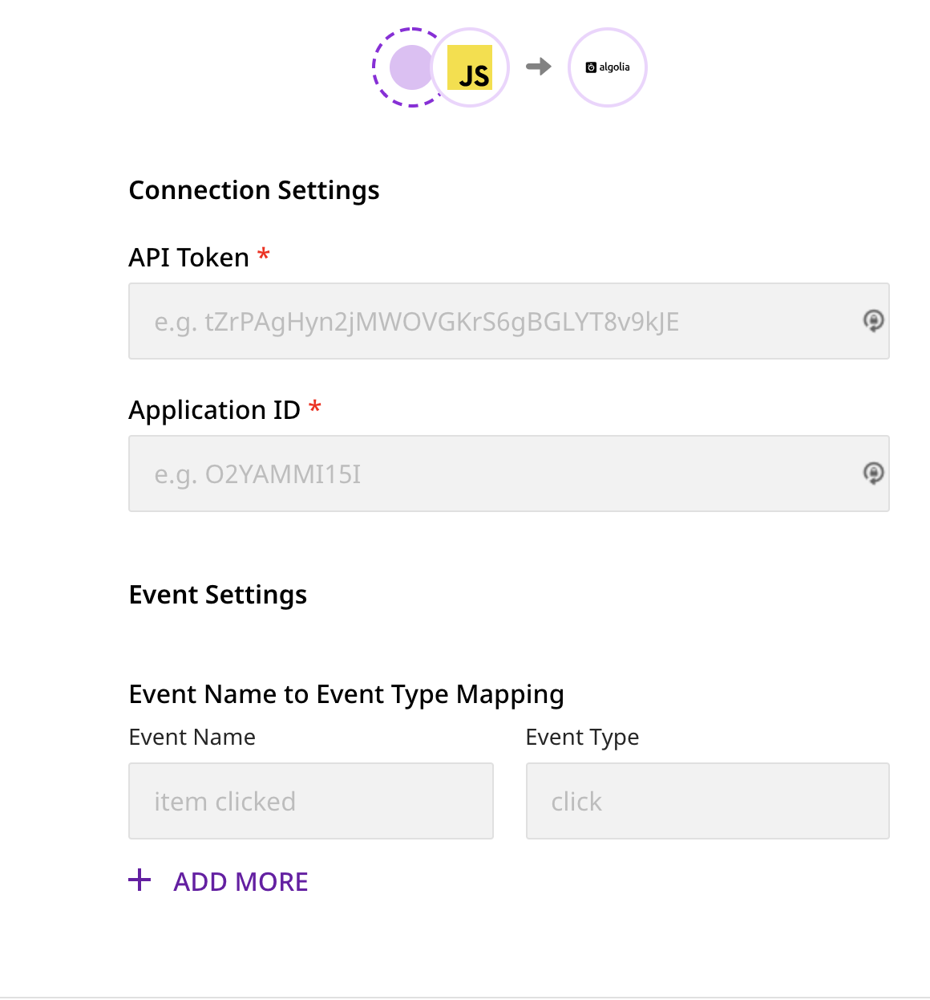

# Algolia Insights

[**Algolia**](https://www.algolia.com/) is a popular site search and discovery platform. It helps businesses build and optimize their users' product search and discovery experience, resulting in enhanced online engagement, increased conversion rates, and better user lifetime value.

RudderStack supports Algolia Insights as a destination to which you can seamlessly send your customer data.

## Getting Started

Before configuring Algolia Insights as a destination in RudderStack, verify if the source platform is supported by Algolia by referring to the table below:

| **Connection Mode** | **Web** | **Mobile** | **Server** |
| :--- | :--- | :--- | :--- |
| **Device mode** | - | - | - |
| **Cloud mode** | **Supported** | **Supported** | **Supported** |

<div class="infoBlock">

To know more about the difference between Cloud mode and Device mode in RudderStack, read the [**RudderStack connection modes**](https://rudderstack.com/docs/rudderstack-connection-modes/) guide.
</div>

Once you have confirmed that your source platform supports sending events to Algolia, follow these steps:

* From your [**RudderStack dashboard**](https://app.rudderstack.com/), add the source. From the list of destinations, select **Algolia**.

<div class="infoBlock">

Follow our guide on [**Connections**](https://rudderstack.com/docs/rudderstack-cloud/connections/) for more information.
</div>

* Assign a name to the destination and click on **Next**. You should then see the following screen:

<span class="imageTitle">Algolia Connection Settings</span>

### Connection Settings

This section details the connection settings required to configure Algolia as a destination in RudderStack.

* Enter your Algolia **API Key** and **Application ID**.

<div class="infoBlock">

To get the Algolia API key and Application ID, go to your [**Algolia dashboard**](https://www.algolia.com/apps/). Under the **API Keys** menu, copy the values under **Application ID** and **Search-Only API Key**.
</div>

* Under **Event Settings**, you can add the **Event Name** and its corresponding **Event Type**. These are optional fields and can also be passed via the `track` call.

<div class="infoBlock">

The `event`-`eventType` mapping passed via the `track` call **will get a higher precedence** over the mapping specified in the dashboard.
</div>

<div class="warningBlock">

If the **Event** - **Event Type** mapping is not specified in the dashboard and these fields are not passed in the `track` call as well, then the event will be discarded.
</div>

* Finally, click on **Next**. Algolia will now be enabled as a destination in RudderStack.

## Track

The `track` call lets you send events related to your customers' product usage. The required fields are `event`, `eventType`, `index`, and either `objectIds` or `filters`.

Note that the **Event Name** \(`event`\) and **Event Type** \(`eventType`\) can be mapped in the dashboard while configuring the destination. Note that the `eventType` value set in `properties` in the `track` call will have a higher precedence over the dashboard mapping.

<div class="infoBlock">

In case you have already specified the mapping in the dashboard, you don't need to send the same `eventType` in the `track` call.
</div>

<div class="warningBlock">

To send a new `event` via `track` which is not specified in the dashboard, make sure you include the `eventType` inside the `properties` of the call. Otherwise, the event will be **discarded**.
</div>

The following table includes all `track` fields with their relative mapping to the Algolia fields:

| **RudderStack Field** | **Algolia Field** |
| :--- | :--- |
| `index` | `index` |
| `eventType` | `eventType` |
| `timestamp` | `timestamp` |
| `queryId` | `queryID` |
| `filters` | `filters` |
| `objectIds` | `objectIDs` |
| `positions` | `positions` |

<div class="infoBlock">

RudderStack looks for these fields within the `properties` field of the event payload. `userId` or `anonymousId` is mapped to `userToken` in Algolia.
</div>

A sample `track` call is as shown:

```javascript
rudderanalytics.track("event name", {
  eventType: "click",
  index: "index1",
  timestamp: 1630649198801,
  objectIds: [ "objId1","objId2"],
  positions: [1,2],
  queryId: "e28d338dbfbbdcb4678d9d30a5e286ee"
});
```

To successfully send events to Algolia, the following criteria must be met:

| **Field** | **Criteria** |
| :--- | :--- |
| `eventType` | Values can only be  either of `click`, `view` or `conversion`. Otherwise, the event will be discarded. |
| `timestamp` | Must be in milliseconds UNIX epoch and must be maximum 4 days old. |
| `queryId` | Must be a 32-character Hexadecimal string. |
| `filters` | Must be an array of strings. **If it has more than 10 strings, only the first 10 values will be passed**. |
| `objectIds` | Must be an array of strings. **If it has more than 20 strings, only the first 20 values will be passed**. |
| `positions` | Must be an array of integers. **It must be passed for only `click` type events. Only the first 20 values will be passed**. |

<div class="infoBlock">

For all the event types \(`eventType`\), either `filters` or `objectIds` must be passed and **not both**. If both or none of the fields are passed, the event will be discarded.
</div>

<div class="infoBlock">

For the `click` event type, if you pass `objectIds`, then you must pass either **both** or **none** of the `positions` and `queryId` fields. If only either of the fields are present, the event will be discarded.

Also, the length of `objectIds` and `positions` arrays should be equal. Otherwise, the event will be discarded.
</div>

### E-Commerce Events

For Algolia Insights, RudderStack supports the `products` array for two E-Commerce events [**`product list viewed`**](https://rudderstack.com/docs/rudderstack-api/api-specification/rudderstack-ecommerce-events-specification/browsing#product-list-viewed) and [**`order completed`**](https://rudderstack.com/docs/rudderstack-api/api-specification/rudderstack-ecommerce-events-specification/ordering#order-completed).

An example is shown below:

```javascript
rudderanalytics.track("product list viewed", {
  index: "index1",
  products: [
    {
      objectId: "objectId",
      position: 1
    }
  ]
});
```

## FAQs

### What happens if the Event Name - Event Type mapping is not specified in the dashboard as well as in the `track` call?

If the **Event** - **Event Type** mapping is not specified in the dashboard and these fields are not passed in the `track` call as well, then the event will be discarded.

## Contact Us

If you come across any issues while configuring or using Algolia Insights with RudderStack, you can [**contact us**](mailto:%20docs@rudderstack.com) or start a conversation in our [**Slack**](https://rudderstack.com/join-rudderstack-slack-community) community.
