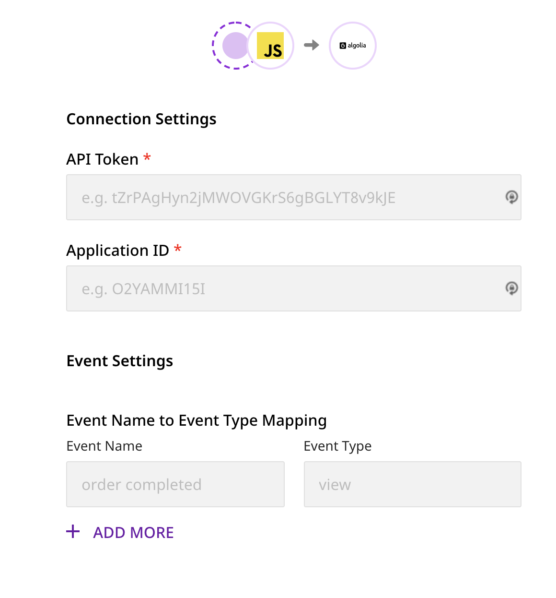

# Algolia

[**Algolia**](https://www.algolia.com/) is a popular site search and discovery platform. It helps businesses build and optimize their users' product search and discovery experience, resulting in enhanced online engagement, increased conversion rates, and better user lifetime value.

RudderStack supports Algolia as a destination to which you can seamlessly send your customer data.

## Getting Started

Before configuring Algolia as a destination in RudderStack, verify if the source platform is supported by Algolia by referring to the table below:

| **Connection Mode** | **Web** | **Mobile** | **Server** |
| :--- | :--- | :--- | :--- |
| **Device mode** | - | - | - |
| **Cloud** **mode** | **Supported** | **Supported** | **Supported** |


To know more about the difference between Cloud mode and Device mode in RudderStack, read the [**RudderStack connection modes**](https://docs.rudderstack.com/get-started/rudderstack-connection-modes) guide.


Once you have confirmed that your source platform supports sending events to Algolia, follow these steps:

* From your [**RudderStack dashboard**](https://app.rudderstack.com/), add the source. From the list of destinations, select **Algolia**.


Follow our guide on [**Adding a Source and Destination in RudderStack**](https://docs.rudderstack.com/how-to-guides/adding-source-and-destination-rudderstack) for more information.


* Assign a name to the destination and click on **Next**. You should then see the following screen:



### Connection Settings

This section details the connection settings required to configure Algolia as a destination in RudderStack.

* Enter your Algolia **API Key** and **Application ID**.


To get the Algolia API key and Application ID, go to your [**Algolia dashboard**](https://www.algolia.com/apps/). Under the **API Keys** menu, copy the values under **Application ID** and **Search-Only API Key**.


* Under **Event Settings**, you can add the **Event Name** and its corresponding **Event Type**. These are optional fields and can also be passed via the `track` call. 


The `event`-`eventType` mapping passed via the `track` call  **will get a higher precedence** over the mapping specified in the dashboard.



If the **Event** - **Event Type** mapping is not specified in the dashboard and these fields are not passed in the `track` call as well, then the event will be dropped.


* Finally, click on **Next**. Algolia will now be enabled as a destination in RudderStack.

## Track

The `track` call lets you send events related to your customers' product usage. The required fields are `event`, `eventType`, `index`, and either `objectIds` or `filters`.

Note that the **Event Name** (`event`) and **Event Type** (`eventType`) can be mapped in the dashboard while configuring the destination. These fields can also be passed via the `track` call. Note that the values sent via `track` call will have a higher precedence over the dashboard mapping.


In case you have already specified the mapping in the dashboard, you don't need to send the same `eventType` in the `track` call.



If you are sending a new `event` via  the `track` call which is not specified in the dashboard, make sure you include the `eventType` in the call as well, otherwise the call will be **dropped**.



The following table includes all `track` fields with their relative mapping to the Algolia fields:

| **RudderStack Field**    | **Algolia Field** |
| :----------------------- | :---------------- |
| `userId` / `anonymousId` | `userToken`       |
| `index`                  | `index`           |
| `eventType`              | `eventType`       |
| `timestamp`              | `timestamp`       |
| `queryId`                | `queryID`         |
| `filters`                | `filters`         |
| `objectIds`              | `objectIDs`       |
| `positions`              | `positions`       |


A sample `track` call is as shown:

```javascript
rudderanalytics.track("event name", {
  eventType: "click",  
  index: "index1",
  timestamp: 1630649198801,
  objectIds: [ "objId1","objId2"],
  positions: [1,2],
  queryId: "e28d338dbfbbdcb4678d9d30a5e286ee"
});
```

To successfully send events to Algolia, the following criteria must be met:

* `eventType` can only be either `click`, `view` or `conversion`. Otherwise, the event will be dropped.
* `timestamp` must be in milliseconds UNIX epoch and must be maximum 4 days old.
* `queryId` must be a 32-character hexadecimal string.
* `filters` must be an array of strings. If it has more than 10 strings, only first 10 values will be passed.
* `objectIds` must be an array of strings. If it has more than 20 strings, only first 20 values will be passed.
* `positions` must be an array of integers. It must be passed for only `click` type events. Only first 20 values will be passed.


For all the event types (`eventType`), either `filters` or `objectIds` must be passed and **not both**. If both or none of the fields are passed, the event will be dropped.




For the `click` event type, if you pass `objectIds`, then you must pass either **both** or **none** of the `positions` and `queryId` fields. If only either of the fields are present, the event will be dropped. 

Also, the length of `objectIds` and `positions` arrays should be equal. Otherwise, the event will be dropped.


### E-Commerce Events

For Algolia, Rudderstack supports the `products` array for two E-Commerce events [**`product list viewed`**](https://docs.rudderstack.com/rudderstack-api/api-specification/rudderstack-ecommerce-events-specification/browsing#product-list-viewed) and [**`order completed`**](https://docs.rudderstack.com/rudderstack-api/api-specification/rudderstack-ecommerce-events-specification/ordering#order-completed). 

An example is shown below:

```javascript
rudderanalytics.track("product list viewed", {
  index: "index1",
  products: [
    {
      objectId: "objectId",
      position: 1
    }
  ]
});
```

## FAQs

### What happens if the Event Name - Event Type mapping is not specified in the dashboard as well as in the `track` call?

If the **Event** - **Event Type** mapping is not specified in the dashboard and these fields are not passed in the `track` call as well, then the event will be dropped.

## Contact Us

If you come across any issues while configuring or using Algolia with RudderStack, you can [**contact us**](mailto:%20docs@rudderstack.com) or start a conversation on our [**Slack**](https://resources.rudderstack.com/join-rudderstack-slack) channel.
