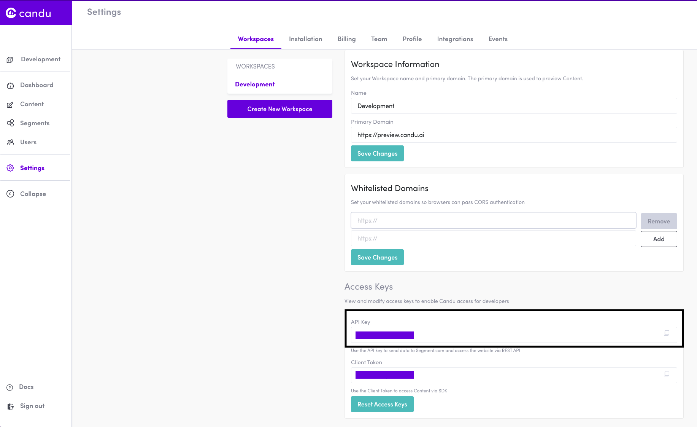

# Candu

[Candu](https://www.candu.ai/) is a product experience platform that provides no-code web tools for SaaS applications. It lets software teams to design, refine, and personalize their application’s user interface to create intuitive product experiences.

RudderStack supports Candu as a destination platform where you can send your event data seamlessly.


<div class="successBlock">

  <strong>Find the open-source transformer code for this destination in our <a href="https://github.com/rudderlabs/rudder-transformer/tree/master/v0/destinations/candu">GitHub repo</a></strong>.
</div>

## Getting started

Before configuring Candu as a destination in RudderStack, verify if the source platform is supported by Candu by referring to the table below:

| **Connection Mode** | **Web**       | **Mobile**    | **Server**    |
| :------------------ | :------------ | :------------ | :------------ |
| **Device mode**     | -             | -             | -             |
| **Cloud mode**      | **Supported** | **Supported** | **Supported** |


<div class="infoBlock">

To know more about the difference between cloud mode and device mode in RudderStack, refer to the <a href="https://rudderstack.com/docs/connections/rudderstack-connection-modes/">RudderStack Connection Modes</a> guide.
</div>

Once you have confirmed that the source platform supports sending events to Candu, follow these steps:

- From your [**RudderStack dashboard**](https://app.rudderstack.com/), add the source. Then, from the list of destinations, select **Candu**.

<div class="infoBlock">

Follow our guide on <a href="https://rudderstack.com/docs/connections/adding-source-and-destination-rudderstack/">Adding a Source and Destination in RudderStack</a> for more information.
</div>


## Connection settings

To successfully configure Candu as a destination, you will need to configure the following settings:

- **API Key**: Your API Key is the unique key generated against your Candu account. You can find it under the **Settings** > **Workspaces** > **Access Keys** section of your Candu account. Refer to the [FAQ section](#faq) for more details.


## Identify

The `identify` call lets you capture the details of a visiting user along with any associated traits such as their name, email address, etc.

A sample `identify` call is shown below:

```javascript
rudderanalytics.identify("webUser01", {
  email: "abc@mail.com",
  firstName: "Name",
  lastName: "LastName",
  phoneNumber: "22222222",
  dateOfBirth: "xxxx-xx-xx",
  custom_fields: {
    key1: "value1",
    key2: "value2",
  },
});
}
```


## Track

The `track` call lets you capture user events along with the properties associated with them.

A sample `track` call is shown below:

```javascript
rudderanalytics.track('Promotion Clicked', {
  promotion_id: 'promo1',
  creative: 'banner1',
  name: 'sale',
  position: 'home_top'
});
```

<div class="warningBlock">

When sending events to Candu, make an `identify` call before the `track` call. This ensures that no duplicate user identities are created in the Candu platform.

</div>

## FAQ

### Where can I get the API key in Candu?

1. Login to your Candu account.
2. Go to the **Settings** option.
3. Look for the API key under **Access Keys** section in the **Workspaces** tab.



## Contact us

For queries on any of the sections covered in this guide, you can [**contact us**](mailto:%20docs@rudderstack.com) or start a conversation in our [**Slack**](https://rudderstack.com/join-rudderstack-slack-community) community.
