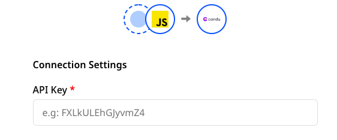

# Candu

Candu is a product experience platform that provides no-code web tools for SaaS applications. It allows software teams to design, refine, and personalize their application’s user interface to create intuitive product experiences.

RudderStack supports Candu as a destination platform where you can send your event data seamlessly.


<div class="successBlock">

  <strong>Find the open-source transformer code for this destination in our <a href="https://github.com/rudderlabs/rudder-transformer/tree/master/v0/destinations/candu">GitHub repo</a></strong>.
</div>

## Getting started

Before configuring Candu as a destination in RudderStack, verify if the source platform is supported by Candu by referring to the table below:

| **Connection Mode** | **Web**       | **Mobile**    | **Server**    |
| :------------------ | :------------ | :------------ | :------------ |
| **Device mode**     | -             | -             | -             |
| **Cloud mode**      | **Supported** | **Supported** | **Supported** |


<div class="infoBlock">

To know more about the difference between cloud mode and device mode in RudderStack, refer to the <a href="https://rudderstack.com/docs/connections/rudderstack-connection-modes/">RudderStack Connection Modes</a> guide.
</div>

Once you have confirmed that the source platform supports sending events to Candu, follow these steps:

- From your [**RudderStack dashboard**](https://app.rudderstack.com/), add the source. Then, from the list of destinations, select **Candu**.

<div class="infoBlock">

Follow our guide on <a href="https://rudderstack.com/docs/connections/adding-source-and-destination-rudderstack/">Adding a Source and Destination in RudderStack</a> for more information.
</div>



## Connection settings

To successfully configure Candu as a destination, you will need to configure the following settings:

- **API Key**: Your API Key is the unique key generated against your Candu account. It can be found in the **Settings** option, under **Workspaces** tab, in the **Access Keys** section of your Candu account.


## Identify

The identify call lets you capture the actions of a visiting user. It also lets you record any traits associated with them such as their name, email address, etc.

<div class="infoBlock">

For more information on the <code class="inline-code">identify</code> call, refer to the <a href="https://www.rudderstack.com/docs/rudderstack-api/http-api/">HTTP API Specification</a> guide.

</div>

A sample `identify` call is shown below:

```javascript
rudderanalytics.identify("webUser01", {
          email: "abc@mail.com",
          firstName: "Name",
          lastName: "LastName",
          phoneNumber: "22222222",
          dateOfBirth: "xxxx-xx-xx",
          custom_fields: {
            key1: "value1",
            key2: "value2",
          },
        });
      }
```


## Track

The `track` call allows you to capture user actions along with the properties associated with these actions. Each action is considered to be an event.

A sample `track` call is shown below:

```javascript
rudderanalytics.track('Promotion Clicked', {
          promotion_id: 'promo1',
          creative: 'banner1',
          name: 'sale',
          position: 'home_top'
      });
```

<div class="warningBlock">

While working with Candu platform, the `identify` call should always be made before the `track` call. The reason being if a `track` call is made first for an anonymous user, then a user is created with anonymousId. Further, when an `identify` call is made for the same user where the user has userId and traits, a separate user is created in Candu. Hence, two identities are created for the same user.

</div>

## Contact us

For queries on any of the sections covered in this guide, you can [**contact us**](mailto:%20docs@rudderstack.com) or start a conversation in our [**Slack**](https://rudderstack.com/join-rudderstack-slack-community) community.
