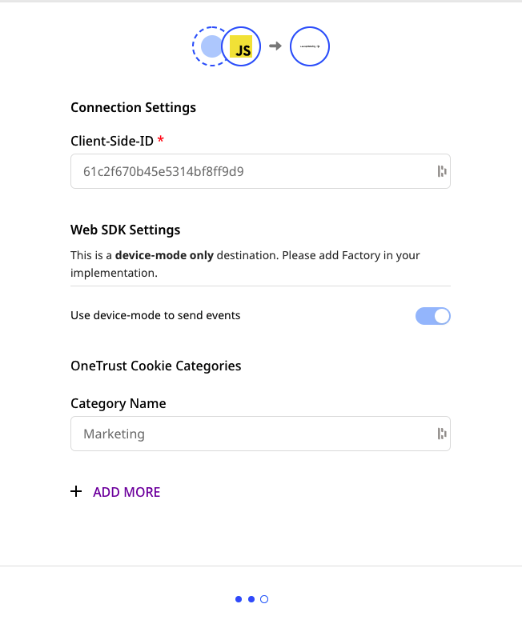
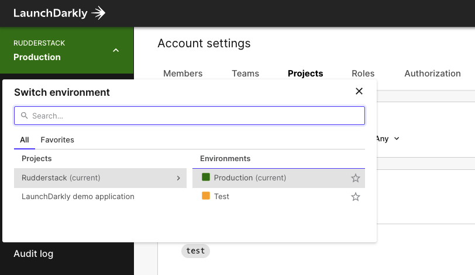
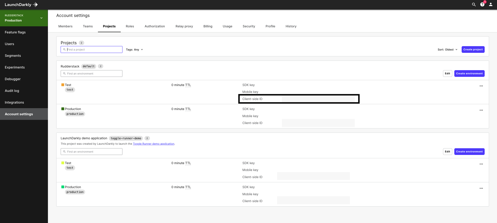
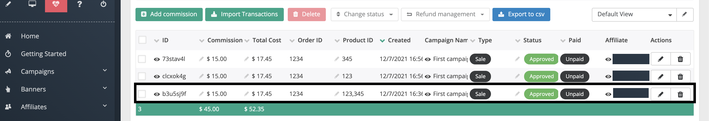
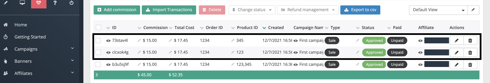

# LaunchDarkly

[**LaunchDarkly**](https://launchdarkly.com/) is a popular feature management platform that offers cutting-edge A/B testing and experimentation functionalities. It lets you efficiently automate and manage feature flags and improve overall product workflow and software quality.

RudderStack supports LaunchDarkly as a destination to which you can seamlessly send your data for flag management.

## Getting started

Before configuring LaunchDarkly as a destination in RudderStack, verify if the source platform is supported by LaunchDarkly by referring to the table below:

| Connection Mode     | Web           | Mobile                 | Server        |
| :------------------ | :------------ | :--------------------- | :-------------|
| **Device mode**     | **Supported**             | -                      | -            |
| **Cloud mode**      | - | -          | - |

<div class="infoBlock">
 
 To know more about the difference between cloud mode and device mode in RudderStack, refer to the <a href="https://rudderstack.com/docs/connections/rudderstack-connection-modes/">RudderStack connection modes</a> guide.
</div>

Once you have confirmed that your source platform supports sending events to LaunchDarkly, follow these steps:

* From your [**RudderStack dashboard**](https://app.rudderstack.com/), add the source. From the list of destinations, select **LaunchDarkly**.

<div class="infoBlock">
 
 Refer to the guide on <a href="https://rudderstack.com/docs/connections/adding-source-and-destination-rudderstack/">Adding a Source and Destination in RudderStack</a> for more information.
</div>

* Assign a name to the destination and click on **Next**. You should then see the following screen:



### Connection settings

The connection settings required to configure LaunchDarkly as a destination in RudderStack are listed below:

* **Client-side ID**: Enter the client-side ID of your LaunchDarkly project.

<div class="infoBlock">
 
For more information on getting the LaunchDarkly client-side ID, refer to the <a href="#faqs">FAQs</a> section below.
</div>

## Identify

The `identify` call lets you create a new user in LaunchDarkly or update an existing one. 

A sample `identify` call is as shown below:

```javascript
rudderanalytics.identify(
  "userId", {
    anonymous: false,
    avatar: "https://avatarfiles.alphacoders.com/837/83744.jpg",
    country: "India",
    custom: {
      favourite_color: "black"
    },
    email: "name@domain.com",
    firstName: "Test",
    ip: "10.11.23.22",
    lastName: "User",
    name: "Test User",
    privateAttribureNames: ["avatar", "country"],
    secondary: "abcd21234"
  }
);
```

The following table lists the supported fields for the `identify` call:

| Field | Type | Presence | Description | 
|:------|:-----|:---------|:-------------|
| key    | String | Required | Unique user identifier |
| anonymous    | Boolean | Optional | Must be set to `true`  |
| avatar | String | Optional | User's avatar image URL |
| country | String | Optional | Country associated with the user |
| custom | Object | Optional | Additional attributes associated with the user |
| email | String | Optional | User's email address |
| firstName | String | Optional | User's first name |
| ip | String | Optional | User's IP address |
| lastName | String | Optional | User's last name |
| name | String | Optional | User's full name |
| privateAttributeNames | String Array | Optional | List of attribute names (built-in or custom) marked as private and not sent to LaunchDarkly as analytics events |
| secondary | String | Optional | User's secondary identifier |

<div class="infoBlock">

<code class="inline-code">key</code> is the only required field in the <code class="inline-code">identify</code> call, where RudderStack maps the user ID. If no unique identifier is provided, RudderStack will automatically assign the <code class="inline-code">anonymousId</code> as the <code class="inline-code">key</code>.
</div>

## Track

The `track` call lets you record user events and send them to LaunchDarkly as custom conversion metrics for your experiments.

A sample `track` call is as shown:

```javascript
rudderanalytics.track("Test Event", {
  foo: "bar"
});
```

## Alias

The `alias` call lets you merge different identities of a known user. You can explicitly change the identity of a user via this call.

A sample `alias` call is shown below:

```javascript
rudderanalytics.alias("newUserId","userId");
```

## FAQs

### Where do I get the LaunchDarkly Client-side ID?

To get your LaunchDarkly client-side ID, follow these steps:

- Log into your [**LaunchDarkly dashboard**](https://app.launchdarkly.com/).

- Select your project, as shown:



- Then, navigate to **Account settings** - **Projects**.

- You will see the client-side ID for your project here.



## Contact us

For queries on any of the sections covered in this guide, you can [**contact us**](mailto:%20docs@rudderstack.com) or start a conversation in our [**Slack**](https://rudderstack.com/join-rudderstack-slack-community) community.


#### Affiliate to Link settings

* **Affiliate Link ID**: Enter your affiliate link ID here, e.g. `affiliateId`. This refers to the ID of the DOM object where the Affiliate ID is added.

* **AffiliateId Parameter Name**: Enter your affiliate ID parameter name, e.g. `a_aid`.

Suppose you set the **Affiliate Link ID** to `affiliateId` and **AffiliateId Parameter Name** to `aff_id`. Then, the anchor link of the domain where you want to send the affiliate/referrer ID will be converted from: `<a href="http://abcd.com"id="affiliateId"></a>` to:  `<a href="http://abcd.com/?aff_id=<the_affiliate_id>"id="affiliateId"></a>`.

#### Cookie to Link settings

* **Cookie Link ID**: Enter your cookie link ID here. This refers to the ID of the DOM object where the cookie ID is added.

* **Cookie Parameter Name**:  Enter the cookie parameter name here.

<div class="infoBlock">

These settings are similar to the <strong>Affiliate to Link</strong> settings, except that the cookie will be written in place of the <code class="inline-code">affiliateId</code>.
</div>

#### Event tracking settings

* **Merge Products**: This setting determines if RudderStack should merge the product information while making a sale call to LaunchDarkly. If disabled, an individual sale object will be created for each product.

<div class="infoBlock">

Refer to the <a href="https://rudderstack.com/docs/destinations/marketing/post-affiliate-pro/#sales-tracking">Merging product information during sales tracking</a> section for more information on this feature.
</div>

* **Disable Tracking Method**: Disable this setting to disable flash cookie creation.

* **List of Events for Click**: For [**Clicks Tracking**](https://rudder.postaffiliatepro.com/merchants/index.php#Clicks-Tracking), RudderStack will consider only the events listed in this field.

<div class="warningBlock">

Make sure the event names specified in this field are comma-separated.
</div>

* As this is a destination that supports sending events only via the web device mode, the **Use device mode to send events** option will be always enabled.

Finally, click on **Next** to complete the setup. LaunchDarkly will now be enabled as a destination in RudderStack.

## Identify

You can use the RudderStack `identify` method to set a unique customer ID. You can then use this ID to subsequently track the customer's activities.

A sample `identify` call is shown below:

```javascript
rudderanalytics.identify(
  "user001", // visitor Id
);
```

RudderStack calls the `setVisitorId` function of the LaunchDarkly SDK and sets the user ID provided in the `identify` call, as shown:

```javascript
PostAffTracker.setVisitorId("user001");
```

## Track

RudderStack supports two types of event tracking for LaunchDarkly:

* **Clicks tracking**: RudderStack initiates LaunchDarkly's clicks tracking mechanism for the events that are explicitly specified in the **List of Events for Click** field, while setting up the integration.

* **Sales tracking**: RudderStack initiates LaunchDarkly's sales tracking only for the **Order Completed** event.

### Clicks tracking

A sample `track` event for clicks tracking is as shown:

```javascript
rudderanalytics.track(
"User Clicked", //event name
{
      affiliateId: "affiliate id",
      bannerId: "banner id",
      campaignId: "campaign id",
      channel: "channel",
      data1: "data1",
      data2: "data2",
} //properties
);
```
<div class="warningBlock">

The <strong>User Clicked</strong> event must be explictly specified in the <strong>List of Events for Click</strong> field. Otherwise, the event will be discarded.
</div>

RudderStack maps the following properties to the LaunchDarkly click event properties:

| **RudderStack Event Property** | **LaunchDarkly Property** |
|:---------------------|:--------------------------|
| `data1`                         | `Data1`                   |
| `data2`                |  `Data2`                  |
| `affiliateId`                  | `AffiliateID`                      |
| `bannerId`                        | `BannerID`                          |
| `campaignId`                       | `CampaignID`                          |
| `channel`                       | `Channel`                          |

### Sales tracking

In case of sales tracking, RudderStack creates a LaunchDarkly `sale` object. For the properties in the event, RudderStack then calls the respective `sale` object function.

A sample `Order Completed` event sent to LaunchDarkly sales tracking is shown below:

```javascript
rudderanalytics.track(
"Order Completed", //event name
{
      checkout_id: "12345",
      order_id: "1234",
      affiliation: "aff_id",
      total: 17.45,
      fixedCost: 20.5,
      revenue: 15.0,
      customCommision: 15,
      campaign: "campaignId",
      channel: "channelId",
      coupon: "ImagePro",
      currency: "EUR",
      status: "A",
      data1: "something",
      data2: "something",
      data3: "something",
      data4: "something",
      data5: "something",
      doNotDeleteCookies: true,

      products: [
        {
          product_id: "123",
          sku: "G-5",
          name: "Product1",
          price: 14,
          fixedCost: 20.5,
          quantity: 1,
          customCommision: 10.23,
          category: "Miscellaneous",
          currency: "USD",
          commisionStatus: "A",
          url: "https://www.website.com/product/path",
          image_url: "https://www.website.com/product/path.jpg",
        },
        {
          product_id: "345",
          sku: "F-5",
          name: "Product2",
          price: 2.45,
          fixedCost: 5.0,
          quantity: 2,
          customCommision: 10.50,
          commisionStatus: "A",
          category: "General",
        },
      ],
} //properties
);
```

When the **Merge Products** option is enabled while configuring the destination in the dashboard, RudderStack merges the product information and sends the `sale` object as seen in the LaunchDarkly dashboard below:



If this option is disabled, two separate `sale` objects are created and sent to LaunchDarkly, as shown:


