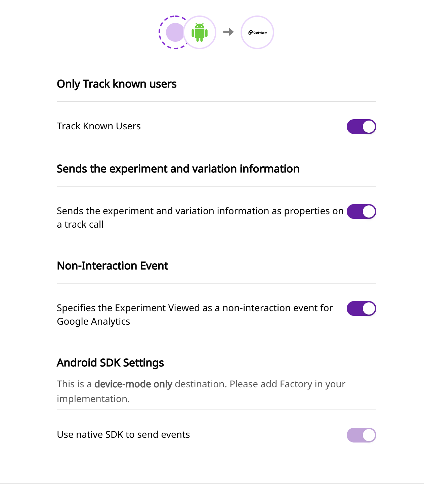

# Optimizely Full Stack

[Optimizely Full Stack](https://www.optimizely.com/products/full-stack/) is a powerful A/B testing, feature flagging and experimentation platform. It allows you to track every aspect of your customer's overall product journey, and experiment with various application features.

With a fully-functional cross-platform support, Optimizely Full Stack allows you to roll out product features that best suit your application, and in turn boost your overall sales and customer engagement.

RudderStack supports Optimizely Full Stack as a destination to which you can send your event data in real-time.

## Getting Started

To enable sending data to Optimizely Full Stack, you will first need to add it as a destination to the source from which you are sending your event data. Once the destination is enabled, events from our SDK will start flowing to Optimizely Full Stack.

Before configuring your source and destination on the RudderStack, please verify if the source platform is supported by Optimizely Full Stack, by referring to the table below:

| **Connection Mode** | **Web** | **Mobile**    | **Server** |
| :------------------ | :------ | :------------ | :--------- |
| **Device mode**     | **-**   | **Supported** | **-**      |
| **Cloud mode**      | **-**   | **-**         | **-**      |

<div class="infoBlock">

To know more about the difference between Cloud mode and Device mode in RudderStack, read the <a href="https://rudderstack.com/docs/rudderstack-cloud/rudderstack-connection-modes/">RudderStack connection modes</a> guide.

</div>

Once you have confirmed that the platform supports sending events to Optimizely Full Stack, perform the steps below:

- From your [RudderStack dashboard](https://app.rudderlabs.com/), add the source. From the list of destinations, select Optimizely Full Stack**.**

<div class="infoBlock">

Please follow our [Adding a Destination](https://www.rudderstack.com/docs/rudderstack-cloud/destinations/#adding-a-destination) guide to add a source and destination in RudderStack.

</div>

- Give a name to the destination and click on **Next**. You should then see the following screen:


<span class="imageTitle">Connection Settings for Optimizely Full Stack</span>

The connection settings are explained in more detail below:

- **Track Known Users**: Optimizely does not alias known and unknown users. Therefore, RudderStack will send the `anonymousId` to Optimizely by default if this setting is disabled. Otherwise, the `userId` will be sent.
- **Send the experiment and variation information as properties on a track call**: By enabling this setting, the experiment data can be sent to the other destinations as a `track` call. This is done by triggering the `Experiment Viewed` event every time an Optimizely live variable is accessed.
- **Specifies the experiment viewed as non interaction event for Google Analytics**: Enabling this option sends `Experiment Viewed` as a non-interaction event.

Configure the settings according to your requirements and click on **Next** to complete the setup. Optimizely Full Stack should now be added and enabled as a destination in RudderStack.

### Implementation Prerequisites

Unlike other destinations, Optimizely Full Stack for the mobile integration works a little differently. You will have to implement some Optimizely functions natively to make sure the experiment logic runs correctly.

<div class="infoBlock">

RudderStack maps the `track` calls with Optimizely's `track` calls. You need to implement all the Optimizely's decision-based methods like `activate` and `isFeatureEnabled` natively.

For more details please checkout [Easy Event Tracking](https://blog.optimizely.com/2019/02/26/introducing-easy-event-tracking-the-easier-way-to-understand-and-optimize-the-customer-journey/) and the [Optimizely SDK reference Guide](https://docs.developers.optimizely.com/full-stack/docs/sdk-reference-guides#section-ios-and-tvos).

</div>

## Adding Optimizely to Your Mobile Project

<!--

Please follow these steps to add Optimizely to your Android Project:

1. Add the following `repository` to your `app/build.gradle` file.

```
repositories {
    mavenCentral()
}
```

2.  After that, add the following `dependency` in the same file:

```
implementation 'com.rudderstack.android.integration:optimizely:0.1.1'
implementation 'com.optimizely.ab:android-sdk:3.0.0'
```

3. Initialize the Optimizely Manager:

<div class="successBlock">

Optimizely recommends initializing their SDK as soon as possible. You need to initialize the Optimizely Manager before proceeding to the next step \(Step 4\) .

Please refer to the Optimizely [Initializing the SDK](https://docs.developers.optimizely.com/full-stack/docs/initialize-sdk-android) guide for more information.

</div>

```
val optimizelyManager =  OptimizelyManager.builder()
            .withSDKKey(<YOUR OPTIMIZELY SDK KEY>)
            .build(this)
```

4. Finally, change the initialization of your `RudderClient` in your `Application` class:

```
val rudderClient = RudderClient.getInstance(
    this,
    <YOUT_WRITE_KEY>,
    RudderConfig.Builder()
        .withEndPointUri(<YOUR_DATA_PLANE_URL>)
        .withFactory(OptimizelyIntegrationFactory.FACTORY(optimizelyManager)
        .build()
)
```

<div class="warningBlock">

Make sure you pass the Optimizely manager instance you created (in Step 3) to the factory as shown in the snippet above.

</div>




Follow these steps to add Optimizely to your iOS project:

1. Go your `Podfile` and add the `Rudder-Optimizely` extension

```
pod 'Rudder-Optimizely'
```

    2.  After adding the dependency followed by `pod install` , you can add the imports to your `AppDelegate.m` file as shown:

```
#import "RudderOptimizelyFactory.h"
```

    3. Finally, change the initialization of your `RudderClient` as shown:

```
RSConfigBuilder *builder = [[RSConfigBuilder alloc] init];
[builder withDataPlaneUrl:DATA_PLANE_URL];
// Setup optimizely logger.
OPTLYLoggerDefault *optlyLogger = [[OPTLYLoggerDefault alloc] initWithLogLevel:OptimizelyLogLevelAll];
// Create an Optimizely manager
 self.optlyManager = [[OPTLYManager alloc] initWithBuilder:[OPTLYManagerBuilder  builderWithBlock:^(OPTLYManagerBuilder * _Nullable builder) {
        builder.sdkKey = @<SDK KEY>;
        builder.logger = optlyLogger;
    }]];
[builder withFactory:[RudderOptimizelyFactory instanceWithOptimizely:self.optlyManager]];
[builder withLoglevel:RSLogLevelDebug];
[RSClient getInstance:WRITE_KEY config:[builder build]];
```


-->

<Tabs>
  <TabList>
    <Tab>Android</Tab>
    <Tab>iOS</Tab>
  </TabList>
    <TabPanels>
      <TabPanel>
        Please follow these steps to add Optimizely to your Android Project:
<ol>
<li>Add the following <code class="inline-code">repository</code> to your <code class="inline-code">app/build.gradle</code> file.
<span>

```
repositories {
    mavenCentral()
}
```
</span>
</li>
<li>After that, add the following <code class="inline-code">dependency</code> in the same file:
<span>

```
implementation 'com.rudderstack.android.integration:optimizely:0.1.1'
implementation 'com.optimizely.ab:android-sdk:3.0.0'
```
</span>
</li>
<li>Initialize the Optimizely Manager:

<div class="successBlock">

Optimizely recommends initializing their SDK as soon as possible. You need to initialize the Optimizely Manager before proceeding to the next step (Step 4) .

Please refer to the Optimizely <a href="https://docs.developers.optimizely.com/full-stack/docs/initialize-sdk-android">Initializing the SDK</a> guide for more information.

</div>
<span>

```
val optimizelyManager =  OptimizelyManager.builder()
            .withSDKKey(<YOUR OPTIMIZELY SDK KEY>)
            .build(this)
```
</span>
</li>
<li>Finally, change the initialization of your <code class="inline-code">RudderClient</code> in your <code class="inline-code">Application</code> class:
<span>

```
val rudderClient = RudderClient.getInstance(
    this,
    <YOUT_WRITE_KEY>,
    RudderConfig.Builder()
        .withEndPointUri(<YOUR_DATA_PLANE_URL>)
        .withFactory(OptimizelyIntegrationFactory.FACTORY(optimizelyManager)
        .build()
)
```
</span>

<div class="warningBlock">

Make sure you pass the Optimizely manager instance you created (in Step 3) to the factory as shown in the snippet above.

</div>
</li>
</ol>
      </TabPanel>
      <TabPanel>
        Follow these steps to add Optimizely to your iOS project:
<ol>
<li>Go your <code class="inline-code">Podfile</code> and add the <code class="inline-code">Rudder-Optimizely</code> extension
<span>

```
pod 'Rudder-Optimizely'
```
</span>
</li>
<li>After adding the dependency followed by <code class="inline-code">pod install</code> , you can add the imports to your <code class="inline-code">AppDelegate.m</code> file as shown:
<span>

```
#import "RudderOptimizelyFactory.h"
```
</span>
</li>
<li>Finally, change the initialization of your <code class="inline-code">RudderClient</code> as shown:
<span>

```
RSConfigBuilder *builder = [[RSConfigBuilder alloc] init];
[builder withDataPlaneUrl:DATA_PLANE_URL];
// Setup optimizely logger.
OPTLYLoggerDefault *optlyLogger = [[OPTLYLoggerDefault alloc] initWithLogLevel:OptimizelyLogLevelAll];
// Create an Optimizely manager
 self.optlyManager = [[OPTLYManager alloc] initWithBuilder:[OPTLYManagerBuilder  builderWithBlock:^(OPTLYManagerBuilder * _Nullable builder) {
        builder.sdkKey = @<SDK KEY>;
        builder.logger = optlyLogger;
 }]];
[builder withFactory:[RudderOptimizelyFactory instanceWithOptimizely:self.optlyManager]];
[builder withLoglevel:RSLogLevelDebug];
[RSClient getInstance:WRITE_KEY config:[builder build]];
```
</span>
</li>
</ol>
      </TabPanel>
    </TabPanels>
</Tabs>

## Contact Us

If you come across any issues while configuring or using Optimizely Full Stack with RudderStack, please feel free to [contact us](mailto:%20docs@rudderstack.com). You can also start a conversation in our [Slack](https://rudderstack.com/join-rudderstack-slack-community) community; we will be happy to talk to you!
