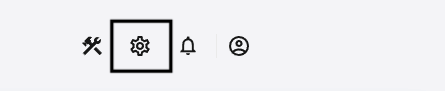
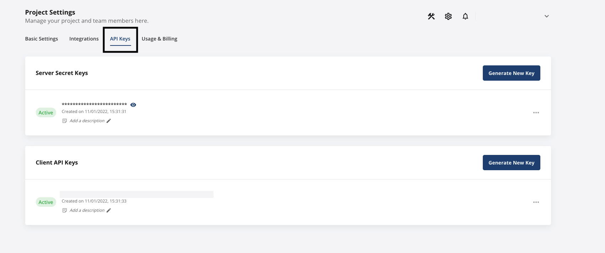

# Statsig

Statsig helps companies safely A/B test features in production before rolling them out, avoiding product debates and costly mistakes when shipping out new features. Statsig automates the grunt work so that your A/B tests run automatically, and you always get the latest insights into how your product features are performing.

<div class="successBlock">

  <strong>Read more about Statsig on their <a href="https://statsig.com/">website</a>. For more information on the Statsig-supported data connectors, refer to their <a href="https://docs.statsig.com/integrations/data-connectors">documentation</a></strong>.
</div>

RudderStack supports Statsig as a destination to which you can send real-time event data for efficient A/B testing.

## Getting started

Before configuring Statsig as a destination in RudderStack, verify if the source platform is supported by Statsig by referring to the table below:

| Connection Mode     | Web           | Mobile                 | Server        |
| :------------------ | :------------ | :--------------------- | :-------------|
| **Device mode**     | -             | -                      | -             |
| **Cloud mode**      | **Supported** | **Supported**          | **Supported** |

<div class="infoBlock">
 
 To know more about the difference between cloud mode and device mode in RudderStack, refer to the <a href="https://rudderstack.com/docs/rudderstack-cloud/rudderstack-connection-modes/">RudderStack connection modes</a> guide.
</div>

Once you have confirmed that your source platform supports sending events to Statsig, follow these steps:

1. From your [RudderStack dashboard](https://app.rudderstack.com/), add the source. Then, from the list of destinations, select **Statsig**.
2. Assign a name to the destination and click on **Next**.

### Connection settings

To configure Statsig as a destination in RudderStack, enter the **Server Secret Key** associated with your project. To obtain the server secret key, follow these steps:

1. Log into your [Statsig console](https://console.statsig.com).
2. Go to your project and click on the **Settings** icon on the top right, as shown:



3. Finally, click on **API Keys**. You should find the **Server Secret Key** here.



## Identify

The [`identify`](https://rudderstack.com/docs/rudderstack-api/api-specification/rudderstack-spec/identify/) call lets you identify a visiting user and associate them to their actions. It also lets you record the traits about them like their name, email address, etc.

A sample `identify` call is as shown:

```javascript
rudderanalytics.identify("userId", {
  name: "Name Surname",
  email: "name@domain.com",
})
```

### Retrieving the `userId`

To get the `userId` associated with an identified user, you can use the `getUserId()` method as shown:

```javascript
rudderanalytics.getUserId();
```

### Retrieving the `anonymousId`

An anonymous ID (`anonymousId`) is an autogenerated UUID (Universally Unique Identifier) that is assigned to each unique, unidentified visitor coming to your website.

You can retrieve the `anonymousId` of any visitor by running the `getAnonymousId()` method, as shown:

```javascript
rudderanalytics.getAnonymousId();
```

<div class="warningBlock">

If the value of <code class="inline-code">anonymousId</code> is <code class="inline-code">null</code> in the SDK, calling the above function will lead to RudderStack automatically setting a new <code class="inline-code">anonymousId</code>.
</div>

## Page

The [`page`](https://rudderstack.com/docs/rudderstack-api/api-specification/rudderstack-spec/page/) call lets you record your website's page views with any additional relevant information about the viewed page. Many destinations require the `page` events to be called at least once every page load.

A sample `page` call is shown below:

```javascript
rudderanalytics.page("Home")
```

## Track

The [`track`](https://rudderstack.com/docs/rudderstack-api/api-specification/rudderstack-spec/track/) call lets you record the user events, i.e. the actions your users perform, along with any properties associated with these actions.

A sample `track` call is as shown:

```javascript
rudderanalytics.track("Product Reviewed", {
  review_id: "12345",
  product_id: "123",
  rating: 3.0,
  review_body: "Average product, expected much more."
})
```

## Screen

The [`screen`](https://rudderstack.com/docs/rudderstack-api/api-specification/rudderstack-spec/screen/) call lets you record whenever a user views their mobile screen, with any additional relevant information about the viewed screen.

A sample `screen` call sent via the [RudderStack iOS SDK](https://rudderstack.com/docs/stream-sources/rudderstack-sdk-integration-guides/rudderstack-ios-sdk/) is shown below:

```objectivec
[[RSClient sharedInstance] screen:@"Main"
                properties:@{@"prop_key" : @"prop_value"}];
```

## Group

The [`group`](https://rudderstack.com/docs/rudderstack-api/api-specification/rudderstack-spec/group/) call allows you to link an identified user with a group, such as a company, organization, or an account. It also lets you record any custom traits associated with that group, e.g. the name of the company, number of employees, etc.

A sample `group` call is shown below:

```javascript
rudderanalytics.group("12345", {
  name: "MyGroup",
  industry: "IT",
  employees: 450,
  plan: "basic"
})
```

## Alias

The [`alias`](https://rudderstack.com/docs/rudderstack-api/api-specification/rudderstack-spec/alias/) call lets you merge different identities of a known user.

<div class="successBlock">

<code class="inline-code">alias</code> is an advanced method that lets you change the tracked user's ID explicitly. This method is useful when managing identities for some of the downstream destinations.
</div>

A sample `alias` call is as shown:

```javascript
rudderanalytics.alias("12345")
```

## Contact us

**This integration has been built and maintained by Statsig**. For any queries, [contact the Statsig team](https://statsig.com/contact) or start a conversation in their [Slack](https://statsigcommunity.slack.com/) community.