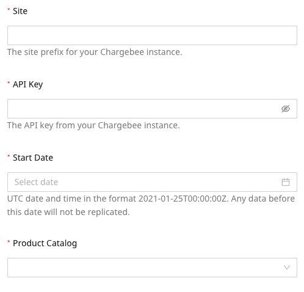
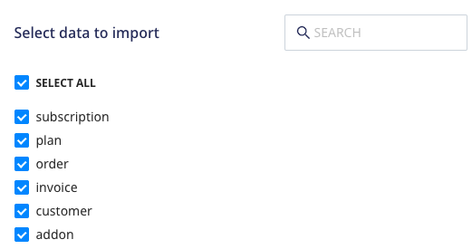

# Chargebee

[Chargebee](https://www.Chargebee.com/) is a subscription billing and revenue management platform. It lets you streamline your revenue operations via features like subscription workflow automation, cutting-edge revenue reporting, and more. 

This document guides you in setting up Chargebee as a source in RudderStack. Once configured, RudderStack automatically ingests your specified Chargebee data, which can then be routed to your RudderStack-supported data warehouse destination.

All the Cloud Extract sources support sending data only to a <a href="https://www.rudderstack.com/docs/data-warehouse-integrations/">data warehouse destination</a>.

## Getting started

To set up Chargebee as a source in RudderStack, follow these steps:

1. Log into your [RudderStack dashboard](https://app.rudderstack.com/).
2. Go to **Sources** > **New source** > **Cloud Extract** and select **Chargebee** from the list of sources.
3. Assign a name to your source and click on **Next**.

### Connection settings

Enter the following connection credentials to authenticate your Chargebee account with RudderStack:

- **Site**: Enter your Chargebee site name.
- **API Key**: Enter your [Chargebee API key](https://www.chargebee.com/docs/2.0/api_keys.html). 
- **Start Date**: Enter the date from which RudderStack should import your historical Chargebee data.
- **Product Catalog**: Select your [Chargebee Product Catalog version](https://www.chargebee.com/docs/2.0/product-catalog.html) from the dropdown. 

RudderStack does not support changing the <strong>Product Catalog</strong> version once you have successfully set up the source.

### Destination settings

The following settings specify how RudderStack sends the data ingested from Chargebee to the connected warehouse destination:

- **Table prefix**: RudderStack uses this prefix to create a table in your data warehouse and loads all your Chargebee data into it.
- **Schedule Settings**: RudderStack gives you three options to ingest the data from Chargebee:
    - **Basic**: Runs the syncs at the specified time interval. 
    - **CRON**: Runs the syncs based on the user-defined CRON expression.
    - **Manual**: You are required to run the syncs manually.

For more information on the schedule types, refer to the <a href="https://www.rudderstack.com/docs/cloud-extract-sources/common-settings/">Common Settings</a> guide.

### Selecting the data to import

Choose the Chargebee data that you wish to ingest via RudderStack. You can either select all the data or choose specific Chargebee data attributes as per your requirement.

Chargebee is now configured as a source. RudderStack will start ingesting data from Chargebee as per your specified schedule and frequency.

You can further connect this source to your data warehouse by clicking on **Add Destination**, as shown:

Use the <strong>Use Existing Destination</strong> option if you have an already-configured data warehouse destination in RudderStack. To configure a data warehouse destination from scratch, select the <strong>Create New Destination</strong> button.

## FAQ

### How do I obtain the Chargebee API key?

The Chargebee API key is required to authenticate your app and regulate its access to the Chargebee API. To obtain the API key, log into your Chargebee dashboard and go to **Settings** > **Configure Chargebee** > **API Keys and Webhooks**. Then, click on the **API Keys** tab. Your API key should be listed here.

For more information, refer to the [Chargebee documentation](https://www.chargebee.com/docs/2.0/api_keys.html).

### Is it possible to have multiple Cloud Extract sources writing to the same schema?

Yes, it is.

RudderStack associates a table prefix for every Cloud Extract source writing to a warehouse schema. This way, multiple Cloud Extract sources can write to the same schema with different table prefixes.

## Contact us

If you come across any issues while configuring Chargebee as a source in RudderStack, you can [contact us](mailto:%20docs@rudderstack.com) or start a conversation in our [Slack](https://rudderstack.com/join-rudderstack-slack-community) community.
