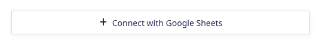
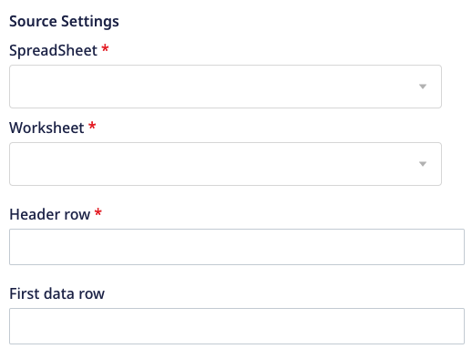

# Google Sheets

[Google Sheets](https://www.google.com/sheets/about/) is a popular spreadsheet program that lets you create spreadsheets which are updated and saved automatically.

This document guides you in setting up Google Sheets as a source in RudderStack. Once configured, RudderStack automatically ingests your specified Google Sheets data, which can then be routed to your RudderStack-supported data warehouse destination.

All the Cloud Extract sources support sending data only to a <a href="https://www.rudderstack.com/docs/data-warehouse-integrations/">data warehouse destination</a>.

## Getting started

To set up Google Sheets as a source in RudderStack, follow these steps:

1. Log into your [RudderStack dashboard](https://app.rudderstack.com/).
2. Go to **Sources** > **New source** > **Cloud Extract** and select **Google Sheets** from the list of sources.
3. Assign a name to your source and click on **Next**.

### Connection settings

* **Connect with Google Sheets**: Click **Connect with Google Sheets** and grant RudderStack the necessary permissions to access your Google Sheets data.

Your Google Sheets account and the related details will then automatically appear under <strong>Choose an account</strong>.

* **SpreadSheet**: Choose the Google spreadsheet you want to use as a data source.
* **Worksheet**: Choose a worksheet present in the above spreadsheet.
* **Header row**: Specify the header row in the worksheet.
* **First data row**: Specify the first row from where data should be picked.

### Destination settings

The following settings specify how RudderStack sends the data ingested from Google Sheets to the connected warehouse destination:

- **Table prefix**: RudderStack uses this prefix to create a table in your data warehouse and loads all your Google Sheets data into it.
- **Schedule Settings**: RudderStack gives you three options to ingest the data from Google Sheets:
    - **Basic**: Runs the syncs at the specified time interval. 
    - **CRON**: Runs the syncs based on the user-defined CRON expression.
    - **Manual**: You are required to run the syncs manually.

For more information on the schedule types, refer to the <a href="https://www.rudderstack.com/docs/cloud-extract-sources/common-settings/">Common Settings</a> guide.

Google Sheets is now configured as a source. RudderStack will start ingesting data from Google Sheets as per your specified schedule and frequency.

You can further connect this source to your data warehouse by clicking on **Add Destination**, as shown:

Use the <strong>Use Existing Destination</strong> option if you have an already-configured data warehouse destination in RudderStack. To configure a data warehouse destination from scratch, select the <strong>Create New Destination</strong> button.

## FAQ

### Is it possible to have multiple Cloud Extract sources writing to the same schema?

Yes, it is.

RudderStack associates a table prefix for every Cloud Extract source writing to a warehouse schema. This way, multiple Cloud Extract sources can write to the same schema with different table prefixes.

## Contact us

If you come across any issues while configuring Sendgrid as a source in RudderStack, you can [contact us](mailto:%20docs@rudderstack.com) or start a conversation in our [Slack](https://rudderstack.com/join-rudderstack-slack-community) community.
